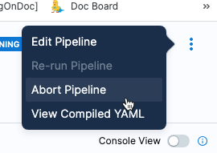
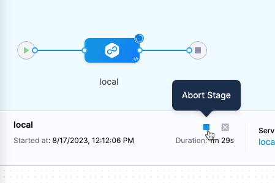
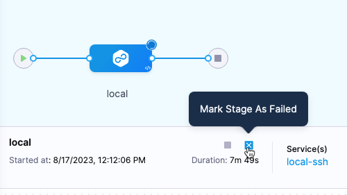

This topic explains how to abort a pipeline or pipeline stage during its execution, and includes important considerations.

## Aborting a pipeline

You can abort a pipeline by selecting **Abort Pipeline** in the options settings of the running pipeline execution.

  

Use abort as a last resort. The abort action stops the pipeline execution and causes the pipeline to end execution in an aborted state.

### Key considerations

- When you abort a pipeline, the pipeline will finish executing its current task and then stop execution.
- The status of the pipeline will be **Aborted**.
- Harness will not clean up the resources that are created during pipeline execution.

## Aborting a stage

You can abort a pipeline stage by selecting the stop button next to the stage name in a running pipeline execution.

  

When you abort a stage during pipeline execution, the stage will finish executing the current task and stop. The pipeline will stop executing and it will enter an **Aborted** state.

### Key Behaviors and Ramifications when using Abort

- When you abort a stage, the stage will finish executing its current task and then stop execution. 
- Subsequent stages will not execute.
- The status of the pipeline will be **Aborted**.
- Harness will not clean up the resources that are created during stage execution.
  - If you would like to clean up and revert back to the old state, mark the stage as failed:

      

    To use this option, you must enable the **Allow users to mark a running Step as failure** setting in **Account Settings** > **Default Settings** > **Pipeline**.

