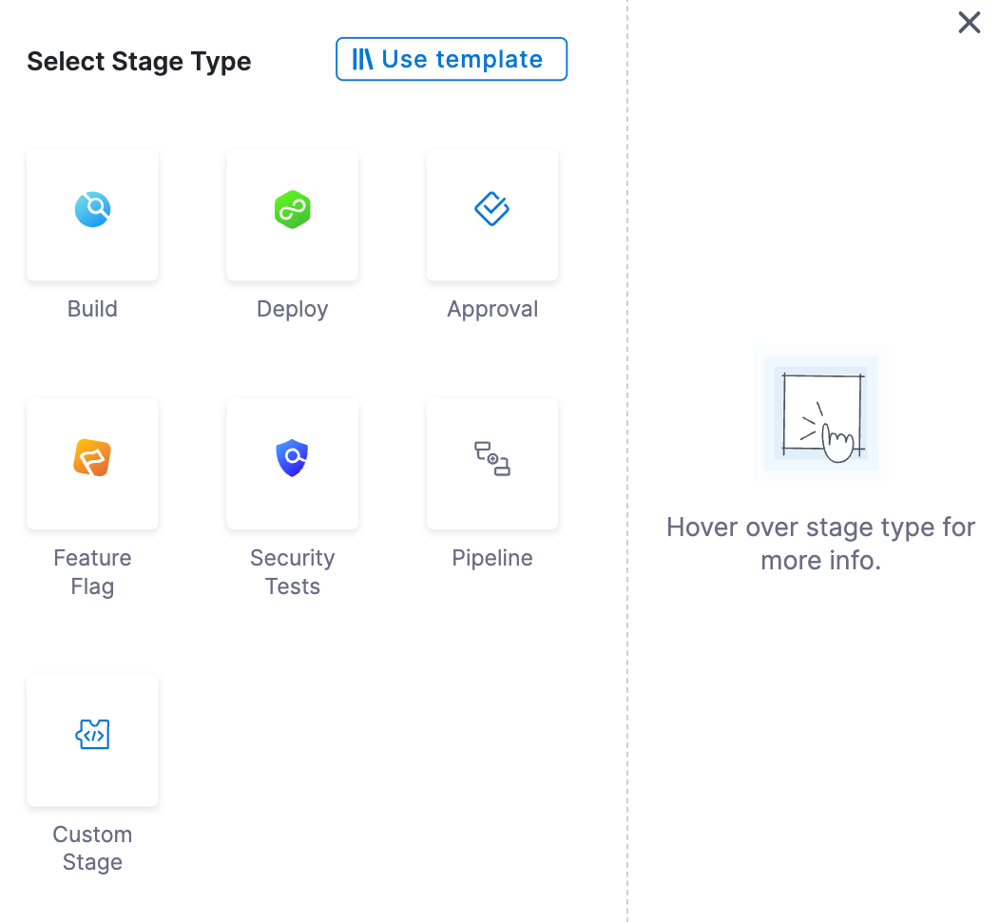
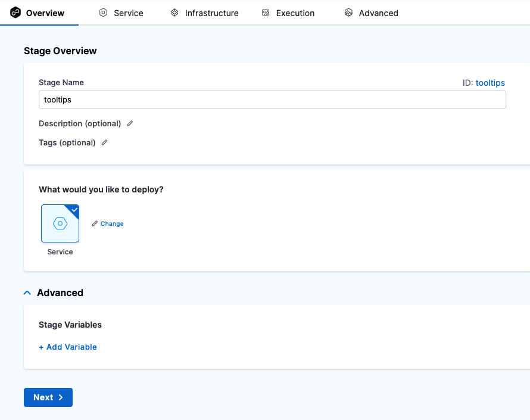
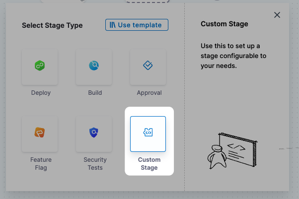

import Tabs from '@theme/Tabs';
import TabItem from '@theme/TabItem';


A stage is a part of a [Harness pipeline](/docs/platform/get-started/key-concepts.md#pipelines) that contains the logic to perform a major segment of a larger workflow defined in a pipeline. Stages are often based on the different workflow milestones, such as building, approving, and delivering.

The process of adding a stage to a pipeline is the same for all Harness modules. When you add a stage to a pipeline, you select the stage type, such as **Build** for CI or **Deploy** for CD. The available stage settings are determined by the stage type, and, if applicable, the module associated with the selected stage type.

This functionality is limited to the modules and settings that you have access to.

## Add a stage

1. In any [Harness project](../organizations-and-projects/create-an-organization.md), create a pipeline in any module that supports pipelines.
2. In your pipeline, select **Add stage**, and then select the stage type:

   * **Build:** Build, test, and push artifacts to repositories.
   * **Deploy:** Deploy services, serverless functions, or other workloads.
   * **Approval:** Approve or reject changes during pipeline progress.
   * **Feature Flag:** Enable or disable functionality remotely without redeploying code.
   * **Security Tests:** Scan code, artifacts, and infrastructure for security vulnerabilities.
   * **Pipeline:** Run a pipeline as a stage in another pipeline.
   * **Custom Stage:** [Custom stages](#add-a-custom-stage) are flexible stages you can configure for use cases outside the standard stage types.

   

   :::tip

   If a specific module or stage type isn't shown, make sure the module is enabled in your project. For more information, go to [Create organizations and projects](../organizations-and-projects/create-an-organization.md).

   :::

3. Configure the stage settings.

   * You must provide a few initial settings to add a stage to a pipeline, and then you can configure additional settings, such as **Infrastructure** or **Stage Variables** after adding the stage.
   * The available settings depend on the module and stage type. Go to your module's documentation for more information about that module's stage settings.

4. If applicable to the stage type or module, add steps to the **Execution** tab to define the tasks to perform in that stage. The available steps depend on the stage type. Go to your module's documentation for details about configuring different step types.

### Stage names

When you create a stage, you give it a name. Harness automatically creates and **Id** ([Entity Identifier](../references/entity-identifier-reference.md)) based on the name. You can change the **Id** during initial stage creation; however, once the stage is saved, the **Id** becomes immutable.

You can change the **Name** at any time, but you can't change the **Id**.

### Stage variables

Stage variables are variables that you add to a stage and then reference in the entity settings and steps in that stage, as well as in later stages in the pipeline. Stage variables can be custom variables or modify known variables (service variables, environment variables, etc.).

You can add stage variables in the Pipeline Studio's Visual Editor or YAML Editor.


<Tabs>
  <TabItem value="Visual" label="Visual">


To add stage variables, go to a stage's **Overview** tab, expand the **Advanced** section, and then select **Add Variable**.

<figure>



<figcaption>The <b>Overview</b> tab for a <b>Deploy</b> stage.</figcaption>
</figure>


</TabItem>
  <TabItem value="YAML" label="YAML" default>


```yaml
    - stage:
        ...
        variables:
          - name: VAR_NAME
            type: String ## String or Secret
            description: ""
            value: 90
```


</TabItem>
</Tabs>


Variable values can be [fixed values, runtime inputs, or expressions](/docs/platform/variables-and-expressions/runtime-inputs).

Stage variables are available across the pipeline and you can override their values in later stages.

To reference stage variables in the same stage where they are defined, use the expression `<+stage.variables.VAR_NAME>`.

To reference stage variables in other stages, use the expression `<+pipeline.stages.STAGE_ID.variables.VAR_NAME>`.

You can also reference stage variables in files fetched at runtime. For example, you could create a stage variable called `NAME` and then reference it in the Kubernetes `values.yaml` file used by that stage by calling the [Harness expression](../variables-and-expressions/harness-variables.md): `<+stage.variables.NAME>`. For example:

```yaml
name: <+stage.variables.NAME>  
replicas: 2  
  
image: <+primary.artifact.image>  
...
```

When you run this pipeline, the value you set for `NAME` in the stage settings is supplied to the `values.yaml` file.

### Advanced stage settings

On the **Advanced** tab, you can configure:

* [Conditional executions](/docs/platform/pipelines/step-skip-condition-settings)
* [Failure strategies](/docs/platform/pipelines/failure-handling/define-a-failure-strategy-on-stages-and-steps)
* [Looping strategies - Matrix, repeat, parallelism](/docs/platform/pipelines/looping-strategies/looping-strategies-matrix-repeat-and-parallelism)

## Add a Custom stage

Harness has predefined stages for the most common release operations, such as Build (CI), Deploy (CD), and Approval stages. There are times when you need a stage to perform other operations that don't require the predefined settings of CI, CD, or Approval stages. For example, you might need a stage for ad hoc provisioning or to run jobs before a deployment stage. In these cases, you could use a Custom stage.

Unlike the Build, Deploy, or Approval stages, the Custom stage has no predefined functionality or requirements. The Custom stage provides flexibility to support any use case outside of the standard stages.

To add a Custom stage to your pipeline, [add a stage](#add-a-stage) and select **Custom** as the stage type. The Custom stage is available in all modules that use pipelines (CI, CD, and so on).



Like the standard stages, Custom stages support:

* [Stage variables](#stage-variables).
* [Advanced stage settings](#advanced-stage-settings): Conditional executions, failure strategies, and looping strategies.
* [Templates](/docs/platform/templates/template): You can [create stage templates](../templates/add-a-stage-template.md) based on Custom stages, and you can use step templates in Custom stages. You can also create pipeline templates from pipelines that have Custom stages.
* [Delegate selectors](/docs/platform/delegates/manage-delegates/select-delegates-with-selectors): You to select the [Harness Delegate](/docs/platform/delegates/delegate-concepts/delegate-overview.md) to use for each step in a Custom stage. If you don't specify a delegate, Harness uses the default delegate selection process.

:::info Rollback

Custom stages *don't* support [rollback failure strategies](/docs/platform/pipelines/failure-handling/define-a-failure-strategy-for-pipelines), but you can use [conditional executions](./step-skip-condition-settings.md) to run steps/stages based on the outcomes of other steps or stages. For example, run a step only if a previous step succeeded.

:::

### Environments and Infrastructure Definitions in Custom stages

You can also use **Environment** and **Infrastructure Definition** in Custom stages. 

Please review these important notes about using **Environment** and **Infrastructure Definition** in Custom stages:

- **Service** is not supported in Custom stages.
- Both **Environment** and **Infrastructure Definition** are optional. You can have a Custom stage with no **Environment** or **Infrastructure Definition** or with only **Environment** or with both **Environment** and **Infrastructure Definition**. 
- Currently, you can only use a single environment and single infrastructure.
- Harness does not support environment propagation in the Custom stage.
- Harness does not support dynamic infrastructure provisioning in the Custom stage.
- Harnes does not support environment and infrastructure filtering in the Custom stage.
- You can add both environment global and infrastructure global overrides in Custom stages.
- Service-specific overrides are not supported as services are not supported in Custom stages.


### Steps available for Custom stages

* The Custom stage leverages steps from other stage types. Any steps listed in the Step Library for your Custom stages are also available for Build, Deploy, or Approval stages. Harness has no steps that are applicable only to the Custom stage.
* The Custom stage can't use module-specific steps. Steps specific to CI and CD stages, like the Rolling Deployment step, aren't available for the Custom stage.
* Licensing is applied to steps in Custom stages. For example, CD steps, such as the HTTP step, are available for the Custom stage only if you have a CD license.
