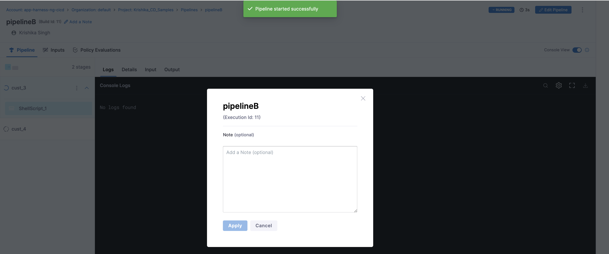
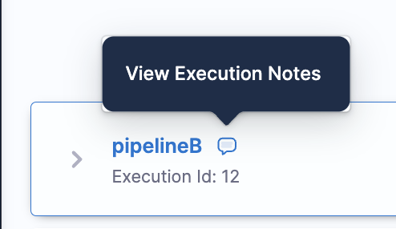

Note is helpful for users to document real-time observation that can be helpful for setting up context for troubleshooting, speeding up debugging. It helps in overall efficiency during the processs.

:::important note
Currently this feature is behing the Feature Flag `PIE_DISABLE_NOTES_UPDATE_AFTER_EXECUTION_COMPLETED`. Please contact [Harness support](mailto:support@harness.io) to enable this feature.
:::

You can add a note while your pipeline is running. 

Also, note that after the pipeline execution is done you won't be able to edit the note, you can just view the notes in pipeline execution.
You can see you execution note in Pipeline Execution History or in the Execution section.

