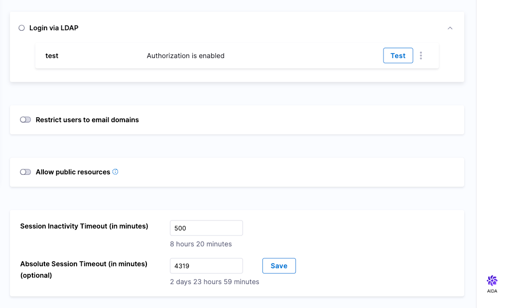

:::important
Currently, this feature is behind the feature flag `PL_ALLOW_TO_SET_PUBLIC_ACCESS`. Contact [Harness Support](mailto:support@harness.io) to enable the feature.

:::

Harness provides an option to allow public access to pipeline executions. When you activate this setting, pipeline executions for pipelines marked for public view will be accessible without the need to sign in to Harness. You can then mark your pipelines for public view and share pipeline execution URLs.

:::info note

When you mark your pipelines for public view, you will have access to console logs for the pipeline steps.

:::

To allow public access to resources, do the following:

1. In your Harness account, select **Account Settings**.
2. Select **Authentication**. The Authentication page opens.
   
   
   
3. Turn on the **Allow public resources** option. The **Enable public access of resources** confirmation dialog opens.
4. On the confirmation screen, select **Enable**.

To allow public access to pipeline executions, do the following:

1. In Harness, open your pipeline.
2. Select **Advanced Options**. The **Advanced Options** pane opens.
3. Select **Mark this pipeline for public view**.

