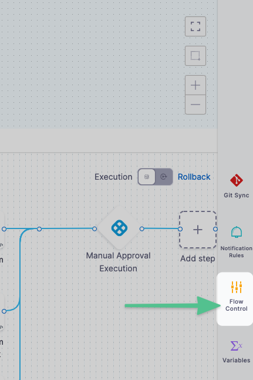
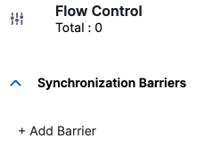
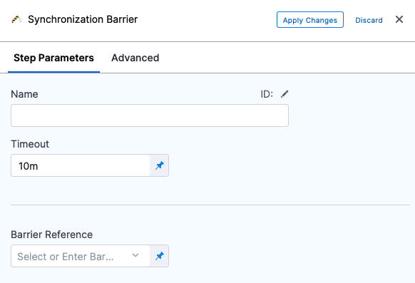
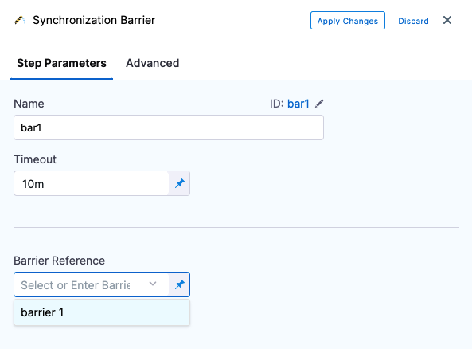

In complex pipelines that orchestrate interdependent services or components, you may need to coordinate the execution flow across different stages or step groups. For example, you might want to verify a group of services only after all of them are deployed successfully.

Harness provides **Barriers** to help with this kind of synchronization. Barriers allow you to pause execution at defined points and ensure that multiple parallel entities—such as stages or step groups—only proceed once all required parts reach the same barrier.

:::info
Barrier steps are only supported inside **Deploy** and **Custom** stage types.
:::

## How Barriers Work

- Barriers take effect only when **two or more stages or step groups use the same barrier name** (configured via the **Barrier Reference** field in the Barrier step) **and are executed in parallel**.
- **Barriers are also supported across child pipelines.** A parent pipeline can define and use a barrier, and any child pipeline can reference and synchronize using the same barrier.
- All stages or step groups referencing the same barrier must reach the barrier point. Only then do they all proceed simultaneously past that point.
- If any one of the stages or step groups fails **before** reaching the barrier, the remaining ones are signaled to fail as well.
- Each stage or step group will then follow its configured failure strategy.

Barriers can also be used with looping strategies. However, additional constraints apply when using barriers in looped parallel executions. For details, refer to the [Important notes](https://developer.harness.io/docs/continuous-delivery/x-platform-cd-features/cd-steps/flow-control/synchronize-deployments-using-barriers/).

## Example

Here’s a visualization of how barriers synchronize parallel stages:

- **Stage A** and **Stage B** both wait at **Barrier X** and proceed only when both reach it.
- **Stage B** and **Stage C** both wait at **Barrier Y** and proceed together once both are ready.

This allows you to control complex coordination logic within a pipeline without resorting to manual delays or checks.

## Add a Barrier

A barrier is simply a name added in a pipeline's **Flow Control** settings.

1. In your pipeline, select **Flow Control**.
   
   

2. In **Flow Control**, select **Add Barrier**.
   
   

3. In **Barrier Name**, enter a unique name, and then click outside of the settings. The barrier is created.
   
   

Next, the name is selected using the **Barrier** step in the stages where you want to synchronize.

## Use a Barrier in a Step

To apply a barrier, do the following:

1. In your stage, under **Execution**, select **Add Step**, and then select **Barrier**.
   
   

2. Enter a name for the step.

3. In **Timeout**, enter the timeout period in milliseconds. For example, `600000` milliseconds is 10 minutes. The timeout period determines how long each stage with a barrier must wait for the other stage(s) to reach the barrier point. When the timeout expires, it is considered a deployment failure.

4. Barrier timeouts are not hard timeouts. A barrier can fail anytime between the timeout value and `timeout + 1 minute`.

5. In **Barrier Reference**, select the name of an existing barrier.
   
   

6. Select **Apply Changes**.

## Using Barriers with Looping Strategies

You can also use [barriers with looping strategies](/docs/continuous-delivery/x-platform-cd-features/cd-steps/flow-control/synchronize-deployments-using-barriers#using-barriers-with-looping-strategies).