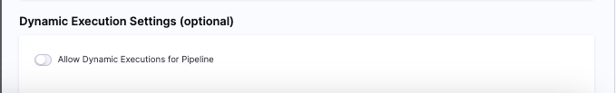
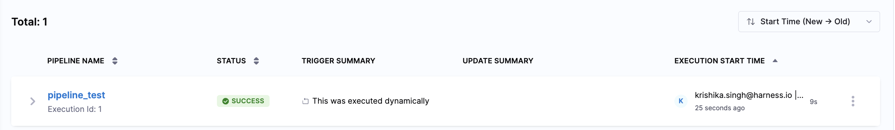

Dynamic execution of Pipelines allows you to execute pipelines by providing pipeline YAML configuration during runtime without requiring pre-saved configurations in Harness. Essentially, Harness is being used as a pure execution engine, while an external system within the ecosystem handles YAML creation and editing. This is particularly useful when pipelines are dynamically generated based on user actions. At the same time, it enables seamless integration with the existing ecosystem while maintaining Harness's robust security and governance controls.

## Pre-Requisites

### Account and Pipeline Level Setting

:::info note
Currently, this setting is behind the Feature Flag `PIPE_DYNAMIC_PIPELINES_EXECUTION`. Contact [Harness Support](mailto:support@harness.io) to enable this Feature Flag.
:::

Before you can execute pipelines dynamically, you need to enable two settings at both the **Account** and **Pipeline** levels.

1. Account Level Setting

Navigate to **Account Setting** -> **Default Settings** -> **Pipeline** -> Enable **Allow Dynamic Execution for Pipelines**

If you need to disable dynamic execution for the account, you can do so at any time by simply turning off this setting.


2. Pipeline Level Setting 

:::info note
To execute a pipeline dynamically, the pipeline must already exist in the UI. The pipeline-level setting for dynamic execution will only be visible once the Account-Level Setting is enabled. 
:::

After enabling the account setting, you must enable the pipeline-level setting in your pipeline:

Navigate to **Advanced Options** -> **Dynamic Execution Settings (optional)** -> **Enable Allow Dynamic Execution for Pipeline**



### Permissions

Users need both [**Edit and Execute**](/docs/platform/role-based-access-control/add-manage-roles.md) permissions on the Pipelines.

### YAML Configuration

:::info note
Dynamic execution of pipelines is only supported via the [API](#dynamic-execution-api) and not through the UI.
:::

To execute a pipeline dynamically, you must provide a valid YAML configuration through the Dynamic Execution API.

## Dynamic Execution API

The Dynamic Execution API in Harness allows you to execute a pipeline dynamically by passing YAML configurations directly in the request body.

```curl
curl --location 'https://app.harness.io/gateway/pipeline/api/v1/orgs/default/projects/PROJECT_ID/pipelines/PIPELINE_ID/execute/dynamic' \
--header 'accept: */*' \
--header 'content-type: application/json' \
--header 'origin: https://app.harness.io' \
--header 'Harness-Account: ACCOUNT_ID' \
--header 'x-api-key: HARNESS_API_KEY' \
--data '{
    "yaml": ""
}'
```
### YAML Format Requirement

To execute a pipeline dynamically, the YAML should follow the required format as shown in the [example](#example) below.

### Example

```
curl --location 'https://app.harness.io/gateway/pipeline/api/v1/orgs/default/projects/Krishika_CD_Samples/pipelines/Deploy_Web_Application/execute/dynamic' \
--header 'accept: */*' \
--header 'content-type: application/json' \
--header 'origin: https://app.harness.io' \
--header 'Harness-Account: ACCOUNT_ID' \
--header 'x-api-key: HARNESS_API_KEY' \
--data '{
    "yaml": "pipeline:\n  name: Deploy_Web_Application\n  identifier: Deploy_Web_Application\n  projectIdentifier: Krishika_CD_Samples\n  orgIdentifier: default\n  tags: {}\n  stages:\n    - stage:\n        name: Build_Web_App\n        identifier: Build_Web_App\n        description: \"\"\n        type: CI\n        spec:\n          cloneCodebase: false\n          caching:\n            enabled: true\n          buildIntelligence:\n            enabled: true\n          platform:\n            os: Linux\n            arch: Amd64\n          runtime:\n            type: Cloud\n            spec: {}\n          execution:\n            steps:\n              - step:\n                  type: Run\n                  name: Run_1\n                  identifier: Run_1\n                  spec:\n                    shell: Sh\n                    command: echo \"Building Web App\"\n    - stage:\n        name: Deploy_Web_App\n        identifier: Deploy_Web_App\n        description: \"\"\n        type: Deployment\n        spec:\n          deploymentType: Kubernetes\n          service:\n            serviceRef: k8s_service\n            serviceInputs:\n              serviceDefinition:\n                type: Kubernetes\n                spec:\n                  artifacts:\n                    primary:\n                      primaryArtifactRef: <+input>\n                      sources: <+input>\n          environment:\n            environmentRef: k8sdemoenv\n            deployToAll: false\n            infrastructureDefinitions:\n              - identifier: k8sdemoinfra\n          execution:\n            steps:\n              - step:\n                  name: Rollout Deployment\n                  identifier: rolloutDeployment\n                  type: K8sRollingDeploy\n                  timeout: 10m\n                  spec:\n                    skipDryRun: false\n                    pruningEnabled: false\n              - step:\n                  type: ShellScript\n                  name: ShellScript_1\n                  identifier: ShellScript_1\n                  spec:\n                    shell: Bash\n                    executionTarget: {}\n                    source:\n                      type: Inline\n                      spec:\n                        script: echo \"Web App Deployed\"\n                    environmentVariables: []\n                    outputVariables: []\n                  timeout: 10m\n            rollbackSteps:\n              - step:\n                  name: Rollback Rollout Deployment\n                  identifier: rollbackRolloutDeployment\n                  type: K8sRollingRollback\n                  timeout: 10m\n                  spec:\n                    pruningEnabled: false\n        tags: {}\n        failureStrategies:\n          - onFailure:\n              errors:\n                - AllErrors\n              action:\n                type: StageRollback"
}'

```

Upon successful execution, the API returns the following response:

```json
{
    "execution_details": {
        "execution_id": "xD908VCSQVaP3Zo14tEI8g",
        "status": "RUNNING"
    }
}
```
Once the API is triggered, you can monitor the pipeline execution in the Harness UI.



In the trigger summary you will see a message indicating **This was executed dynamically**. This confirms that the pipeline was triggered using the Dynamic Execution API.

## What's Supported 

Dynamically executing pipelines support usage of following features:-

1. Template resolution at runtime
2. Expression resolution
3. Services and environments
4. Secrets and connectors
5. OPA policy enforcement

## Limitations

Dynamically executing pipelines doesn't support following features:-

1. Input sets
2. Selective stage Execution
3. Retry/Re-Run capability
4. Automatic Triggers
5. Post Production Rollback
6. Runtime Inputs


