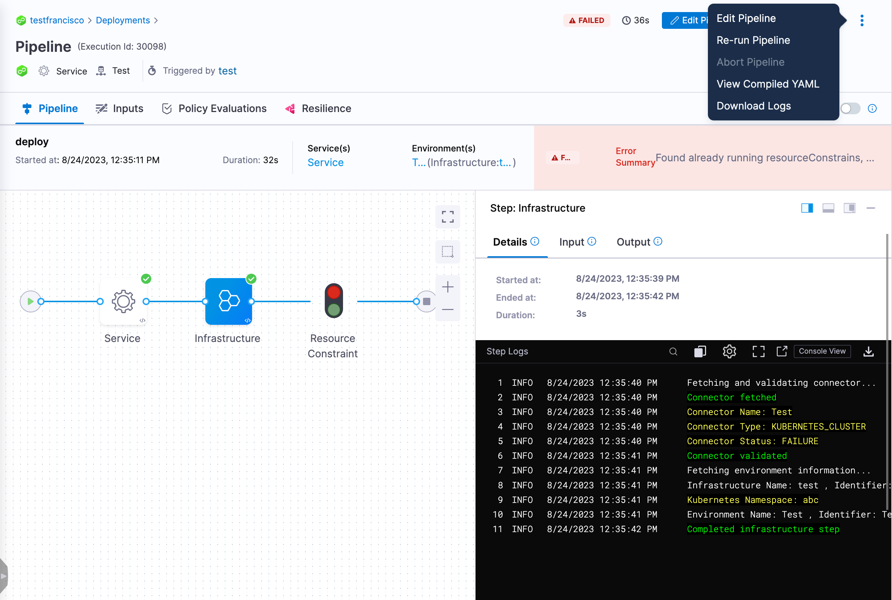
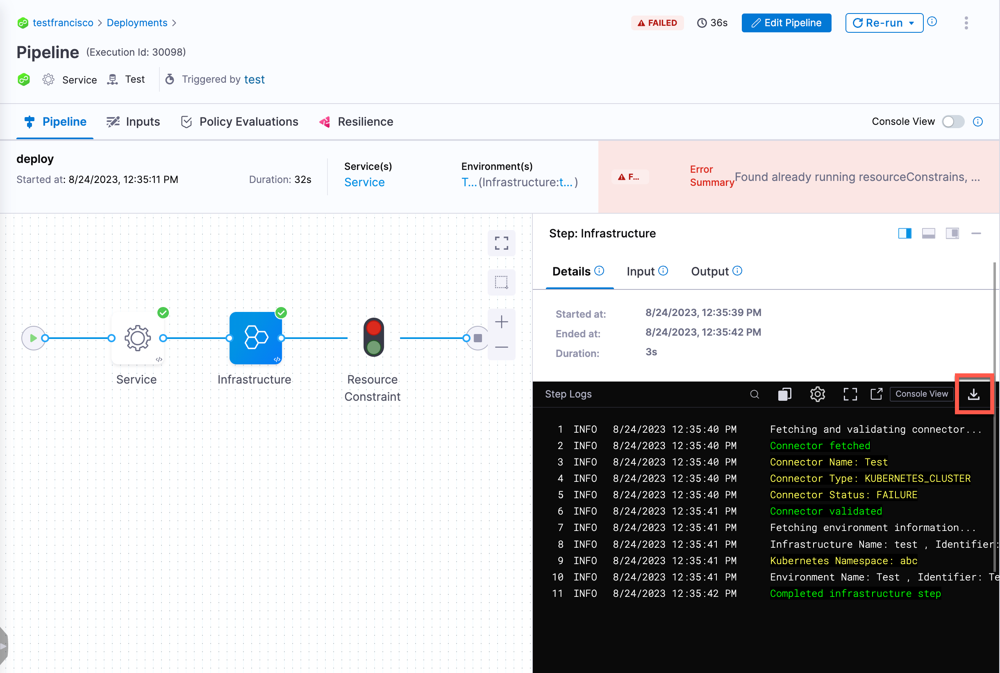

You can download pipeline, stage, and step execution logs either through the UI or via the API.

The process of downloading logs is the same for all Harness modules. Your access to certain modules and settings limits the functionality available to you.

After downloading, logs are provided as a `.zip` file containing log files in **NDJSON (newline-delimited JSON)** format, where each line is a standalone JSON object.

:::info
The extracted files have many levels of nested directories. To locate specific log files, you might need to navigate through several levels.
:::

## Important notes

* You might encounter the error message `Prefix Key Exceeds Maximum Download Limit` if your download exceeds the maximum number of log files.
   * The download contains individual log files for each step and step sub-section in the execution.
   * There is a limit of 500 log files per download request.
* Windows users may encounter issues extracting `logs.zip` with the native extraction tool. To avoid this, we recommend using a third-party tool such as 7-Zip or similar.

## Download pipeline log files

To download pipeline log files, do the following:

1. In Harness, select your pipeline.
2. Select **More Options** (&vellip;), and then select **Download Logs**.

   

   Harness queries the log service, exports the log, and downloads the `logs.zip` file.

3. Open the `logs.zip` file, and extract the contents.
4. Drill down into the extracted files to locate the log you want to examine.

## Download step log files

To download step log files, do the following:

1. In Harness, select your pipeline.
2. Select the step for which you want to download the execution log.
3. Under **Details**, select the download icon.

   

   Harness queries the log service, exports the log, and downloads the `logs.zip` file.

4. Open the `logs.zip` file, and extract the contents.
5. Drill down into the extracted files to locate the log you want to examine.

## Download logs via API

You can download pipeline, stage, and step execution logs via the Log Service API `/log-service/blob/download`. Authentication by [Harness API token](/docs/platform/automation/api/add-and-manage-api-keys) is required. For more information, go to the [Harness API reference](https://apidocs.harness.io/#section/Introduction/Authentication).

The response contains a link to download the requested log file.

:::warning
Ensure the pipeline execution has completed before attempting to download logs. Downloading logs from a running execution may result in incomplete or missing log files.
:::

:::note
Delegates with versions lower than 23.10.81010 may have issues with log streaming.
:::

The log download endpoint is asynchronous. The initial response returns a `queued` status. You must poll the same endpoint until the `status` changes to `success`, at which point the `link` field contains the URL to download the `logs.zip` file.

Example response:

```json
{
  "link": "https://storage.googleapis.com/<STORAGE_PATH>/logs.zip?Expires=...",
  "status": "queued",
  "expires": "2026-04-13T18:24:23Z"
}
```

* `link`: The URL to download the `logs.zip` file.
* `status`: The current state of the download request (`queued`, `success`).
* `expires`: When the download link expires.

#### cURL command to download pipeline logs

This cURL command downloads pipeline log files based on the given pipeline execution key.

```
curl 'https://app.harness.io/gateway/log-service/blob/download?accountID=ACCOUNT_ID&prefix=PIPELINE_EXECUTION_PREFIX_KEY' \
  -X 'POST' \
  -H 'content-type: application/json' \
  -H 'x-api-key: <HARNESS-PERSONAL-ACCESS-TOKEN>'
```

* `ACCOUNT_ID`: Your Harness account identifier.
* `PIPELINE_EXECUTION_PREFIX_KEY`: A multi-part value consisting of `ACCOUNT_ID/pipeline/PIPELINE_ID/RUN_SEQUENCE/-PLAN_EXECUTION_ID`. For example, `12345abcd/pipeline/My_Cool_Pipeline/12/-dfstsh`.
   * `ACCOUNT_ID`: Your Harness account identifier.
   * `PIPELINE_ID`: The identifier of the pipeline that you want to get logs for.
   * `RUN_SEQUENCE`: The incremental execution/build identifier of the specific pipeline run that you want logs for.
   * `-PLAN_EXECUTION_ID`: A hyphen (`-`) followed by the identifier of the pipeline execution that you want to get logs for.
* `TOKEN`: [Harness API token](/docs/platform/automation/api/add-and-manage-api-keys)

#### cURL command to download step logs

This cURL command downloads pipeline log files based on the given step key.

```
curl 'https://app.harness.io/gateway/log-service/blob/download?accountID=ACCOUNT_ID&prefix=STEP_PREFIX_KEY' \
  -X 'POST' \
  -H 'content-type: application/json' \
  -H 'x-api-key: <HARNESS-PERSONAL-ACCESS-TOKEN>'
```

* `ACCOUNT_ID`: Your Harness account identifier.
* `STEP_PREFIX_KEY`: A multi-part value consisting of `ACCOUNT_ID/pipeline/PIPELINE_ID/RUN_SEQUENCE/-PLAN_EXECUTION_ID/STAGE_ID/STEP_ID`. For example, `12345abcd/pipeline/My_Cool_Pipeline/12/-dfstsh/My_Cool_Stage/My_Cool_Step`.
   * `ACCOUNT_ID`: Your Harness account identifier.
   * `PIPELINE_ID`: The identifier of the pipeline that has the step that you want to get logs for.
   * `RUN_SEQUENCE`: The incremental execution/build identifier of a specific pipeline run.
   * `-PLAN_EXECUTION_ID`: A hyphen (`-`) followed by the identifier of the pipeline execution that you want to get logs for.
   * `STAGE_ID`: The identifier of the stage that has the step that you want to get logs for.
   * `STEP_ID`: The identifier of the step that you want to get logs for.
* `TOKEN`: [Harness API token](/docs/platform/automation/api/add-and-manage-api-keys)


### Download logs link with a vanity URL

Currently, the generated download link for the `logs.zip` file is wrapped around a Harness URL, for example, `https://app.harness.io/storage/harness-download/\<PATH_TO_YOUR_LOG_KEY>`. However, if you want the vanity URL link for the `logs.zip` file, you can add the IPs below to your account's allowlist.

```
34.82.155.149
34.168.179.66
```

For more information, go to [Allowlist Harness domains and IPs](/docs/platform/references/allowlist-harness-domains-and-ips/).
