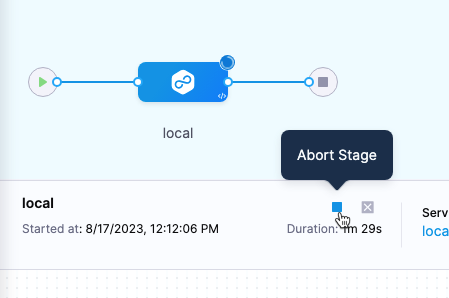

This topic explains how to stop an in-progress pipeline, stage, or step. Take care when using this option as it can have additional impacts.

## Required permissions

To abort a pipeline, stage, or step, you need permission to abort pipelines. There are two primary ways you can configure this with [Harness RBAC](/docs/platform/role-based-access-control/rbac-in-harness.md):

* **Pipeline Execute** permission: By default, this permission grants you the ability to initiate and interact with pipeline executions, including running pipelines, aborting pipelines and pipeline components (stages and steps), retrying/rerunning pipelines, and so on.
* (Beta) **Abort** permission: To control the **Abort** permission separately from other pipeline execute functions, you can enable the Feature Flag `CDS_PIPELINE_ABORT_RBAC_PERMISSION` by contacting [Harness Support](mailto:support@harness.io).
   * Enabling this feature flag can take several days because it requires migrating your existing users to this permissions structure.
   * If the **Abort** permission isn't listed in your account's RBAC settings, then your account is using the default **Pipeline Execute** permission functionality to control all pipeline execution functions (run, abort, retry, and so on).

Permissions are contained in [roles](https://developer.harness.io/docs/platform/role-based-access-control/add-manage-roles), which can be narrowly scoped, such as the **Pipeline Executor** role, or broadly scoped, like the **Account Admin** role.

## Abort a pipeline

When you abort a pipeline:

* The pipeline finish executing the current task and then stops.
* The pipeline status becomes **Aborted**.
* Harness **does not** clean up resources that were created during pipeline execution, such as pods.

:::warning

Abort pipelines as a last resort. The abort action stops the pipeline execution and causes the pipeline to end execution in an aborted state. This prevents end-of-pipeline cleanup tasks from happening and can leave infrastructure in an unresolved state.

:::

To terminate a running pipeline, go to the pipeline's execution details, select **More Options** (&vellip;), and then select **Abort Pipeline**.

## Abort a stage

When you abort a stage:

* The stage finishes executing the current task and then stops. Then the pipeline stops, and the pipeline status becomes **Aborted**. Stages after the aborted stage do not run.
* Harness **does not** clean up resources that were created during stage execution, such as pods.

To terminate a running stage in a running pipeline, go to the pipeline's execution details, select the stage you want to terminate, and select the **Stop** icon next to the stage name.

:::tip

To clean up the workspace and revert back to the old state, [mark the stage as failed](/docs/platform/pipelines/failure-handling/mark-as-failed).

:::

## Abort a step

You can initiate an abort on the **Verify** step. For more information, go to [Abort verification](/docs/continuous-delivery/verify/configure-cv/abort-verification).

## Abort process and when an "abort" gets completed

Although an abort process may be initiated, there are multiple steps that need to be completed as a part of an abort.  This can mean that delays can occur in the timing of when tasks become aborted, and whether the receiving environments will abort their processes.

As an example, a pipeline may have multiple parallel stages, doing a variety of tasks.  A bash job, a build in Artifactory, and possibly other processes could be running concurrently.

They all may have different timings for when those abort process will be received and completed.  

### What happens in the process

The abort event to the delegate has its own delay due to network and infrastructure and can take time to arrive.  

After that, the delegate still has the possibility of additional delays in sending that "abort" message to the destinations. Network and infrastructure can add further delays and then the abort process is also dependent on the task itself.

For example, aborting a BASH execution should be relatively simple, whereas, stopping a build process from Artifactory would be a larger process. Harness can initiate a command to abort, but it may ultimately be controlled by the other service that it is connecting to, and how it would handle the abort command.

During that time, the task that is supposed to be stopped, it can be completed, or partially completed.  It is recommended that a user review their environments to confirm if any artifacts or builds were created before the abort commands were completed. 

Users should often weigh whether aborting a pipeline, or failing stages to trigger a rollback is a better option to stop their execution.