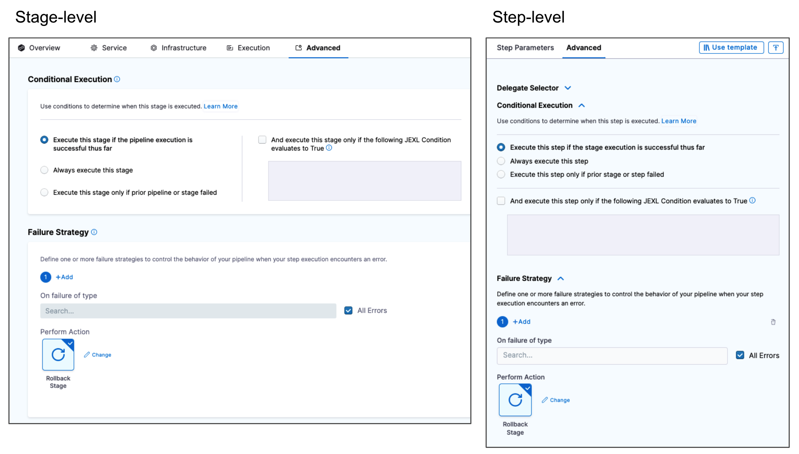
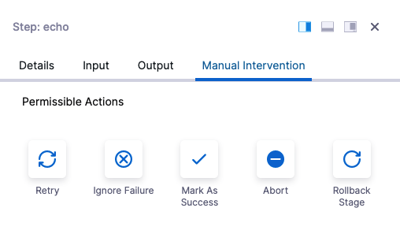

A failure strategy defines how steps, stages, and step groups handle different failure conditions.

A failure strategy consists of error conditions that must occur to trigger the strategy and the actions to take when those failure conditions occur.

Failure strategies are a critical pipeline design component that determine what fails a step or stage and what to do when the failure occurs.

<details>
<summary>Video: Configure failure strategies</summary>

<DocVideo src="https://www.youtube.com/watch?v=4KYGllvJ42U" />

</details>

You can also [rollback pipelines](/docs/platform/pipelines/define-a-failure-strategy-for-pipelines).

## Failure strategies take precedence over conditional executions

Harness pipeline stages and steps can include both [conditional executions](../w_pipeline-steps-reference/step-skip-condition-settings.md) and failure strategies.



When using these settings together in multiple stages, you must consider how they could interact.

For example, assume you have a pipeline with two stages: **stage 1** and **stage 2**. Assume stage 2's **Conditional Execution** is set to **Execute this step only if prior stage or step failed**, and stage 1's **Failure Strategy** is set to **Rollback Stage on All Errors**. If stage 1 has any error, it is rolled back and it is not considered a failure; therefore, the stage 2's **Conditional Execution** is not executed. In order to get stage 2 to execute, you can set the stage 1 **Failure Strategy** to **Ignore Failure**. Then rollback won't occur and stage 2's **Conditional Execution** executes.

If you want to run particular steps when a stage fails, make sure you add those steps to the stage's **Rollback** settings.

## Add a stage failure strategy

The stage failure strategy applies to all steps in the stage that do not have their own failure strategy configured.

1. In your pipeline, select the [stage](/docs/platform/pipelines/add-a-stage) where you want to add the failure strategy.
2. Select the **Advanced** tab.
3. Under **Failure Strategy**, the default stage failure strategy is shown:

   ```
   On all errors other than those specified in failure strategies defined here, perform action.
   ```

   You can't remove the default strategy, but you can edit it to choose a different **Action**, **Timeout**, and **Post timeout action**.

4. To add an additional stage failure strategy, select **Add**, and then configure the failure strategy settings:

   - **On failure of type:** Select one or more of the error types to trigger the failure strategy. For details, go to [Step and Stage Failure Strategy Settings](../w_pipeline-steps-reference/step-failure-strategy-settings.md).
   - **Perform Action:** Select the action that should occur when the specified failure event happens.
   - **Timeout** and **Post timeout action:** These are available if you selected **Manual Intervention** for the **Action**. The manual intervention action allows a user to intervene and choose an **Action** when the specified failure event occurs. You can enter a **Timeout** for the user to select an action, and a **Post Timeout Action** to fallback on if the user doesn't manually select an action in a certain amount of time.
   - **Retry Count** and **Retry Intervals:** these are available if you selected **Retry** for the **Action**. Enter the number of times to retry the step and the retry interval.

## Add a step failure strategy

Steps don't have a default failure strategy. Instead, steps inherit the stage failure strategy if there is no step-level failure strategy.

When you add a step failure strategy, you override the stage failure strategy for that step.

To add a step failure strategy:

1. Edit the step where you want to add the failure strategy.
2. Select the **Advanced** tab.
3. Select **Failure Strategy**, select **Add**, and then configure the failure strategy settings:

   - **On failure of type:** Select one or more of the error types to trigger the failure strategy. For details, go to [Step and Stage Failure Strategy Settings](../w_pipeline-steps-reference/step-failure-strategy-settings.md).
   - **Perform Action:** Select the action that should occur when the specified failure event happens.
   - **Timeout** and **Post timeout action:** These are available if you selected **Manual Intervention** for the **Action**. The manual intervention action allows a user to intervene and choose an **Action** when the specified failure event occurs. You can enter a **Timeout** for the user to select an action, and a **Post Timeout Action** to fallback on if the user doesn't manually select an action in a certain amount of time.
   - **Retry Count** and **Retry Intervals:** these are available if you selected **Retry** for the **Action**. Enter the number of times to retry the step and the retry interval.

## Failure strategy as runtime input

You can also define stage, step, and step group failure strategies at runtime by configuring them as [runtime inputs](/docs/platform/variables-and-expressions/runtime-inputs).

This video explains how to define a failure strategy as runtime input:

<DocVideo src="https://harness-24.wistia.com/medias/bj2kzkgw8a" />

## Failure strategies for CD steps and stages

For guidance on configuring failure strategies for CD stages and steps, go to [Define a failure strategy on Harness CD stages and steps](/docs/continuous-delivery/x-platform-cd-features/executions/step-and-stage-failure-strategy).

## Handling manual interventions

Here is what a Manual Intervention action looks like when a failure occurs:



The user can select an **Action**. If the Manual Intervention exceeds the **Timeout** setting, Harness automatically selects the **Post Timeout Action**.
