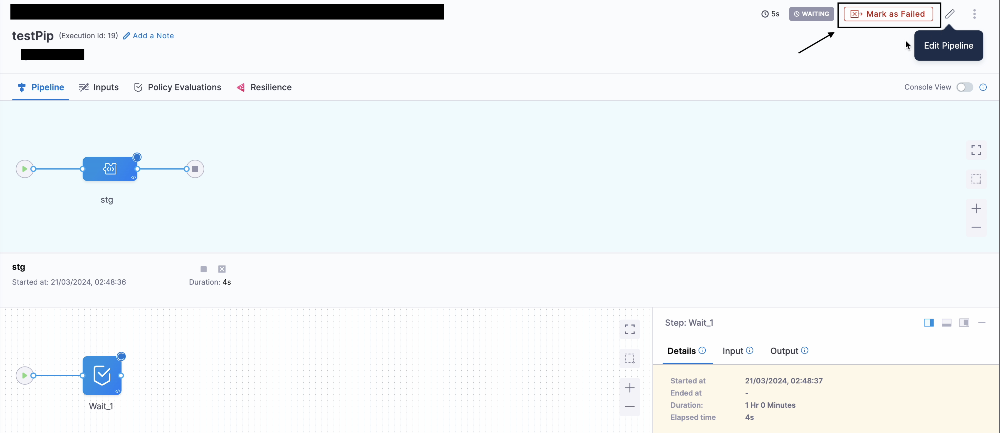
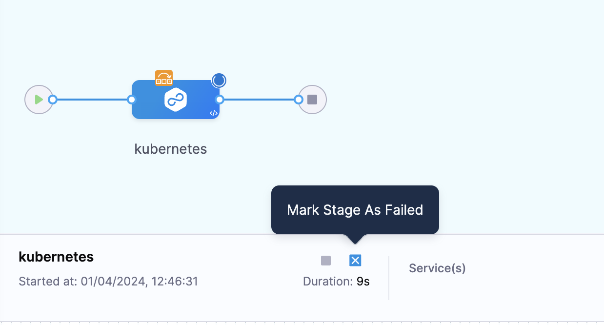

:::note

Currently, this feature is behind the feature flag `CDS_MARK_PIPELINE_AS_FAILURE`. Contact [Harness Support](mailto:support@harness.io) to enable the feature.

:::
You can mark an executing pipeline as failed by selecting ``Mark as Failed`` option.

After marking as failed, Harness fails currently running/waiting stages. It does not fail the already executed stages.

## What is difference between Mark as Failed at stage level and Mark as Failed at pipeline level?
We need to understand the difference between ``Mark as Failed`` at ``stage`` level and ``Mark as Failed`` at ``pipeline`` level.
- If you have a single stage running at a time there is no difference, both the functionality performs the same thing.

- If you are runnning parallel stages, then using ``Mark as Failed`` at ``pipeline`` level send the failure interrupt to each of the running stages. 

You can perform the same performation by going to each running stage and clicking the existing ``Mark as Failure`` at ``stage`` level.

## Requirements

- You must have `Execute` pipeline permission to be able to mark a pipeline as failed.
- You must enable `Allow users to mark a running Step as failure` in your Harness account's [default settings](/docs/platform/settings/default-settings).

