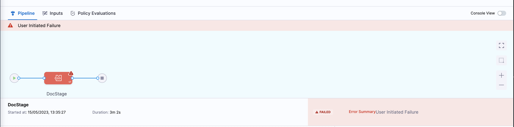

You can mark a specific stage as failed during pipeline execution by selecting the `Mark Stage As Failed` option.

Marking a stage as failed lets you:

- Abort a step that is running that you need to stop.
- Trigger a configured failure strategy after the step is aborted.

After marking a stage as failed, Harness aborts any currently-running delegate tasks.

## Requirements

- You must have `Execute` pipeline permission to be able to mark as stage as failed.
- You must enable `Allow users to mark a running Step as failure` in your Harness account's [default settings](/docs/platform/settings/default-settings).

## Configure failure strategy

Failure strategies define the actions to take when a stage fails. You can configure failure strategies for different failure conditions.

If a stage marked as failed has no specified failure strategy, Harness uses the default failure strategy.

To configure a failure strategy for manual stage failure:

1. In your pipeline, select the stage where you want to configure a failure strategy.
2. Select the **Advanced** tab.
3. Under **Failure Strategy**, select **Add**.
4. For **On failure of type**, select **User Marked Failure**.
5. For **Perform Action**, select the desired action to take when the stage is marked as failed, such as **Rollback** or **Retry**.
6. Select **Save**.

## Mark a stage as failed

To mark a stage as failed during pipeline execution:

1. [Go to the execution details](/docs/platform/pipelines/executions-and-logs/view-and-compare-pipeline-executions) for a currently-running pipeline.
2. Select the stage you want to mark as failed, and select **Mark Stage As Failed**.

   

3. Select **Confirm**.

In the execution history, the stage's **Error Summary** reports `User Initiated Failure`, and the stage's failure type is `USER_MARKED_FAILURE`.

:::info Parallel stages

If you need to fail multiple stages running parallel, you must select **Mark Stage as Failed** for each parallel stage.

If you only mark one of the parallel stages as failed, the other stages must complete before the failure strategy applies for the failed stage.

:::
