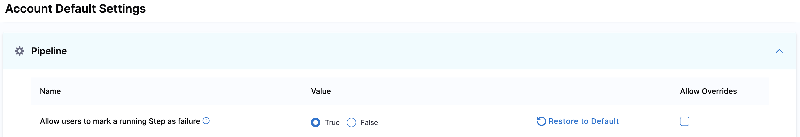
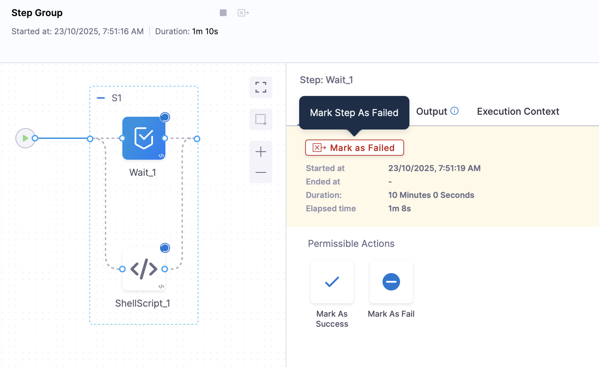
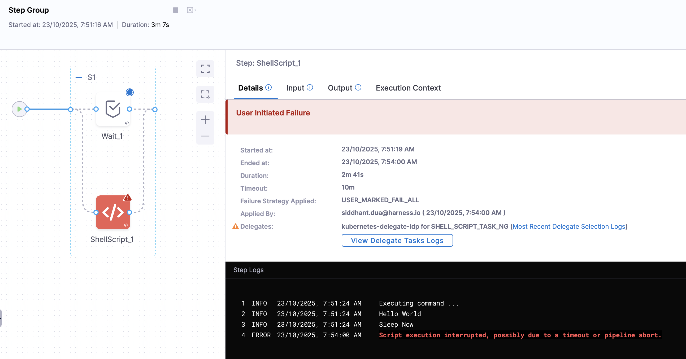

You can mark a specific step as failed during pipeline execution by selecting the step and using the `Mark As Failed` option.

It is a manual action that you can perform to mark a step as failed. This action is extremely useful when you have multiple steps running in a parallel step group, and you wish to mark a running step as failed.

- Allows you to abort a step that is running and needs to be stopped.
- Allows other steps in the step group to continue running unless they are also marked as failed.
- Triggers a configured failure strategy after the step is aborted.

## Requirements

- You must have `Execute` pipeline permission to be able to mark a step as failed.
- You must enable `Allow users to mark a running Step as failure` in your Harness account's [default settings](/docs/platform/settings/default-settings).

## Configure failure strategy

Failure strategies define the actions to take when a step fails. You can configure failure strategies for different failure conditions.

If a step marked as failed has no specified failure strategy, Harness uses the default failure strategy.

To configure a failure strategy for manual step failure:

1. In your pipeline, select the step where you want to configure a failure strategy.
2. Select the **Advanced** tab.
3. Under **Failure Strategy**, select **Add**.
4. For **On failure of type**, select **User Marked Failure**.
5. For **Perform Action**, select the desired action to take when the step is marked as failed, such as **Rollback** or **Retry**.
6. Select **Save**.

## Mark a step as failed

To mark a step as failed during pipeline execution:

1. [Go to the execution details](/docs/platform/pipelines/executions-and-logs/view-and-compare-pipeline-executions) for a currently-running pipeline.
2. Select the step you want to mark as failed, and select **Mark Step As Failed**.

3. Select **Confirm**.

In the execution history, the step's **Error Summary** reports `User Initiated Failure`, and the step's failure type is `USER_MARKED_FAILURE`.

