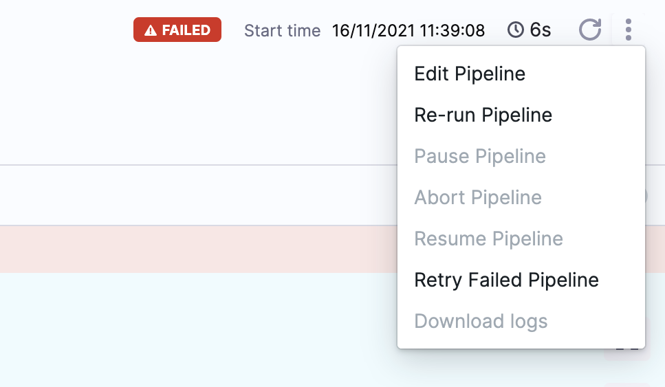
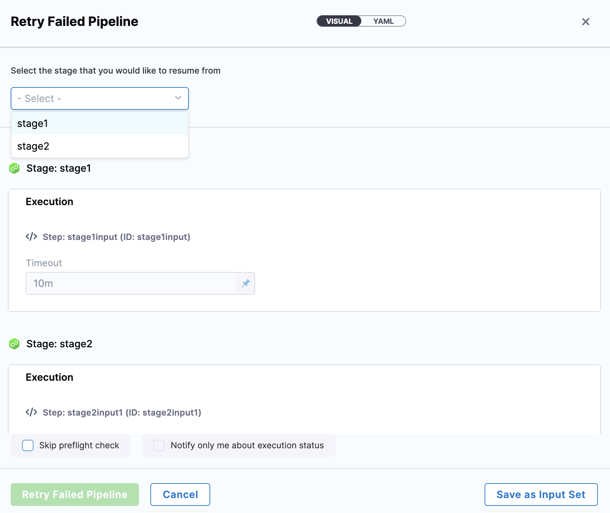

Pipeline executions fail for many reasons, such as infrastructure changes or changes to resource access. In such cases, rerunning an entire pipeline can be costly and time-consuming.

With Harness, you can resume pipeline executions from any successful stage or a failed stage. These options enable you to quickly rerun stages after you identify the cause of the failure.

*Retrying* a pipeline or stage is different from *rerunning* a pipeline or stage:

* When you rerun, you start fresh. For example, you can select new values for runtime inputs. You can rerun the entire pipeline or [rerun from a specific stage](/docs/platform/pipelines/run-specific-stage-in-pipeline.md).
* When you retry, you are running the pipeline/stage exactly as it was run before. You can't change mandatory settings, parameters, or conditions. You cannot retry any execution whose first (original) execution is more than 30 days old.

## Prerequisites

You need:

* An understanding of [Harness' key concepts](/docs/get-started/key-concepts.md).
* Pipeline execution permissions, such as is granted by the [Pipeline Executor role](/docs/platform/role-based-access-control/permissions-reference.md).
* A pipeline that is in **Failed**, **Aborted**, **Expired,** or **Rejected** status.

## Retry stages

1. Go to the execution history and locate the failed pipeline.
2. Select **More Options** (&vellip;), and then select **Retry Failed Pipeline**.

   

3. In the **Retry Pipeline** settings, select the stage from which you want to retry the Pipeline. If your pipeline uses [runtime inputs](/docs/platform/variables-and-expressions/runtime-inputs.md), these are automatically populated from the previous execution.

   

:::tip parallel stages

If your pipeline contains parallel stages and one of those stages fails, you can choose to retry only the failed parallel stage or retry all parallel stages.

:::
