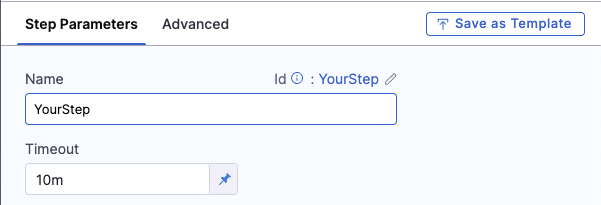

Timeout settings help prevent steps, stages, and pipelines from running excessively long. For example, this can help end a pipeline naturally if a step enters an endless loop or other long-lasting or infinite failure condition.

## Step timeouts

When configuring a step, you can set the step **Timeout** under the **Step Parameters** tab. The default is usually 10 minutes.

  

Step timeouts mark steps as expired in the following scenarios:

* The step does not complete before the configured timeout.
* The stage or pipeline reaches the stage/pipeline timeout limit when the step is still running.

## Stage timeout

Find the stage **Timeout** settings under **Overview** > **Advanced** when configuring your stage. 

  <DocImage path={require('./static/stage-timeout.png')} width="60%" height="60%" title="Click to view full size image" />

Stage timeouts mark stages as expired in the following scenarios:

* The stage does not complete before the configured timeout.
* The pipeline reaches its timeout limit when the stage is still running.

:::info note
When a stage time out is less than it's total step execution time, the failure strategy applied is `EXPIRE_ALL`, preventing rollback. This occurs because child nodes (steps) inherit the expired status from the stage, stopping further execution.
:::

## Pipeline timeouts

Find the **Pipeline Timeout Settings** under the **Advanced Options** section in the right navbar. 

  <DocImage path={require('./static/pipeline-timeout.png')} width="30%" height="30%" title="Click to view full size image" />

The pipeline timeout applies to the duration of the entire pipeline. It does not override stage/step timeouts, but stages and steps will timeout if the pipeline timeout limit is hit while a stage/step is running.

:::warning Approvals

Approval steps and stages can *pause* execution but they *do not* stop the pipeline timeout counter. Make sure that the pipeline timeout setting accommodates the time required for approvals.

:::
