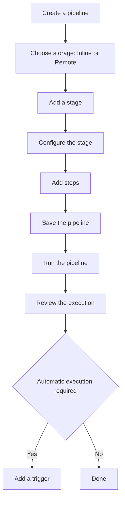

import Tabs from '@theme/Tabs';
import TabItem from '@theme/TabItem';

<style>
{`
  .tabs--full-width {
    width: 100%;
  }
  .tabs--full-width .tabs__item {
    flex: 1;
    text-align: center;
    justify-content: center;
  }
`}
</style>

This quickstart walks you through creating and running your first Harness pipeline using the Pipeline Studio. 

This topic uses a **Custom** stage with a **Shell Script** step. A Custom stage does not require build infrastructure or deployment prerequisites, allowing you to focus on creating and running the pipeline.

After completing this quickstart, you can add <a href="/docs/continuous-integration/use-ci/prep-ci-pipeline-components" target="_blank" rel="noopener noreferrer">CI Build stages</a>, <a href="/docs/continuous-delivery" target="_blank" rel="noopener noreferrer">CD Deploy stages</a>, or any other stage type.

---

## What you will learn from this topic

- How to [create a pipeline](#create-a-pipeline) in Pipeline Studio.
- How to [add a stage and steps](#add-a-custom-stage) to the pipeline.
- How to [run the pipeline](#run-the-pipeline) and view the execution.
- How to [view execution logs](#view-execution-logs) for a step.

---

## Before you begin

- **Harness account**: You need an active Harness account. If you do not have one, <a href="https://app.harness.io/auth/#/signup/?module=ci" target="_blank" rel="noopener noreferrer">sign up for free</a>.
- **Project**: You need an existing project. For more information, refer to <a href="/docs/platform/organizations-and-projects/overview" target="_blank" rel="noopener noreferrer">Organizations and Projects</a>.
- **Permissions**: You need the **Pipeline: Create/Edit** permission in the project. For more information, refer to <a href="/docs/platform/role-based-access-control/rbac-in-harness" target="_blank" rel="noopener noreferrer">RBAC in Harness</a>.
- **Delegate**: A Harness Delegate is required to execute steps on your infrastructure. If you do not have a delegate yet, go to <a href="/docs/platform/delegates/install-delegates/overview" target="_blank" rel="noopener noreferrer">Install a delegate</a> to install one.

---

## Pipeline creation architecture

You create and manage pipelines in a Harness project. If you are new to Harness pipelines, use this flow to get started:


```mermaid
flowchart TD
  A[Create a pipeline] --> B[Choose storage: Inline or Remote]
  B --> C[Add a stage]
  C --> D[Configure the stage]
  D --> E[Add steps]
  E --> F[Save the pipeline]
  F --> G[Run the pipeline]
  G --> H[Review the execution]
  H --> I{Automatic execution required}
  I -- Yes --> J[Add a trigger]
  I -- No --> K[Done]
```

The exact configuration depends on what you want the pipeline to do and which Harness module you are using.

## Pipeline studio modes

Harness Pipeline Studio provides two interchangeable editors. To switch between editors, use the **Visual / YAML** toggle at the top of Pipeline Studio.

<div align="center"><DocImage path={require('./static/harness-yaml-quickstart-21.png')} alt="Switch between Visual and YAML editors in Pipeline Studio" width="60%" /></div>

<Tabs className="tabs--full-width">
<TabItem value="visual" label="Visual" default>

### Visual

The **Visual** editor is a graphical canvas where you configure stages and steps using the Harness UI. It is the recommended starting point for new pipeline authors.

Key areas in the visual editor:

- **Pipeline canvas:** Shows stages as cards arranged left to right. Select a stage to open its configuration panel.
- **Stage configuration panel:** Contains the **Overview**, **Infrastructure**, **Execution**, and **Advanced** tabs for the selected stage.
- **Step Library:** A searchable catalog of available steps. Open it by selecting **Add Step** in a stage's execution view.
- **Pipeline header:** Contains **Run**, **Save**, **Triggers**, **Input Sets**, **Variables**, and **Notifications** controls.

<div align="center"><DocImage path={require('./static/harness-visual-quickstart-21.png')} alt="Pipeline visual mode" width="80%" /></div>

</TabItem>
<TabItem value="yaml" label="YAML">

### YAML

The **YAML** editor is a full-featured text editor for the pipeline YAML. Use it when you prefer to write or review pipeline configuration as code.

Key features:

- **Autocomplete:** Press `Cmd/Ctrl + Space` to see context-aware suggestions for keys and values.
  - **On a blank line:** Suggestions include valid keys at that level, such as `timeout`, `stage`, and `step`.
    <div align="center"><DocImage path={require('./static/harness-yaml-quickstart-22.png')} alt="Autocomplete suggestions on a blank line" width="60%" /></div>
  - **In context:** Suggestions narrow to keys valid at the current nesting level.
    <div align="center"><DocImage path={require('./static/harness-yaml-quickstart-25.png')} alt="Context-aware autocomplete" width="60%" /></div>
  - **For a key without a value:** Suggestions include valid values for that key.
    <div align="center"><DocImage path={require('./static/harness-yaml-quickstart-32.png')} alt="Autocomplete value suggestions" width="60%" /></div>
- **Find and replace:** Press `Cmd/Ctrl + F`.
  <div align="center"><DocImage path={require('./static/harness-yaml-quickstart-35.png')} alt="Find and replace in the YAML editor" width="60%" /></div>
- **Command palette:** Press `F1` to see all available commands and shortcuts.
  <div align="center"><DocImage path={require('./static/harness-yaml-quickstart-36.png')} alt="Command palette in the YAML editor" width="60%" /></div>
- **Inline validation:** Errors are highlighted in real time. Hover over an error marker to see details.
   <div align="center"><DocImage path={require('./static/harness-yaml-quickstart-37.png')} alt="Invalid indicator in the YAML editor" width="60%" /></div>
    
   <div align="center"><DocImage path={require('./static/harness-yaml-quickstart-38.png')} alt="Hover to see expected values" width="60%" /></div>

Everything you configure in the visual editor is reflected immediately in the YAML editor, and vice versa.

#### YAML schema

The Harness YAML schema formally defines all valid keys, values, and structures. It is available at <a href="https://github.com/harness/harness-schema" target="_blank" rel="noopener noreferrer">github.com/harness/harness-schema</a>. That repository also includes instructions for embedding the schema in VS Code and Sublime Text for local validation and autocomplete support.

You can also inspect the schema at runtime using Chrome DevTools:

1. Open Chrome DevTools and select the **Network** tab.
2. Open the relevant configuration section in Harness and reload it if necessary.
3. Identify the successful network request that loads the configuration or schema metadata for that section.
4. Open the request's **Preview** or **Response** tab.
5. Inspect the returned metadata or schema for the relevant definitions, properties, or configuration fields.

<div align="center"><DocImage path={require('./static/yaml-reference-cd-pipeline-00.png')} alt="Inspecting schema metadata in Chrome DevTools" width="80%" /></div>

#### Schema conventions

| Convention | Description |
|---|---|
| `key: value` | Standard YAML associative arrays. Settings are not quoted. |
| 2-space indentation | Default indentation. Lines prefaced by `-` use 4-space indentation from the position of the `-`. |
| `<+input>` | Marks a field as a <a href="/docs/platform/variables-and-expressions/runtime-inputs" target="_blank" rel="noopener noreferrer">runtime input</a>. The value is provided at execution time. |
| `<+expression>` | Marks a field as an <a href="/docs/platform/variables-and-expressions/harness-expressions-reference" target="_blank" rel="noopener noreferrer">expression</a>. Harness evaluates it at runtime. |
| `[]` (empty brackets) | Inline empty array. To add items: delete the brackets, add a new line, enter `-` followed by the item, and use autocomplete to see valid item structures. |
| `{}` (empty braces) | Inline empty map. To add entries: delete the braces, add a new line, and enter `key: value` pairs. |
| `\|` (block style) | Multiline string. Every new line becomes a literal new line, with one added at the end. |
| `\|-` (block scalar, strip) | Multiline string. Strips trailing new lines. Use for multi-line scripts. |

</TabItem>
</Tabs>

---

## Create a pipeline

This section demonstrates how to create a pipeline with a **Custom** stage and a **Shell Script** step using the visual editor. The same workflow applies when you create pipelines with other stage types and steps.

Perform the following steps to create a pipeline.

1. In Harness, navigate to your project.
2. In the left navigation, select **Pipelines**.
3. Select **+ Create a Pipeline**.
4. In the **Create new Pipeline** dialog, enter a **Name** for your pipeline. For this quickstart, enter `DemoPipeline`.

   Harness automatically generates an **ID** from the name. You can edit the ID now; after saving, the ID cannot be changed.

5. Choose where to store the pipeline definition:
   - Select **Inline** to store the pipeline configuration in Harness.
   - Select **Remote** to store it as code in a Git repository. For more information, refer to <a href="/docs/platform/git-experience/git-experience-overview" target="_blank" rel="noopener noreferrer">Git Experience</a>.

6. Select **Start**.

<div align="center"><DocImage path={require('./static/pipeline-getting-started-copy.png')} alt="Create new Pipeline dialog showing the Name field, Inline and Remote storage options, and the Start button" width="80%" /></div>

Harness opens **Pipeline Studio** in the visual editor.

<details>
<summary>YAML</summary>

You can also create this pipeline using the YAML editor by replacing the default YAML with the following definition:

```yaml
pipeline:
  name: DemoPipeline                    # Enter the pipeline name.
  identifier: DemoPipeline              # Pipeline ID. Harness generates this from the name.
  tags: {}                              # Optional: Add pipeline tags.
  projectIdentifier: KrishnamoorthyTest # Project where the pipeline is created.
  orgIdentifier: default                # Organization that contains the project.
```
</details>

### Add a Custom stage

Perform the following steps to add a Custom stage to the pipeline.

1. On the pipeline canvas, select **Add Stage**.
2. Select **Custom Stage** as the stage type.

   :::tip
   To create a CI build pipeline instead, select **Build** and go to <a href="/docs/continuous-integration/get-started/onboarding-guide" target="_blank" rel="noopener noreferrer">Get started with Harness CI</a>. To create a CD deployment pipeline, select **Deploy** and go to <a href="/docs/continuous-delivery/getting-started" target="_blank" rel="noopener noreferrer">Get started with Harness CD</a>.
   :::

3. Enter a **Stage Name**. For this quickstart, enter `Teststage`.
4. Select **Set Up Stage**.

The stage configuration panel opens with the following tabs: **Overview**, **Execution**, and **Advanced**.

#### Overview tab

The **Overview** tab contains basic stage information and optional settings.

<div align="center"><DocImage path={require('./static/pipeline-overview.png')} alt="pipeline overview tab" width="80%" /></div>

1. In the **Stage Name** field, enter `Teststage` (if not already entered).
2. Optionally, add a **Description** for the stage.
3. Optionally, add **Tags** to categorize the stage.
4. Optionally add a **Timeout**.
5. Add a stage variable if needed using **Stage variable**.
   1. Select **+ New Variable**.
   2. In **Type**, select the variable type.
   3. In **Name**, enter a name for the variable.
   4. In **Value**, enter the variable value.
   5. To require the value when the pipeline runs, select **Set variable as required during runtime**. You can configure a pipeline setting to accept a value when the pipeline runs instead of specifying a fixed value when you create the pipeline. When you run the pipeline, Harness prompts you to provide a value for the variable. For more information, go to [Use runtime input](https://developer.harness.io/docs/platform/variables-and-expressions/runtime-input-usage/).
   6. Optionally, enter a description in Description.
   7. Select **Save** to add the variable.
      <details>
      <summary>YAML-Stage variable</summary>
      ```yaml
        variables:
          - name: name
            type: String
            description: Name description
            required: false
            value: Test
      ```

      Reference pipeline variables with `<+pipeline.variables.name>`.

      Reference stage variables with `<+stage.variables.name>`.

       For more information, refer to <a href="/docs/platform/variables-and-expressions/harness-expressions-reference" target="_blank" rel="noopener noreferrer">Harness expressions reference</a>. 

       If Set variable as required during runtime is selected, the variable value is provided when the pipeline is run rather than being set as a fixed value when you create the variable.
      </details>
   
5. Click **Next**

:::note Services and Environment tabs

The **Service**, **Environment**/**Infrastructure** tabs are required for **Deploy** stages and other stage types that require deployment configuration. They are not required for a **Custom** stage.

For more information, see the [Service YAML schema](https://github.com/harness/harness-schema/blob/main/v0/pipeline/stages/cd/service-yaml-v2.yaml), [Environment YAML schema](https://github.com/harness/harness-schema/blob/main/v0/pipeline/stages/cd/environment-yaml-v2.yaml), and [Infrastructure Definition YAML schema](https://github.com/harness/harness-schema/blob/main/v0/pipeline/stages/cd/infra-structure-definition-yaml.yaml).

:::

#### Execution tab

The **Execution** tab is where you add and configure the steps that run in this stage. For more information, refer to [Add a Shell Script step](#add-a-shell-script-step).

<div align="center"><DocImage path={require('./static/pipeline-execution.png')} alt="pipeline overview tab" width="80%" /></div>

#### Advanced tab

The **Advanced** tab includes optional configuration that you can add at the stage or step level, depending on your requirements:

- **Conditional Execution:** Run the stage only when specific conditions are met. For more information, refer to <a href="/docs/platform/pipelines/step-skip-condition-settings" target="_blank" rel="noopener noreferrer">Conditional execution</a>.
- **Failure Strategy:** Define what happens when the stage fails. For more information, refer to <a href="/docs/platform/pipelines/failure-handling/define-a-failure-strategy-on-stages-and-steps" target="_blank" rel="noopener noreferrer">Failure strategies</a>.
- **Looping Strategy:** Repeat the stage for multiple items or configurations. For more information, refer to <a href="/docs/platform/pipelines/looping-strategies/looping-strategies-matrix-repeat-and-parallelism" target="_blank" rel="noopener noreferrer">Looping strategies</a>.
- **Delegate Selector:** Choose which delegate runs this stage. For more information, refer to <a href="/docs/platform/delegates/delegate-concepts/delegate-overview" target="_blank" rel="noopener noreferrer">Delegate overview</a>. 

<div align="center"><DocImage path={require('./static/pipeline-advanced.png')} alt="pipeline advanced tab" width="80%" /></div>

For example, you can add the pipeline marked as failed for unknown errors as a **Failure Strategy**.

<div align="center"><DocImage path={require('./static/pipeline-stratgey.png')} alt="pipeline advanced tab" width="80%" /></div>

<details>
<summary>YAML - Failure strategy</summary>

```yaml
   failureStrategies:
          - onFailure:
              errors:
                - Unknown
              action:
                type: MarkAsFailure
```
</details>

---

### Add a Shell Script step

Perform the following steps to add a shell script step to the stage.

1. In the **Execution** tab, select **Add Step**.
2. In the **Step Library**, search for **Shell Script** and select it.
3. Configure the step:

   | Field | Value |
   |---|---|
   | **Name** | `Print message` |
   | **Timeout** | `10m` (default) |
   | **Script Type** | `Bash` |
   | **Select script location** | `Inline` |
   | **Script** | `echo "Hello from Harness!"` |

   <div align="center"><DocImage path={require('./static/pipeline-add-a-step.png')} alt="pipeline advanced tab" width="80%" /></div>

4. Select **Apply Changes**. The step appears on the stage execution canvas.

<details>
<summary>YAML - Pipeline step</summary>

```yaml
step:
  type: ShellScript
  name: Print message
  identifier: Print_message
  spec:
    shell: Bash
    executionTarget: {}
    source:
      type: Inline
      spec:
        script: echo "Hello from Harness!"
    environmentVariables: []
    outputVariables: []
  timeout: 10m
```
</details>

You can arrange steps sequentially, in step groups, or in parallel. Each step type has its own configuration options. For more information about organizing steps into groups, go to [Organize steps in step groups](/docs/platform/pipelines/use-step-groups/).

---

## Run the pipeline

1. In Pipeline Studio, select **Run** in the top right corner.
2. The **Run Pipeline** dialog opens. This pipeline has no runtime inputs, so no additional configuration is needed.
3. Select **Run Pipeline**.

   Harness queues and starts the execution. You are redirected to the execution view.

---

## View execution logs

After the pipeline starts running, the execution view shows the pipeline graph with stage and step status.

1. On the execution graph, select the **Teststage** stage.
2. Select the **Print message** step.
3. The **Console View** panel opens on the right, showing real-time logs for the step.

   You should see output similar to the following:

   ```text
   Executing command...
   Hello from Harness!
   Command completed with ExitCode (0)
   ```

4. After the step completes, the stage and pipeline statuses update to **Success**.

 <div align="center"><DocImage path={require('./static/pipeline-success.png')} alt="pipeline advanced tab" width="80%" /></div>

---

## Pipeline YAML

The following example shows the complete YAML for the pipeline created in this quickstart,including the pipeline, stage, step, variables, and failure strategy.

<details>
<summary>Pipeline YAML</summary>

```yaml
pipeline:
  name: DemoPipeline                    # Your pipeline name.
  identifier: DemoPipeline              # Your pipeline identifier.
  tags: {}                              # Your pipeline tags.
  projectIdentifier: KrishnamoorthyTest # Your project identifier.
  orgIdentifier: default                # Your organization identifier.
  stages:                               # Your pipeline stages.
    - stage:
        name: Teststage                  # Your stage name.
        identifier: Teststage            # Your stage identifier.
        description: ""                  # Your stage description.
        type: Custom                     # Your stage type.
        spec:                            # Your stage configuration.
          execution:                    # Your stage execution settings.
            steps:                       # Your stage steps.
              - step:
                  type: ShellScript      # Your step type.
                  name: Print message    # Your step name.
                  identifier: Print_message # Your step identifier.
                  spec:                  # Your step configuration.
                    shell: Bash          # Your script type.
                    executionTarget: {}  # Your execution target.
                    source:              # Your script source.
                      type: Inline       # Your script location.
                      spec:
                        script: echo "Hello from Harness!" # Your script.
                    environmentVariables: [] # Your environment variables.
                    outputVariables: []      # Your output variables.
                  timeout: 10m            # Your step timeout.
        tags: {}                         # Your stage tags.
        variables:                       # Your stage variables.
          - name: name                   # Your variable name.
            type: String                 # Your variable type.
            description: Name description # Your variable description.
            required: false              # Your runtime requirement setting.
            value: Test                  # Your variable value.
        failureStrategies:               # Your failure strategy.
          - onFailure:
              errors:
                - Unknown                # Your failure condition.
              action:
                type: MarkAsFailure      # Your failure action.
```
</details>


## Next steps

- <a href="/docs/continuous-integration/get-started/onboarding-guide" target="_blank" rel="noopener noreferrer">Get started with Harness CI</a>: Add a Build stage to compile code, run tests, and push artifacts.
- <a href="/docs/continuous-delivery/getting-started" target="_blank" rel="noopener noreferrer">Get started with Harness CD</a>: Add a Deploy stage to deploy a service to Kubernetes, a VM, or a serverless target.
- <a href="/docs/platform/triggers/triggers-overview" target="_blank" rel="noopener noreferrer">Triggers overview</a>: Automate pipeline runs on Git events or a schedule.
- <a href="/docs/platform/pipelines/input-sets" target="_blank" rel="noopener noreferrer">Input sets and overlays</a>: Parameterize the pipeline with runtime inputs and save reusable input sets.

---

