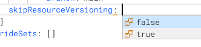

You can use YAML to create pipelines, connectors, triggers, and other components in Harness. This topic explains how to use the YAML editor and provides information about the Harness YAML schema.

Everything you can do in the Visual editor, you can also represent in YAML.

## Use the YAML editor

1. Edit or create a pipeline. For guidance on creating pipelines, go to [CD onboarding guide](/docs/continuous-delivery/get-started/onboarding-guide) or [CI pipeline creation overview](/docs/continuous-integration/use-ci/prep-ci-pipeline-components).
2. In the Pipeline Studio, select **YAML** to switch to the YAML editor.

   

You can use these helpful shortcuts when working in the YAML editor

### Autocomplete/suggestions

The YAML editor has an autocomplete feature that makes it very easy to see what entries are available.

Press `CTRL + Space` to display a list of suggestions based on your cursor location.

On a blank line, suggestions include keys, such as `timeout`, `stage`, `step`, and so on.


The suggestions depend on the context and location in your YAML.


When you enable suggestions for a key without a value, suggestions include possible values.



If a key already has a value, no suggestions are shown. You must delete the value and then press `Ctrl + Space`.

### Find and replace

Press `Cmd/Ctrl + F` to enable find and replace.


### Command palette

The command palette displays all of the commands and the keyboard shortcuts for most commands.

To enable the command palette, press `F1`.


## YAML validation

As you edit your YAML, incomplete or invalid YAML triggers the **Invalid** indicator.

Hover over the **Invalid** indicator to see where the errors are.


You can also hover over any incomplete entry to see what is expected.


Select **Peek Problem** to see suggestions and valid values, if available.


## YAML schema

Harness pipeline YAML lets you model your release process declaratively. Each pipeline entity, component, and setting has a YAML entry.

The Harness YAML schema is available at [github.com/harness/harness-schema](https://github.com/harness/harness-schema). This repository contains the schema definition for Harness pipeline configuration files, enabling users to define and customize their pipelines effortlessly. This repo provides steps on how to embed the YAML schema in Visual Studio Code and Sublime Text.

In addition to the YAML schema available at [github.com/harness/harness-schema](https://github.com/harness/harness-schema), you can use [Chrome DevTools](https://developer.chrome.com/docs/devtools/) to view the schema.

1. Open Chrome DevTools and select the **Network** tab.
2. Select the `yaml-schema` item.
3. Select the **Preview** tab.
4. Find the `definitions` section.

<!--  -->

<docimage path={require('./static/yaml-reference-cd-pipeline-00.png')} />

### Schema conventions

* Entries are standard YAML associative arrays using `key: value`. Settings are not quoted.
* Whitespace indentation is 2 spaces, unless the preceding line is prefaced by `-`, in which case indentation is 4 spaces (from the position of the `-`).
* You can use [fixed values, runtime input, or expressions](../variables-and-expressions/runtime-inputs.md) for most settings.
* Use quotes to indicate an empty string. Values do not need quotes. Once you enter a value and save the pipeline, the quotes are removed.
* Entries are listed as `key: keyword`. The key is a data type that corresponds to a setting such as `skipResourceVersioning`. The keyword is a literal definition for the setting, like `false` or `K8sManifest`.
* Brackets indicate an inline series branch (an array of the data type). For example `variables: []`. To edit: Delete the brackets, enter a new line, and enter a dash `-`, and then enable [autocomplete](#autocompletesuggestions).
* Curly braces indicate an array separated by new lines. For example, `tags: {}`. To edit: Delete the curly braces, enter a new line, and then enter the `key: value` pairs. For example:

   ```yaml
   ...
   tags:
       docs: "CD"
       yaml example: ""
   ...
   ```

* The block style indicator `|` turns every new line within the string into a literal new line and adds one line at the end. Include `-` after the block style indicator to remove new lines from the end of each line. For example:

   ```yaml
   ...
   script: |-
       echo "hello"

      echo <+pipeline.name>
   ...
   ```

### Basic pipeline structure

The following outline shows the high-level settings and YAML structure of a Harness pipeline. This is not an exhaustive representation of all possible keys, and it does not describe stage or step configuration; it is meant to give you a general idea of the YAML structure of pipelines in Harness.

```yaml
pipeline:
    name: YAML Example ## A name for the pipeline.
    identifier: YAML_Example ## A unique Id for the pipeline.
    projectIdentifier: default ## Specify the project this pipeline belongs to.
    orgIdentifier: default ## Specify the organization this pipeline belongs to.
    tags: {}
    description:
    stages: ## Contains the stage definitions.
        - stage:
            ...
        - stage:
            ...
    notificationRules:
    flowControl:
    properties:
    timeout:
    variables: ## Contains pipeline variables. Stage and step variables are defined within their own sections.
        -
```

A minimum amount of pipeline configuration is required to be able to save the pipeline.

### Basic stage structure

The following outline shows the high-level settings and YAML structure for the `stages` section in a Harness pipeline. A stage is a subset of a pipeline that contains the logic to perform one major segment of the pipeline process. Pipelines can have multiple `stage` within `stages`. This is not an exhaustive representation of all possible keys, and it does not describe step configuration; it is meant to give you a general idea of the YAML structure of stages in Harness.

```yaml
    stages:
        - stage:
              identifier: ## Enter a unique Id for the stage. In the Visual editor, the Id is generated automatically. In YAML, you have to enter an Id.
              name: ## Enter a name for the stage.
              type: ## Define the stage type, such as CD (Deploy), CI (Build), Approval, or Custom.
              description:
              tags:
              spec: ## Contains stage components, such as infrastructure and execution (steps).
                  serviceConfig: ## For deployment stages, define service configurations.

                  infrastructure: ## Define infrastructure to use to run the stage.

                  execution: ## Define the steps in the stage.
                      steps:
                          -
              variables: ## Define stage variables.
                  -
              when: ## Define a conditional execution.
                  pipelineStatus:
              failureStrategies: ## Define a failure strategy.
                  - onFailure:
                          errors:
                              - null

```

For details on each stage type and configuration, go to:

* **Approval:** [Using Manual Harness Approval Stages](../approvals/adding-harness-approval-stages.md) and [Adding Jira Approval Stages and Steps](../approvals/adding-jira-approval-stages.md)
* **Build:** [CI Build stage settings](/docs/continuous-integration/use-ci/set-up-build-infrastructure/ci-stage-settings)
* **Deployment:** [CD tutorials](/tutorials/cd-pipelines)
* **Custom:** [Add a custom stage](./add-a-custom-stage)


#### Stage spec

The `stage.spec` sections correspond with the tabs in the Visual editor.


For example, the following `stage.spec` YAML defines the `serviceConfig` for a Deployment stage, which includes the `service` and `serviceDefinition` settings. This stage adds a service named `myservice` and a [service definition using Kubernetes manifests](/docs/continuous-delivery/deploy-srv-diff-platforms/kubernetes/cd-kubernetes-category/define-kubernetes-manifests/). Service Definitions represent the real artifacts, manifests, and variables of a Service. They are the actual files and variable values. This example uses `<+input>`, which represents [runtime inputs](../variables-and-expressions/runtime-inputs.md).

```yaml
              spec:  
                  serviceConfig:  
                      service:  
                          identifier: myservice  
                          name: myservice  
                      serviceDefinition:  
                          type: Kubernetes  
                          spec:  
                              manifests:  
                                  - manifest:  
                                        identifier: <+input>  
                                        type: K8sManifest  
                                        spec:  
                                            store:  
                                                type: Github  
                                                spec:  
                                                    connectorRef: <+input>  
                                                    gitFetchType: Branch  
                                                    branch: <+input>  
                                                    folderPath: <+input>  
                                                    repoName: <+input>
```

:::tip Connectors

The `connectorRef` setting identifies the [Harness connector](/docs/category/connectors) that connects to the Git repo where the manifests are located. In the Visual editor you can create and select connectors while building your pipeline. In the YAML editor, you must provide the **Id** of an existing connector. If you need to exit your pipeline to create a connector, use a runtime input (`connectorRef: <+input>`) as a placeholder, so that you can save the pipeline and return to it later.

:::

You can [propagate CD services from previous stages](/docs/continuous-delivery/x-platform-cd-features/services/propagate-and-override-cd-services). In YAML, this is represented as follows:

```yaml
              spec:  
                  serviceConfig:  
                      useFromStage:  
                          stage: ""
```

#### Stage infrastructure

The `stage.spec.infrastructure` options depend on the stage `type`.


For example, the following `infrastructure` YAML describes the `environment` and `infrastructureDefinition` for a Deployment stage. This example uses a [Kubernetes Cluster Connector](/docs/platform/connectors/cloud-providers/add-a-kubernetes-cluster-connector) for a platform-agnostic direct connection to the target cluster. This example also uses `<+input>`, which represents [runtime inputs](../variables-and-expressions/runtime-inputs.md).

```yaml
                  infrastructure:
                      environment:
                          identifier: myinfra
                          name: myinfra
                          type: PreProduction
                      infrastructureDefinition:
                          type: KubernetesDirect
                          spec:
                              connectorRef: <+input>
                              namespace: <+input>
                              releaseName: <+input>
```

### Basic step structure (stage execution)

`execution.steps` contains one or more `step`, which define the steps that run in the stage.

Each `step` is prefaced by `-`.


The possible values for `step.type` depend on the `stage.type`.


Here's an example of a [Shell Script step](/docs/continuous-delivery/x-platform-cd-features/cd-steps/utilities/shell-script-step).

```yaml
                          - step:
                                identifier: ssh ## Enter a unique Id for the step. In the Visual editor, the Id is generated automatically. In YAML, you have to enter an Id.
                                name: ssh ## Enter a name for the step.
                                type: ShellScript ## Define the step type.
                                description:
                                spec: ## Define the step settings, depending on the step type.
                                    shell: Bash
                                    source:
                                        type: Inline
                                        spec:
                                            script: echo "hello world"
                                    timeout: <+input>
                                    onDelegate: false
                                failureStrategies: ## Define a failure strategy.
                                    - onFailure:
                                            errors:
                                                - AllErrors
                                            action:
                                                type: Abort
                                when: ## Define a conditional execution.
                                    stageStatus: Success
```

You can arrange steps sequentially, in groups, or in parallel.

Here's an example of the step group structure:

```yaml
                          - stepGroup: ## Step group flag.
                                name: ## Provide a name for the step group.
                                identifier: ## Provide a unique identifier for the step group.
                                steps: ## Define steps in the step group.
                                    - step:
                                        ...
                                    - step:
                                        ...
```

## Variables and advanced settings

### Conditional executions

Use `when` to define [conditional execution settings](./w_pipeline-steps-reference/step-skip-condition-settings) for stages and steps.

You must indent `when` to the same depth as either `step.identifier` or `stage.identifier`.

```yaml
                                when:
                                    stageStatus: Success
```

### Failure strategies

Use `failureStrategies` to define [failure strategies for stages and steps](./define-a-failure-strategy-on-stages-and-steps.md). You can also define failure strategies for pipelines to [rollback failed pipelines](./define-a-failure-strategy-for-pipelines.md).

```yaml
              failureStrategies:  
                  - onFailure:  
                          errors:  
                              - AllErrors  
                          action:  
                              type: Abort
```

### Variables

You can define `variables` for pipelines, stages, and steps. 

```yaml
              variables: 
                  - name: someVar
                    type: String
                    value: someValue
```

### Notification rules

Use notification rules to [send pipeline event notifications](/docs/continuous-delivery/x-platform-cd-features/cd-steps/notify-users-of-pipeline-events/) through email and popular communication and incident management platforms. You select the types of events to send, and then select how you want to send notifications. When those events occur, Harness sends event information to those channels and recipients.

The `notificationRules` section is placed at the end of the pipeline YAML. It is optional.

```yaml
pipeline:  
    name: ""  
    identifier: ""  
    projectIdentifier: ""  
    orgIdentifier: ""  
    tags: {}  
    stages:  
...  
    notificationRules:  
        - name: NOTIFICATION_NAME
          pipelineEvents: 
              - type: AllEvents
          notificationMethod:
              type: Email
              spec:
                  userGroups: []
                  recipients:
                      - some.email@company.com
          enabled: true
```

### Flow Control

[Barriers](/docs/continuous-delivery/manage-deployments/synchronize-deployments-using-barriers/) allow you to synchronize different stages in your pipeline, and control the flow of your deployments systematically.

These are optional and added to the end of the pipeline YAML.

#### Schema


```yaml
pipeline:  
    name: ""  
    identifier: ""  
    projectIdentifier: ""  
    orgIdentifier: ""  
    tags: {}  
    stages:  
...  
    flowControl:  
        barriers:  
            - name:
              identifier:
```

## Other entities in YAML

In addition to pipelines, you can define other Harness components in YAML, such as triggers, connectors, and input sets.

### Trigger YAML

[Triggers](/docs/category/triggers) automate the execution of pipelines based on events like new artifacts or pull requests. They can run on a schedule or leverage an external webhook.

Trigger YAML is not part of pipeline YAML, but you can write pipeline triggers in YAML by selecting **Triggers** in the Pipeline Studio.

#### Webhook trigger structure

```yaml
trigger:  
    name: ""  
    identifier: ""  
    enabled: true|false  
    description: ""  
    tags: {}  
    orgIdentifier: ""  
    projectIdentifier: ""  
    pipelineIdentifier: ""  
    source:  
        type: Webhook  
        spec:  
            type: Github  
            spec:  
                type: ""  
                spec:  
                    connectorRef: ""  
                    autoAbortPreviousExecutions: true|false  
                    payloadConditions:  
                        - key: ""  
                          operator: ""  
                          value: ""  
                        - key: ""  
                          operator: ""  
                          value: ""  
                        - key: ""  
                          operator: ""  
                          value: ""  
                    headerConditions: []  
                    actions: []
```

<details>
<summary>Webhook trigger YAML example</summary>

```yaml
trigger:  
    name: mytrigger  
    identifier: mytrigger  
    enabled: true  
    description: ""  
    tags: {}  
    orgIdentifier: default  
    projectIdentifier: CD_Examples  
    pipelineIdentifier: YAML  
    source:  
        type: Webhook  
        spec:  
            type: Github  
            spec:  
                type: PullRequest  
                spec:  
                    connectorRef: quickstart  
                    autoAbortPreviousExecutions: false  
                    payloadConditions:  
                        - key: changedFiles  
                          operator: Equals  
                          value: filename  
                        - key: sourceBranch  
                          operator: Equals  
                          value: foo  
                        - key: targetBranch  
                          operator: Equals  
                          value: bar  
                    headerConditions: []  
                    actions: []  
    inputYaml: |  
        pipeline:  
            identifier: YAML  
            stages:  
                - stage:  
                      identifier: Deploy  
                      type: Deployment  
                      spec:  
                          infrastructure:  
                              infrastructureDefinition:  
                                  type: KubernetesDirect  
                                  spec:  
                                      connectorRef: Kubernetes_Quickstart  
                                      namespace: default  
                - stage:  
                      identifier: Canary  
                      type: Deployment  
                      spec:  
                          infrastructure:  
                              environmentRef: helmchart  
                              infrastructureDefinition:  
                                  type: KubernetesDirect  
                                  spec:  
                                      connectorRef: Kubernetes_Quickstart  
                                      namespace: default
```

</details>


#### Cron/schedule trigger structure

```yaml
trigger:  
    name: ""  
    identifier: ""  
    enabled: true|false  
    tags: {}  
    orgIdentifier: ""  
    projectIdentifier: ""  
    pipelineIdentifier: ""  
    source:  
        type: Scheduled  
        spec:  
            type: Cron  
            spec:  
                expression: ""
```

#### Custom trigger structure

```yaml
trigger:  
    name: ""  
    identifier: ""  
    enabled: true|false  
    description: ""  
    tags: {}  
    orgIdentifier: ""  
    projectIdentifier: ""  
    pipelineIdentifier: ""  
    source:  
        type: Webhook  
        spec:  
            type: Custom  
            spec:  
                payloadConditions: []  
                headerConditions: []
```

### Input sets and overlays YAML

[Input sets](./input-sets.md) are collections of runtime inputs for a pipeline that are provided before execution. Runtime inputs contain the values that you would be prompted to provide when you executed the pipeline. Overlays are groups of input sets. Overlays enable you to provide several input sets when executing a pipeline.

#### Input set YAML structure

The contents of input set yaml depends on the settings in your pipeline that use runtime input (`<+input>`).

```yaml
inputSet:  
    name: ""  
    tags: {}  
    identifier: ""  
    orgIdentifier: ""  
    projectIdentifier: ""  
    pipeline:  
        identifier: ""  
        stages:  
            - stage:  
                  identifier: ""  
                  type: ""  
                  spec:  
                      infrastructure:  
                          infrastructureDefinition:  
                              type: ""  
                              spec:  
                                  connectorRef: ""  
                                  namespace: ""
```

<details>
<summary>Input set YAML example</summary>

```yaml
inputSet:  
    name: My Input Set 1  
    tags: {}  
    identifier: My_Input_Set  
    orgIdentifier: default  
    projectIdentifier: CD_Examples  
    pipeline:  
        identifier: YAML  
        stages:  
            - stage:  
                  identifier: Deploy  
                  type: Deployment  
                  spec:  
                      infrastructure:  
                          infrastructureDefinition:  
                              type: KubernetesDirect  
                              spec:  
                                  connectorRef: Kubernetes_Quickstart  
                                  namespace: default  
            - stage:  
                  identifier: Canary  
                  type: Deployment  
                  spec:  
                      infrastructure:  
                          environmentRef: helmchart  
                          infrastructureDefinition:  
                              type: KubernetesDirect  
                              spec:  
                                  connectorRef: Kubernetes_Quickstart  
                                  namespace: default
```

</details>

#### Overlay YAML structure

```yaml
overlayInputSet:  
    name: ""  
    identifier: ""  
    orgIdentifier: ""  
    projectIdentifier: ""  
    pipelineIdentifier: ""  
    inputSetReferences:  
        - ""  
        - ""  
    tags: {}
```

<details>
<summary>Overlay YAML example</summary>

```yaml
overlayInputSet:  
    name: My Overlay Set  
    identifier: My_Overlay_Set  
    orgIdentifier: default  
    projectIdentifier: CD_Examples  
    pipelineIdentifier: YAML  
    inputSetReferences:  
        - My_Input_Set  
        - My_Input_Set_2  
    tags: {}
```

</details>

### Connector YAML

[Connectors](/docs/category/connectors) contain the information necessary for Harness to integrate and communicate with third-party tools.

:::tip

In pipeline YAML, the `connectorRef` setting identifies a Harness connector. In the Visual editor you can create and select connectors while building your pipeline. In the YAML editor, you must provide the **Id** of an existing connector. If you need to exit your pipeline to create a connector, use a runtime input (`connectorRef: <+input>`) as a placeholder, so that you can save the pipeline and return to it later.

:::

#### Connector structure

```yaml
connector:
    name:
    identifier:
    description:
    orgIdentifier: default
    projectIdentifier: default
    type: K8sCluster ## Indicate the connector type.
    spec: ## Define connector settings depending on the type.
        credential:
            type: InheritFromDelegate
        delegateSelectors:
            - example
```
