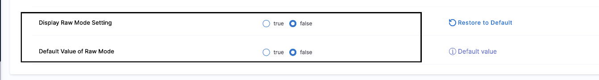

As a user, you can control the pre-processing of input data, allowing you to manage how empty values are handled in the background. In the normal case, when you provide an empty value `""` as your input, it will be converted into `<+input>` in the background.

Let's take an example where you are running a pipeline via an input set:-

We have provided value of variable **var_config** as empty string.
```yaml
inputSet:
  name: input
  tags: {}
  identifier: input
  orgIdentifier: default
  projectIdentifier: Samples
  pipeline:
    identifier: test_expression
    variables:
      - name: var_config
        type: String
        value: ""
```
Now, when we run the pipeline and check the compiled yaml after the execution it would have taken it as `<+input>`.


As a user, you might want more control over how these empty values are handled, especially in cases where you want the string to remain empty. This is where the **Raw Mode** feature comes into play.

With Raw Mode enabled, the empty string `""` remains as-is throughout the pipeline execution process. This ensures that the YAML and the visual view are consistent with the final payload sent during execution.

For instance, if you want **var_config** to remain an empty string, enabling Raw Mode will prevent it from being converted to `<+input>`.

This ensures that the input remains exactly as specified, providing you with precise control over your pipeline configurations.


## How to enable this feature?

:::info note
Currently this feature is behind feature flag `CDS_ENABLE_RAW_MODE`.
:::

You need to enable following settings at account level to use this feature:

1. Display Raw Mode Setting
2. Default value of Raw Mode 



## Detailed Behavior Changes

### If Raw mode of Off (Current Behavior)

- **Initial Load** : `<+input>` is shown as `""`
- **Run Pipeline with Input Set: `""` is converted into `<+input>` in the payload.
- Run Pipeline without Input Set: No transformation; `""` is converted to `<+input>` in the payload.
- Input Set Details Page: `""` is converted to `<+input>` upon saving
- Triggers Page: `""` is converted to `<+input>` upon saving.

### If Raw mode in On

- Creating and Updating Input Sets:
   - Initial Load: No transformation, values are as it is.
   - Saving: Values remain unchanged.

- Run Pipeline form with Input Set:
  - Initial Load: No transformation, values are as it is.
  - Execution: No transformation; values are as it is.

- Run Pipeline without Input Set:
  - Initial Load: `""` stays `""`.
  - Execution: `""` stays `""`.

