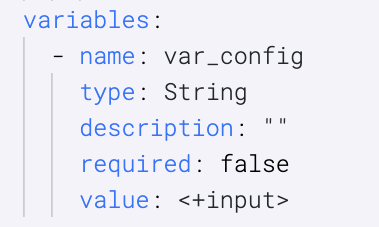

As user you can control pre-processing of input data allowing you to control empty values in the background. 

In normal case when we give `""` i.e you provide empty value as your input, in background it will convert it into `<+input>`. 

Let's take an example where you are running a pipeline via an input set:-

We have provided value of variable **var_config** as empty string.
```yaml
inputSet:
  name: input
  tags: {}
  identifier: input
  orgIdentifier: default
  projectIdentifier: Samples
  pipeline:
    identifier: test_expression
    variables:
      - name: var_config
        type: String
        value: ""
```
Now, when we run the pipeline and check the compiled yaml after the execution it would have taken it as `<+input>`.


