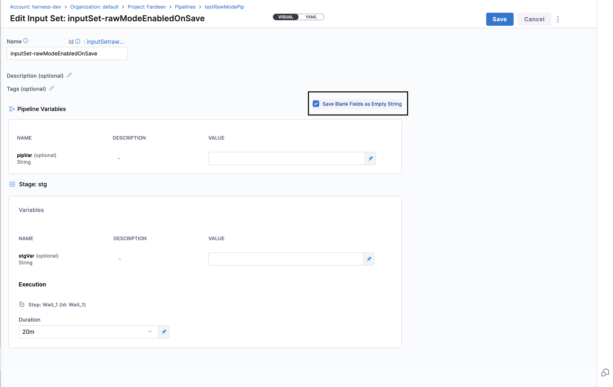
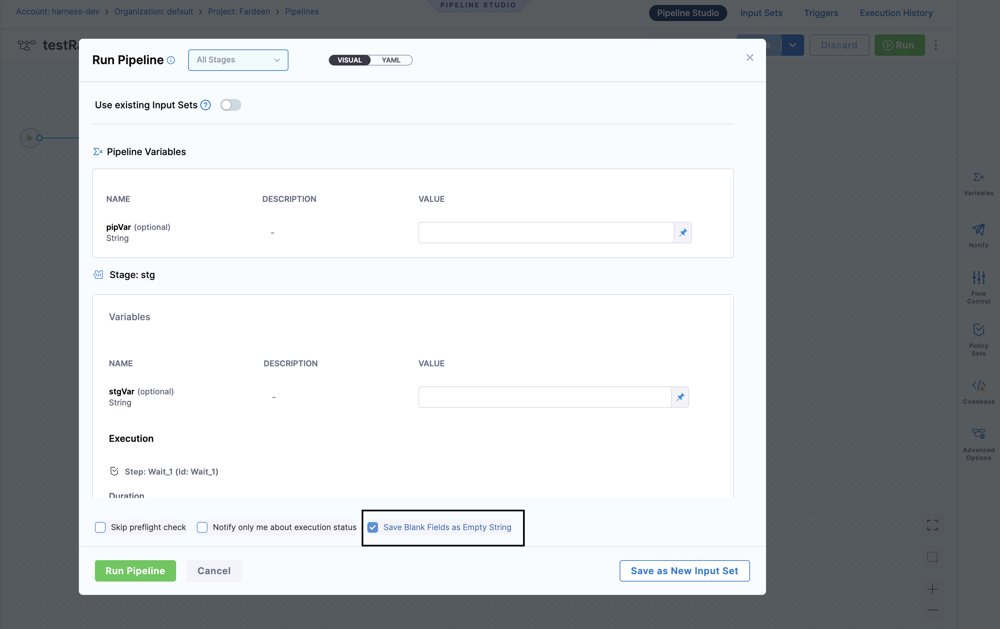

As a user, you can control the pre-processing of input data, allowing you to manage how empty values are handled in the background. Typically, when you provide an empty value `""` as your input, it is converted to `<+input>` in the background.

Here's an example where you are running a pipeline via an input set. Here, we have not provided any input value.

```yaml
inputSet:
  name: input
  tags: {}
  identifier: input
  orgIdentifier: default
  projectIdentifier: Samples
  pipeline:
    identifier: test_expression
    variables:
      - name: var_config
        type: String
        value: ""
```
When you run the pipeline and check the compiled YAML after the execution, you can see that the value is taken as `<+input>`.
If you have saved your Input Set in Git, when you check the YAML, you can see that the value of the variable is `<+input>`.


As a user, you might want more control over how these empty values are handled, especially in cases where you want the string to remain empty. To handle this behavior, Harness provides the **Save Blank Fields as Empty String** option.

Enable this option to keep the empty string `""` as is throughout the pipeline execution process. This ensures that the YAML and the Visual view are consistent with the final payload sent during the execution.

For instance, if you want **var_config** to remain an empty string, enabling Raw Mode will prevent it from being converted to `<+input>`.

This ensures that the input remains exactly as specified, providing you with precise control over your pipeline configurations.


## How to enable this feature?

:::info note
Currently this feature is behind feature flag `CDS_ENABLE_RAW_MODE`. Contact [Harness Support](mailto:support@harness.io) to enable the feature.
:::

Enable following settings at account level to use this feature:

- **Show checkbox to Save Blank Fields as Empty String**: This setting, when enabled, will show the checkbox **Save Blank Fields as Empty String** both while creating the Input Set and during Pipeline Run form.
- **Default value of Blank Fields as Empty String**: When enabled, this setting will automatically select the **Save Blank Fields as Empty String** checkbox.


## Detailed Behavior Changes

### If Save Blank Fields as Empty String is not enabled (Current Behavior)

- **Creating Input Sets**:
   - **Initial Load**: On load `<+input>` is converted to `""`.
   - **Saving**: On Save, `""` is converted to`<+input>`.

- **Updating Input Sets**:
  - **Initial Load**: On Load, `<+input>` is converted to `""`.
  - **Saving**: On Save, `""` is converted to `<+input>`.

- **Run Pipeline form with Input Set**:
  - **Initial Load**: On Load, `<+input>` is converted to `""`.
  - **Execution**: On Run, `""` stays `<+input>`.

- **Run Pipeline without Input Set**:
  - **Initial Load**: On Load, `<+input>` is changed to `""`.
  - **Execution**: `""` stays `""`.

### If Save Blank Fields as Empty String is enabled

- **Creating Input Sets**:
   - **Initial Load**: On load `<+input>` is converted to `""`
   - **Saving**: On Save, `""` stays `""` and `<+input>` stays `<+input>`.

- **Updating Input Sets**:
  - **Initial Load**: On Load, `<+input>` stays `<+input>`, `""` stays `""`.
  - **Saving**: On Save, `<+input>` stays `<+input>`, `""` stays `""`.



- **Run Pipeline form with Input Set**:
  - **Initial Load**: On Load, `<+input>` stays `<+input>`, `""` stays `""`.
  - **Execution**: On Run, `<+input>` stays` <+input>`, `""` stays `""`.

- **Run Pipeline without Input Set**:
  - **Initial Load**: On Load, `<+input>` is changed to `""`.
  - **Execution**: `""` stays `""`.

