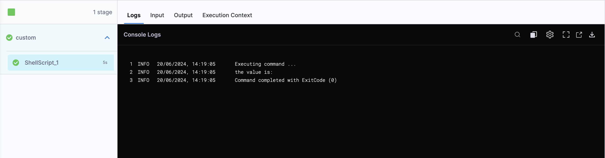
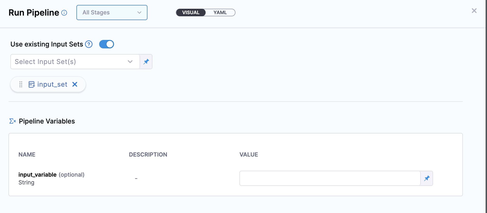
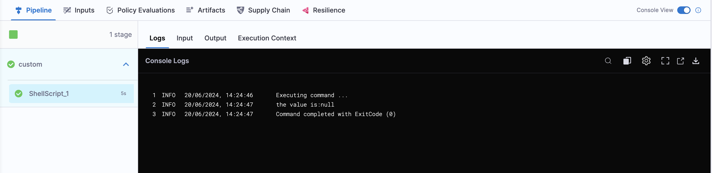
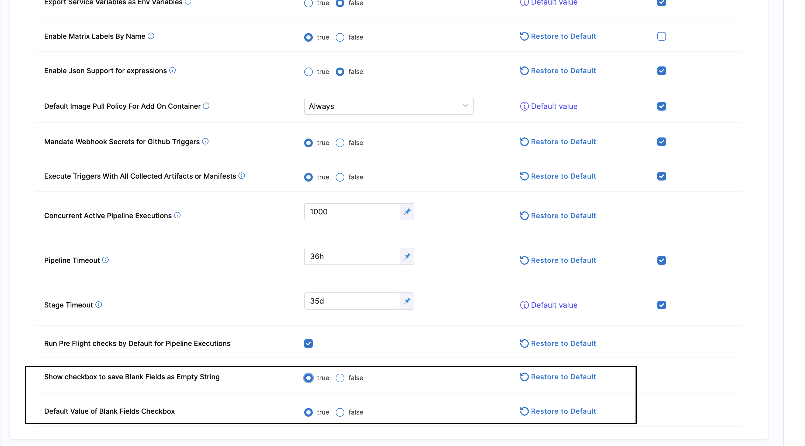
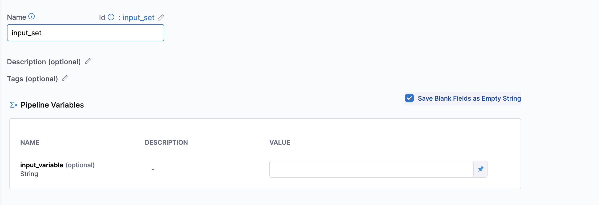
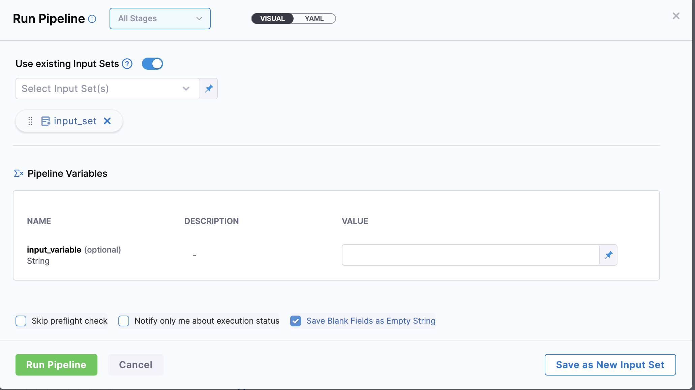
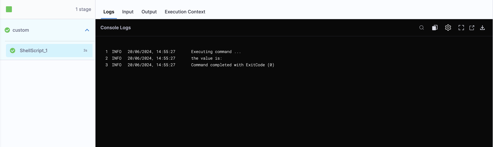

## Problem

Let's try to understand how are empty string handled in Harness and what are the inconsistency and then we can move toward the solution to handle this inconsistency.

To understand the problem, let's take a simple pipeline as an example:-

```yaml
pipeline:
  name: Input_Pipeline
  identifier: Input_Pipeline
  projectIdentifier: test
  orgIdentifier: default
  tags: {}
  stages:
    - stage:
        name: custom
        identifier: custom
        description: ""
        type: Custom
        spec:
          execution:
            steps:
              - step:
                  type: ShellScript
                  name: ShellScript_1
                  identifier: ShellScript_1
                  spec:
                    shell: Bash
                    executionTarget: {}
                    source:
                      type: Inline
                      spec:
                        script: |
                          input_variable=<+pipeline.variables.input_variable>
                          echo "the value is:$input_variable"
                    environmentVariables: []
                    outputVariables: []
                  timeout: 10m
        tags: {}
  variables:
    - name: input_variable
      type: String
      description: ""
      required: false
      value: <+input>

```

We have an input variable called `input_variable` that we set at runtime. We use a simple script to print the value of `input_variable` to see if it is passed as an **empty string** or as **null** when we leave it empty.


We have an input set created as well for this pipeline where we have left the value of `input_variable` as empty.
Example yaml:-

```yaml
inputSet:
  name: input_set
  tags: {}
  identifier: input_set
  orgIdentifier: default
  projectIdentifier: test
  pipeline:
    identifier: Input_Pipeline
    variables:
      - name: input_variable
        type: String
        value: ""
```

Now as we know we can have two ways of running a pipeline, one without Input Set and one with Input Set.

### Running a pipeline without Input Set

If we run a pipeline without using an input set and check the execution we will see the output as:-



The output is taking the value of `input_variable` as empty which is fine since we have provided the value of `input_variable` during runtime as empty.


### Running a pipeline with Input Set

Now, let's run the pipeline using an input set we have created i.e `input_set`.




If we run a pipeline using an input set and check the execution we will see the output as:-



The output is treating `input_variable` as **null** when left empty. 

We want it to behave consistently, whether running with or without an input set, by treating empty strings as empty. Null values can cause the pipeline to fail, which we want to avoid.

This happens because, in the Harness system, when saving the input set with an empty value for an input variable or running the pipeline with an input set having an empty string value of an input variable, it gets encoded as `<+input>`.

:::info note
`<+input>` is treated as null in Harness
:::

## Solution

As a user, you might want more control over how empty values are handled, especially if you want the string to stay empty. Harness provides an option called **Save Blank Fields as Empty String** for this purpose.

With this option enabled, an empty string `""` remains unchanged throughout the pipeline execution. This keeps the YAML and Visual view consistent with the final payload sent during execution.

Let's first see how to enable this feature and then in later section let's discuss the behavior change we see after enabling this feature.

## How to enable this feature?

:::info note
Currently this feature is behind feature flag, `CDS_ENABLE_RAW_MODE`. Contact [Harness Support](mailto:support@harness.io) to enable the feature.
:::

Enable the following settings at account level to use this feature:

- **Show checkbox to Save Blank Fields as Empty String**: When enabled, this setting shows the checkbox **Save Blank Fields as Empty String** both when creating the input set in the Input Set section and when creating an input set in triggers, as well as in the Pipeline Run form.
- **Default value of Blank Fields as Empty String**: When enabled, this setting will automatically select the **Save Blank Fields as Empty String** checkbox.



## Detailed Behavior Changes

Let's understand the behavior change after enabling the above mentioned settings:

Let's take the same example we have used while understanding the problem.

```yaml
pipeline:
  name: Input_Pipeline
  identifier: Input_Pipeline
  projectIdentifier: test
  orgIdentifier: default
  tags: {}
  stages:
    - stage:
        name: custom
        identifier: custom
        description: ""
        type: Custom
        spec:
          execution:
            steps:
              - step:
                  type: ShellScript
                  name: ShellScript_1
                  identifier: ShellScript_1
                  spec:
                    shell: Bash
                    executionTarget: {}
                    source:
                      type: Inline
                      spec:
                        script: |
                          input_variable=<+pipeline.variables.input_variable>
                          echo "the value is:$input_variable"
                    environmentVariables: []
                    outputVariables: []
                  timeout: 10m
        tags: {}
  variables:
    - name: input_variable
      type: String
      description: ""
      required: false
      value: <+input>

```

We have an input variable called `input_variable` that we set at runtime. We use a simple script to print the value of `input_variable` to see if it is passed as an **empty string** or as **null** when we leave it empty after checking the **Save Blank Fields as Empty String** during running the pipeline as well as during creating and saving the input set.


We have an input set created as well for this pipeline where we have left the value of `input_variable` as empty.

After you have enabled the above feature you will see a checkbox **Save Blank Fields as Empty String** while creating an Input Set, we will enable the checkbox and then save the Input set. 

This will ensure that no transformation occurs in the Harness system and empty values of an input variable is treated an empty and not null. We will understand more when we will move forward with running the pipeline.



Example yaml:-

```yaml
inputSet:
  name: input_set
  tags: {}
  identifier: input_set
  orgIdentifier: default
  projectIdentifier: test
  pipeline:
    identifier: Input_Pipeline
    variables:
      - name: input_variable
        type: String
        value: ""
```
Now as we know we can have two ways of running a pipeline, one without Input Set and one with Input Set.

### Running a pipeline without an Input Set

Running the pipeline without an Input Set will have no changes in behavior and it will treat empty string value of an input variable as empty.


### Running a pipeline with an Input Set

Now, let's run the pipeline using an input set we have created i.e `input_set` with checkbox **Save Blank Fields as Empty String** enabled.



If we run a pipeline using an input set and check the execution we will see the output as:-



In this case as you see the output is treating `input_variable` as **empty string** when left empty.

This ensures that the behavior remains consistent throughout, treating empty string values for an input variable as empty to avoid null values.
