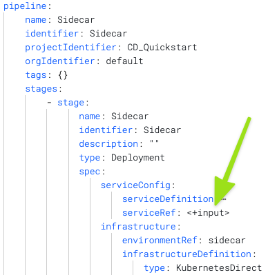
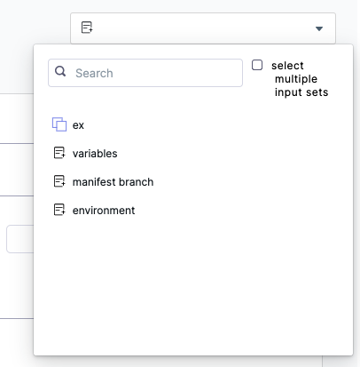
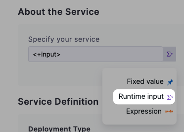

Harness input sets are collections of runtime inputs for a pipeline provided before execution.

All pipeline settings can be set as runtime inputs in Pipeline Studio **Visual** and **YAML** editors:

|  |  |
| ------------------------------------ | ------------------------------------ |


An input set includes all the runtime inputs that are not permanent in the pipeline. Runtime inputs contain the values that you would be prompted to provide when you executed the pipeline.

Overlays are groups of input sets. Overlays enable you to provide several input sets when executing a pipeline.

With input sets and overlays, you can make a single pipeline that can be used for multiple scenarios. Each scenario can be defined in an input set or overlay and simply selected at runtime.

## Input sets overview

Nearly every setting in a Pipeline can be configured as a runtime input. You can then create an input set from those inputs.


Here are some input set examples:

* Values of fields and variables
* Artifacts
* Connectors
* Environments
* Infrastructures
* Services
* Secrets
* Stage variables
* Step settings

Input sets group the values of these entities and make it easy provide the correct set of values for a single pipeline execution, and reuse the same values for the executions of multiple pipelines.

## Overlays Overview

You can combine several input sets in an overlay. Overlays are use when:

* The pipeline is used for multiple services.
* The services have some configurations in common, but some have differences. For example:
	+ Same configuration but using different runtime variables.
	+ Same artifact stream.

In this use case, you can then create different input sets:

* 1 Input Set for the common configuration: this set is used for every Pipeline execution regardless of the Service selected in the Pipeline.
* 1 Input Set for each Service with a specific configuration.
* 1 Input Set for a unique execution. For example, if it contains a specific build number.

For a specific execution, you provide multiple input sets. All together, these input sets provide a complete list of values needed for pipeline execution.

### Input set order in overlays

You can arrange the input sets in an overlay to prioritize the input sets.

Each input set in an overlay can overwrite the settings of previous input sets in the sequence.

## Using input sets for pipeline execution

Before running a pipeline, you can select one or more input sets and apply them to the pipeline. As a result, Harness will do the following operations:

* Apply the input set(s) on the pipeline. If you are using an overlay, the application it performed in the same as the input sets in the overlay to ensure the correct values are used.
* Indicate if the pipeline can start running. Meaning, all required values are provided.
	+ If the pipeline cannot start running, Harness indicates which values are missing.
* Harness shows the following:
	+ The values that were resolved.
	+ The values that were not resolved. In this case, Harness provides a clear indication that the pipeline cannot run without values for all variables.

## Example: Input set for service and primary artifact

Here's the YAML for an input set that let's you select the Harness service to deploy. In this example, the service selected also has its primary artifact and a replicas variable set as runtime inputs.

```yaml
inputSet:
  name: Artifact Input Set
  tags: {}
  identifier: Artifact_Input_Set
  orgIdentifier: default
  projectIdentifier: CD_Docs
  pipeline:
    identifier: kubernetes_demo
    stages:
      - stage:
          identifier: k8s_deployment
          type: Deployment
          spec:
            service:
              serviceRef: Kubernetes
              serviceInputs:
                serviceDefinition:
                  type: Kubernetes
                  spec:
                    artifacts:
                      primary:
                        primaryArtifactRef: nginx
                        sources: ""
                    variables:
                      - name: replicas
                        type: String
                        value: "3"
```


## Run pipelines using input sets and overlays

Create a pipeline template that can use different runtime variable values for different services, codebases, target environments, and goals.


Harness input sets are collections of runtime variables and values that can be provided to pipelines before execution.

An input set includes all the runtime inputs that are not permanent in the pipeline. Runtime inputs are the settings that you would be prompted to provide when you executed the pipeline manually.

Overlays are groups of input sets. Overlays enable you to provide several input sets when executing a pipeline.

Input sets and overlays allow you to create a pipeline template that can use different runtime input values for different services, codebases, target environments, and goals.


## Before you begin

Review the following:

* [CI tutorials](../../continuous-integration/get-started/tutorials.md)
* [Kubernetes deployments in Harness CD overview](/docs/continuous-delivery/deploy-srv-diff-platforms/kubernetes/kubernetes-cd-quickstart)
* [Input sets and overlays](input-sets.md)
* [Runtime inputs](../variables-and-expressions/runtime-inputs.md)

## Create input sets

You can create an input set in two ways:

* From the **Run Pipeline** page:

1. Configure your pipeline and select **Run**.
2. Enter values for the required runtime inputs.
3. Select **Save as Input Set**. The input set setup appears.
   
   
   
4. Enter a name, description, and tags for the new input set, and then select **Save**.

* By simply creating an input set:

1. In **Pipeline Studio**, click **Input Sets**.
2. Click **New Input Set** and select **Input Set**.
3. Enter values for the required runtime inputs and click **Save**.

### YAMl Example

```yaml
inputSet:  
    name: service  
    tags: {}  
    identifier: service  
    pipeline:  
        identifier: BG_example  
        stages:  
            - stage:  
                  identifier: nginx  
                  type: Deployment  
                  spec:  
                      serviceConfig:  
                          serviceDefinition:  
                              type: Kubernetes  
                              spec:  
                                  manifests:  
                                      - manifest:  
                                            identifier: manifests  
                                            type: K8sManifest  
                                            spec:  
                                                store:  
                                                    type: Git  
                                                    spec:  
                                                        branch: main  
                                  variables:  
                                      - name: foo  
                                        type: String  
                                        value: bar  
                          serviceRef: nginx  
                      infrastructure:  
                          environmentRef: quickstart  
                  variables:  
                      - name: stagevar  
                        type: String  
                        value: ""
```

### Import input sets

With the Harness Git Experience, you can [import input sets](/docs/platform/git-experience/import-input-sets) from a Git repo.

## Create Overlays

Once you have multiple input sets, you can combine them into an overlay.

In an overlay, you select the order in which to apply several input sets.

When you run a pipeline using an overlay, the inputs sets are applied in the order specified in the overlay. The first input set is used, and then subsequent inputs sets override any previously specified or empty values.

## Run pipelines with input sets or overlays

When you have created your input sets and overlays, you can run the pipeline using them.

You can select input sets and overlays in two ways:

* From the **Run Pipeline** page:

1. In **Pipeline Studio**, select **Run**.
2. In the **Run Pipeline** page, select the **Input Sets** option.
   
   
   
3. Select one or more input Sets or overlay to apply their settings.
4. Select **Run Pipeline**.

* From the **Input Sets** list:

1. In **Pipeline Studio**, select **Input Sets**.
2. Select the input sets or overlay you want to use, and then select **Run Pipeline**. You can also use the input sets option here.
3. Change any settings you want and select **Run Pipeline**.

The pipeline runs with the selected input sets or overlays settings.

## Limitations

Only runtime inputs are available in input sets. Most, but not all, pipeline and stage settings can be defined as runtime inputs.

You can use any setting that offers the **runtime input** option:


