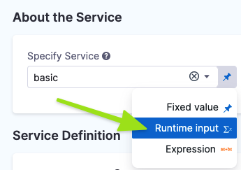
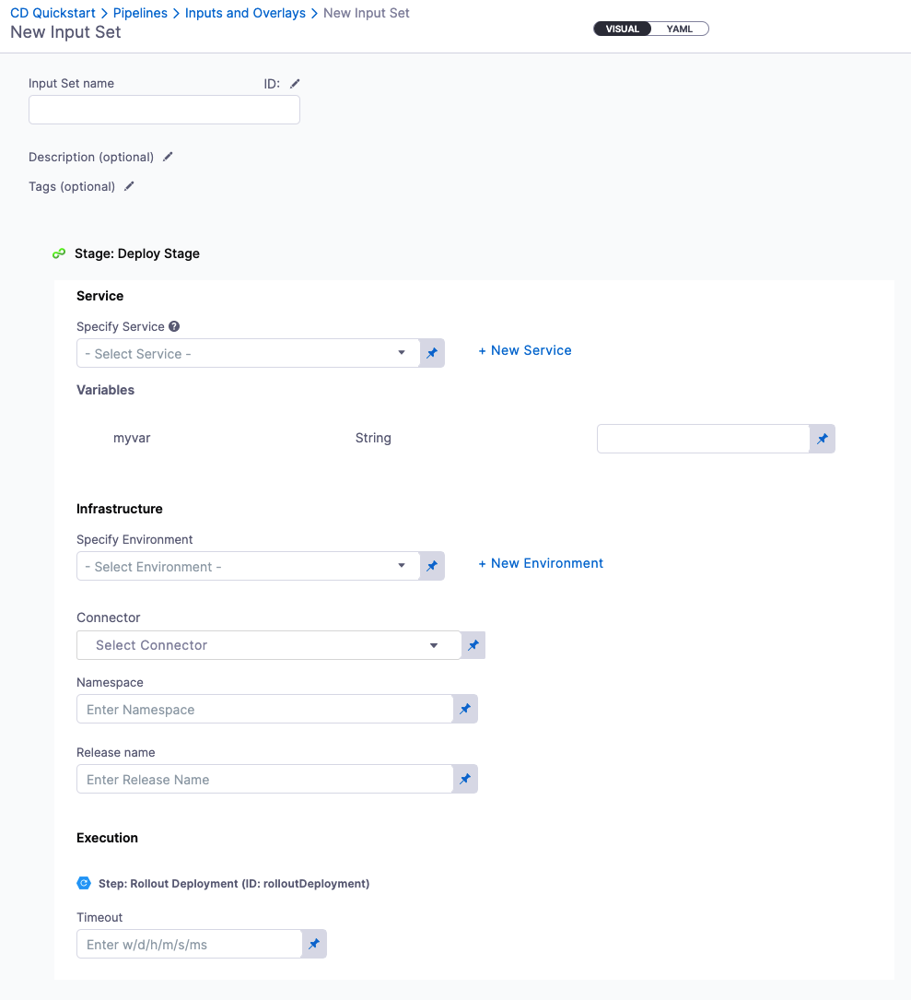
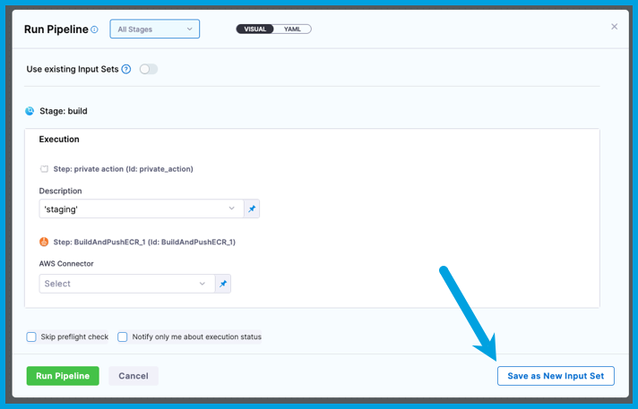
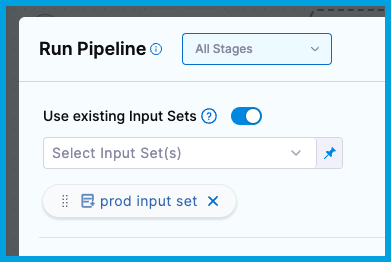
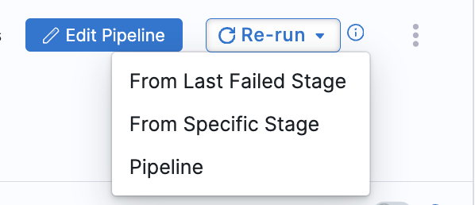

import Tabs from '@theme/Tabs';
import TabItem from '@theme/TabItem';


With input sets and overlays, you can reuse a single pipeline for multiple scenarios. You can define each scenario in an input set or overlay, and then select the relevant input set or overlay at runtime.

**Input sets are collections of runtime input values for a pipeline.** [Runtime inputs](/docs/platform/variables-and-expressions/runtime-inputs.md#use-runtime-inputs) provide placeholders with the expectation that you'll define those values at runtime.

Runtime inputs are useful for templatizing your pipelines, because runtime inputs can have different values each time the pipeline runs. For example, you can set all infrastructure settings to runtime input so that users provide relevant dev, QA, or prod values with each run. This way, users don't need to edit the actual pipeline, they just supply the necessary values for that run.

**Input sets make it even easier to templatize with runtime inputs.** Input sets contain preconfigured values for any settings in the pipeline that use runtime input. Instead of manually entering a value for each runtime input, you select the input set that contains the relevant values. You can create input sets for different pipeline use cases, and then select the relevant input set at runtime. When other users run the same pipeline, they can select the input set that corresponds with their use case.

:::tip

Input sets reduce the chance of errors in runtime input by eliminating the need to manually populate each runtime input value.

:::

Overlays are groups of input sets, which enable you to pull runtime inputs from multiple input sets.

## Specify settings that use runtime input

To be included in an input set, settings must be configured to [use runtime input](/docs/platform/variables-and-expressions/runtime-inputs.md#use-runtime-inputs). Settings that don't use runtime input can't be included in input sets. You can configure runtime input in either the Visual or YAML editors in the Pipeline Studio.


<Tabs>
  <TabItem value="Visual" label="Visual editor">


In the Pipeline Studio's Visual Editor, you can use the **Value type selector** to select **Runtime Input**.



In free-text fields, you can directly enter `<+input>` to specify runtime input without changing the value type.


</TabItem>
  <TabItem value="YAML" label="YAML editor" default>


When writing pipelines in YAML, enter `<+input>` for a setting's value to indicate runtime input.

```yaml
              - step:
                  identifier: Run_1
                  type: Run
                  name: Run_1
                  spec:
                    shell: <+input>
                    command: <+input>
```


</TabItem>
</Tabs>


Almost any setting in a pipeline can use runtime input, including variables, artifacts, connectors, environments, infrastructures, services, secrets, step settings, looping strategies, and more.


## Create input sets

1. In the Pipeline Studio header, select **Input Sets**.
2. Select **New Input Set**.
3. Enter a **Name** for the input set. **Description** and **Tags** are optional.
4. Enter values for the [settings that use runtime input](#specify-settings-that-use-runtime-input), and then select **Save**.

   If a setting doesn't use runtime input (`<+input>`), you can't define a value for it in an input set.

   You don't have to provide a value for every setting. For example, you can leave some settings as manual runtime input. Or you can create multiple input sets that populate different values, which you can then combine into [overlays](#create-overlays).

   

### Create input sets at runtime

When you run a pipeline that requires runtime input, you can select **Save as New Input Set** to quickly create an input set from your provided values.



### Create input sets in YAML

You can use the YAML editor to write input sets. When creating an input set, select **YAML** to switch to the YAML editor.

Here is an example of a YAML definition for an input set for a Deploy stage. This input set specifies the service to deploy, as well as the primary artifact reference, and the value of the `replicas` variable.

```yaml
inputSet:
  name: Artifact Input Set
  tags: {}
  identifier: Artifact_Input_Set
  orgIdentifier: default
  projectIdentifier: CD_Docs
  pipeline:
    identifier: kubernetes_demo
    stages:
      - stage:
          identifier: k8s_deployment
          type: Deployment
          spec:
            service:
              serviceRef: Kubernetes
              serviceInputs:
                serviceDefinition:
                  type: Kubernetes
                  spec:
                    artifacts:
                      primary:
                        primaryArtifactRef: nginx
                        sources: ""
                    variables:
                      - name: replicas
                        type: String
                        value: "3"
```

### Import input sets

With the Harness Git Experience, you can also [import input sets](/docs/platform/git-experience/import-input-sets) from a Git repo.

## Create overlays

You can combine multiple input sets into overlays, and then, when you run the pipeline, you choose which input sets to use for that run. With overlays, you don't have to define every runtime input value in every input set, providing a flexible, "build-your-own" input set experience.

For example, assume you have a CD pipeline that is used for multiple services. The services have some common configurations, but there are some differences. You can create an overlay consisting of multiple input sets so that users can pick and choose the input sets that correspond with their deployment scenario:

* One input set for the common or default configurations. This set should be used for every run, regardless of the selected service.
* Input sets for each service. Each of these input sets contains the configurations for that service. These input sets can modify values defined in the default input set, and they can provide values for empty fields that weren't specified in the default input set.
* Input sets for edge cases, such as an input set that contains a specific build number.

<!-- When you run a pipeline with the overlay(#run-pipelines-with-input-sets-or-overlays), select **Use multiple input sets**, and then select the input sets from the overlay that you want to use for that particular run. -->

### Configure overlays

To configure overlays:

1. [Create input sets](#create-input-sets).
2. On the **Input Sets** page, select **New Input Set**, and then select **Overlay Input Set**.
3. Enter a **Name** for the overlay. **Description** and **Tags** are optional.
4. In **Use existing Input Sets**, select the input sets to include in this overlay, and select **Apply Input Sets**
5. Drag and drop the input sets to define their [priority in the overlay](#priority-in-overlays).
6. Select **Save**.

### Priority in overlays

In an overlay, you specify the order in which to resolve the input sets. The first input set in the sequence is resolved first. Then, input sets resolved after the first either replace values specified in prior input sets or populate values not specified in prior input sets.

If a setting is specified in multiple input sets, the value is replaced as each input set is resolved, and the setting's final value is the value assigned in the last input set to be resolved.

<!-- However, it is possible that you won't use every input set in the overlay for every run. When you run a pipeline with an overlay, you can select specific input sets to use. If an input set is not selected for a particular run, it is skipped. -->

## Manage access to input sets

:::note

Currently, input set access control is behind the feature flag `PIE_INPUTSET_RBAC_PERMISSIONS`. Contact [Harness Support](mailto:support@harness.io) to enable the feature. We will also run a migration for you so that existing input sets remain accessible to users.

:::

Input sets can be access-controlled, similar to pipelines and other entities. This allows you to make some input sets invisible to certain users, or not let them edit the values in the input sets. The permissions for input sets are View, Create/Edit, and Delete. You can view and manage these permissions on the Roles page under **Access Control**.

Input sets are listed along with other resources in the **Resource Group** section of the Access Control screens. For more information on setting up and managing permissions using Resource Groups and Roles, go to [Manage resource groups](/docs/platform/role-based-access-control/add-resource-groups/).

To use an input set for a pipeline execution, the user must have View permissions on the input set, along with Execute permissions for the pipeline. To edit the input set, the user must have Edit permissions for the input set. 

When a user creates a new input set, Create/Edit and View permissions are added by default for the user. 

## Run pipelines with input sets or overlays

To run a pipeline with an input set or overlay:

1. In the Pipeline Studio, select **Run**.
2. On the **Run Pipeline** window, select **Use existing Input Sets**.
3. Select input sets or overlays to use for the run. <!-- Use **Select multiple input sets** to select specific input sets from an overlay. -->

   

4. On the **Run Pipeline** window, the settings that require runtime input are populated with the values from the selected input sets. If necessary, you can manually change any of the values before running the pipeline.
5. Select **Run Pipeline**.

:::tip

You can also run a pipeline with an input set or overlay from the **Input Sets** page.

:::

### Value resolution

When you select input sets or overlays to use for a pipeline run, Harness applies the values from the input sets to their corresponding pipeline settings. With an overlay, the values are resolved according to the specified [priority in the overlay](#priority-in-overlays).

For each setting that requires runtime input, Harness either:

* Displays the value assigned to the setting, as resolved from the input sets.
* Displays an error for any required settings that don't have a value assigned.

If any required settings don't have a value, you must manually input a value before you can run the pipeline.

### Get the resolved input

You can use the [expression](/docs/platform/variables-and-expressions/harness-variables.md) `<+inputSet>` to get the input set values for a pipeline execution as JSON.

You need to enclose `<+inputSet>` between single quotes to parse it correctly.

For example: `echo '<+inputSet>' | jq -s`

Here's an example of a resolved `<+inputSet>` expression:

```
{pipeline:identifier:Custom} {pipeline:stages:[{stage:identifier:Custom}]} {pipeline:stages:[{stage:type:Custom}]} {pipeline:stages:[{stage:spec:{execution:steps:[{step:identifier:ShellScript_1}}}]} {pipeline:stages:[{stage:spec:{execution:steps:[{step:type:ShellScript}}}]} {pipeline:stages:[{stage:spec:{execution:steps:[{step:timeout:10s}}}]} {pipeline:stages:[{stage:spec:{execution:{step:identifier:json_format}]}}]} {pipeline:stages:[{stage:spec:{execution:{step:type:ShellScript}]}}]} {pipeline:stages:[{stage:spec:{execution:{step:timeout:10m}]}}]}
```

## Handling Input Changes During Pipeline Re-Runs

When re-running a pipeline, especially with multi-deployment or looping stages, note that input values may be cached from the initial execution. This may result in the pipeline using original inputs rather than new values specified for the re-run.



### Behavior Details

#### Last Failed Stage Re-Run

Selecting **From Last Failed Stage** reuses metadata (including input values) from the previous execution. While consistent, this does not apply updated user inputs.

#### Specific Stage Re-Run

 To ensure new input values are applied, select **From Specific Stage** when re-running. This option reloads all specified inputs, including any changes made since the last run.

### Example

On the first run, a user provides **poc.11** as the release version. On re-running, they specify **poc.13**.
Expected Outcome: If re-run **From Last Failed Stage**, the pipeline may still use **poc.11** due to cached metadata. Selecting **From Specific Stage** will correctly apply **poc.13**.

### Recommendation

To apply updated inputs reliably, always use the **From Specific Stage** option if input changes are required for the re-run.