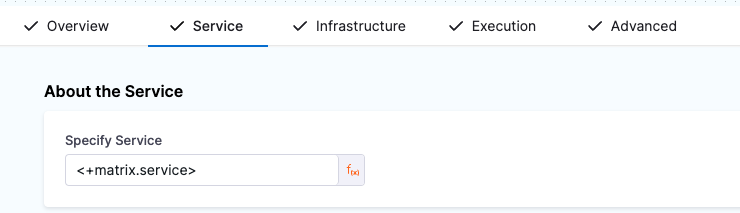

Here are some examples of matrix strategies you can use in your stages or steps. For information about how matrix strategies work and instructions for creating different types of looping strategies, go to [Use looping strategies](./looping-strategies-matrix-repeat-and-parallelism).

## Basic matrix: Repeat over a list

The simplest form of a matrix strategy is one-dimensional. It includes a single list of values to iterate over.

```yaml
matrix:
  TAG: [ "value1", "value2", "value3" ] ## Supply a user-specified tag and a comma-separated list of values.
  maxConcurrency: 3 ## Optional but recommended. Specify the maximum number of instances that can run concurrently.
```

This example loops over a series of JDK versions.

```yaml
matrix:
  jdk: [ "18", "17", "16", "15", "14", "13", "12", "11", "10", "9" ]
  maxConcurrency: 2
```

A one-dimensional matrix is the only form of matrix strategy that you can also define in a [repeat strategy](./looping-strategies-matrix-repeat-and-parallelism.md#repeat-strategies). For example:

```yaml
repeat:
  items: [ "18", "17", "16", "15", "14", "13", "12", "11", "10", "9" ] ## 'items' is required. Provide a comma-separated list of values.
  maxConcurrency: 2 ## Optional but recommended. Specify the maximum number of instances that can run concurrently.
```

## Use fixed values for matrix values

The following examples use fixed values for the [matrix strategy](./looping-strategies-matrix-repeat-and-parallelism.md#matrix-strategies) dimensions.

### Run an app on multiple browsers and operating systems

Suppose you have a pipeline that builds a Go app, and you want to test the app on three different platforms and three different browsers. In the stage or step where you test the app, you can define a matrix strategy that loops over your desired `browser` and `os` values, for example:

```yaml
matrix:
  browser: [chrome, safari, firefox]
  os: [macos, windows, linux]
  maxConcurrency: 3
```

The `browser` and `os` are the dimensions of your matrix. When you write matrix strategies in Harness, each matrix dimension consists of a user-specified tag with a comma-separated list of values.

Use `maxConcurrency` to specify the maximum number of instances that can run at once. This example matrix has nine combinations. Rather than overload the build infrastructure with nine concurrent runs, setting `maxConcurrency` to `3` limits the pipeline to three concurrent runs. The remaining combinations are queued while the first three run.

### Deploy multiple services to multiple environments

You can use a matrix strategy on a Deploy stage to deploy multiple services to multiple environments. The following example includes dimensions to deploy three services on two environments. It uses [`exclude`](./looping-strategies-matrix-repeat-and-parallelism.md#exclude-combinations) to ignore one combination, and it sets the [`maxConcurrency`](./looping-strategies-matrix-repeat-and-parallelism.md#limit-resource-usage) to `2`.

```yaml
matrix:
  service: [svc1, svc2, svc3] ## First dimension.
  environment: [env1, env2] ## Second dimension.
  exclude: ## Specify combinations to ignore or skip.
    - service: svc1
      environment: env1
  maxConcurrency: 2 ## Optional but recommended. Specify the maximum number of instances that can run concurrently.
```

The `service` and `environment` are the dimensions of the matrix. Each matrix dimension consists of a user-specified tag with a comma-separated list of values.

In a pipeline where you used the above matrix strategy, you could use the expression `<+matrix.service>` on the Service tab of the Deploy stage to call the `service` values.



## Use runtime input for matrix values

You can use [runtime input](../../variables-and-expressions/runtime-inputs.md) (`<+input>`) for values and entire matrix strategies.

When you run the pipeline, you are prompted to provide the values (which you can provide as an array) or the entire strategy definition, depending on how you specified the runtime input.

### Use runtime input for one dimension

To use runtime input for the values in a matrix dimension, enter `<+input>` in your pipeline YAML:

```yaml
matrix:
  TAG: <+input>
```

For example, the matrix strategy used in the following pipeline would prompt you to provide a list of values for `goVersion` at pipeline runtime:

```yaml
pipeline:
  name: MatrixAxisAsRuntimeInput
  identifier: MatrixAxisAsRuntimeInput
  tags: {}
  stages:
    - stage:
        name: exampleStage
        identifier: exampleStage
        description: ""
        type: Custom
        spec:
          execution:
            steps:
              - step:
                  type: ShellScript
                  name: Shell Script_1
                  identifier: ShellScript_1
                  spec:
                    shell: Bash
                    onDelegate: true
                    source:
                      type: Inline
                      spec:
                        script: echo "Hello world!"
                    environmentVariables: []
                    outputVariables: []
                  timeout: 10m
                  failureStrategies: []
                  strategy:
                    matrix:
                      goVersion: <+input>

```

Here is an example of a possible input set for this pipeline:

```yaml
pipeline:
  identifier: MatrixExamples
  stages:
    - stage:
        identifier: exampleStage
        type: Custom
        spec:
          execution:
            steps:
              - step:
                  identifier: ShellScript_1
                  type: ShellScript
                  strategy:
                    matrix:
                      goVersion:
                        - 1.1.0
                        - 1.1.1
```

### Use runtime input for multiple dimensions

You can use runtime input for multiple dimensions in a matrix. You can also use a combination of runtime input and other values (such as fixed values, expressions, or complex JSON). For example, the following matrix strategy uses runtime input for two dimensions and fixed values for the third dimension.

```yaml
 strategy:
    matrix:
      image: <+input>
      version: <+input>
      tags:
        - "harness"
        - "core"
      maxConcurrency: 3
```

The number of instances generated by this strategy depends on the number of values you provide for each runtime input. It is a good idea to include `maxConcurrency` with this strategy in case a lot of values are provided.

Here is a YAML example of a pipeline with the above matrix strategy:

```yaml
pipeline:
  name: MatrixAxisAsRuntimeInput
  identifier: MatrixAxisAsRuntimeInput
  tags: {}
  stages:
    - stage:
        name: exampleStage
        identifier: exampleStage
        description: ""
        type: Custom
        spec:
          execution:
            steps:
              - step:
                  type: ShellScript
                  name: Shell Script_1
                  identifier: ShellScript_1
                  spec:
                    shell: Bash
                    onDelegate: true
                    source:
                      type: Inline
                      spec:
                        script: echo "Hello world!"
                    environmentVariables: []
                    outputVariables: []
                  timeout: 10m
                  failureStrategies: []
                  strategy:
                    matrix:
                      image: <+input>
                      version: <+input>
                      tags:
                       - "harness"
                       - "core"
```

Here is an example of a possible input set for this pipeline. Note that `tags` is not included because those values are fixed values.

```yaml
pipeline:
  identifier: MatrixExamples
  stages:
    - stage:
        identifier: exampleStage
        type: Custom
        spec:
          execution:
            steps:
              - step:
                  identifier: ShellScript_1
                  type: ShellScript
                  strategy:
                    matrix:
                      image:
                        - nginx
                        - ingress
                      version:
                        - latest
                        - 1.2.0
```

### Use runtime input for the entire matrix strategy

To require runtime input for an entire matrix strategy, use `matrix: <+input>`. You'll have to provide the entire matrix strategy when you run the pipeline.

For example, you could use this if you need to input different dimensions, values, and exclusions at runtime.

Here is an example of a pipeline that uses runtime input for the entire matrix strategy:

```yaml
pipeline:
  name: MatrixAsRuntimeInput
  identifier: MatrixAsRuntimeInput
  tags: {}
  stages:
    - stage:
        name: exampleStage
        identifier: exampleStage
        description: ""
        type: Custom
        spec:
          execution:
            steps:
              - step:
                  type: ShellScript
                  name: Shell Script_1
                  identifier: ShellScript_1
                  spec:
                    shell: Bash
                    onDelegate: true
                    source:
                      type: Inline
                      spec:
                        script: echo "Hello world!, my name is <+matrix.name>"
                    environmentVariables: []
                    outputVariables: []
                  timeout: 10m
                  failureStrategies: []
                  strategy:
                    matrix: <+input>
        tags: {}
```

Here is an example of an input set for this pipeline:

```yaml
pipeline:
  identifier: MatrixExamples
  stages:
    - stage:
        identifier: exampleStage
        type: Custom
        spec:
          execution:
            steps:
              - step:
                  identifier: ShellScript_1
                  type: ShellScript
                  strategy:
                    matrix:
                      image:
                        - nginx
                        - ingress
                      version:
                        - 10
                        - 11
                        - 12
                      exclude:
                        - image: nginx
                          version: 12
```

## Get matrix values from expressions

You can use expressions as values for matrix dimensions. You can also use expressions to extract values from elsewhere, such as from pipeline or stage variables.

For example, the following pipeline uses a matrix strategy that loops over a series of Jira issues. The issue numbers are derived from the pipeline variable `jiraTickets`, which is populated at runtime (as indicated by it's value `<+input>`). The matrix strategy uses an expression with the split method to separate the individual issue numbers from the pipeline variable: `<+pipeline.variables.example>.split(',')`.

```yaml
pipeline:
  name: RepeatJiraTickets
  identifier: RepeatJiraTickets
  projectIdentifier: naidusanity
  orgIdentifier: default
  tags: {}
  stages:
    - stage:
        name: approval1
        identifier: approval1
        description: ""
        type: Approval
        spec:
          execution:
            steps:
              - step:
                  type: JiraApproval
                  name: Jira Approval_1
                  identifier: JiraApproval_1
                  spec:
                    connectorRef: abc
                    issueKey: <+matrix.jiraTicket>
                    approvalCriteria:
                      type: KeyValues
                      spec:
                        matchAnyCondition: true
                        conditions:
                          - key: Status
                            operator: equals
                            value: Done
                    rejectionCriteria:
                      type: KeyValues
                      spec:
                        matchAnyCondition: true
                        conditions: []
                  timeout: 1d
                  failureStrategies: []
                  strategy:
                    matrix:
                      jiraTicket: <+pipeline.variables.jiraTickets>.split(',')
        tags: {}
  variables:
    - name: jiraTickets
      type: String
      description: ""
      value: <+input>
```

Here is an example of a possible input set for this pipeline:

```yaml
pipeline:
  identifier: RepeatJiraTickets
  variables:
    - name: jiraTickets
      type: String
      value: cd-1,cd-2,cd-3 ## Jira issue numbers provided at runtime.
```

## Get matrix values from trigger payloads

To provide the axis value from a trigger, use [codebase expressions](/docs/continuous-integration/use-ci/codebase-configuration/built-in-cie-codebase-variables-reference) or [trigger payload expressions](/docs/platform/triggers/triggers-reference#attributes) to define the axis values.

For example:

```yaml
 strategy:
    matrix:
        payload: [<+trigger.payload.user.username>, <+trigger.sourceRepo>, <+trigger.prNumber>]
```

You can use `<+trigger.payload.PATH_IN_JSON>` to [reference any field in the trigger's JSON payload](/docs/platform/triggers/triggers-reference#referencing-payload-fields), such as `<+trigger.payload.pull_request.user.login>`.

## Use complex JSON for matrix values

If you are not sure about the value of an item in a pipeline, you can store it as a JSON string instead. This way, if an object is an output of the previous step, you can use the JSON functor to get a list from that object.

The following example shows a pipeline that provides a custom object using JSON functor. The matrix strategy references a pipeline variable containing the JSON object.

```yaml
pipeline:
  name: matrix_split
  identifier: matrix_split
  projectIdentifier: naidusanity
  orgIdentifier: default
  tags: {}
  stages:
    - stage:
        name: s2
        identifier: s2
        description: ""
        type: Custom
        spec:
          execution:
            steps:
              - step:
                  type: ShellScript
                  name: Shell Script_1
                  identifier: ShellScript_1
                  spec:
                    shell: Bash
                    onDelegate: true
                    source:
                      type: Inline
                      spec:
                        script: |-
                          echo <+matrix.service.name>
                          echo <+matrix.service.version>
                          echo <+json.list("a", <+pipeline.variables.services>)>
                    environmentVariables: []
                    outputVariables: []
                  timeout: 10m
        tags: {}
        strategy:
          matrix:
            service: <+json.list("a", <+pipeline.variables.services>)>
  variables:
    - name: services
      type: String
      description: ""
      value: "{\"a\":[ { \"name\": \"svc1\", \"version\": \"1.0.0\" }, { \"name\": \"svc2\", \"version\": \"1.0.2\" }, { \"name\": \"svc3\", \"version\": \"1.0.1\" } ]}"
```

Escaping is required for some punctuation. Also note the use of double quotes around the entire object.
