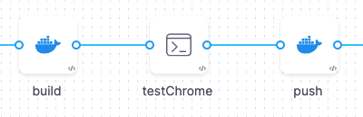
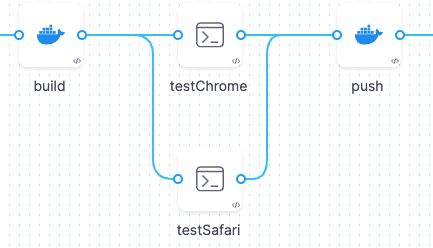
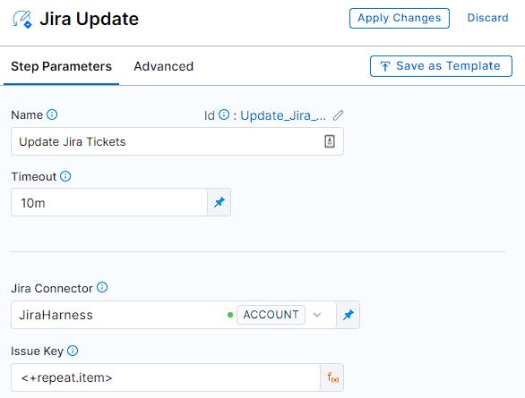

Harness recommends the following best practices for implementing [looping strategies](./looping-strategies-matrix-repeat-and-parallelism.md) in your pipelines.

## Complex looping scenarios require careful planning

Harness supports complex looping strategies such as:

* Multi-dimensional matrix strategies.
* Multi-layered matrix strategies (matrices on both stages and steps).
* Multiple looping strategies in the same stage.

Before you implement a complex looping scenario, carefully consider the resource consumption required by your stage/step containers and the overall capacity of your build/deploy infrastructure. If there are too many concurrent stages or steps, and the pipeline's resources are exhausted, then the pipeline can fail, time out, over-consume resources, or run "successfully" but incorrectly.

:::tip

As a general rule, your looping scenario is too complex if you can't visualize how it will run and calculate the memory and CPU required for the pipeline to support it.

:::

## How pipelines reserve resources

When a pipeline requests resources for a stage, it calculates the *maximum CPU and memory required at any point in the stage*.

The following example demonstrates resource consumption with looping strategies.

1. Assume you have a Build stage with three steps. The first step builds an artifact for a web app. The second step runs the artifact in a browser to confirm that it runs. The third step pushes it to a registry.

  

2. Each step consumes up to 500M (memory) and 400m (CPU).
3. If the steps run serially, not concurrently, the pipeline reserves 500Mi memory and 400m CPU for the entire stage. This is the most memory and CPU required at any one time for the entire life of the stage.
4. If you want to test the app on both Chrome and Firefox, you can apply a matrix strategy to the second step:

   ```yaml
   matrix:
     browser: [chrome, firefox]
     maxConcurrency: 2
   ```

5. Now the pipeline will create two copies of the second step and run them concurrently. This doubles the resource consumption at that point in the stage. As a result, the pipeline reserves double the resources (1000M memory, 800m CPU) to meet the new maximum memory and CPU requirement.

  

6. Finally, assume that you expand the matrix strategy to include another browser, a dimension to test on different operating systems, and you run all the tests (nine instances) at once.

   ```yaml
   matrix:
     os: [macos, linux, android]
     browser: [chrome, firefox, opera]
     maxConcurrency: 9
   ```

6. In this case, the stage requires nine times the original resources to run. It is likely that the pipeline will fail due to insufficient resources to run these nine instances concurrently.

To avoid failure due to inadequate resources, use [maxConcurrency](#how-to-calculate-ideal-concurrency) to limit the number of instances that can run at once.

For more information and examples of resource requirements, go to [Resource allocation](/docs/continuous-integration/use-ci/set-up-build-infrastructure/resource-limits).

## How to calculate ideal concurrency

Always consider the value of `maxConcurrency`. This is a powerful setting that can help you achieve optimum pipeline speeds. Your goal is to define a `maxConcurrency` that speeds up your pipeline runs while staying within the capacity limits of your infrastructure.

Harness recommends that you use an iterative workflow to determine the ideal `maxConcurrency` for a specific stage or step:

1. Start with a low `maxConcurrency` value of `2` or `3`.
2. Run the pipeline and monitor the resource consumption for the overall pipeline.
3. Gradually increase the `maxConcurrency` based on each successive run until you reach a balance between the total run time and resource consumption.

## Looping over items in a list or array with variables

[Harness variable expressions](../../variables-and-expressions/harness-variables.md) support all Java String class built-in methods.

You can [create a Harness string variable](/docs/platform/variables-and-expressions/expression-v2) containing a comma-separated list of other strings that represent items. At runtime, you can even get this list from the input.

The following YAML example shows a pipeline with a pipeline variable that contains a list of Jira tickets:

```yaml
pipeline:
  identifier: RepeatJiraTickets
  variables:
    - name: jiraTickets
      type: String
      value: HD-29193,HD-29194,HD-29195
```

# Variable: <+pipeline.variables.jiraTickets>
HD-29193,HD-29194,HD-29195

To split this variable into an array of substrings, use a Harness expression with the `split()` method:

```yaml
<+pipeline.variables.jiraTickets.split(',')>
```

You can use such an expression in a looping strategy. For example, these `repeat` and `matrix` strategies loop over the list of tickets pulled from the `jiraTickets` variable:

```yaml
repeat:
  items: <+pipeline.variables.jiraTickets.split(',')>
```

```yaml
matrix:
  jira: <+stage.variables.jiraTickets.split(',')>
```

You can use looping strategy expressions to refer to each value in the loop. For example, in the **Issue Key** field in a **Jira Update** step, you can use the expressions `<+repeat.item>` or `<+matrix.jira>` to insert the Jira issue number for each iteration of the loop.



The expression `<+repeat.item>` only applies to [repeat strategies](./looping-strategies-matrix-repeat-and-parallelism.md#repeat-strategies). You need to use matrix expressions (such as `<+matrix.jira>`) with [matrix strategies](./looping-strategies-matrix-repeat-and-parallelism.md#matrix-strategies).
