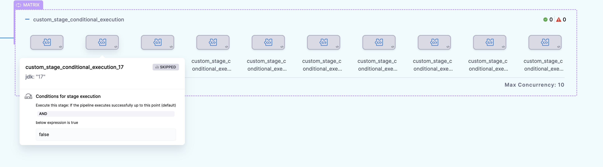
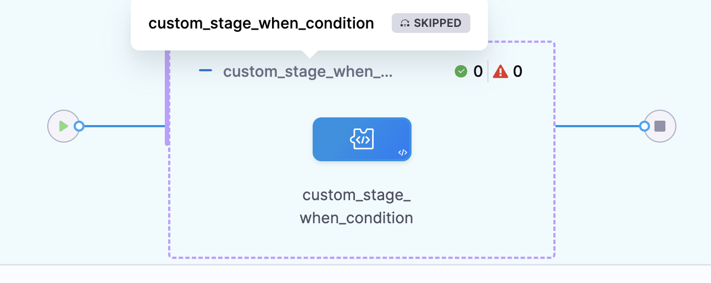

Harness recommends the following best practices for implementing [looping strategies](./looping-strategies-matrix-repeat-and-parallelism.md) in your pipelines.

## Complex looping scenarios require careful planning

Harness supports complex looping strategies such as:

* Multi-dimensional matrix strategies.
* Multi-layered matrix strategies (matrices on both stages and steps).
* Multiple looping strategies in the same stage.

Before you implement a complex looping scenario, carefully consider the resource consumption required by your stage/step containers and the overall capacity of your build/deploy infrastructure. If there are too many concurrent stages or steps, and the pipeline's resources are exhausted, then the pipeline can fail, time out, over-consume resources, or run "successfully" but incorrectly.

:::tip

As a general rule, your looping scenario is too complex if you can't visualize how it will run and calculate the memory and CPU required for the pipeline to support it.

:::

## How pipelines reserve resources

When a pipeline requests resources for a stage, it calculates the *maximum CPU and memory required at any point in the stage*.

The following example demonstrates resource consumption with looping strategies.

1. Assume you have a Build stage with three steps. The first step builds an artifact for a web app. The second step runs the artifact in a browser to confirm that it runs. The third step pushes it to a registry.

  

2. Each step consumes up to 500M (memory) and 400m (CPU).
3. If the steps run serially, not concurrently, the pipeline reserves 500Mi memory and 400m CPU for the entire stage. This is the most memory and CPU required at any one time for the entire life of the stage.
4. If you want to test the app on both Chrome and Firefox, you can apply a matrix strategy to the second step:

   ```yaml
   matrix:
     browser: [chrome, firefox]
     maxConcurrency: 2
   ```

5. Now the pipeline will create two copies of the second step and run them concurrently. This doubles the resource consumption at that point in the stage. As a result, the pipeline reserves double the resources (1000M memory, 800m CPU) to meet the new maximum memory and CPU requirement.

  

6. Finally, assume that you expand the matrix strategy to include another browser, a dimension to test on different operating systems, and you run all the tests (nine instances) at once.

   ```yaml
   matrix:
     os: [macos, linux, android]
     browser: [chrome, firefox, opera]
     maxConcurrency: 9
   ```

6. In this case, the stage requires nine times the original resources to run. It is likely that the pipeline will fail due to insufficient resources to run these nine instances concurrently.

To avoid failure due to inadequate resources, use [maxConcurrency](#how-to-calculate-ideal-concurrency) to limit the number of instances that can run at once.

For more information and examples of resource requirements, go to [Resource allocation](/docs/continuous-integration/use-ci/set-up-build-infrastructure/resource-limits).

## How to calculate ideal concurrency

Always consider the value of `maxConcurrency`. This is a powerful setting that can help you achieve optimum pipeline speeds. Your goal is to define a `maxConcurrency` that speeds up your pipeline runs while staying within the capacity limits of your infrastructure.

Harness recommends that you use an iterative workflow to determine the ideal `maxConcurrency` for a specific stage or step:

1. Start with a low `maxConcurrency` value of `2` or `3`.
2. Run the pipeline and monitor the resource consumption for the overall pipeline.
3. Gradually increase the `maxConcurrency` based on each successive run until you reach a balance between the total run time and resource consumption.

## Looping over items in a list or array with variables

[Harness variable expressions](../../variables-and-expressions/harness-variables.md) support all Java String class built-in methods.

You can [create a Harness string variable](/docs/platform/variables-and-expressions/expression-v2) containing a comma-separated list of other strings that represent items. At runtime, you can even get this list from the input.

The following YAML example shows a pipeline with a pipeline variable that contains a list of Jira tickets:

```yaml
pipeline:
  identifier: RepeatJiraTickets
  variables:
    - name: jiraTickets
      type: String
      value: HD-29193,HD-29194,HD-29195
```

To call this variable's default value, use the expression `<+pipeline.variables.jiraTickets>`. When called in this way, it returns the entire string value: `HD-29193,HD-29194,HD-29195`.

To split this variable into an array of substrings, use a Harness expression with the `split()` method:

```yaml
<+pipeline.variables.jiraTickets.split(',')>
```

You can use such an expression in a looping strategy. For example, these `repeat` and `matrix` strategies loop over the list of tickets pulled from the `jiraTickets` variable:

```yaml
repeat:
  items: <+pipeline.variables.jiraTickets.split(',')>
```

```yaml
matrix:
  jira: <+stage.variables.jiraTickets.split(',')>
```

You can use looping strategy expressions to refer to each value in the loop. For example, in the **Issue Key** field in a **Jira Update** step, you can use the expressions `<+repeat.item>` or `<+matrix.jira>` to insert the Jira issue number for each iteration of the loop.


The expression `<+repeat.item>` only applies to [repeat strategies](./looping-strategies-matrix-repeat-and-parallelism.md#repeat-strategies). You need to use matrix expressions (such as `<+matrix.jira>`) with [matrix strategies](./looping-strategies-matrix-repeat-and-parallelism.md#matrix-strategies).

## When conditions with looping strategies

Your looping strategies can include `when` conditions that apply to the looping strategy logic, *and* your pipeline can include [conditional executions](/docs/platform/pipelines/step-skip-condition-settings), which are `when` conditions that determine whether to run a particular stage, step, or step group.

It's important to understand where to use each type of `when` condition and how they impact pipeline execution.

Use [when conditions in looping strategies](#when-condition-in-looping-strategy) to evaluate whether to *create instances of a stage/step*. For example:

   * You sometimes want to skip the looping strategy. For example, in a unified deployment pipeline, you might skip a matrix applied to a `prod` deployment stage when the pipeline isn't running against the `prod` environment.
   * You don't always need to run a stage/step for every item in a matrix.
   * Your looping strategy is populated by variable input, and you want to skip it if it resolves to be empty.

Use [conditional executions with looping strategies](#conditional-execution-with-looping-strategy) to evaluate whether to *run a stage/step/step group that was generated from a looping strategy*. For example:

 * Only run stages generated from a looping strategy if they run in a particular deployment environment.

You can also use [both conditional executions and looping strategy when conditions](#combination-of-conditional-execution-and-looping-strategy-when-condition) for multi-dimensional evaluation, and you can use [expressions in when conditions](#expressions-in-when-conditions).

### Conditional execution with looping strategy

Conditional executions determine whether a stage, step, or step group should run. If you add a conditional execution ot a stage or step with a looping strategy, the conditional execution is evaluated for every instance created by the looping strategy.

In this example, the stage has a matrix looping strategy *and* a conditional execution. When the pipeline runs, multiple stage instances are created by the matrix looping strategy (One for each item in the `jdk` list), and then Harness checks the stage's conditional execution against each instance created by the matrix.

```yaml
    - stage:
        name: custom_stage_conditional_execution
        identifier: custom_stage_conditional_execution
        description: ""
        type: Custom
        spec:
          execution:
            steps:
              - step:
                  type: ShellScript
                  name: ShellScript_1
                  identifier: ShellScript_1
                  spec:
                    shell: Bash
                    executionTarget: {}
                    source:
                      type: Inline
                      spec:
                        script: |
                          echo hey
                    environmentVariables: []
                    outputVariables: []
                  timeout: 10m
        tags: {}
        strategy:
          matrix:
            jdk:
              - "18"
              - "17"
              - "16"
              - "15"
              - "14"
              - "13"
              - "12"
              - "11"
              - "10"
              - "9"
        when:
          pipelineStatus: Success
          condition: "false"
```

In this example, the conditional execution is hardcoded to resolve to false, so every stage is skipped.



### When condition in looping strategy

In this example, the matrix looping strategy is modified by a `when` condition:

```yaml
        strategy:
          when: <+pipeline.name> == "looping_strategy_when"
          matrix:
            jdk:
              - "18"
              - "17"
              - ...
```

In this example, when the pipeline runs, Harness checks the matrix strategy's `when` condition before creating each instance in the matrix. If the condition is met, Harness creates an instance for that item in the matrix. If the condition is not met, Harness doesn't create an instance for that item. This evaluation is repeated for each item in the matrix.

```yaml
    - stage:
        name: custom_stage_when_condition
        identifier: custom_stage_conditional_execution
        description: ""
        type: Custom
        spec:
          execution:
            steps:
              - step:
                  type: ShellScript
                  name: ShellScript_1
                  identifier: ShellScript_1
                  spec:
                    shell: Bash
                    executionTarget: {}
                    source:
                      type: Inline
                      spec:
                        script: |
                          echo hey
                    environmentVariables: []
                    outputVariables: []
                  timeout: 10m
        tags: {}
        strategy:
          when: <+pipeline.name> == "looping_strategy_when"
          matrix:
            jdk:
              - "18"
              - "17"
              - "16"
              - "15"
              - "14"
              - "13"
              - "12"
              - "11"
              - "10"
              - "9"
```

In this example, the `when` condition checks if the pipeline name is `looping_strategy_when`. Since that is not the name of this example pipeline, no stages are created from the matrix.



### Combination of conditional execution and looping strategy when condition

You can also use both conditional executions and looping strategy `when` conditions.

When you use both, Harness first evaluates the looping strategy `when` condition to determine how many instances to create from the looping strategy, based on how many items pass the `when` condition. Then Harness checks each created instance against the conditional execution to determine whether to run each created instance.

Here's an example that uses both. In this example, the matrix looping strategy has a `when` condition that checks if the pipeline name is `looping_strategy_when`. Then, the stage has a conditional execution that checks if the pipeline has executed successfully so far and that the environment name is not `QA`. 

```yaml
pipeline:
  name: looping_strategy_when
  identifier: looping_strategy_when
  tags: {}
  projectIdentifier: fdsf
  orgIdentifier: default
  stages:
    - stage:
        name: sA
        identifier: sA
        description: ""
        type: Custom
        spec:
          execution:
            steps:
              - step:
                  type: ShellScript
                  name: ShellScript_1
                  identifier: ShellScript_1
                  spec:
                    shell: Bash
                    executionTarget: {}
                    source:
                      type: Inline
                      spec:
                        script: echo hey
                    environmentVariables: []
                    outputVariables: []
                  timeout: 10m
        tags: {}
        strategy:
          when: <+pipeline.name> == "looping_strategy_when"
          matrix:
            jdk:
              - "18"
              - "17"
              - "16"
              - "15"
              - "14"
              - "13"
              - "12"
              - "11"
              - "10"
              - "9"
        when:
          pipelineStatus: Success
          condition: <+environment.name> != "QA"
  allowStageExecutions: true
```

When this pipeline runs:

1. Harness checks the looping strategy `when` condition and creates a stage instance for each item in the matrix that passes the condition. In this example, the condition checks that the pipeline name is `looping_strategy_when`. Since that is the pipeline's name, all items in the matrix pass the check and Harness creates a stage for each.
2. Harness checks each created stage instance against the conditional execution to determine whether to run each stage. In this example, the stage runs if the pipeline has executed successfully so far *and* the environment name is not `QA`. Assuming this pipeline is run for the `prod` environment and no prior stages failed, then all the stage instances in the matrix will run.

### Expressions in when conditions

You can use Harness and JEXL expressions in your `when` conditions, conditional executions, and your looping strategies.

This example reflects a complex use case that involves [pipeline chaining](/docs/platform/pipelines/pipeline-chaining). The previous pipeline in the series of chained pipelines produces an output variable called `number_of_services` that indicates how many services were deployed by that prior pipeline. It also produces a list of the deployed services (stored in `deployed_services`), if any.

The matrix strategy uses the value of the `number_of_services` variable in a `when` condition to determine whether to trigger the matrix strategy in the chained pipeline. If no services (`0`) were deployed, then the chained pipeline skips the matrix strategy. If at least one service (greater than `0`) was deployed, then it executes a matrix strategy that iterates over the list of deployed services (generating one instance per deployed service).

```yaml
        strategy:
          when: <+pipeline.stages.STAGE_ID.spec.execution.steps.STEP_ID.output.outputVariables.number_of_services> > 0
          matrix:
            service: <+json.list("services", <+pipeline.stages.STAGE_ID.spec.execution.steps.STEP_ID.output.outputVariables.deployed_services>)>
            maxConcurrency: 4
```

The above example shows expressions in a `when` condition in a looping strategy. For information about expressions in conditional execution, go to [Define conditional executions for stages and steps](/docs/platform/pipelines/step-skip-condition-settings).
