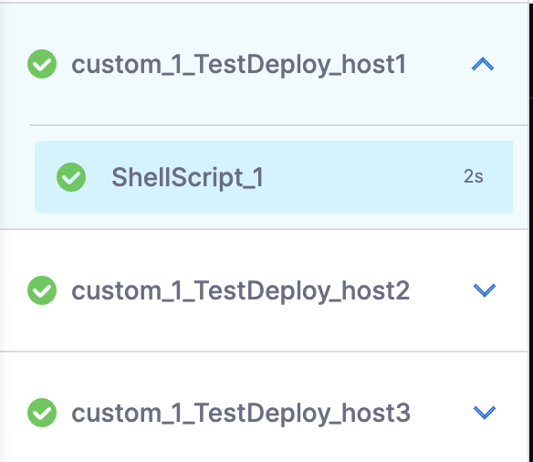
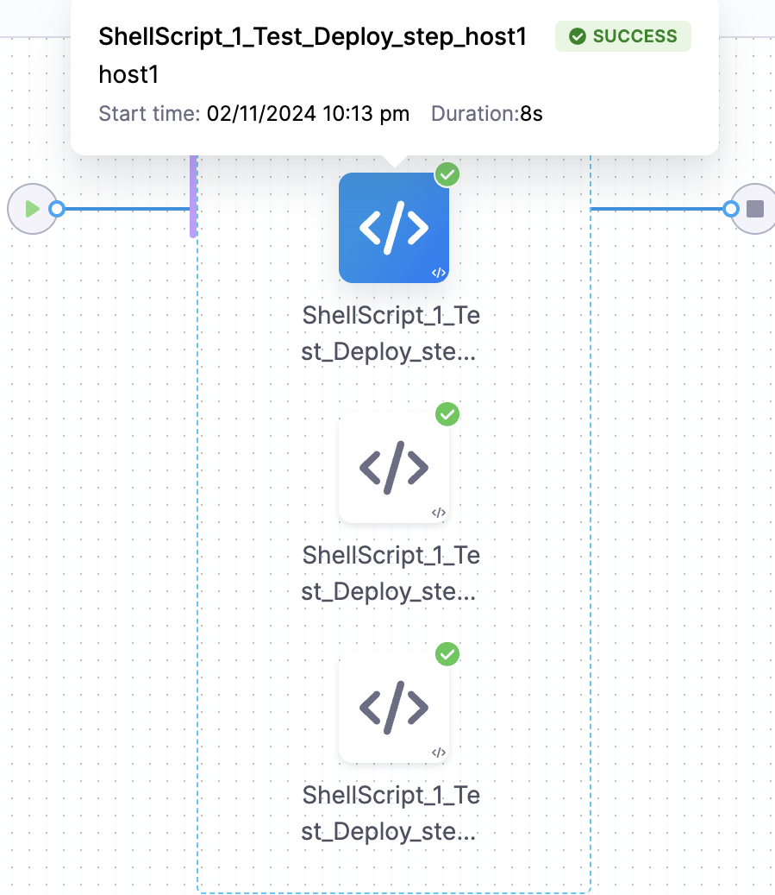
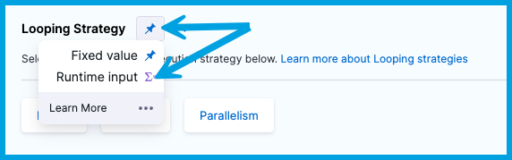
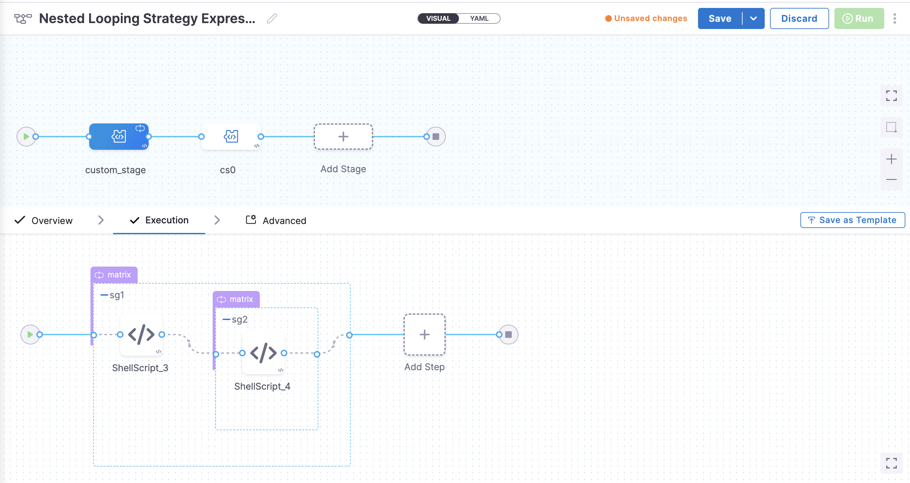

Looping strategies optimize your pipelines by running steps or stages concurrently or running stages or steps multiple times with different inputs. Looping strategies make pipelines more organized, readable, and easy to maintain. Harness offers three looping strategies:

- **Parallelism:** Save time by running steps and stages concurrently.
  - For example, if you have a Build stage with 20 unit tests, you can reduce the overall test time by running tests in parallel (such as 4 groups of 5 tests each), rather than all 20 tests sequentially.
- **Matrix:** Repeat stages or steps multiple times with different input for each instance. Supports complex inputs and input combinations.
  - For example, to test a UI feature in multiple browsers and platforms, you could define a matrix that specifies the browsers and platforms to test.
  - With a matrix strategy, you don't need to make a separate step for each variation. You can iterate over one step that swaps out the matrix input each time it runs.
- **Repeat:** Repeat stages or steps multiple times. Supports iterating over a simple list.
  - For example, to build artifacts for multiple JDK versions in the same Build stage, you can loop over one step, rather than making separate copies for each JDK version.

:::info

- There is no limit on the number of dimensions you can include in a matrix or the number of looping strategies you can define in a pipeline.
- Avoid complex looping scenarios unless you clearly understand the resources that your scenario will require. For more information, go to [Best Practices for Looping Strategies](./best-practices-for-looping-strategies.md).

:::

:::warning

Regardless of your strategy, the maximum number of stages you can run in parallel is 256.

:::

## Parallelism strategies

Parallelism saves time by running steps and stages concurrently.

A common use case for parallelism is for Build stages that include a lot of tests. For example, a Build stage with 100 tests takes much less time to run if you run the tests in concurrent batches, rather than all 100 tests sequentially.

You can set `parallelism` strategies on steps or stages. The following YAML example would produce ten instances of the step or stage where it was specified.

```yaml
parallelism: 10
```

:::info note
MaxConcurrency with Parallelism is not supported.
:::

For more information about parallelism strategies, go to:

- [Split tests in Run steps](/docs/continuous-integration/use-ci/run-tests/speed-up-ci-test-pipelines-using-parallelism)
- [Run stages in parallel](./run-stages-in-parallel.md)

## Matrix strategies

Matrix strategies are highly flexible and support complex combinations of variable inputs. With a matrix, you can run the same stage or step multiple times with different parameters each time. Matrix strategies eliminate the need to make separate copies of nearly identical stages and steps. Matrix strategies also make your pipelines more readable, clean, and easy to maintain. You can define matrix strategies to support workflows such as:

- A **Run** step that load-tests a UI feature in four different browsers and on three different platforms.
- A **Build** stage that builds artifacts for ten different JDK versions.
- A **Deploy** stage that deploys three different services to four different environments.

When a pipeline with a matrix strategy runs, Harness creates multiple copies of the stage or step, according to the specifications in the `matrix` strategy, and runs them in parallel.

The following YAML example includes a matrix with two dimensions: `service` and `env`. The `service` dimension has three values, and the `env` dimension has two values. When the pipeline runs, Harness produces six instances - One for each `service` value combined with each `env` value (svc1 on env1, svc1 on env2, svc2 on env1, and so on).

```yaml
matrix:
  service: [svc1, svc2, svc3] ## There are three services to iterate over.
  env: [env1, env2] ## There are two environments to iterate over.
```

<details>
<summary>Pipeline YAML example with matrix strategies</summary>

```yaml
pipeline:
name: matrix-example-2
identifier: matrixexample2
projectIdentifier: myproject
orgIdentifier: myorg
tags: {}
stages:
  - stage:
      name: echoMatrixSettings
      identifier: echoMatrixSettings
      description: ""
      type: Custom
      spec:
        execution:
          steps:
            - step:
                type: ShellScript
                name: echo
                identifier: echo
                spec:
                  shell: Bash
                  onDelegate: true
                  source:
                    type: Inline
                    spec:
                      script: |-
                        echo "iteration index = <+strategy.iteration>"  
                        echo "total iterations = <+strategy.iterations>"  
                        echo "stage values (parent):"  
                        echo "Current version for stage: <+stage.matrix.service>"  
                        echo "Current environment for stage: <+stage.matrix.environment>"  
                        echo "step values (local):"  
                        echo "Current item (version): <+repeat.item>"
                  environmentVariables: []
                  outputVariables: []
                  executionTarget: {}
                timeout: 10m
                failureStrategies: []
                strategy:
                  repeat:
                    items:
                      - "18"
                      - "17"
                      - "16"
                      - "15"
                      - "14"
                      - "13"
                      - "12"
                      - "11"
                      - "10"
                      - "9"
                    maxConcurrency: 2
      tags: {}
      strategy:
        matrix:
          service:
            - svc1
            - svc2
            - svc3
          environment:
            - env1
            - env2
          exclude:
            - service: svc1
              environment: env1
          maxConcurrency: 2
```

</details>

### Configure a matrix strategy

First, define a matrix of configurations that you want the stage or step to iterate over. A matrix is a series of dimensions, each consisting of a user-defined tag (such as `env`, `service`, `platform`, `browser`, `jdk`, and so on) and a list of values. You can do this in the YAML editor or in the **Advanced** settings for the stage/step in the Visual editor.

```yaml
matrix:
  tag1: [value1, value2, value3]
  tag2: [value1, value2]
```

Then, use `<+matrix.TAG>` expressions (such as `<+matrix.jdk>`, `<+matrix.env>`, or `<+matrix.service>`) in your step or stage settings to call the list of values for each tag. For example, this **Run** step references a matrix that iterates over values for `browser` and `os`.

```yaml
- step:
    type: Run
    name: Run_tests
    identifier: Run_test
    spec:
      shell: Sh
      command: |-
        echo "Testing app in <+matrix.browser> on <+matrix.os>"
        ...
```

You can also use matrix values as variable values. For example, this [Action step](/docs/continuous-integration/use-ci/use-drone-plugins/ci-github-action-step.md) iterates over a list of Python versions to install multiple versions of Python in the build workspace.

```yaml
- step:
    type: Action
    name: Install python
    identifier: installpython
    spec:
      uses: actions/setup-python@v4
      with:
        python-version: <+stage.matrix.pythonVersion>
        token: <+secrets.getValue("github_token")>
```

### Avoid hyphens and periods in matrix tag/dimension names

Harness recommends avoiding hyphens and periods in matrix tag/dimension names, such as `matrixTag` instead of `matrix-tag`.

However, if you need to reference a matrix dimension name that includes a period or hyphen/dash, you must wrap the tag in double quotes and use the `get()` method in the expression, such as `<+stage.matrix.get("python-version")>`.

If a dimension with a hyphen/dash or period is not referenced correctly, the expression resolves as null and doesn't throw an error.

### Matrix expressions in multi-layer matrix strategies

If a stage and step both have matrix strategies with the same tag labels, you need to use specific expressions to reference matrix values in the step or stage.

- `<+stage.matrix.TAG>`: Use this expression to reference a value in a stage level matrix strategy.
- `<+matrix.TAG>`: Use this expression to reference a value in a step level matrix strategy.

For example:

```
echo "Stage values (parent):"
echo "Current service for stage: <+stage.matrix.browser>"
echo "Current os for stage: <+stage.matrix.os>"
echo "Step values (local):"
echo "Current browser for step: <+matrix.browser>"
echo "Current os for step: <+matrix.os>"
```

### Exclude combinations

Use the `exclude` keyword to filter out combinations that you don't want to iterate over.

The following YAML example exclude two specific combinations from the matrix:

```yaml
matrix:
  service: [svc1, svc2, svc3]
  env: [env1, env2]
  exclude: ## Specify combinations that you don't want to iterate over.
    - service: svc1 ## Don't run svc1 with env1.
      env: env1
    - service: svc3 ## Don't run svc3 with env2.
      env: env2
```

You can also exclude any combination containing a specific value. The following YAML example includes a matrix strategy that excludes any combination containing `macos`:

```yaml
matrix:
  browser: [chrome, safari, firefox]
  os: [macos, windows, linux]
  exclude:
    - os: macos
```

### Limit resource usage

Use the `maxConcurrency` keyword to limit the number of parallel runs to prevent overtaxation of pipeline resources.

```yaml
matrix:
  service: [svc1, svc2, svc3]
  env: [env1, env2]
  maxConcurrency: 2 ## Run no more than 2 instances at once.
```

If the matrix strategy produces more instances than are allowed by the `maxConcurrency`, the additional instances are queued.

### Customize matrix stage names

By default, Harness uses indices for the matrix naming strategy (stages are named with indices like `_2_2`, `_1_3`, and so on). If you prefer, you can customize this naming convention for better readability. There are two ways to do this:

#### Use matrix axes as stage labels

You can set **Enable Matrix Labels by Name** at the account, organization, or project level. This setting uses the names of the matrix indices as labels.

1. Navigate to the **Default Settings** for your account, organization, or project:
   - To modify account settings, select **Account Settings**, select **Account Resources**, and then select **Default Settings**.
   - To modify organization settings, select **Account Settings**, select **Organizations**, select the organization you want to configure, and then select **Default Settings**.
   - To modify project settings, go to the project you want to configure, and, under **Project Setup**, select **Default Settings**.
2. Expand the **Pipeline** settings.
3. Set **Enable Matrix Labels By Name** to **True**.
4. Select **Save**.

#### Use a custom label for matrix stages

You can use the `nodeName` key in your `matrix` YAML to define a matrix stage naming convention. Expressions are supported, so you can customize the name as required. For example:

```yaml
matrix:
  service: [svc1, svc2, svc3]
  env: [env1, env2]
  nodeName: stage_<+matrix.service>_<+matrix.env>
```

When you specify a `nodeName`, the original/parent stage name is prepended to the `nodeName`. Therefore, the final, resolved name of each stage is `OriginalStageName_nodeName`.

If the resolved value of `nodeName` is the same for multiple stages, Harness automatically appends an index identifier to the name, such as `OriginalStageName_nodeName_0`, `OriginalStageName_nodeName_1`, and so on.

### Matrix examples and best practices

- [Best Practices for Looping Strategies](./best-practices-for-looping-strategies.md)
- [Matrix examples](./additional-matrix-examples.md)

## Repeat strategies

You can use `repeat` as an alternative to `parallelism` or one-dimensional `matrix` strategies.

### Repeat a set number of times

Use `times` to specify a number of times to repeat a step or stage. You can use `maxConcurrency` to prevent overtaxtion of pipeline resources by limiting the number of repeated instances that run at once.

```yaml
repeat:
  times: 6
  maxConcurrency: 3
```

The above YAML example is equivalent to the following `parallelism` strategy:

```yaml
parallelism: 6
  maxConcurrency: 3
```

In your steps and stages, you can use the following expressions to access the index values for each iteration. For example, this is useful for tracking repeat progress in step logs or tagging images or artifacts produced by repeated steps.

- `<+strategy.iteration>`: Current count within the repeat loop. Starts at zero.
- `<+strategy.iterations>`: Total number of iterations produced by the repeat loop.

### Repeat for each value in a list

Use `items` to iterate over a list of values. Use the expression `<+repeat.item>` in your stage/step settings to access values in the list. This option also supports `maxConcurrency`.

```yaml
repeat:
  items: ["18", "17", "16", "15", "14", "13", "12", "11", "10", "9"]
  maxConcurrency: 5
```

The `items` configuration is equivalent to a one-dimensional `matrix`.

```yaml
matrix:
  items: ["18", "17", "16", "15", "14", "13", "12", "11", "10", "9"]
  maxConcurrency: 5
```

### Repeat on multiple target hosts

To run steps on multiple target hosts, such as in a CD stage that performs a Deployment Template or SSH/WinRM deployment, use `repeat.items` with the expression `<+stage.output.hosts>` to reference all of the hosts/pods/instances. For example:

```yaml
repeat:
  items: <+stage.output.hosts>
```

For more information, go to [Run a step on multiple target instances](/docs/continuous-delivery/x-platform-cd-features/cd-steps/run-a-script-on-multiple-target-instances).

#### Use a custom label for repeat stages and steps
You can use the keyword `nodeName` when specifying your repeat items to define your stage and step naming convention. Expressions are supported, so you can customize the name as required. For example:

##### Customize the stage name:
```yaml
  tags: {}
  stages:
    - stage:
        name: custom_1
        identifier: custom_1
        description: ""
        type: Custom
        spec:
          execution:
            steps:
              - step:
                  type: ShellScript
                  name: ShellScript_1
                  identifier: ShellScript_1
                  spec:
                    shell: Bash
                    executionTarget: {}
                    source:
                      type: Inline
                      spec:
                        script: echo hello
                    environmentVariables: []
                    outputVariables: []
                  timeout: 10m
        tags: {}
        strategy:
          repeat:
            items:
              - host1
              - host2
              - host3
            nodeName: TestDeploy_<+repeat.item>
```


##### Customize the step name:

```yaml
tags: {}
  stages:
    - stage:
        name: custom_stage_2
        identifier: custom_stage_2
        description: ""
        type: Custom
        spec:
          execution:
            steps:
              - step:
                  type: ShellScript
                  name: ShellScript_1
                  identifier: ShellScript_1
                  spec:
                    shell: Bash
                    executionTarget: {}
                    source:
                      type: Inline
                      spec:
                        script: echo hello_world
                    environmentVariables: []
                    outputVariables: []
                  timeout: 10m
                  strategy:
                    repeat:
                      items:
                        - host1
                        - host2
                        - host3
                      nodeName: Test_Deploy_step_<+repeat.item>


```

:::info 
When creating a CI pipeline where both stage and step uses looping strategy and you want to use expressions inside nodeName in step then you have to use ``Test_Deploy_step_<+step.item>`` instead of ``Test_Deploy_step_<+repeat.item>``.
:::

:::info note
1. When you use `nodeName`, the final name of the stages will be ``OriginalStageName_nodeName``, and the original stage name will be there.
2. If the evaluated value of `nodeName` is the same in multiple stages, it will automatically append ``OriginalStageName_nodeName_0``, ``OriginalStageName_nodeName_1`` to the repeats. 
:::

## Looping strategies as runtime input

You can configure stage, step, and step group looping strategies as [runtime input](/docs/platform/variables-and-expressions/runtime-inputs) in your pipelines and templates.

When you configure looping strategies as runtime input, you select the strategy and provide the strategy specifications at pipeline runtime. This means you can run s pipeline with a `parallelism` strategy and then run the same pipeline with a `matrix` strategy by providing different runtime input.

To do this, go to the **Looping Strategy** settings where you want to configure the looping strategy to be specified at runtime, select the **Thumbtack** icon, and change the input type to **Runtime Input**.



When you run the pipeline, you'll be prompted to define the looping strategy configuration ([parallelism](#parallelism-strategies), [matrix](#matrix-strategies), or [repeat](#repeat-strategies)) for that run.

Due to the potential complexity of looping strategies, [input sets](/docs/platform/pipelines/input-sets) are useful for looping strategies as runtime input. Input sets contain pre-defined runtime inputs that you select at runtime. This eliminates the need to manually enter the entire looping strategy each time.

## Looping strategy expressions

You can use [Harness expressions](/docs/platform/variables-and-expressions/harness-variables) to reference stage/step instances generated by looping strategies, retrieve the execution status of a stage/step in a looping strategy, or get instance counts in looping strategies. These expressions are available in pipelines during execution and rollback.

### strategy.currentStatus

In stages/steps using matrix or repeat strategies, use `<+strategy.currentStatus>` to get the current status of the looping strategy for the stage/step with maximum depth. This expression gets the looping strategy status relative to the position of the expression.

The value of the expression depends on where both the expression and looping strategy occur in the pipeline:

- When this expression is used in a step, Harness resolves it as the looping strategy status for the first parent node (stage/step) of the step using the looping strategy.
- If the step containing the expression is the first node in a looping strategy, then the expression resolves to that step's looping strategy status.
- If a previous step in the same stage uses a looping strategy (but not the step containing the expression), the expression resolves to that step's looping strategy status.
- If there are no previous steps using a looping strategy, but the stage uses a looping strategy, then the expression resolves to the stage's looping strategy status.

Possible statuses for nodes (stages/steps) using a looping strategy are `RUNNING`, `FAILED`, or `SUCCESS`.

For more information, go to [Status expressions](/docs/platform/variables-and-expressions/harness-variables.md#status-expressions).

### strategy.node.NODE_ID.currentStatus

In stages/steps using matrix or repeat strategies, use either of the following two expressions to get the current status of the looping strategy for a specific stage or step, as defined by the `NODE_ID`: For example:

```
<+strategy.node.NODE_ID.currentStatus>
<+strategy.node.get("NODE_ID").currentStatus>
```

For example:

```
echo <+strategy.node.cs1.currentStatus>
echo <+strategy.node.get("ShellScript_1").currentStatus>
```

Possible statuses for nodes (stages/steps) using a looping strategy are `RUNNING`, `FAILED`, or `SUCCESS`.

Because stages and steps can't have the same identifier, the index value of the [iteration count](#iteration-counts) is appended to the base stage/step identifier to create unique identifiers for each stage/step instance created by the looping strategy. For more information about this, go to [Indexed identifiers in looping strategies](#indexed-identifiers-in-looping-strategies).

### Iteration counts

Use the following expressions to access the index values for each iteration of a step/stage produced by a looping strategy. For example, this is useful for tracking looping strategy progress in step logs or tagging images or artifacts produced by looped steps.

- `<+strategy.iteration>`: Current count within the loop. Starts at zero.
- `<+strategy.iterations>`: Total number of iterations produced by the loop.

### Indexed identifiers in looping strategies

Because stages and steps can't have the same identifier, the index value of the [iteration count](#iteration-counts) is appended to the base stage/step identifier to create unique identifiers for each stage/step instance created by the looping strategy. If you need to use an expression that references the identifier of a stage/step instance in a looping strategy, you must use the identifier with the appended index value.

For example, assume a looping strategy is applied to a stage with the identifier `my_build_stage`. The expression `<+pipeline.stages.my_build_stage.variables>` won't work. Instead, you must append the index value to the identifier in the expression, such as: `<+pipeline.stages.my_build_stage_0.variables>`.

### identifierPostFix expressions

<details>
<summary>What is the identifierPostFix</summary>

When you use a looping strategy like matrix or parallelism on a stage/step/step group, Harness automatically generates the unique IDs of the child stages/steps/step groups created by the looping operation. The `identifierPostFix` is a postfix added to the identifiers of nodes (stage/step/step group) during execution when the node is a child of the looping strategy. This ensures that all children of the looping strategy have unique identifiers.

For example, the following matrix strategy creates 3 stages based on the `repo` values `docker`, `gcr`, and `ecr`. The `identifierPostfix` values would be `_docker`, `_gcr`, and `_ecr` for the different combinations of each stage run.

```
strategy:
  matrix:
    repo:
      - docker
      - gcr
      - ecr
```

Similarly, the following parallelism strategy creates four stages/steps with the `identifierPostfix` values of `_0`, `_1`, `_2`, and `_3`.

```
strategy:
  parallelism: 4
```

</details>

* `<+strategy.identifierPostFix>`: This expression retrieves the `identifierPostFix` of the current node or any parent node that is a child of the looping strategy.
   * When used in a step, Harness resolves `<+strategy.identifierPostFix>` to the `identifierPostFix` of the child node belonging to the first looping strategy parent node (either stage or step).
   * If both the step and stage have the looping strategy configured, the expression resolves to the `identifierPostFix` of the step.
   * If the step (or stepGroup) does not have the looping strategy configured, the expression resolves to the `identifierPostFix` of the stage.
* `<+step.identifierPostFix>`: This expression returns the `identifierPostFix` of the current step when the step is a child of a looping strategy.
* `<+stage.identifierPostFix>`: This expression retrieves the `identifierPostFix` of the stage when the current node's stage is a child of a looping strategy.
* `<+stepGroup.identifierPostFix>`: This expression returns the `identifierPostFix` of the step group when the current node is under the step group, or when the current node is the step group itself, and that step group is a child of a looping strategy.
* `<+strategy.node.STRATEGY_NODE_IDENTIFIER.identifierPostFix>`: This expression retrieves the `identifierPostFix` for the node that is the child of a looping strategy with the identifier `STRATEGY_NODE_IDENTIFIER`.
   * For example, consider two nested step groups, sg1 and sg2 (which is a child of sg1). Both sg1 and sg2 have a looping strategy configured.

      

   * In this example, the expression `<+stepGroup.identifierPostFix>` always retrieves the `identifierPostFix` of sg2.
   * To obtain the `identifierPostFix` for a specific step group, you could use `<+strategy.node.sg1.identifierPostFix>` to retrieve the `identifierPostFix` for the node with the identifier sg1 (parent step group), and you could use `<+strategy.node.sg2.identifierPostFix>` to retrieve the `identifierPostFix` for the node with the identifier sg2 (child step group).
   * Similarly, you can use other strategy expressions for any specific strategy level if a looping strategy is configured for both the parent and child nodes.

* `<+strategy.node.STRATEGY_NODE_IDENTIFIER.*>`: Using this format, you can retrieve the values of any strategy expressions associated with looping strategies at various levels. This is useful when looping strategies are configured within nested levels. Here are some examples:
   * `<+strategy.node.sg1.iteration>`: Retrieves the current iteration of the node with the identifier sg1 (parent step group).
   * `<+strategy.node.sg2.iteration>`: Retrieves the current iteration of the node with the identifier sg2 (child step group).
   * `<+strategy.node.some_node_with_looping_strategy.iteration>`: Retrieves the current the iteration of the node with identifier `some_node_with_looping_strategy` (`some_node_with_looping_strategy` can be any type of node stage, step, or step group).
   * `<+strategy.node.sg1.iterations>`: Retrieves the total iterations of the node with the identifier sg1.
   * `<+strategy.node.sg2.iterations>`: Retrieves the total iterations of the node with the identifier sg2.
   * `<+strategy.node.some_node_with_looping_strategy.iterations>`: Retrieves the total iterations of the node with the identifier `some_node_with_looping_strategy`.
   * `<+strategy.node.sg1.matrix.key1>`: Retrieves the value for the matrix axis key1 for the node with the identifier sg1 if a matrix looping strategy is configured for sg1.
   * `<+strategy.node.sg2.matrix.key1>`: Retrieves the value for the matrix axis key1 for the node with the identifier sg2 if a matrix looping strategy is configured for sg2.
   * `<+strategy.node.some_node_with_looping_strategy.matrix.key1>`: Retrieves the value for the matrix axis key1 for the node with the identifier `some_node_with_looping_strategy` if a matrix looping strategy is configured for `some_node_with_looping_strategy`.

## Execution status of stages with looping strategies

The status of a stage with looping strategy is based on the highest priority execution status among its child stages:

* Negative statuses takes precedence over positive status.
* If _any one_ child stage has negative status, then the parent stage takes that negative status.
* If _multiple_ child stages have negative statuses, the parent stage takes the negative status with the highest priority.
* If _all_ child stages have a positive status, the parent stage takes the positive status with the highest priority.

Negative status are prioritized as follows, from highest to lowest:

1. Aborted
2. Failed
3. Freeze failed
4. Approval rejected
5. Expired

Positive statuses are prioritized as follows, from highest to lowest:

1. Ignore Failed
2. Succeeded

Here are some examples of the looping strategy status logic:

* If one child stage is `Failed` and another child stage is `Expired`, then the parent becomes `Failed` because `Failed` has higher priority than `Expired`.
* If one child stage is `Ignore failed` and another child stage is `Succeeded`, then the parent becomes `Ignore failed` because `Ignore failed` has higher priority than `Succeeded`.
* If one child stageis `Expired` and all other child stages  are `Succeeded`, then the parent becomes `Expired` because negative statuses take priority over positive statuses, even if only one child stage has a negative status.
