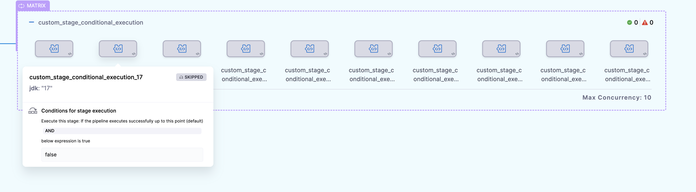
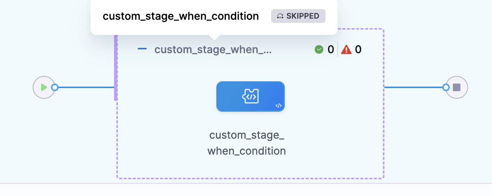
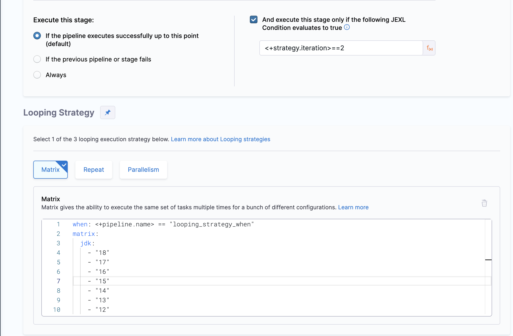
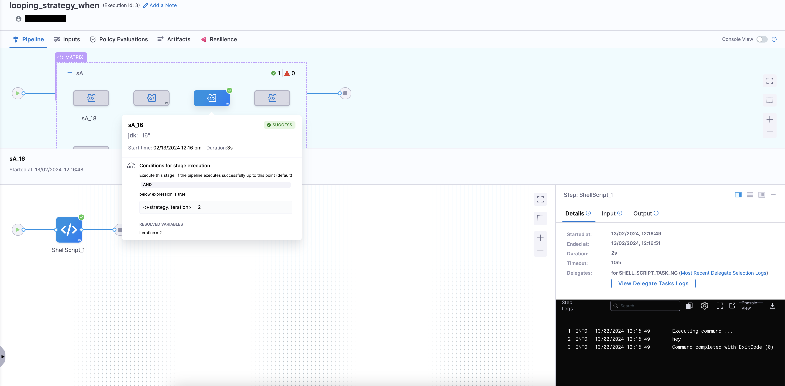
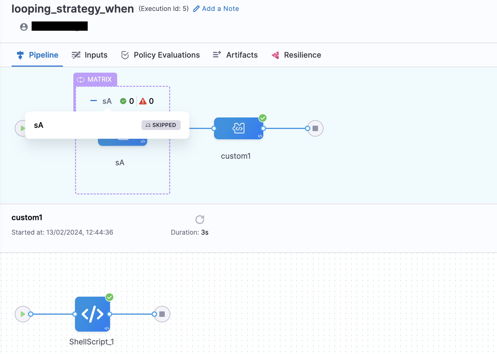

## when Condition vs Conditional Execution
It is important to understand the difference between using ``when`` condition and conditional execution in the pipeline while using looping strategy. 
**Let's consider an example of a pipeline using conditional execution while using matrix in a stage:-**
```yaml
pipeline:
  name: looping _strategy
  identifier: looping__strategy
  projectIdentifier: Krishika_CD_Samples
  orgIdentifier: default
  tags: {}
  stages:
    - stage:
        name: custom_stage_conditional_execution
        identifier: custom_stage_conditional_execution
        description: ""
        type: Custom
        spec:
          execution:
            steps:
              - step:
                  type: ShellScript
                  name: ShellScript_1
                  identifier: ShellScript_1
                  spec:
                    shell: Bash
                    executionTarget: {}
                    source:
                      type: Inline
                      spec:
                        script: |
                          echo hey
                    environmentVariables: []
                    outputVariables: []
                  timeout: 10m
        tags: {}
        strategy:
          matrix:
            jdk:
              - "18"
              - "17"
              - "16"
              - "15"
              - "14"
              - "13"
              - "12"
              - "11"
              - "10"
              - "9"
        when:
          pipelineStatus: Success
          condition: "false"

```
In this example, when you will execute the pipeline, all the stages i.e ``custom_stage_conditional_execution_18``, ``custom_stage_conditional_execution_17 `` and so on will be created and then it will check the conditional execution i.e in this case condition is ``false`` so all the stages will get skipped.


**Now, let's consider an example where you are using ``when`` condition while using matrix in stage:-**
```yaml
pipeline:
  name: looping _strategy
  identifier: looping__strategy
  projectIdentifier: Krishika_CD_Samples
  orgIdentifier: default
  tags: {}
  stages:
    - stage:
        name: custom_stage_when_condition
        identifier: custom_stage_conditional_execution
        description: ""
        type: Custom
        spec:
          execution:
            steps:
              - step:
                  type: ShellScript
                  name: ShellScript_1
                  identifier: ShellScript_1
                  spec:
                    shell: Bash
                    executionTarget: {}
                    source:
                      type: Inline
                      spec:
                        script: |
                          echo hey
                    environmentVariables: []
                    outputVariables: []
                  timeout: 10m
        tags: {}
        strategy:
          when: <+pipeline.name> == "looping_strategy_when"
          matrix:
            jdk:
              - "18"
              - "17"
              - "16"
              - "15"
              - "14"
              - "13"
              - "12"
              - "11"
              - "10"
              - "9"
        when:
          pipelineStatus: Success
```
In this example, when the pipeline is executed, it will first check whether the pipeline name is ``looping_strategy_when``. If it is not, the execution of the stage will be skipped, and all the stages will not be created, unlike conditional execution.


**Let's cover an example where we are using conditional execution as well as ``when`` condition in the pipeline for more clarity**

Suppose you have a matrix with 10 elements in your pipeline and you want to run a particular ith element after it satisfies a particular condition:
```yaml
pipeline:
  name: looping_strategy_when
  identifier: looping_strategy_when
  tags: {}
  projectIdentifier: fdsf
  orgIdentifier: default
  stages:
    - stage:
        name: sA
        identifier: sA
        description: ""
        type: Custom
        spec:
          execution:
            steps:
              - step:
                  type: ShellScript
                  name: ShellScript_1
                  identifier: ShellScript_1
                  spec:
                    shell: Bash
                    executionTarget: {}
                    source:
                      type: Inline
                      spec:
                        script: echo hey
                    environmentVariables: []
                    outputVariables: []
                  timeout: 10m
        tags: {}
        strategy:
          when: <+pipeline.name> == "looping_strategy_when"
          matrix:
            jdk:
              - "18"
              - "17"
              - "16"
              - "15"
              - "14"
              - "13"
              - "12"
              - "11"
              - "10"
              - "9"
        when:
          pipelineStatus: Success
          condition: <+strategy.iteration> == 2
  allowStageExecutions: true
```
Let's discuss how this YAML will get evaluated and what the expected output will be:
1. First, it will check whether ``when: <+pipeline.name> == "looping_strategy_when"`` is true. If it's true, then it will move forward to run the looping strategy, otherwise it will be skipped. 

2. Second, if you have a stage-level conditional execution as provided in the above example:
```yaml
 when:
        pipelineStatus: Success
        condition: <+strategy.iteration> == 2
```
Here, after the first ``when: <<+pipeline.name> == "looping_strategy_when"`` condition is evaluated, then it will only evaluate the stage-level condition.


To summarize, the above YAML will first check if the pipeline name matches ``looping_strategy_when``, and if it does, for example, if the status is ``Success``, it will run the second element of the matrix.


## When to use ``when `` condition.

Some scenarios where you might want to use the ``when`` condition in your pipeline include:

1. When you prefer not to execute the looping strategy at all.
2. When you want to bypass matrix/repeat/parallelism if it's empty

#### Let's consider an example where it will skip to run looping strategy:-
```yaml
pipeline:
  name: looping_strategy_when
  identifier: looping_strategy_when
  tags: {}
  projectIdentifier: fdsf
  orgIdentifier: default
  stages:
    - stage:
        name: sA
        identifier: sA
        description: ""
        type: Custom
        spec:
          execution:
            steps:
              - step:
                  type: ShellScript
                  name: ShellScript_1
                  identifier: ShellScript_1
                  spec:
                    shell: Bash
                    executionTarget: {}
                    source:
                      type: Inline
                      spec:
                        script: echo hey
                    environmentVariables: []
                    outputVariables: []
                  timeout: 10m
        tags: {}
        strategy:
          when: <+pipeline.name> == "feat1"
          matrix:
            jdk:
              - "18"
              - "17"
              - "16"
              - "15"
              - "14"
              - "13"
              - "12"
              - "11"
              - "10"
              - "9"
        when:
          pipelineStatus: Success
          condition: <+strategy.iteration> == 2
  allowStageExecutions: true
```
In this example, the pipeline name doesn't match as ``feat1``, therefore it will skip running the looping strategy (in this case ``matrix``), and move forward to run the rest of the pipeline.


#### Let's consider an example where we want to skip the looping strategy stage when the list to iterate is empty. 

Suppose you have a chained pipeline with an output variables that provides a list of deployed services and number of services deployed. In another stage, there is a matrix that takes this variable as input and produces a list of deployed services.
```yaml
strategy:
          when: <+pipeline.stages.get_deployed_services.spec.execution.steps.get_deployed_services.output.outputVariables.number_of_services> > 0
          matrix:
            service: <+json.list("services", <+pipeline.stages.get_deployed_services.spec.execution.steps.get_deployed_services.output.outputVariables.deployed_services>)>
            maxConcurrency: 4
```
In this example, you can see if number of deployed services if less than 0 then you can skip the stage and move forward. 