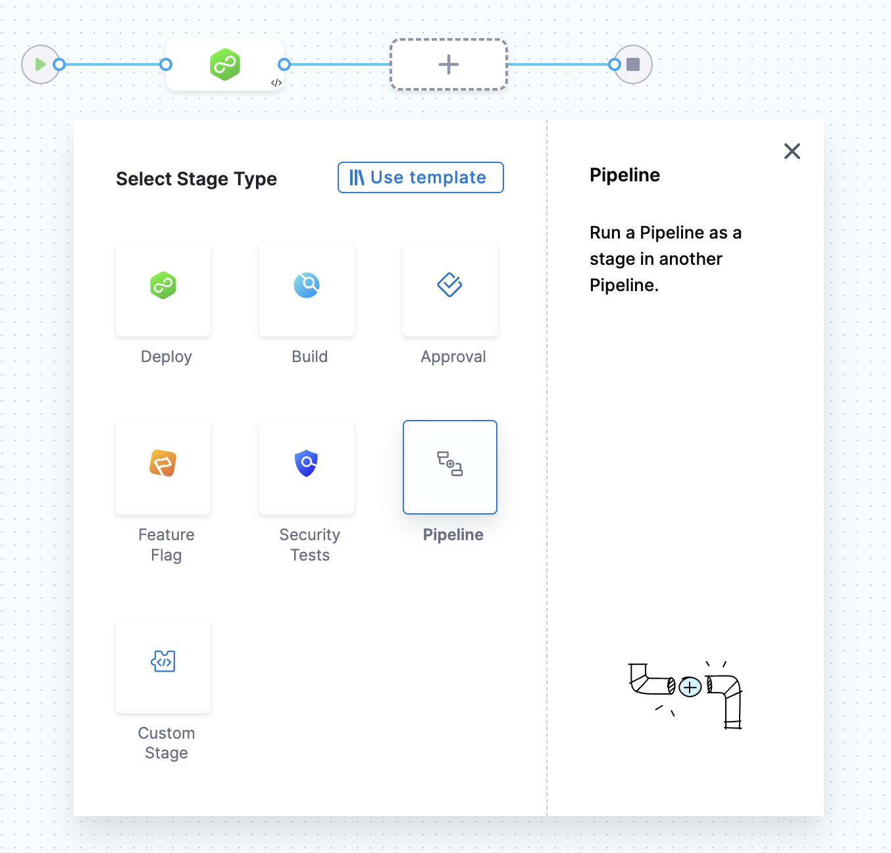
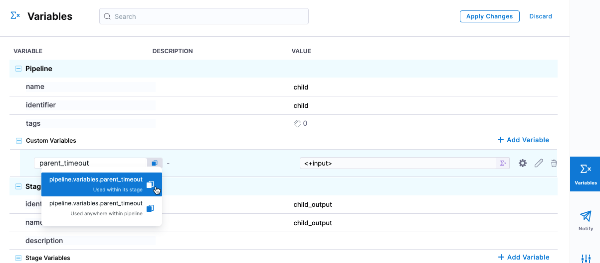
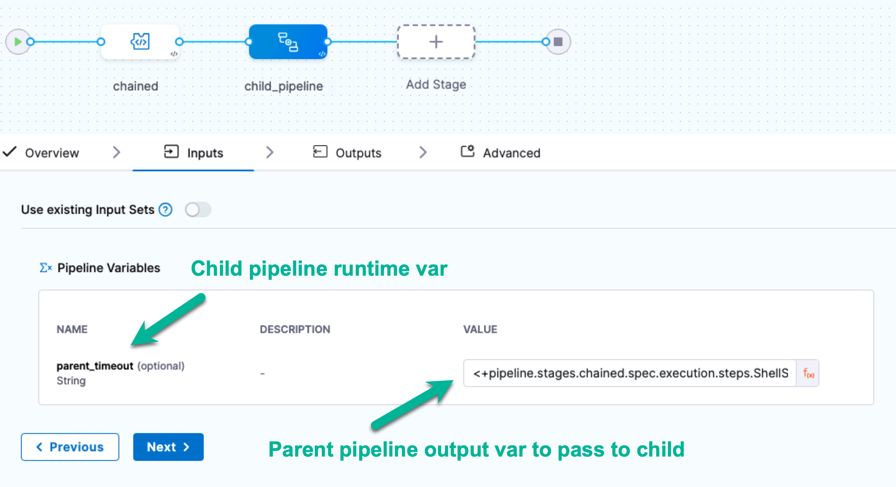
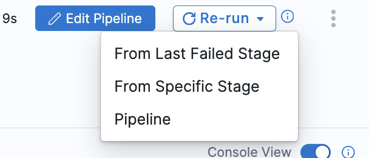

Pipeline chaining involves using the output of one pipeline as input for another. You can link multiple processing steps together and execute them sequentially, creating a more complex workflow.

For example, you could have a pipeline that deploys an application to a test environment. This could be followed by a pipeline that runs a set of integration tests and, finally, a pipeline that deploys the application to production. Each pipeline in the chain is triggered by the completion of the previous pipeline. The output of each pipeline is passed to the next pipeline in the chain. This way, you can automate the whole process and make sure that the application is tested properly before deploying to production.

Chaining pipelines in Harness offers the following benefits:

- Development of complex workflows involving multiple stages of deployment, testing, and verification.
- Ease of handling errors. Visibility into the deployment process makes it easier to identify and troubleshoot issues.
- Faster and more efficient deployment.
- Reusability of the pipeline across multiple applications and environments, reducing the need to recreate the same steps for each deployment.
- Improved collaboration and communication by allowing different teams to work on different stages of the deployment process.
- Enable greater compliance with regulatory requirements and industry best practices through automatic deployments.

## Requirements and considerations

- You need read permissions for the child (chained) pipeline and edit permissions for the parent (primary) pipeline to add a chained pipeline (a pipeline stage) to a pipeline.
- To manually run chain pipelines, you need execute permissions for the parent and child pipelines to ensure successful execution.
- If you change the runtime inputs in a chained pipeline, select **Inputs** in the parent pipeline to see the changes.
- When manually running a pipeline, the pre-flight checks don't validate child pipelines.
- Pipeline stages (chained pipelines) don't support matrix strategies.
- Pipeline stages don't support auto-suggested expressions in **Outputs**.
- Artifacts, test results, and other output produced by chained pipelines are available in the execution details for the chained pipeline that produced those outputs. This information is not stored in the parent pipeline's execution details.
- Nested pipeline chaining is not supported. When the referred pipeline invokes a child pipeline, it cannot be included within another pipeline.

## Chain pipelines

To chain pipelines in Harness:

1. Create each [pipeline](../pipelines/add-a-stage.md#step-1-create-a-pipeline) that you want to chain together, including a parent pipeline where you'll link the child pipelines.
2. To chain pipelines, go to the parent pipeline, select **Add Stage**, and then select **Pipeline**.

   

3. Select the child pipeline that you want to chain to the parent. You can select any pipeline that you can [access](/docs/platform/role-based-access-control/rbac-in-harness) across different orgs and projects in your Harness account.
4. Select **Apply Selected**.
5. Repeat the above steps to continue chaining pipelines as needed, and then save the parent pipeline.

   In the final chained pipeline stage, you can add concluding steps, such as a **Deploy** step if you need to deploy an application.

6. Harness recommends running the pipeline in a development environment to test it before executing it in production.

## Use parent output in child pipelines

You can use Harness expressions to reference output from a parent pipeline as input in a child pipeline stage.

To use the output of a parent pipeline in the child pipeline and its stages:

1. In the child pipeline, select **Variables**. You need to create a child pipeline variable so that when you add the child pipeline to the parent pipeline as a stage, the child pipeline stage will have an input you can use to map output variables from the parent pipeline.
2. Under **Pipeline**, in **Custom Variables**, select **Add Variable**.  You can also utilize variables defined at any stage in the child pipeline.  
3. Enter a name for the variable and set its value as a *runtime input*, and make a note of the variable expression name.  Setting this as a *runtime input* allows the Parent Pipeline to see the variable and define the information within the variable.  

   

4. Select **Apply Changes**. Save the child pipeline.
5. In the parent pipeline, verify that you have an output variable to pass to the child pipeline.  This can be any variable within the parent pipeline. For example, a [Shell Script step output variable](/docs/continuous-delivery/x-platform-cd-features/cd-steps/utilities/shell-script-step).  Copy the reference to this variable to be used later.
6. In the parent pipeline, select/add the child pipeline stage. The runtime pipeline variable you added to the child pipeline appears in the **Inputs** tab, with a *runtime input* mark.
7. Click on the *runtime input* mark and change it to an *expression*.  

   

9. In **Inputs**, you should see the runtime input from the child pipeline variable you created.
10. In **Value**, enter an expression that references the parent pipeline output variable you want to pass to the child pipeline, in this case, the reference of the parent pipeline variable from step 5.  Save these changes in the parent pipeline.

:::info

The **Inputs** tab supports auto-suggested expressions, but these are not available in the **Outputs** tab.

:::

When the parent pipeline runs and the child pipeline is executed, the child pipeline uses the pipeline-level runtime variable. That variable is resolved using the value from the parent pipeline output variable.

<details>
<summary>YAML Example: Chained pipelines using variables</summary>

Here's an example of a child and parent pipeline where a parent pipeline output expression is mapped and used in a child pipeline stage.

```yaml
pipeline:
  name: child
  identifier: child
  projectIdentifier: CD_Docs
  orgIdentifier: default
  tags: {}
  stages:
    - stage:
        name: child_output
        identifier: child_output
        description: ""
        type: Custom
        spec:
          execution:
            steps:
              - step:
                  type: ShellScript
                  name: ShellScript_1
                  identifier: ShellScript_1
                  spec:
                    shell: Bash
                    onDelegate: true
                    source:
                      type: Inline
                      spec:
                        script: echo <+pipeline.variables.parent_timeout>
                    environmentVariables: []
                    outputVariables: []
                  timeout: 10m
          outputs: []
        tags: {}
  variables:
    - name: parent_timeout
      type: String
      description: ""
      required: false
      value: <+input>
```
</details>

<details>
<summary>Parent pipeline with child pipeline stage</summary>

```yaml
pipeline:
  name: parent
  identifier: parent
  projectIdentifier: CD_Docs
  orgIdentifier: default
  tags: {}
  stages:
    - stage:
        name: chained
        identifier: chained
        description: ""
        type: Custom
        spec:
          execution:
            steps:
              - step:
                  type: ShellScript
                  name: ShellScript_1
                  identifier: ShellScript_1
                  spec:
                    shell: Bash
                    onDelegate: true
                    source:
                      type: Inline
                      spec:
                        script: timeout=<+pipeline.stages.chained.spec.execution.steps.ShellScript_1.timeout>
                    environmentVariables: []
                    outputVariables:
                      - name: parent_timeout
                        type: String
                        value: timeout
                  timeout: 10m
          outputs: []
        tags: {}
    - stage:
        name: child_pipeline
        identifier: child_pipeline
        description: ""
        type: Pipeline
        spec:
          org: default
          pipeline: child
          project: CD_Docs
          outputs: []
          inputs:
            identifier: child
            variables:
              - name: parent_timeout
                type: String
                value: <+pipeline.stages.chained.spec.execution.steps.ShellScript_1.output.outputVariables.parent_timeout>

```
</details>

## Re-running Failed Stages in Chained Pipelines

If you re-run the execution from a failed stage, and that stage is configured with a chained pipeline, the entire child pipeline will re-run, not just the specific stage within the child pipeline.

Consider this Pipeline Yaml:-

```yaml
pipeline:
  name: pipelineA
  identifier: pipelineA
  projectIdentifier: CD_Samples
  orgIdentifier: default
  tags: {}
  stages:
    - stage:
        name: cust_1
        identifier: cust_1
        description: ""
        type: Custom
        spec:
          execution:
            steps:
              - step:
                  type: ShellScript
                  name: ShellScript_1
                  identifier: ShellScript_1
                  spec:
                    shell: Bash
                    executionTarget: {}
                    source:
                      type: Inline
                      spec:
                        script: echo hello
                    environmentVariables: []
                    outputVariables: []
                  timeout: 10m
        tags: {}
    - stage:
        name: cust_2
        identifier: cust_2
        description: ""
        type: Pipeline
        spec:
          org: default
          pipeline: pipelineB
          project: CD_Samples

```
In this pipeline we are using chained pipeline `pipelineB`.

Pipeline Yaml for `pipelineB`:-

```yaml
pipeline:
  name: pipelineB
  identifier: pipelineB
  projectIdentifier: CD_Samples
  orgIdentifier: default
  tags: {}
  stages:
    - stage:
        name: cust_3
        identifier: cust_3
        description: ""
        type: Custom
        spec:
          execution:
            steps:
              - step:
                  type: ShellScript
                  name: ShellScript_1
                  identifier: ShellScript_1
                  spec:
                    shell: Bash
                    executionTarget: {}
                    source:
                      type: Inline
                      spec:
                        script: echo hello_2
                    environmentVariables: []
                    outputVariables: []
                  timeout: 10m
        tags: {}
    - stage:
        name: cust_4
        identifier: cust_4
        description: ""
        type: Custom
        spec:
          execution:
            steps:
              - step:
                  type: ShellScript
                  name: ShellScript_1
                  identifier: ShellScript_1
                  spec:
                    shell: Bash
                    executionTarget: {}
                    source:
                      type: Inline
                      spec:
                        script: hello
                    environmentVariables: []
                    outputVariables: []
                  timeout: 10m
        tags: {}

```
In this pipeline, stage `cust_4` will fail due to incorrect shell script command. Now when you click on `Re-run` and under that `From Last failed Stage` the whole chained pipeline will run. 



## Execution of Chained Pipeline
:::info note
Currently this feature is behing the Feature Flag `PIE_SHOW_ALL_EXECUTIONS_FILTER`. Please contact [Harness support](mailto:support@harness.io) to enable this feature.
:::
You can see execution of your child pipeline in that pipeline execution history.


## Considerations when executing remote chained pipelines

Consider the following points for executing remote (stored in SCM) chained pipelines:

- A chained pipeline is fetched from the default branch when the parent pipeline is defined inline, and the chained pipeline is defined remotely.
- When the parent pipeline is defined remotely, and the chained pipeline is defined inline, the parent pipeline is fetched from the corresponding branch, and the chained pipeline is fetched inline.
- When both the chained pipeline and the parent pipeline are defined remotely, but under the same repository, the chained pipeline should belong to the same branch as the parent pipeline.
- A chained pipeline is fetched from the default branch when both the parent and chained pipelines are defined remotely in separate repositories. This is irrespective of the branch of the parent pipeline.
