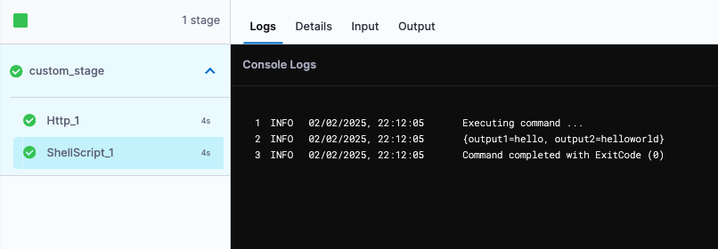

## Overview

The Execution Graph API provides a structured representation of a pipeline's execution in Harness, detailing the flow, dependencies, statuses, and outcomes of different tasks within a pipeline. This API enables users to retrieve execution details at various levels, including stages, steps, and specific nodes.

## API to Get Execution Subgraph for Node Execution

The **Execution Subgraph API** provides detailed information about a specific node's execution in the pipeline.

### API Endpoint

```GET /executions/{executionId}/subgraph/{nodeExecutionId}```

- **executionId**: The ID of the execution.
- **nodeExecutionId**: The ID of the node within the execution whose subgraph details are to be fetched.

For detailed documentation, refer to the [Pipeline Execution Details API](https://apidocs.harness.io/tag/Pipeline-Execution-Details/?_gl=1*smd27j*_gcl_au*MTMxODM4MjQ4LjE3MzYxODY4MjA.*_ga*MTE3NTQ1ODQ5Ny4xNzI4NDAwNDc3*_ga_46758J5H8P*MTczODIyNzY5OS4yNTAuMS4xNzM4MjI4OTI3LjYwLjAuMA..#operation/getExecutionSubGraphForNodeExecution).

## Execution Graph Components 

Key Elements:
- Root Node: The entry point of the pipeline execution.
- Execution Nodes: Represents individual steps such as script execution, API calls, or deployments.
- Dependencies: Defines relationships between nodes, including sequential or parallel execution.
- Task Delegation: Assigns tasks to worker agents or delegates for execution.
- Status Tracking: Monitors execution states (Success, Failed, Running, etc.).
- Output Variables: Captures and stores data produced by execution steps.
- Logs: Stores detailed execution logs for debugging and analysis.
 
## Example Execution Graph JSON

Below is an example of the JSON response representing the execution graph:

```json
{
  "status": "SUCCESS",
  "data": {
    "executionGraph": {
      "rootNodeId": "HWbn_nVGSByRRgwtex3H2A",
      "nodeMap": {
        "ovKqIaGkQo2iRsKWgtameg": {
          "uuid": "ovKqIaGkQo2iRsKWgtameg",
          "setupId": "nfeEKsfVSYi9iJfDz2OY2Q",
          "name": "ShellScript_2",
          "identifier": "ShellScript_2",
          "baseFqn": "pipeline.stages.custom_stage.spec.execution.steps.ShellScript_2",
          "outcomes": {
            "output": {
              "outputVariables": {}
            }
          },
          "stepParameters": {
            "uuid": "nfeEKsfVSYi9iJfDz2OY2Q",
            "identifier": "ShellScript_2",
            "name": "ShellScript_2",
            "timeout": "10m",
            "type": "ShellScript",
            "spec": {
              "outputVariables": {},
              "environmentVariables": {},
              "shell": "Bash",
              "source": {
                "uuid": "oUbMpp0WTImNqk5B0RuqOg",
                "type": "Inline",
                "spec": {
                  "script": "echo \necho "
                }
              },
              "executionTarget": {}
            }
          },
          "startTs": 1738237072505,
          "endTs": 1738237075169,
          "stepType": "ShellScript",
          "status": "Success",
          "failureInfo": {
            "message": "",
            "failureTypeList": [],
            "responseMessages": []
          },
          "skipInfo": null,
          "nodeRunInfo": {
            "whenCondition": "<+OnStageSuccess>",
            "evaluatedCondition": true,
            "expressions": []
          },
          "retryNodeMetadata": null,
          "executableResponses": [
            {
              "task": {
                "taskId": "H5kWcK_2TjGvqknkCmiGOw-DEL",
                "taskCategory": "DELEGATE_TASK_V2",
                "logKeys": [
                  "accountId:ACCOUNT_ID/orgId:ORG_ID/projectId:PROJECT_ID/pipelineId:output_variable/runSequence:1/level0:pipeline/level1:stages/level2:custom_stage/level3:spec/level4:execution/level5:steps/level6:ShellScript_2-commandUnit:Execute"
                ],
                "units": [],
                "taskName": "SHELL_SCRIPT_TASK_NG"
              }
            }
          ],
          "unitProgresses": [
            {
              "unitName": "Execute",
              "status": "SUCCESS",
              "startTime": "1738237073847",
              "endTime": "1738237073854"
            }
          ],
          "progressData": {
            "unitProgresses": [
              {
                "unitName": "Execute",
                "status": "SUCCESS",
                "startTime": "1738237073847",
                "endTime": "1738237073854"
              }
            ]
          },
          "delegateInfoList": [
            {
              "id": "8MQ151-eSbGOhgEr6VBl_g",
              "name": "harnessci-cd-ng-prod",
              "taskId": "H5kWcK_2TjGvqknkCmiGOw-DEL",
              "taskName": "SHELL_SCRIPT_TASK_NG"
            }
          ],
          "interruptHistories": [],
          "stepDetails": {},
          "strategyMetadata": null,
          "executionInputConfigured": false,
          "logBaseKey": "accountId:ACCOUNT_ID/orgId:ORG_ID/projectId:PROJECT_ID/pipelineId:output_variable/runSequence:1/level0:pipeline/level1:stages/level2:custom_stage/level3:spec/level4:execution/level5:steps/level6:ShellScript_2"
        },
        "nxZXM3IuQqmwNO-UGR_PBw": {
          "uuid": "nxZXM3IuQqmwNO-UGR_PBw",
          "setupId": "T9PYhM5bThaBTQYkD7IplA",
          "name": "ShellScript_1",
          "identifier": "ShellScript_1",
          "baseFqn": "pipeline.stages.custom_stage.spec.execution.steps.ShellScript_1",
          "outcomes": {
            "output": {
              "outputVariables": {
                "output1": "",
                "output2": ""
              }
            }
          },
          "stepParameters": {
            "uuid": "T9PYhM5bThaBTQYkD7IplA",
            "identifier": "ShellScript_1",
            "name": "ShellScript_1",
            "timeout": "10m",
            "type": "ShellScript",
            "spec": {
              "outputVariables": {
                "output1": "hello",
                "output2": "helloworld"
              },
              "environmentVariables": {},
              "shell": "Bash",
              "source": {
                "uuid": "Dngv_Yz8Q26VhUiGoXbu1Q",
                "type": "Inline",
                "spec": {
                  "script": "echo hellp"
                }
              },
              "executionTarget": {}
            }
          },
          "startTs": 1738237068060,
          "endTs": 1738237071106,
          "stepType": "ShellScript",
          "status": "Success",
          "failureInfo": {
            "message": "",
            "failureTypeList": [],
            "responseMessages": []
          },
          "skipInfo": null,
          "nodeRunInfo": {
            "whenCondition": "<+OnStageSuccess>",
            "evaluatedCondition": true,
            "expressions": []
          },
          "retryNodeMetadata": null,
          "executableResponses": [
            {
              "task": {
                "taskId": "Xr7qqhYvQJW1A5ONlZP6cA-DEL",
                "taskCategory": "DELEGATE_TASK_V2",
                "logKeys": [
                  "accountId:ACCOUNT_ID/orgId:ORG_ID/projectId:PROJECT_ID/pipelineId:output_variable/runSequence:1/level0:pipeline/level1:stages/level2:custom_stage/level3:spec/level4:execution/level5:steps/level6:ShellScript_1-commandUnit:Execute"
                ],
                "units": [],
                "taskName": "SHELL_SCRIPT_TASK_NG"
              }
            }
          ],
          "unitProgresses": [
            {
              "unitName": "Execute",
              "status": "SUCCESS",
              "startTime": "1738237069178",
              "endTime": "1738237069186"
            }
          ],
          "progressData": {
            "unitProgresses": [
              {
                "unitName": "Execute",
                "status": "SUCCESS",
                "startTime": "1738237069178",
                "endTime": "1738237069186"
              }
            ]
          },
          "delegateInfoList": [
            {
              "id": "TYzuSpCfSIqRTcI_1NXhsw",
              "name": "cd-cie",
              "taskId": "Xr7qqhYvQJW1A5ONlZP6cA-DEL",
              "taskName": "SHELL_SCRIPT_TASK_NG"
            }
          ],
          "interruptHistories": [],
          "stepDetails": {},
          "strategyMetadata": null,
          "executionInputConfigured": false,
          "logBaseKey": "accountId:ACCOUNT_ID/orgId:ORG_ID/projectId:PROJECT_ID/pipelineId:output_variable/runSequence:1/level0:pipeline/level1:stages/level2:custom_stage/level3:spec/level4:execution/level5:steps/level6:ShellScript_1"
        },
        "HWbn_nVGSByRRgwtex3H2A": {
          "uuid": "HWbn_nVGSByRRgwtex3H2A",
          "setupId": "UPu3J3RHSX2Ho9JiaEHgaw",
          "name": "custom_stage",
          "identifier": "custom_stage",
          "baseFqn": "pipeline.stages.custom_stage",
          "outcomes": {},
          "stepParameters": {
            "uuid": "UPu3J3RHSX2Ho9JiaEHgaw",
            "identifier": "custom_stage",
            "name": "custom_stage",
            "description": "",
            "variables": {},
            "tags": {},
            "type": "Custom",
            "specConfig": {
              "childNodeID": "UnUHvdf7RguBVTUWzRn47g"
            },
            "timeout": "35d"
          },
          "startTs": 1738237067731,
          "endTs": 1738237075747,
          "stepType": "CUSTOM_STAGE",
          "status": "Success",
          "failureInfo": {
            "message": "",
            "failureTypeList": [],
            "responseMessages": []
          },
          "skipInfo": null,
          "nodeRunInfo": {
            "whenCondition": "<+OnPipelineSuccess>",
            "evaluatedCondition": true,
            "expressions": []
          },
          "retryNodeMetadata": null,
          "executableResponses": [
            {
              "child": {
                "childNodeId": "UnUHvdf7RguBVTUWzRn47g",
                "logKeys": [],
                "units": [],
                "skip": false
              }
            }
          ],
          "unitProgresses": [],
          "progressData": {
            "unitProgresses": []
          },
          "delegateInfoList": [],
          "interruptHistories": [],
          "stepDetails": {},
          "strategyMetadata": null,
          "executionInputConfigured": false,
          "logBaseKey": "accountId:ACCOUNT_ID/orgId:ORG_ID/projectId:PROJECT_ID/pipelineId:output_variable/runSequence:1/level0:pipeline/level1:stages/level2:custom_stage"
        },
        "UGwyVIh2TwKo1Ff9ZWdiyA": {
          "uuid": "UGwyVIh2TwKo1Ff9ZWdiyA",
          "setupId": "eFx1JJDBTSG0KXToOZLW_Q",
          "name": "Execution",
          "identifier": "execution",
          "baseFqn": "pipeline.stages.custom_stage.spec.execution",
          "outcomes": {},
          "stepParameters": {
            "childNodeId": "eFx1JJDBTSG0KXToOZLW_Qsteps",
            "logMessage": "Execution Element"
          },
          "startTs": 1738237067912,
          "endTs": 1738237075453,
          "stepType": "NG_SECTION_WITH_ROLLBACK_INFO",
          "status": "Success",
          "failureInfo": {
            "message": "",
            "failureTypeList": [],
            "responseMessages": []
          },
          "skipInfo": null,
          "nodeRunInfo": null,
          "retryNodeMetadata": null,
          "executableResponses": [
            {
              "child": {
                "childNodeId": "eFx1JJDBTSG0KXToOZLW_Qsteps",
                "logKeys": [],
                "units": [],
                "skip": false
              }
            }
          ],
          "unitProgresses": [],
          "progressData": {
            "unitProgresses": []
          },
          "delegateInfoList": [],
          "interruptHistories": [],
          "stepDetails": {},
          "strategyMetadata": null,
          "executionInputConfigured": false,
          "logBaseKey": "accountId:ACCOUNT_ID/orgId:ORG_ID/projectId:PROJECT_ID/pipelineId:output_variable/runSequence:1/level0:pipeline/level1:stages/level2:custom_stage/level3:spec/level4:execution"
        }
      },
      "nodeAdjacencyListMap": {
        "ovKqIaGkQo2iRsKWgtameg": {
          "children": [],
          "nextIds": []
        },
        "nxZXM3IuQqmwNO-UGR_PBw": {
          "children": [],
          "nextIds": [
            "ovKqIaGkQo2iRsKWgtameg"
          ]
        },
        "HWbn_nVGSByRRgwtex3H2A": {
          "children": [
            "UGwyVIh2TwKo1Ff9ZWdiyA"
          ],
          "nextIds": []
        },
        "UGwyVIh2TwKo1Ff9ZWdiyA": {
          "children": [
            "nxZXM3IuQqmwNO-UGR_PBw"
          ],
          "nextIds": []
        }
      },
      "executionMetadata": null,
      "representationStrategy": "camelCase"
    }
  },
  "metaData": null,
  "correlationId": "7eafc0cb-411e-48e8-b1c7-4644ef7678e2"
}
```

### Extracting Output Variables via Execution Graph API

You can extract output variables via Execution Graph response JSON using HTTP step and Shell script:-
Here is a sample YAML :-

```yaml
pipeline:
  name: output_variable
  identifier: output_variable
  projectIdentifier: PROJECT_ID
  orgIdentifier: ORG_ID
  tags: {}
  stages:
    - stage:
        name: custom_stage
        identifier: custom_stage
        description: ""
        type: Custom
        spec:
          execution:
            steps:
              - step:
                  type: Http
                  name: Http_1
                  identifier: Http_1
                  spec:
                    url: https://app.harness.io/pipeline/api/pipelines/execution/subGraph/kC70LloTRcmoXkS5ffX4eg/HWbn_nVGSByRRgwtex3H2A?accountIdentifier=ACCOUNT_ID&orgIdentifier=ORG_ID&projectIdentifier=PROJECT_ID
                    method: GET
                    headers:
                      - key: x-api-key
                        value: PAT_TOKEN
                      - key: Content-Type
                        value: application/json
                    inputVariables: []
                    outputVariables:
                      - name: out_var
                        value: <+json.select(".data.executionGraph.nodeMap.nxZXM3IuQqmwNO-UGR_PBw.stepParameters.spec.outputVariables", httpResponseBody)>
                        type: String
                  timeout: 10s
              - step:
                  type: ShellScript
                  name: ShellScript_1
                  identifier: ShellScript_1
                  spec:
                    shell: Bash
                    executionTarget: {}
                    source:
                      type: Inline
                      spec:
                        script: echo <+execution.steps.Http_1.output.outputVariables.out_var>
                    environmentVariables: []
                    outputVariables: []
                  timeout: 10m
        tags: {}

```

You need to specify the specific step `uuid` if you want to extract output variables from a specific step, same can ne extracted from JSON.

Output:-


