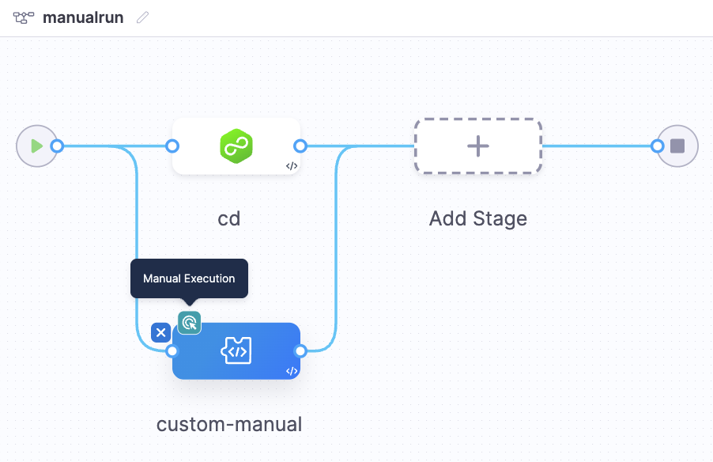
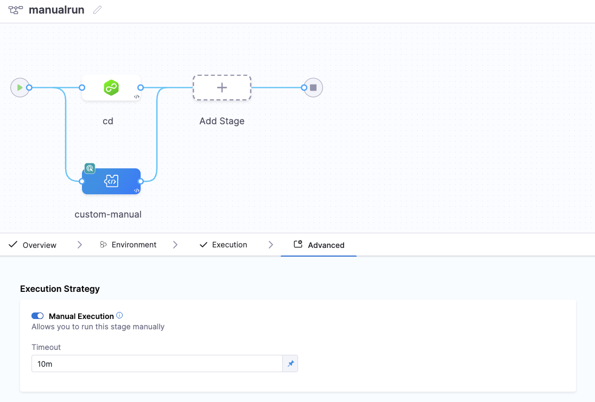
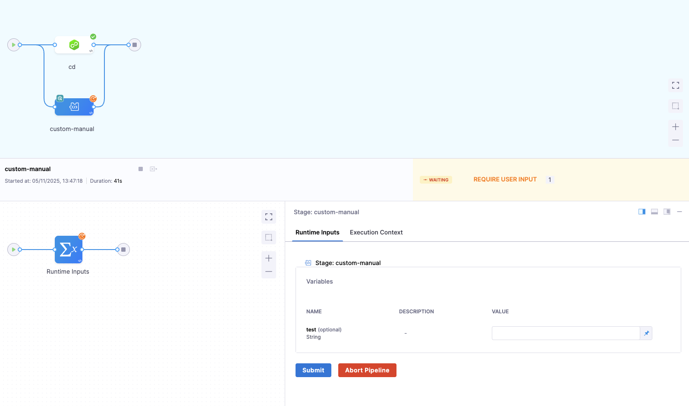
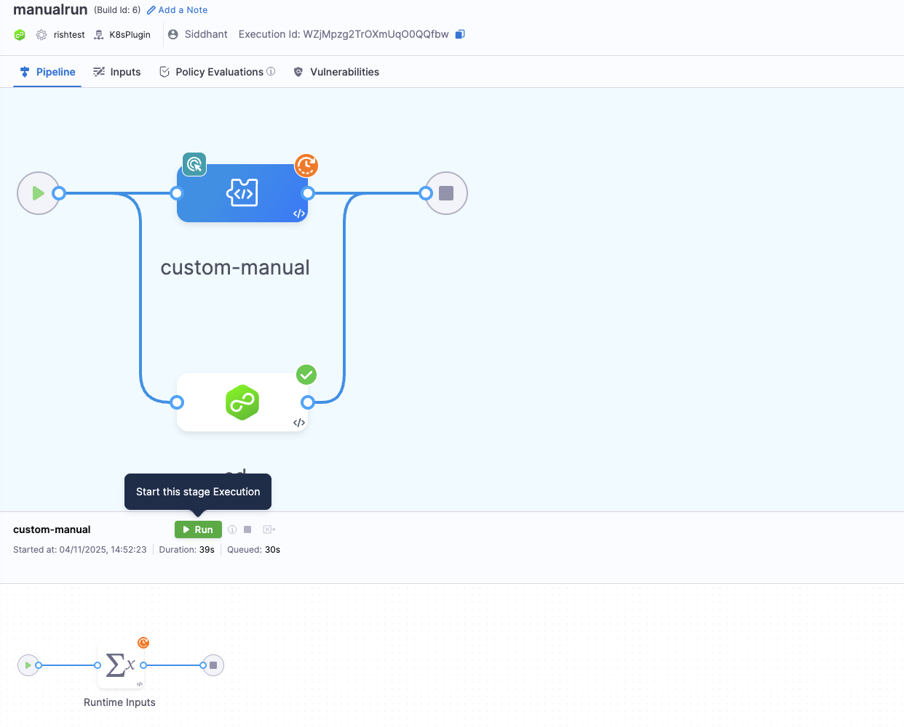
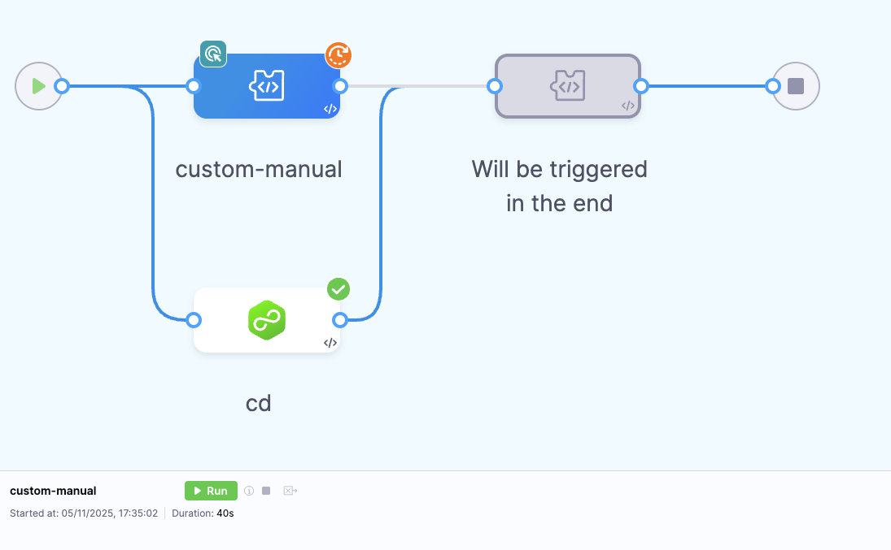

## Overview

The Manual Run or Manual Execution of stages introduces a powerful control mechanism in Harness pipelines, allowing users to pause automatic progression and manually trigger specific stages at runtime.

Manual Run provides users with fine-grained control to decide when a stage should begin execution, making it ideal for scenarios where external validation, human approval, or readiness of a dependent system is required before proceeding.

## Enable Manual Execution of stages

:::info Note

Currently, this feature is behind the feature flag `PIPE_ENABLE_MANUAL_STAGE_RUN`. Contact [Harness Support](mailto:support@harness.io) to enable the feature.

:::

Once you have the feature flag enabled, follow these steps to enable manual execution for a stage:

1. Open the pipeline in Pipeline Studio.
2. Select the stage that you want to run manually.
3. Navigate to Advanced Settings.
4. Enable the **Manual Execution** toggle.
5. Define the timeout for the stage. If the stage is not manually triggered within this timeout, the stage will fail.
6. Save the changes.

## Handling inputs during Manual Execution

If your stage includes runtime inputs, you must define the values for those inputs before manually triggering the stage. 
You will not be able to manually trigger the stage until you have defined the values for all runtime inputs.

## Run a stage manually

When the pipeline reaches a manual stage:

- The pipeline will display a **Run button** beside the stage name. This button will be visible only after you have defined the values for all runtime inputs.
- The stage status appears as **Waiting** until the stage is manually triggered.

The pipeline will not proceed to the next stage in sequential order until this stage is manually triggered and successfully completes. However, stages that run in parallel to the manual stage are independent and will continue to execute without waiting for it. 

## Failure of a Manual stage

If the manual stage fails due to a timeout that occurred because the stage was not manually triggered within the defined timeout, the failure strategy you applied to the stage will take effect. However, if the stage fails due to other reasons, Stage-level failure strategies are overridden by step and step group failure strategies, if present.