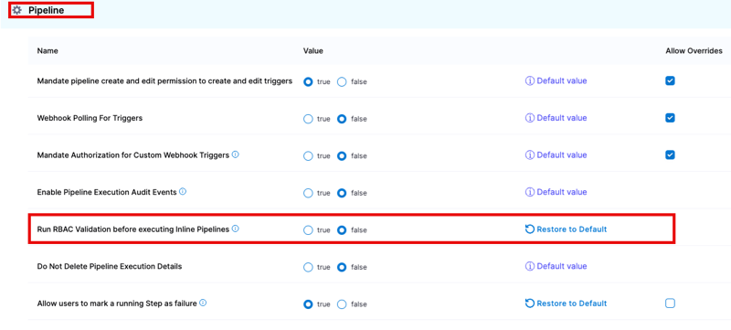

As an account administrator, you can configure global pipeline settings and enforce limits on the usage of pipelines in your account.

Some default limitations are applied on pipeline executions and resource consumption depending on your plan tier. Some settings can be modified within individual pipelines or globally by an administrator. Some settings can't be modified.

## Pipeline Default Settings

You can [configure Default Settings](/docs/platform/settings/default-settings.md) at the account, org, and project scopes. There are various categories of Default Settings.

These are the Default Settings for Pipelines.

### Pipeline triggers settings

- **Mandate pipeline create and edit permission to create and edit triggers:** If enabled, users must have permission to create/edit pipelines to create/edit triggers for those pipelines. If disabled, users with permission to create/edit triggers can create/edit triggers regardless of their access to create/edit the pipelines associated with the triggers.
- **Webhook Polling For Triggers**
- **Mandate Authorization for Custom Webhook Triggers:** Enable this setting to require that all custom triggers in this Harness account use API key tokens. For more information, go to [Enforcing authorization for custom triggers](/docs/platform/triggers/trigger-deployments-using-custom-triggers/#enforcing-authorization-for-custom-triggers).
- **Mandate Webhook Secrets for Github Triggers:** Enable this setting to force [secrets for Webhook triggers](/docs/platform/triggers/triggers-reference/#configure-secret) for authenticating the webhook call. For the secret to work with your webhook, you need to configure the repository webhook with the same secret after creating the trigger in Harness.
- **Execute Triggers With All Collected Artifacts or Manifests:** Enable this setting to allow all artifacts or manifests collected during the polling interval to trigger a deployment, with one deployment triggered for each artifact/manifest collected. For more information, go to [Trigger pipelines on a new artifact](/docs/platform/triggers/trigger-on-a-new-artifact/).

### Enable Pipeline Execution Audit Events

By default, the pipeline execution audit events such as Pipeline Start, Pipeline End, Stage Start, and Stage End are not displayed in the [Audit Trail](/docs/platform/governance/audit-trail/#step-view-an-audit-trail). Enable this setting to display these events.

### Run RBAC Validation before executing Inline Pipelines
:::note
Currently, this feature is behind the feature flags `CDS_PIPELINE_ABORT_RBAC_PERMISSION_MIGRATION` and `CDS_PIPELINE_ABORT_RBAC_PERMISSION`. Contact Harness Support to enable the feature.
:::

By default, before running any pipeline, Harness checks whether the user has access to all of the environments and other resources that the pipeline accesses. This check is run only for inline pipelines, not those stored in Git or other repositories. 

Turn off this setting if the check isn't required. Turning this off can cause pipelines to fail partway through execution (since later stages could have permission issues that haven't been checked beforehand).

The **Run RBAC Validation before executing Inline Pipelines** setting is available in the account-level default settings.

   

### Do Not Delete Pipeline Execution Details

When this is set to true, pipeline executions history remains in the system even when the corresponding pipelines are deleted. You can view these executions in the Pipeline Executions list and open them to view details, but you cannot re-run them. When this is set to false, Harness deletes all executions of a pipeline when that pipeline is deleted.

### Allow users to mark a running Step as failure

Enable this setting to allow users to manually fail in-progress steps.

### Export Service Variables as Env Variables

Enable this setting to [export service variables as environment variables in Shell Script steps](/docs/continuous-delivery/x-platform-cd-features/services/export-ser-var-as-env-var).

### Enable Matrix Labels By Name

Enable this setting to use the names of the matrix indices as labels. By default, Harness uses indices for the matrix naming strategy (stages are named with indices like _2_2, _1_3, and so on). If you prefer, you can customize this naming convention for better readability. For more information, go to [Use matrix axes as stage labels](/docs/platform/pipelines/looping-strategies/looping-strategies-matrix-repeat-and-parallelism/#use-matrix-axes-as-stage-labels).

### Enable Json Support for expressions

Enable this setting to [write expressions using any JSON parser tool](/docs/platform/variables-and-expressions/expression-v2/#write-expressions-using-json).

### Default Image Pull Policy For Add On Container

Use this setting to set the image pull policy for the internal Harness images that run inside a pod along with your containers. For example, you can pull all images using a pull policy of **Always** (the default setting), or you can select **Never** because you expect the image to be present in the cluster already.

### Concurrent Active Pipeline Executions

This is the number of concurrent pipeline executions allowed per execution API request. The setting considers only those executions that are in progress (including those that are paused temporarily by steps such as the wait step or approval step), not those that have executed to completion. Users are permitted 200 and 500 Concurrent Pipeline Executions (based on your plan) across the entire account by default. You can increase it to 500 and 1000 Concurrent Pipeline Executions (based on your plan).

Any executions that are triggered when the limit is reached are added to the execution queue. **These executions and their deployments are not failed by Harness.**

The concurrency limits are as follows for each plan tier:

|          | Free plan and Team/Enterprise trials | Team plan | Enterprise plan |
| -------- | ------------------------------------ | --------- | --------------- |
| Default | 2 | 200 | 500 |
| Maximum | 2 | 500 | 1000 |
| Editable | No | Yes | Yes |
| Scope | Account | Account | Account |

:::warning

These concurrency limits are *account wide* and NOT per pipeline. 

:::

This setting can only be edited in Team and Enterprise plans. You can set it at the account scope only. You can configure the limit anywhere between 2 and the maximum. 

### Pipeline Timeout and Stage Timeout (execution time limits)

The timeout limit is the maximum allowable time a stage or pipeline can run.

By default, the **Pipeline Timeout** and **Stage Timeout** settings are set to the maximum for your plan tier. You can edit these limits to anything less than the maximum for your plan tier. If needed, you can configure different timeout limits at the account, org, and project scopes.

Manually configuring a pipeline or stage to have a longer timeout than the system limit, the system limit is still enforced.

The maximum limits for each plan tier are as follows:

|      | Free plan | Team/Enterprise trials | Team plan | Enterprise plan |
| ---  | --------  | ---------------------- | --------- | --------------- |
| Pipeline timeout | 2 hr | 4 hr  | 30 days | 35 days  |
| Stage timeout | 1 hr | 1 hr | 30 days | 35 days |

## Fixed pipeline settings

You can't modify these pipeline settings.

### Parallelism Limit

The parallelism limit is the number of parallel steps or stages that can exist at a given level in a pipeline, regardless of whether you use a matrix, parallelism looping strategy, or manually arrange the steps/stages in parallel.

This is a fixed limit applied at the account scope and it can't be modified. If you manually enter an invalid value in a pipeline's YAML, you can save the pipeline, but you won't be able to run it.

The following parallelism limits apply to each plan:

* Free plan and Team/Enterprise trials: 10
* Team plan: 256
* Enterprise plan: 256

For example, with a Free plan, you can add a maximum of 10 parallel stages in a pipeline, and you can add a maximum of 10 parallel steps in each of those stages.

Even if you specify a `maxConcurrency` limit of 5 or 10, the moment you do the looping repeat strategy, Harness will already compute the total number of potential stages, if the list generates more than 256 items we will fail there before even running any of the stages and honoring the `maxconcurrency`. 

### Crud Limits

| Resource | Use-case | Default Limits
| ---  | ----------- | ------ |
| Pipeline | Number of pipelines in an account | <ul><li>Free: 5</li><li>Team: 5k</li><li>Enterprise: 10k</li></ul> | 
| Templates | Number of templates present in an account at all levels | <ul><li>Free: 5</li><li>Team: 5k</li><li>Enterprise: 10k</li></ul> | 
| Templates | Nesting of Template | <ul><li>Free: 10</li><li>Team: 10</li><li>Enterprise: 10</li></ul> | 
| Triggers | Number of triggers that can be present in an account |  <ul><li>Free: 100</li><li>Team: 5k</li><li>Enterprise: 10k</li></ul> | 

:::note
If you need limits beyond the default values specified above, please contact [Harness Support](mailto:support@harness.io).
:::

### Execution Limits

| Resource | Use-case | Default Limits
| ---  | ----------- | ------ |
| Step | Inputs size for a step | <ul><li>Free: 100KB</li><li>Team: 500KB</li><li>Enterprise: 1MB</li></ul> | 
| Step | Output size for a step | <ul><li>Free: 100KB</li><li>Team: 1MB</li><li>Enterprise: 1MB</li></ul> | 
| File Store | Size of the file store | <ul><li>Free: 100KB</li><li>Team: 500KB</li><li>Enterprise: 1MB</li></ul> | 
| Triggers | Size of payload supported by triggers |  <ul><li>Free: 16MB</li><li>Team: 16MB</li><li>Enterprise: 16MB</li></ul> | 
| Expression Engine V2 | Maximum size of json we can store on expression engine | 16MB | 

:::note
If you need limits beyond the default values specified above, please contact [Harness Support](mailto:support@harness.io).
:::

### Resolved YAML size limit

**Compiled YAML cannot exceed the Harness-enforced limit of 3 MB.**

Compiled YAML refers to the final YAML file generated for a pipeline with all templates resolved. To find compiled YAML for your pipelines, go to [View and compar pipeline executions](/docs/platform/pipelines/executions-and-logs/view-and-compare-pipeline-executions).

Even if your base pipeline YAML is only a few kilobytes, if the pipeline pulls in a larger-sized template, the total compiled size will be larger (calculated as base pipeline YAML size + Template size).

Exceeding this limit produces an [error message](https://developer.harness.io/docs/troubleshooting/troubleshooting-nextgen/#the-incoming-yaml-document-exceeds-the-limit-3145728-code-points).

### Queue Limit on Concurrent Stage Processing

Harness has a fixed concurrent and queued stage limit of 20 stages. This means if you have several stages running at the same time and consuming pipeline resources, any additional stages that requires the same resources start queueing. If the queue is full, then additional stages fail.

For example, assume a pipeline tries to run 25 stages concurrently, and each stage takes approximately eight hours to complete. Resource consumption by these stages blocks other stages from using those resources for that duration. Harness starts running as many stages as it can based on the available resources and then begins queueing stages, up to a maximum of 20.

Once it reaches the concurrency + queued limit of 20 stages, additional stages fail. In this example, five stages would fail by default of the concurrency and queue limit being full.

## Individual pipeline and module-specific pipeline settings

For individual pipeline settings, such as stage and step settings, pipeline triggers, and so on, go to the documentation for the topic of your choice. For example:

* [Harness CD](/docs/continuous-delivery)
* [Harness CI pipeline creation overview](/docs/continuous-integration/use-ci/prep-ci-pipeline-components)
* [Harness CI Intelligence](/docs/continuous-integration/get-started/harness-ci-intelligence.md)
* [Triggers](/docs/category/triggers)
* [Pipeline failure handling, timeout limits, and retries](/docs/category/failure-handling)
* [Conditional executions](/docs/platform/pipelines/step-skip-condition-settings)
* [Pipeline chaining](/docs/platform/pipelines/pipeline-chaining)
