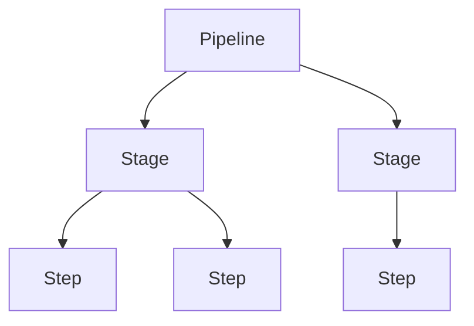

import Tabs from '@theme/Tabs';
import TabItem from '@theme/TabItem';

A Harness pipeline is a workflow that defines a sequence of stages and steps. You can use a pipeline to build and test code, deploy services, run security checks, manage infrastructure, or perform other tasks in a workflow.

This topic introduces the basic pipeline concepts and shows how they fit together.

:::note

All pipeline configurations and examples in this documentation use YAML version v0.

:::

---

## What you will learn from this topic

- How pipelines work in Harness and how to [use them across modules](#pipelines-across-harness-modules)
- How to understand [pipeline structure](#pipeline-structure) including stages, steps, and configuration
- How to [configure pipeline-level settings](#pipeline-configuration) such as inputs, triggers, variables, and notifications
- How to use [additional capabilities](#additional-pipeline-capabilities) like DAG pipelines, chaining, and annotations

---

## Before you begin

- **Harness account and project:** You need access to a Harness account and project. If you are new to Harness, go to [Harness Platform overview](/docs/platform/get-started/overview) to get started.
- **Basic DevOps concepts:** Familiarity with source code, builds, artifacts, deployments, and Git can help you understand pipeline examples.

---

## What is a pipeline?

A pipeline is the top-level workflow in Harness. It contains the stages and steps that define the work you want Harness to perform.

A pipeline can be used to:

- Build and test code.
- Build and publish an artifact.
- Deploy a service or other workload.
- Run security scans.
- Provision and manage infrastructure.
- Run feature flag operations.
- Run other tasks as part of an automated workflow.

A pipeline can contain one or more stages. Each stage contains the logic for one part of the workflow.

---

## Access and permissions

Pipeline access is controlled through Harness role-based access control (RBAC). Your permissions determine which pipeline resources you can view, create, edit, and execute.

For more information, refer to <a href="/docs/platform/role-based-access-control/rbac-in-harness" target="_blank" rel="noopener noreferrer">RBAC in Harness</a>.

---

## Pipelines across Harness modules

Pipelines are a core Harness platform construct used across multiple modules. Depending on the module and stage type, you can build, deploy, provision infrastructure, run security checks, manage databases, operate feature flags, and automate other workflows.

You can combine stages from different modules in a single pipeline when the workflow requires it.

| Module | Typical pipeline use |
|---|---|
| <a href="/docs/continuous-integration" target="_blank" rel="noopener noreferrer">**Continuous Integration (CI)**</a> | Build and test code and publish artifacts. |
| <a href="/docs/continuous-delivery" target="_blank" rel="noopener noreferrer">**Continuous Delivery & GitOps (CD)**</a> | Deploy services and other workloads. |
| <a href="/docs/infra-as-code-management" target="_blank" rel="noopener noreferrer">**Infrastructure as Code Management (IaCM)**</a> | Provision and manage infrastructure through pipeline workflows. |
| <a href="/docs/internal-developer-portal" target="_blank" rel="noopener noreferrer">**Internal Developer Portal (IDP)**</a> | Automate developer workflows and self-service operations. |
| <a href="/docs/software-supply-chain-assurance" target="_blank" rel="noopener noreferrer">**Supply Chain Security (SCS)**</a> | Secure software supply chain workflows through pipelines. |
| <a href="/docs/security-testing-orchestration" target="_blank" rel="noopener noreferrer">**Security Testing Orchestration (STO)**</a> | Run security scans and use scan results in pipeline workflows. |
| <a href="/docs/database-devops" target="_blank" rel="noopener noreferrer">**Database DevOps (DB DevOps)**</a> | Orchestrate database changes through pipeline workflows. |
| <a href="/docs/chaos-engineering" target="_blank" rel="noopener noreferrer">**Chaos Engineering**</a> | Run chaos experiments as steps in supported pipeline stages. |
| <a href="/docs/feature-management-experimentation" target="_blank" rel="noopener noreferrer">**Feature Management & Experimentation (FME)**</a> | Run feature flag operations as part of a pipeline. |

The exact stages and steps available to you depend on the modules enabled for your project and your permissions.

---

## Pipeline storage

Pipelines can be stored in Harness or in your Git repository. Storing pipelines in Git enables version control, code reviews, and collaboration through your existing Git workflows. For more information, refer to <a href="/docs/platform/git-experience/git-experience-overview" target="_blank" rel="noopener noreferrer">Git Experience</a>.

---

## Pipeline studio

Pipeline Studio is the visual editor in Harness where you create and configure pipelines. It provides a drag-and-drop canvas for adding stages and steps, and a YAML editor for advanced configuration. You can switch between visual and YAML views at any time. For more information, refer to <a href="/docs/platform/pipelines/harness-yaml-quickstart" target="_blank" rel="noopener noreferrer">Write pipelines in YAML</a>.

---

## Pipeline structure

A pipeline is the top-level workflow in Harness. It belongs to a project and can span multiple Harness modules.

Each pipeline has:

- A **name** and a unique **identifier** (ID). The ID is set when the pipeline is created and cannot be changed after saving.
- The **organization** and **project** it belongs to.
- One or more **stages**, and each stage contains steps.
- Optional **variables**, **input sets**, **triggers**, **notifications**, and **policy sets**.

## Stages

A stage is a major segment of a pipeline. Stages are often based on workflow milestones such as building, approving, and deploying. Every stage has a type that determines its available settings and steps.

For more information, refer to <a href="/docs/platform/pipelines/add-a-stage" target="_blank" rel="noopener noreferrer">Add a stage</a>.

Each stage has configuration organized across tabs. The tabs available depend on the stage type.

- **Overview**: Name, identifier, description, tags, and stage variables.
- **Infrastructure** (Build and Deploy stages): Where the stage runs. Options include Harness Cloud, a Kubernetes cluster, a VM, or a cloud provider runtime.
- **Execution**: The steps that run inside the stage, arranged on the execution canvas.
- **Advanced**: Looping strategy (matrix, repeat, parallelism), conditional execution (`when`), failure strategy, and delegate selector.

### Stage variables

Stage variables are values defined at the stage level that can be referenced within the stage and in later stages. You can use stage variables to pass data between stages or parameterize stage configuration. For more information, refer to <a href="/docs/platform/pipelines/add-a-stage#stage-variables" target="_blank" rel="noopener noreferrer">Stage variables</a>.

### Services

A service represents the application or workload you want to deploy. Services are primarily used in CD Deploy stages and define what you deploy, including artifacts, manifests, and configuration files. For more information, refer to <a href="/docs/continuous-delivery/get-started/services-and-environments-overview" target="_blank" rel="noopener noreferrer">Services and environments overview</a>.

### Environment and Infrastructure

An environment represents where you deploy your service, such as development, staging, or production. Infrastructure defines the actual target, such as a Kubernetes cluster or cloud provider account, where the deployment runs. For more information, refer to <a href="/docs/continuous-delivery/get-started/services-and-environments-overview" target="_blank" rel="noopener noreferrer">Services and environments overview</a>.

### Execution strategies

Execution strategies determine how Harness deploys your service to the target infrastructure. Common strategies include rolling, canary, and blue-green deployments. Each strategy has different rollout behavior and rollback capabilities. For more information, refer to <a href="/docs/continuous-delivery/manage-deployments/deployment-concepts" target="_blank" rel="noopener noreferrer">Deployment concepts</a>.

### Advanced settings

You can configure advanced settings at both the stage and step level to control execution behavior, handle failures, and integrate with external systems.

#### Conditional execution

Conditional execution lets you skip a stage or step based on the outcome of previous stages or steps, or based on an expression. For example, you can configure a stage to run only when a previous stage succeeds. For more information, refer to <a href="/docs/platform/pipelines/step-skip-condition-settings" target="_blank" rel="noopener noreferrer">Define conditional executions for stages and steps</a>.

#### Looping strategy

Looping strategies allow you to run a stage or step multiple times using matrix, repeat, or parallelism configurations. This is useful for deploying to multiple environments or testing multiple configurations in parallel. For more information, refer to <a href="/docs/platform/pipelines/looping-strategies/looping-strategies-matrix-repeat-and-parallelism" target="_blank" rel="noopener noreferrer">Looping strategies</a>.

#### Failure strategy

A failure strategy defines what Harness does when a stage or step fails, such as retrying the step, marking it as successful, or rolling back changes. You can configure different strategies for different error types. For more information, refer to <a href="/docs/platform/pipelines/failure-handling/define-a-failure-strategy-on-stages-and-steps" target="_blank" rel="noopener noreferrer">Define failure strategies</a>.

#### Send status to Git

The Send Status to Git setting allows Harness to send the stage execution status to your Git provider for pipelines triggered by Git events. This displays the stage status as a check on pull requests and commits. For more information, refer to <a href="/docs/platform/git-experience/git-experience-overview" target="_blank" rel="noopener noreferrer">Git Experience</a>.

---

## Step

A step is a single task within a stage's execution. Steps are the smallest unit of work in a pipeline. Examples include running a shell script, building and pushing a Docker image, deploying a Kubernetes manifest, or sending a Slack notification.

Steps can use inputs, expressions, variables, connectors, secrets, and other configuration depending on the step type.

Each step has:

- A **name** and unique **identifier**.
- A **type** that determines what the step does and what settings it exposes.
- Optional **timeout**, **conditional execution**, and **failure strategy** settings.

Available step types depend on the stage type and the modules you have licensed. For example, the **Run** step is available in CI Build stages, while the **K8s Rolling Deploy** step is available in CD Deploy stages.

Go to the following step references for the steps available in each module:

- <a href="/docs/continuous-integration/use-ci/run-step-settings" target="_blank" rel="noopener noreferrer">CI steps</a>: Steps available in CI Build stages, such as Run, Build and Push, and Git Clone.
- <a href="/docs/continuous-delivery/x-platform-cd-features/cd-steps" target="_blank" rel="noopener noreferrer">CD steps</a>: Steps available in CD Deploy stages, such as Kubernetes, Helm, and Terraform deployment steps.

### Step group

A step group is a collection of steps organized under a single named group. Step groups let you run multiple steps in parallel or sequentially, apply shared failure strategies, and reuse groups as templates. For more information, refer to <a href="/docs/platform/pipelines/use-step-groups" target="_blank" rel="noopener noreferrer">Organize steps in step groups</a>.

---

## Pipeline templates

Pipeline templates let you create reusable pipeline configurations that can be shared across projects and teams. Templates enforce standardization and reduce duplication by defining common pipeline patterns once and using them multiple times. For more information, refer to <a href="/docs/platform/templates/template" target="_blank" rel="noopener noreferrer">Templates</a>.

---

## Pipeline configuration

You can configure pipeline-level settings in addition to stages and steps. The available settings depend on your Harness modules, permissions, and pipeline configuration.

### Inputs and input sets

Inputs allow you to parameterize pipelines with runtime values. Input sets save collections of runtime input values for reuse across multiple executions. For more information, refer to <a href="/docs/platform/pipelines/input-sets" target="_blank" rel="noopener noreferrer">Input sets and overlays</a>.

### Triggers

Triggers start pipelines automatically based on events such as Git commits, pull requests, webhooks, or schedules. You can configure triggers to run pipelines without manual intervention. For more information, refer to <a href="/docs/platform/triggers/triggers-overview" target="_blank" rel="noopener noreferrer">Triggers overview</a>.

### Variables

Variables store and reference values across stages and steps in a pipeline. You can define variables at the pipeline, stage, or step level and use expressions to reference them. For more information, refer to <a href="/docs/platform/variables-and-expressions/add-a-variable" target="_blank" rel="noopener noreferrer">Add and reference variables</a>.

### Notifications

Notifications send alerts on pipeline events such as success, failure, or approval requests. You can send notifications to Slack, email, PagerDuty, or Microsoft Teams. For more information, refer to <a href="/docs/platform/notifications/notifications/notifications" target="_blank" rel="noopener noreferrer">Notifications</a>.

### Flow control

Flow control features let you coordinate execution across stages and steps. This includes barriers for synchronizing parallel stages, conditional execution for skipping stages based on conditions, and looping strategies for running stages multiple times. For more information, refer to <a href="/docs/platform/pipelines/barriers" target="_blank" rel="noopener noreferrer">Barriers</a>.

### Execution settings

Execution settings configure pipeline-level defaults such as timeouts, concurrency limits, and execution behavior. These settings apply to all stages unless overridden at the stage level. For more information, refer to <a href="/docs/platform/pipelines/pipeline-settings" target="_blank" rel="noopener noreferrer">Pipeline settings</a>.

### Policy sets

Policy sets enforce governance rules on pipelines using Open Policy Agent. You can define policies that validate pipeline configuration, control deployments, and enforce organizational standards. For more information, refer to <a href="/docs/platform/governance/policy-as-code/harness-governance-overview" target="_blank" rel="noopener noreferrer">Harness governance overview</a>.

### Advanced configurations

The Advanced Options panel in Pipeline Studio provides additional pipeline-level settings for timeout, stage execution, re-run behavior, and access control.

- **Pipeline timeout**: Set a maximum execution time for the entire pipeline.
- **Selective stage execution**: Allow users to select which stages to run during manual execution.
- **Re-run settings**: Control whether input data is editable when re-running a failed pipeline.
- **Delegate selector**: Specify which delegates can execute the pipeline using delegate tags and selectors.
- **Public access**: Mark a pipeline for public viewing without requiring authentication.

For more information, refer to <a href="/docs/platform/pipelines/pipeline-settings" target="_blank" rel="noopener noreferrer">Pipeline settings</a>.

---

## Additional pipeline capabilities

Advanced pipeline features provide additional capabilities for complex workflows and enterprise requirements.

### Analytics

Pipeline analytics provide visibility into pipeline performance, success rates, execution times, and resource usage. You can use dashboards and reports to track trends and identify bottlenecks. For more information, refer to <a href="/docs/platform/dashboards/dashboards-overview" target="_blank" rel="noopener noreferrer">Dashboards</a>.

### Execution history

Execution history shows all past runs of a pipeline, including status, duration, inputs, and logs. You can view, compare, and re-run previous executions from the history view. For more information, refer to <a href="/docs/platform/pipelines/executions-and-logs/view-and-compare-pipeline-executions" target="_blank" rel="noopener noreferrer">View and compare pipeline executions</a>.

### DAG pipelines

DAG pipelines use directed acyclic graphs to define stage dependencies and execution order. Instead of sequential or parallel execution, you can specify exactly which stages must complete before others start. For more information, refer to <a href="/docs/platform/pipelines/dag-pipelines" target="_blank" rel="noopener noreferrer">DAG pipelines</a>.

### Pipeline chaining

Pipeline chaining lets you run one pipeline as a stage inside another pipeline. This allows you to break complex workflows into smaller reusable pipelines and control execution order between them. For more information, refer to <a href="/docs/platform/pipelines/pipeline-chaining" target="_blank" rel="noopener noreferrer">Pipeline chaining</a>.

### Annotations

Annotations let you publish custom summaries and reports to a dedicated Annotations tab in the pipeline execution view. You can use annotations to surface test results, security scan findings, or deployment notes. For more information, refer to <a href="/docs/platform/pipelines/harness-annotations" target="_blank" rel="noopener noreferrer">Pipeline annotations</a>.

### Reconciliation

Reconciliation updates a pipeline when a referenced entity such as a template, environment, or service changes. Harness prompts you to reconcile the pipeline so it reflects the updated entity. For more information, refer to <a href="/docs/platform/templates/template" target="_blank" rel="noopener noreferrer">Templates</a>.

---

## FAQs and Troubleshooting

- <a href="/docs/platform/pipeline-faq" target="_blank" rel="noopener noreferrer">Pipeline FAQs</a>: Browse common questions about pipeline configuration, triggers, templates, variables, and API usage.
- **Troubleshoot pipelines**: For more information, refer to <a href="/docs/platform/pipelines/troubleshoot-pipeline-executions" target="_blank" rel="noopener noreferrer">Troubleshoot pipeline executions</a>.

---

## Next steps

- <a href="/docs/platform/pipelines/harness-yaml-quickstart" target="_blank" rel="noopener noreferrer">Quickstart: Create your first pipeline</a>: Follow a step-by-step walkthrough to create and run a pipeline in the visual editor.
- <a href="/docs/platform/pipelines/harness-yaml-quickstart" target="_blank" rel="noopener noreferrer">Write pipelines in YAML</a>: Explore the full YAML schema for pipelines, stages, steps, triggers, and input sets.
- <a href="/docs/platform/pipelines/add-a-stage" target="_blank" rel="noopener noreferrer">Add a stage</a>: Learn how to add and configure different stage types in your pipeline.
- <a href="/docs/platform/pipelines/troubleshoot-pipeline-executions" target="_blank" rel="noopener noreferrer">Troubleshoot pipeline executions</a>: Diagnose and resolve common execution, delegate, trigger, and YAML issues.
