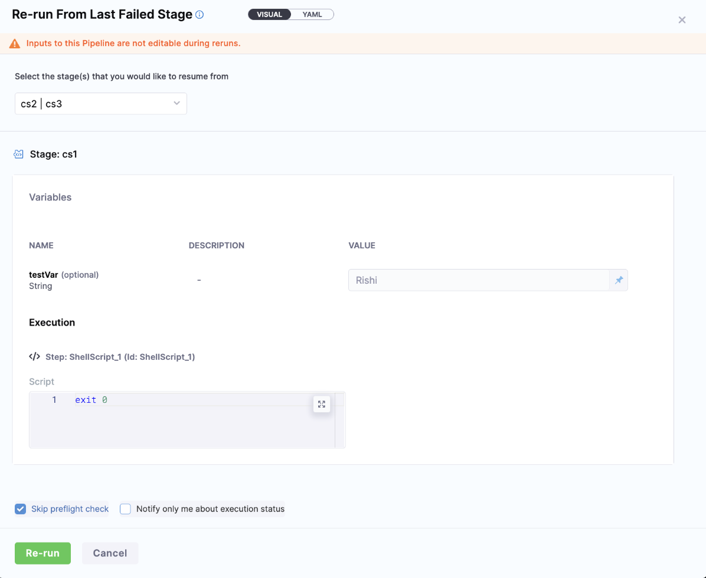

You can configure your pipelines to have no Input change during re-run. This allows you to have consistency in re-run behavior, especially in pipelines where input changes should be restricted after the initial execution.

## How to Enable Fixed Inputs on Re-Run?

To enable the feature where input data remains uneditable during a pipeline re-run, follow these steps:

1. Go to your Pipeline
Navigate to the pipeline where you want to enable this feature.

2. Select **Advanced Options** in Pipeline Settings
In the pipeline settings, click on **Advanced Options**.

3. Locate **Re-Run Settings**
Under the **Re-Run Settings** section, you’ll see an option labeled **Is Input Data uneditable when rerunning?**.

4. Select **Yes**
Set this option to **Yes** to make the input data uneditable during re-runs.


Once you have selected Yes, the following field will automatically be added to your pipeline YAML:

```yaml
fixedInputsOnRerun: true
```
:::important note
The [setting’s](#how-to-enable-fixed-inputs-on-re-run) value is always determined based on the latest version of the pipeline YAML, not the YAML used during the original execution. This means that if you modify the **Is Input Data uneditable when rerunning?** setting after the first execution, the change will take effect during the re-run, even if the original execution had a different configuration.
:::
## Re-Run Pipeline
Once you have enabled this setting, this feature is applicable for all re-run type:-
:::info note
You will see a banner at top **Inputs to this Pipeline are not editable during reruns.**, which states that you won't be able to change the inputs for this pipeline.
:::
1. **Re-Run Pipeline**

2. **Re-run from Specific Stage**

3. **Re-run from Last Failed Stage**

### Pipeline Templates
In case of Pipeline templates, you will be able to enable above [setting](#how-to-enable-fixed-inputs-on-re-run) while creating pipeline templates. 
You cannot add this setting in the pipeline where you are using the pipeline template.
### Remote Pipelines
In case of remote pipelines, the behaviour will be same as Inline. We only need to enable the above [setting](#how-to-enable-fixed-inputs-on-re-run).
### Pipeline Chaining
If the **Is Input Data uneditable when rerunning?** option in the parent pipeline is set to **No**, the inputs in the child pipeline will remain editable, even if the child pipeline has the **Is Input Data uneditable when rerunning?** option set to Yes. In other words, the parent pipeline's settings override the child pipeline’s re-run input editability, allowing inputs to be modified in the child pipeline during a re-run.
### API Call Behavior
When the above [setting](#how-to-enable-fixed-inputs-on-re-run) is enabled, the [API call to Re-run](https://apidocs.harness.io/tag/Pipeline-Execution#operation/rerun-stages-execution-of-pipeline) the pipeline ignores any inputs provided. Normally, on re-runs, the inputs are sent again in the API call. However, with this setting enabled, even if inputs are provided, they will be ignored, and the inputs from the original execution will be used.