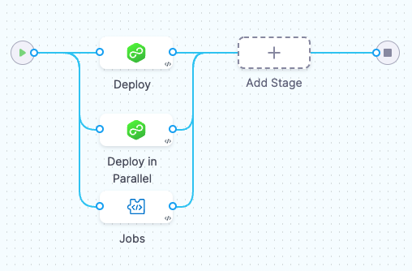
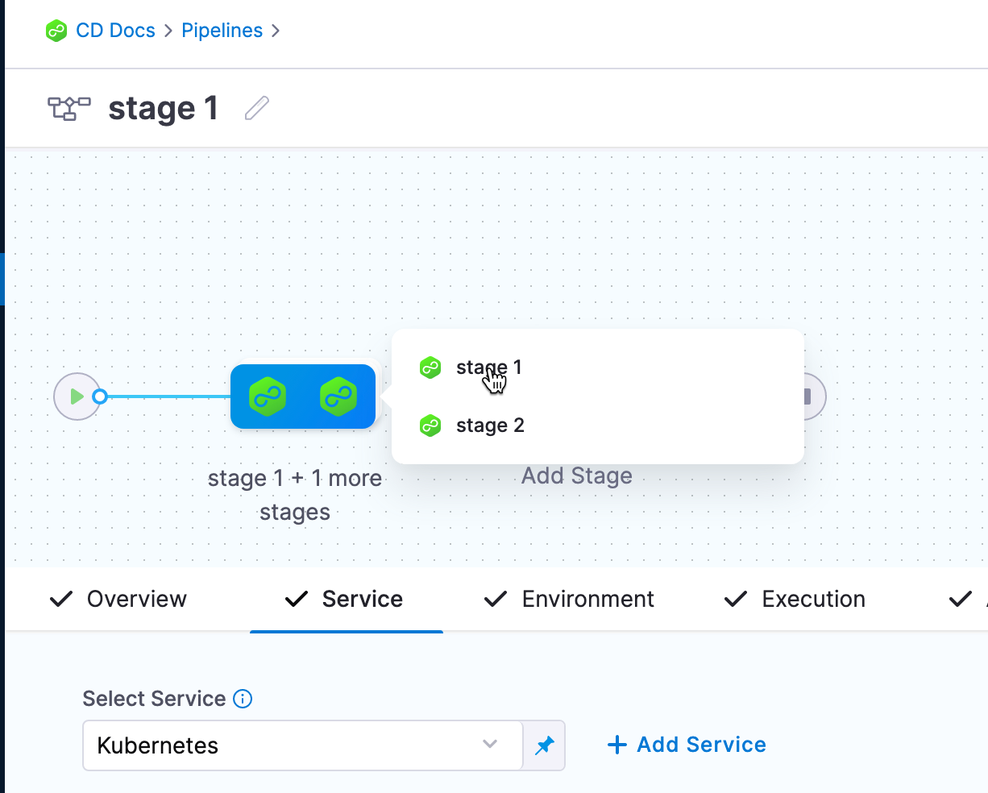

You can run stages in parallel when you want to perform parallel operations. For example:

- In [CI stages](/docs/continuous-integration/use-ci/prep-ci-pipeline-components#stages), parallel execution of builds and tests can speed up the integration process, reduce test time, and provide faster feedback to developers.
- In [CD stages](/docs/continuous-delivery/get-started/key-concepts#stage), parallel execution of deployments can help reduce deployment times and increase the efficiency of the process.
- in [Infrastructure as Code (IaC)](https://www.harness.io/products/infrastructure-as-code-management), parallel execution of IaC scripts can speed up the creation of resources and improve the scalability of infrastructure.

To run stages in parallel, [add stages](add-a-stage.md) to your pipeline, and then arrange the stages to run in parallel.

```mdx-code-block
import Tabs from '@theme/Tabs';
import TabItem from '@theme/TabItem';
```
```mdx-code-block
<Tabs>
  <TabItem value="Visual" label="Visual editor" default>
```

In the Visual editor, you can drag-and-drop stages to arrange them in parallel.



Once grouped in parallel, you can hover over the parallel group and select the stage you want to inspect or edit.



```mdx-code-block
  </TabItem>
  <TabItem value="YAML" label="YAML editor">
```

In the YAML editor, indent the stages under a `parallel` flag.

```yaml
stages:
    - parallel: ## Stages indented under this flag will run in parallel.
        - stage:
          ...
        - stage:
          ...
    - stage: ## This stage is not in the parallel group.
```

```mdx-code-block
  </TabItem>
</Tabs>
```

:::info Deployment stages

In Continuous Delivery, a [resource constraint](/docs/continuous-delivery/manage-deployments/deployment-resource-constraints/) step is added to every stage automatically to make sure that you are not using two infrastructures simultaneously. Hence, one parallel stage executes first. Once the execution of the first stage finishes, the other stage(s) will start.

You can [deploy multiple services to multiple environments in a single deployment stage](/docs/continuous-delivery/x-platform-cd-features/advanced/multiserv-multienv/); however, running multi-service stages in parallel deploys each service to each environment in parallel. This can become complicated. For such use cases, Harness recommends using separate stages.

:::
