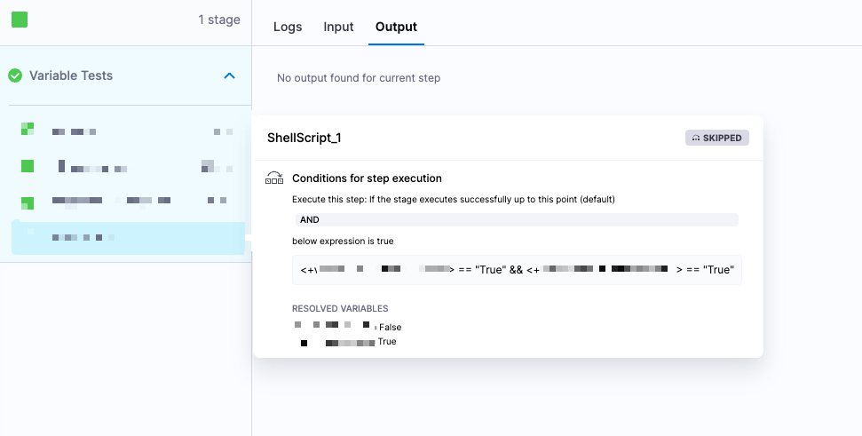
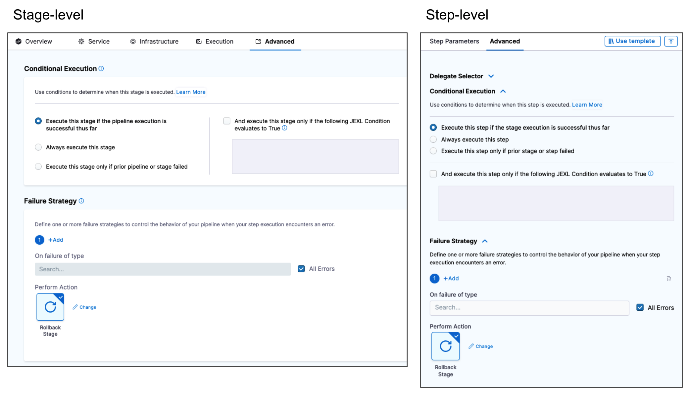

Conditional executions specify when a stage or step should run. For example, you can specify that a particular stage should run only if the prior pipeline or stage failed.

Conditional executions and [failure strategies](/docs/platform/pipelines/failure-handling/define-a-failure-strategy-on-stages-and-steps) are powerful tools you can use to make your pipelines more dynamic and responsive to failures. You can use them individually or together. For example, you can [check if a cache was restored and then install dependencies if the cache *was not* restored](/docs/continuous-integration/use-ci/caching-ci-data/run-if-no-cache).

## Configure conditional executions

In Harness, conditional executions are *when* conditions that can be broad, such as *always execute this stage/step*, or refined by specific [JEXL](https://commons.apache.org/proper/commons-jexl/) conditions.

You can configure conditional executions for:

* **Stages:** A stage's conditional execution settings apply to all steps in that stage that don't have their own step-level conditional execution settings.
  * If you use [pipeline chaining](/docs/platform/pipelines/pipeline-chaining), you can configure conditional executions for child pipelines.
* **Steps:** A step's conditional execution settings overrides the stage's conditional execution settings.
* **Step groups:** A step group's conditional execution determines when to run that step group. Step group conditional execution settings apply to all steps in the group, and you can apply step-level conditional executions to steps within the group.

For details about how Harness prioritizes stage and step conditional executions, go to [Prioritization and handling](#prioritization-and-handling).

### Add a stage conditional execution

The stage conditional execution applies to all steps in the stage that do not have their own conditional execution configured.

Here's an example of a stage conditional execution that runs if the pipeline has executed successfully so far and the build type is PR.

```yaml
    when:
      pipelineStatus: Success
      condition: <+codebase.build.type>=="PR"
```

To add a stage conditional execution:

1. In your pipeline, select the [stage](/docs/platform/pipelines/add-a-stage) where you want to add the conditional execution.
2. Select the **Advanced** tab.
3. Under **Conditional Execution**, select a broad condition for when you want to execute the stage:

   * **If the pipeline executes successfully up to this point (default):** Run this stage if all previous stages in the pipeline were successful. This is the default and most commonly used setting.
   * **If the previous pipeline or stage fails:** Run this stage only if the prior stage or [chained pipeline](/docs/platform/pipelines/pipeline-chaining) failed.
   * **Always:** Run this stage regardless of the status of prior stages or pipelines.

4. You can add [JEXL](https://commons.apache.org/proper/commons-jexl/) conditions to further refine the conditional execution requirements. To do this, select **And execute this stage only if the following JEXL Condition evaluates to true**, and then enter your JEXL condition.

   The stage runs if both the broad condition AND your JEXL condition evaluate to *true*.

   Your JEXL condition can include [Harness expressions and variables](#variables-and-expressions-in-conditional-execution-settings), including the output of previous steps. For example:

   * `<+pipeline.stages.STAGE_ID.spec.execution.steps.STEP_ID.status> == "SUCCEEDED"`
   * `<+environment.name> != "QA"`
   * `<+variable.Boolean1> == "True" && <+variable.Boolean2> == "True"`

### Add a step conditional execution

A step's conditional execution settings overrides the stage's conditional execution settings.

Here's an example of a step conditional execution that runs if the stage has executed successfully so far and the build type is PR.

```yaml
    when:
      stageStatus: Success
      condition: <+codebase.build.type>=="PR"
```

To add a step conditional execution:

1. In your pipeline, edit the step where you want to add the conditional execution.
2. Select the **Advanced** tab.
3. Under **Conditional Execution**, select a broad condition for when you want to execute the step:

   * **If the stage executes successfully up to this point (default):** Run this step if all previous steps in the stage were successful. This is the default and most commonly used setting.
   * **If the previous step fails:** Run this step only if the prior step failed.
   * **Always:** Run this step regardless of the status of prior steps.

4. You can add [JEXL expressions](http://commons.apache.org/proper/commons-jexl/reference/examples.html) to further refine the conditional execution requirements. To do this, select **And execute this step only if the following JEXL Condition evaluates to true**, and then enter your JEXL condition.

   The step runs if both the broad condition AND your JEXL condition evaluate to *true*.

   Your JEXL condition can include [Harness expressions and variables](#variables-and-expressions-in-conditional-execution-settings), including the output of previous steps. For example:

   * `<+pipeline.stages.STAGE_ID.spec.execution.steps.STEP_ID.status> == "SUCCEEDED"`
   * `<+environment.name> != "QA"`
   * `<+variable.Boolean1> == "True" && <+variable.Boolean2> == "True"`

### Remove conditional executions

To clear a stage, step, or step group's conditional execution settings, go to the **Conditional Execution** settings (on the stage/step **Advanced** tab) and select **Reset**.

### Conditional executions as runtime input

You can also define stage, step group, and step conditional executions settings at runtime by configuring them as [runtime inputs](/docs/platform/variables-and-expressions/runtime-inputs).

To do this, go to the **Conditional Execution** settings where you want to configure a condition to be specified at runtime, select the **Thumbtack** icon, and change the input type to **Runtime Input**.

When you run the pipeline, you'll be prompted to define the conditional execution settings for that run.

Due to the potential complexity of JEXL expressions in conditional executions, [input sets](/docs/platform/pipelines/input-sets) are useful for conditional executions as runtime input. Input sets contain pre-defined runtime inputs that you select at runtime. This eliminates the need to manually enter the entire conditional execution each time.

## Variables and expressions in conditional execution settings

In conditional execution settings, your JEXL conditions can include [Harness expressions and variables](/docs/platform/variables-and-expressions/harness-variables), including the output of previous steps.

### Values must be available at evaluation time

The variables and expressions in a JEXL condition must be resolved before the point at which the condition is evaluated.

Conditional execution settings determine whether to run a stage; therefore, a conditional execution can't rely on a variable that isn't resolved until the stage runs.

For example, for a stage conditional execution, the values required for the variables/expressions in the JEXL condition must have been resolved prior to the start of that stage. If the JEXL condition references, for example, a value from a step within the stage, Harness can't resolve the value and the condition can't be evaluated (or evaluates with a `null` value).

### Comparing strings to Booleans

Comparing strings to Booleans always evaluates to `true` unless the string is literally the word `false`.

### Referencing pipeline, stage, and step statues

The status values for pipelines, stages, and steps are Java enums. You can find the list of values in the **Status** filter on the execution, deployment, or build history page.


You can reference these status values in your JEXL conditions. These expressions must reference stages or steps that have already executed at [evaluation time](#values-must-be-available-at-resolution-time).

* **Stage status:** To get a stage's status, use the the expression `<+pipeline.stages.STAGE_ID.status>`, such as:

   ```yaml
   <+pipeline.stages.somestage.status> == "FAILED"
   ```

* **Step status:** To get a step's status, use the expression `<+pipeline.stages.STAGE_ID.spec.execution.steps.STEP_ID.status>`, for example:

   ```yaml
   <+pipeline.stages.somestage.spec.execution.steps.somestep.status> == "FAILED"
   ```

## Prioritization and handling

The hierarchy for conditional execution settings is as follows:

1. **Stage:** Stage-level conditional execution settings determine when a stage should run. If triggered, the step and step groups in the stage start running.
2. **Step group:** Step group-level conditional execution settings determine when a step group should run. If triggered, the steps in the group start running.
3. **Step:** Step-level conditional execution settings determine if individual steps should run. Step conditions are evaluated after stage and step group conditions. This means that step-level conditional execution settings effectively override the stage and step group conditional execution settings. For example, if a stage-level condition evaluates to true and causes a stage to run, each individual step-level condition within that stage is evaluated separately to determine if each individual step should run.

### Important note

For users setting a JEXL Boolean condition, it is important to remember that a conditional that evaluates false will result in a skipped step or stage.  

This will still show a step or stage as completed successfully.


Depending on the situation, this might be the desired effect. Otherwise, you should [implement a failure strategy for the step/stage](/docs/continuous-delivery/x-platform-cd-features/executions/step-failure-strategy-settings.md).
### Failure strategies take precedence over conditional executions

Your stages and steps can include both conditional executions and [failure strategies](/docs/platform/pipelines/failure-handling/define-a-failure-strategy-on-stages-and-steps).



When using these settings together in multiple stages, you must consider how they could interact.

For example, assume you have a pipeline with two stages: `stage1` and `stage2`. Assume `stage2` has a **Conditional Execution** set to **Execute this stage only if prior pipeline or stage failed**, and `stage1` has a **Failure Strategy** set to **Rollback Stage** on **All Errors**. With this configuration, if `stage1` has any error, it rolls back and it isn't marked as failed; therefore, the **Conditional Execution** for `stage2` isn't triggered and `stage2` doesn't run. To get `stage2` to run, you can set the **Failure Strategy** for `stage1` to **Ignore Failure**. This causes the pipeline to proceed (instead of rolling back) when `stage1` fails, and, since `stage1` is now marked as failed, the **Conditional Execution** for `stage2` is triggered and `stage2` runs.

If you want to run particular steps when a stage fails, make sure you add those steps to the stage's **Rollback** failure strategy settings. Typically, you don't want a rollback to continue when there is an error. However, if you want to force a step to run whether or not the rollback fails, include the required step in the stage's **Rollback** settings, configure the required step's conditional execution to **Always**, and then set the preceding step's failure strategy to **Mark as failure** for **All errors**. This ensures the required step runs even if the previous step fails.
