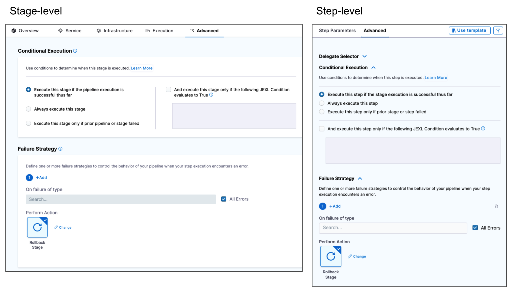
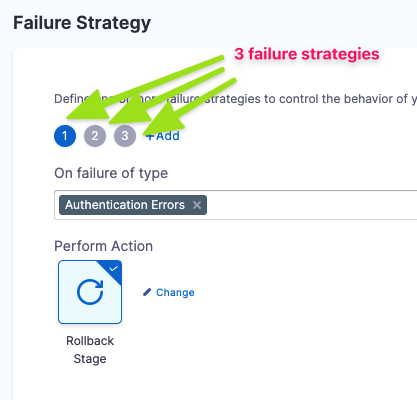

This topic describes the failure strategy settings for pipeline steps and stages.

### Where can I add failure strategies?

You can apply a failure strategy to the following:

* **Step:** This failure strategy overrides (or enhances) the stage failure strategy.
* **Step Group:** You can set up a failure strategy for all steps in the group. Individual steps in the group don't have a failure strategy.
* **Stage:** The failure strategy for all steps and step groups in the stage. If step and step group failure strategies exist, they override this failure strategy.
* **Pipeline:** You can set up a failure strategy for all stages in a pipeline. The pipeline rolls back if any of the stages in the pipeline fails. For more information, go to [Define a failure strategy on pipelines](../define-a-failure-strategy-for-pipelines.md).

For more information, go to [Define a failure strategy on stages and steps](../define-a-failure-strategy-on-stages-and-steps.md).

### Error types

The following error types can be selected in a failure strategy.

| **Error Type** | **Description** |
| :--- | :--- |
| **Authentication Errors** | Credentials provided in a connector are not valid. Typically, the Harness secret used for one of the credentials is incorrect. If Harness cannot determine if an error is authentication and authorization, it is treated as an authentication error. |
| **Authorization Errors** | The credentials are valid but the user permissions needed to access the resource are not sufficient. If Harness cannot determine if an error is authentication and authorization, it is treated as an authentication error. |
| **Connectivity Errors** | A Harness delegate cannot connect to a specific resource. For example, the delegate cannot connect to repository or VM or Secrets Manager. |
| **Delegate Provisioning Errors** | No available delegate can accomplish the task, or the task is invalid. For example, if an HTTP step attempts to connect to a URL but there is no available delegate to perform the task. |
| **Timeout Errors** | A Harness delegate fails to complete a task within the timeout setting in the stage or step. For example, if the Kubernetes workload you are deploying fails to reach steady state within the step timeout. |
| **Unknown Errors** | Errors that don't fall into any other category. This includes Harness application errors. |
| **Verification Failures** | A Harness Continuous Verification step fails. |
| **Policy Evaluation Failures** | An Open Policy Evaluation (OPA) applied on a step fails. |
| **Execution-time Inputs Timeout Errors**| A step times out when running a pipeline due to the unavailability of a runtime input. |
| **Approval Rejection** | An approval step is rejected. You can select specific failure strategies for approval rejection across steps and stages. |
| **Delegate Restart** | An error triggered when the delegate is unreachable when running a pipeline. |
| **All Errors** | An error whether defined by the other error types or not. |

### Error scope

The scope of a failure strategy is confined to where it is set.

For example, a failure strategy set on a step doesn't impact the failure strategy set on a stage. Likewise, the failure strategy set at the stage doesn't override any failure strategies on its steps.

### Rollback stage

Both step and stage failure strategies include the **Rollback Stage** action option. There is no rollback step option.

### Failure strategy settings

The following table lists the failure strategy actions and how they work at the step, step group, and stage levels.

These actions can be applied to the failure strategy as primary action and timeout action.

| **Action** | **Step** | **Step Group** | **Stage** |
| :--- | :--- | :--- | :--- |
| **Manual Intervention** | A Harness user can perform a manual intervention when the error type occurs. There are several options to select from: <li> **Mark as Success**</li><li>**Ignore Failure**</li><li>**Retry**</li><li>**Abort**</li><li>**Rollback Stage**</li>Harness pauses the pipeline execution when waiting for manual intervention. The pipeline execution state appears as **Paused**. | Same as step. | Same as step, but applies to all steps. |
| **Mark as Success** | The step is marked as **Successful** and the stage execution continues. | Same as step. | The failed step is marked as **Successful** and the pipeline execution continues. |
| **Ignore Failure** | The stage execution continues. The step is marked as **Failed**, but rollback is not triggered. | Same as step. | Same as step. |
| **Retry Step** | Harness retries the execution of the failed step automatically. You can set **Retry Count** and **Retry Intervals**. | Same as step. | Same as step. |
| **Retry Step Group** | N/A | Harness will retry the execution of the complete step group automatically, from the beginning. You can set **Retry Count** and **Retry Intervals**. | N/A |
| **Abort** | Pipeline execution is aborted. If you select this option, no timeout is needed. | Same as step. | Same as step. |
| **Rollback Stage** | The stage rolls back to the state prior to stage execution. How the stage rolls back depends on the type of build or deployment it was performing. | Same as step. | Same as step. |
| **Rollback Step Group** | N/A | The step group rolls back to the state prior to step group execution. How the step group rolls back depends on the type of build or deployment it was performing. | N/A |
|**Mark As Failure**|Harness marks the step as **Failed**.|Harness marks the step group as **Failed**.|Harness marks the stage as **Failed**.|

:::info note
The **Retry Step Group** failure strategy is behind the feature flag `PIE_RETRY_STEP_GROUP`. Contact [Harness Support](mailto:support@harness.io) to enable the feature.
:::

### Failure strategy takes precedence over conditional execution

Harness pipeline stages and steps both include **Conditional Execution** and **Failure Strategy** settings.

Using these settings together in multiple stages require some considerations.

For example, you have a pipeline with two stages: **stage 1** followed by **stage 2**. 

The **Conditional Execution** of stage 2 is set to **Execute this step only if prior stage or step failed**. The **Failure Strategy** of stage 1 is set to **Rollback Stage on All Errors**.

If stage 1 has any error, it is rolled back. It is not considered a failure. Hence, the **Conditional Execution** of stage 2 is not executed.

To execute stage 2, you can set the stage 1 **Failure Strategy** to **Ignore Failure**. In this case, rollback will not occur, and the **Conditional Execution** of stage 2 is executed.

In general, if you want to run particular steps on a stage failure, you should add them to stage's **Rollback** section.

### Stage, step, and step group priority

The stage failure strategy applies to all steps that do not have their own failure strategy. A step's failure strategy takes precedence over a step group's failure strategy, which takes precedence over a stage's failure strategy.

Step failure strategies are evaluated before step group's and stage's failure strategy. 

The order of the steps determines which failure strategy is evaluated first.

If the step is not part of a step group, and the first step in the execution doesn't have a failure strategy, the stage's failure strategy is used. If the second step has its own failure strategy, it is used. And so on.

### Multiple failure strategies in a stage

A stage can have multiple failure strategies.

When using multiple failure strategies in a stage, consider the following:

* For failure strategies that don't overlap (different types of failures selected), they behave as expected.
* Two failures cannot occur at the same time. Whichever error occurs first, that failure strategy is used.

### Failure strategy conflicts

Conflicts might arise between failure strategies on the same level or different levels. By level, we mean the step level or the stage level.

#### Same level

If there is a conflict between multiple failures in strategies on the same level, the first applicable strategy is used and the remaining strategies are ignored.

For example, consider these two strategies:

1. Abort on verification failure or authentication failure.
2. Ignore on verification failure or connectivity error.

Here is what will happen:

* On a verification failure, the stage is aborted.
* On an authentication failure, the stage is aborted.
* On a connectivity error, the error is ignored.

#### Different levels

If there is a clash between selected errors in strategies on different levels, the step-level strategy is used and the stage-level strategy is ignored.

### Reference material

* [Stage and Step Execution Condition Settings](step-skip-condition-settings.md)

