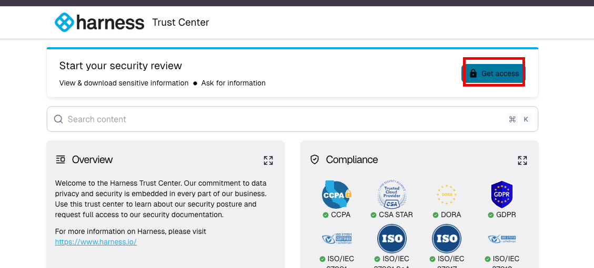
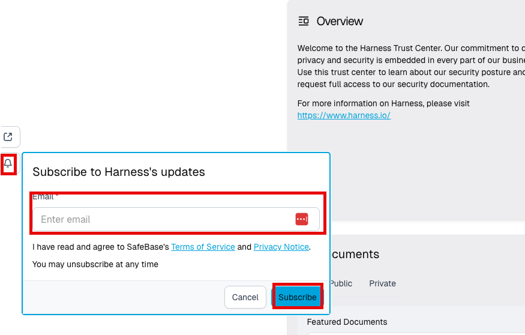

Harness supports allowlisting of its SaaS infrastructure IPs to enable secure access to private networks. This is helpful when you want to connect Harness to internal systems such as Kubernetes clusters, artifact repositories, SCMs, or other internal services.

:::info Private Network Connectivity Options
For Harness Cloud users, see [Private network connectivity options](/docs/platform/references/private-network-connectivity) for a comprehensive guide to all available connectivity options including IP allowlisting and enterprise networking solutions.
:::

We recommend [contacting Harness Support](https://support.harness.io/) to receive the correct list of IPs and guidance based on your use case, region, and Harness modules in use.

## Outbound Access Requirements

Harness Delegates typically only require outbound access to the following domains:

- `app.harness.io` is the Primary Harness platform endpoint.  You may need to include one additional endpoint depending on the cluster for your account. You can verify this by going to your Account Settings -> Account Details, in the Harness Cluster field.
    | Cluster      | URL Format               |
    |--------------|--------------------------|
    | Prod1        | `app.harness.io`         |
    | Prod2        | `app.harness.io`         |
    | Prod3        | `app3.harness.io`        |
    | Prod0/Prod4  | `accounts.harness.io`    |
    | EU clusters  | `accounts.eu.harness.io` |

- `logging.googleapis.com` – (Optional) Used to send logs to Harness Support. This can be disabled using the `STACK_DRIVER_LOGGING_ENABLED` environment variable. [Learn more](/docs/platform/delegates/delegate-reference/delegate-environment-variables/#stack_driver_logging_enabled).

## Allowlisting Harness IPs

To connect securely from Harness to your internal infrastructure — such as for:

- Pipeline execution using Harness Cloud

- Deployments via GitOps agents

- Feature Flags / Feature Management & Experimentation .  Customers may also want to consider setting up a Feature Flag Proxy.

- Hosted builds (Linux/macOS)

- Internal APIs or SCM access

You may need to allowlist specific IP ranges based on the Harness services you're using.

### Sign up for access to the Harness Security Trust Center
Customers can access the IP allowlist by signing up to an account on our `trust.harness.io` website.
1. Go to [the Harness Security Trust Center](https://trust.harness.io/).
2. Click on `Get Access` in the upper right corner to set up a sign in
   
3. Enter your email address and click `continue`.  Agree to the NDA.  
4. An email will be sent to your email address with sign-in instructions

## Locating the IP Allowlist
The IP allowlist is located in the Product Security section of the Trust Center. Harness provides region- and service-specific IPs for allowlisting. These are not publicly listed to avoid misuse.

1. Click on the `Product Security` section
2. Search for the `Harness IPs` document

:::note
If after signing up for an account on `trust.harness.io` you do not see the IP Allowlist, please reach out to [Harness Support](https://support.harness.io/) and we will be glad to provide the correct security for access.
:::

## Retrieve Allowlisted IPs for Harness Cloud via API

Use this API to retrieve the list of IP addresses and CIDR ranges you can allowlist for outbound connections made by tasks executed in Harness Cloud.
For example, when your pipelines run build or test steps on Harness Cloud infrastructure, outbound connections (such as to artifact registries or external services) originate from these IPs.

:::info Scope
This API applies to Harness Cloud build infrastructure managed by Harness.  
If you run builds on self-managed delegates or custom runners, egress IPs are determined by your own infrastructure rather than Harness.
:::

### Prerequisites

- [A Harness API key](/docs/platform/automation/api/add-and-manage-api-keys/) with permissions to call Harness Cloud APIs.
- Your Harness account identifier.

### Endpoint

**Method:** `GET`  
**Path:** `/gateway/ci/ips/allowlist`  
**Query Params:**  
- `accountIdentifier` (string): your Harness account ID

**Header:**  
- `X-API-KEY: <YOUR_API_KEY>`

#### cURL example showing Harness CI

```bash
curl --location --request GET \
  'https://app.harness.io/gateway/ci/ips/allowlist?accountIdentifier=<YOUR_HARNESS_ACCOUNT_ID>' \
  --header 'X-API-KEY: <YOUR_API_KEY>'
```

#### Sample response for Harness CI

```json
{
  "status": "SUCCESS",
  "data": {
    "ipAddresses": [
      "34.102.159.101",
      "127.0.0.3",
      "127.0.0.2"
    ]
  },
  "metaData": null,
  "correlationId": "fcfff224-052a-4196-9aa0-aec8d1fd8811"
}
```

:::note Free tier behavior
Free tier customers receive an empty list in `data.ipAddresses`.
:::

#### Response schema

| Field              | Type          | Description                                     |
| ------------------ | ------------- | ----------------------------------------------- |
| `status`           | string        | Overall request status.                         |
| `data.ipAddresses` | string[]      | IPs or CIDRs to allowlist for Harness Cloud egress. |
| `metaData`         | object | null | Reserved for future use.                        |
| `correlationId`    | string        | ID for support and troubleshooting.             |

### Common uses

* Add these IPs to firewalls or security groups that protect:

  * Git hosts and SCM webhooks
  * Artifact registries
  * Internal package repositories
  * Other services your builds must reach

### Troubleshooting

* **401 or 403:** Verify the API key is valid and has access to Harness Cloud APIs. Confirm header name is `X-API-KEY`.
* **Empty `ipAddresses`:** This is expected for Free tier accounts.
* **Self-managed runners:** If you run builds via your own delegates or runners, allowlist the egress IPs of your infrastructure instead. The API above returns IPs only for Harness Cloud.

### Keeping Updated on changes to the IP Documentation
Harness provides a method to subscribe to all updates in the Harness Trust Center.  
1. Click on the Notification Bell on the right side of the website
2. Subscribe to updates for the Harness Security Trust Center by adding your email and clicking `Subscribe`
   

## Configure clusters

To ensure proper functionality, configure your clusters with API access to the authorized Harness IP addresses.

If you have not yet configured your clusters with the required IP addresses, use the links provided below to complete the configuration for the listed clusters.

- [GKE (Google Kubernetes Engine)](https://cloud.google.com/kubernetes-engine/docs/how-to/authorized-networks)
- [EKS (Amazon Elastic Kubernetes Service)](https://repost.aws/knowledge-center/eks-lock-api-access-IP-addresses)
- [AKS (Azure Kubernetes Service)](https://learn.microsoft.com/en-us/azure/aks/api-server-authorized-ip-ranges)

