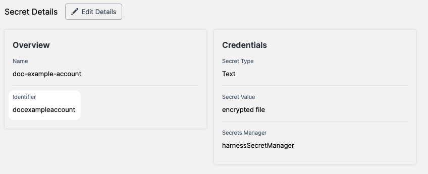

Harness entities and resources include a unique **identifier** (entity ID) that remains immutable once the entity is created. These identifiers provide a consistent way to reference entities, ensuring stability even if the entity's name changes.

---

## Overview of Entity Identifiers

- **Immutability:** Once created, an identifier cannot be changed, even if the entity name is modified.  
- **Purpose:** Identifiers ensure consistent referencing across entities, avoiding issues with name-based changes.  
- **Automatic Generation:** Harness generates identifiers based on the entity name, following specific naming rules.  

---

## Identifier Limits and Requirements

### Identifier Creation

- **Automatic Generation:** When you name an entity, Harness generates its identifier.  
- **Editable During Creation:** You can modify the identifier during entity creation but not after saving it.  
- **Stability on Rename:** Renaming the entity doesn’t affect the identifier.  
- **Conflict Resolution:** If an identifier is already in use, Harness appends a suffix (e.g., `-1`, `-2`) to ensure uniqueness.

### Usage of Identifiers

Harness entities rely on **identifiers** for consistent interaction and referencing. These identifiers are designed to be immutable, ensuring the stability of relationships between entities.

#### Why Identifiers Are Immutable
- **Preserving Relationships:** Identifiers cannot be changed after creation because they are used by other entities to establish and maintain links.
- **Impact of Deletion or Duplication:** If you delete an entity or create a duplicate with a new identifier, existing references to the original identifier are not automatically updated.  

#### Example Scenario
- A Trigger uses the `pipelineIdentifier` field to link to a specific Pipeline.  
- If the original Pipeline is deleted or replaced by a copy with a new identifier:
  - The Trigger will lose its link to the Pipeline.
  - This breaks the Trigger's functionality, as it can no longer reference the deleted Pipeline.

By keeping identifiers immutable, Harness ensures reliable and consistent interactions between entities, avoiding issues caused by changes or deletions.


---

## Identifier Naming Rules

Identifiers must adhere to the following restrictions:  
- **Characters:**
  - Must start with `a-z`, `A-Z`, or `_`.
  - Subsequent characters can include `0-9`, `a-z`, `A-Z`, `_`, `$`, or `-`.  
    - **Note:** Custom role identifiers cannot start with `_`. Hyphens (`-`) are allowed only in secret identifiers.
- **Case Sensitivity:** Identifiers are case-sensitive.  
- **Reserved Words:** The following words cannot be used as identifiers:
  - `or`, `and`, `eq`, `ne`, `lt`, `gt`, `le`, `ge`, `div`, `mod`, `not`, `null`, `true`, `false`, `new`, `var`, `return`, `step`, `parallel`, `stepGroup`, `org`, `account`, `status`, `liteEngineTask`.

---

## Identifier Uniqueness

- **Scope-Based Uniqueness:** Identifiers must be unique within their respective scope:
  - **Account Level:** No two organizations can have the same identifier.
  - **Organization Level:** No two projects can share an identifier within the same organization.
  - **Project Level:** Pipelines must have unique identifiers within the project.
  - **Pipeline Level:** Stages and steps must each have unique identifiers within their parent entity.

Harness enforces these rules and alerts you if an identifier is invalid or duplicates an existing one.

---

## Identifier Example

Here’s an example of a secret with its identifier in both the Visual and YAML editors.

**Visual Editor:**  


**YAML Editor:**  
```yaml
secret:  
  type: SecretText  
  name: doc-example-account  
  identifier: docexampleaccount
  tags: {}  
  description: ""  
  spec:  
    secretManagerIdentifier: harnessSecretManager  
    valueType: Inline
