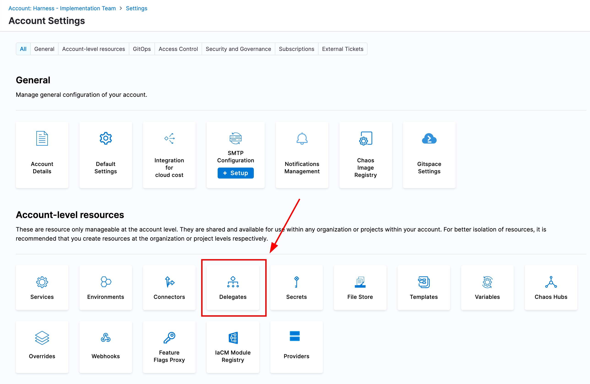
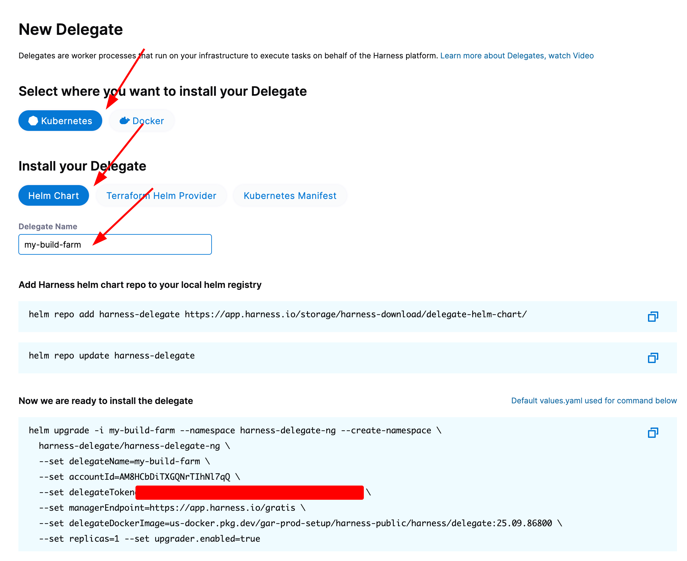
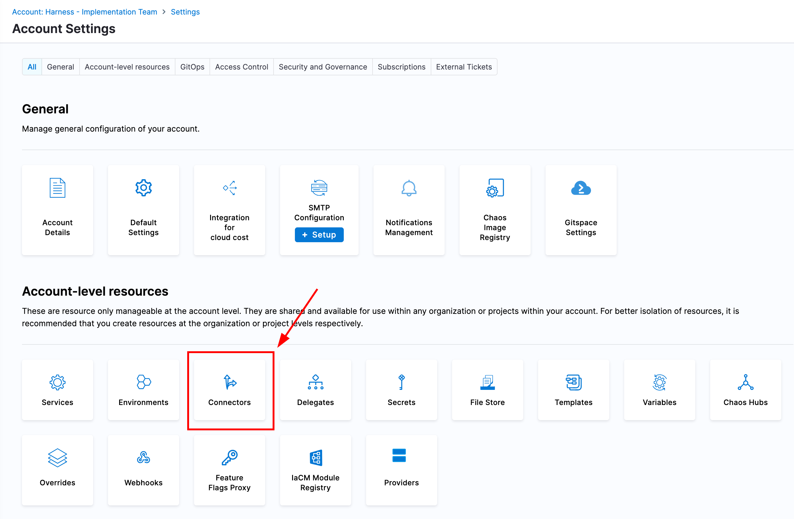
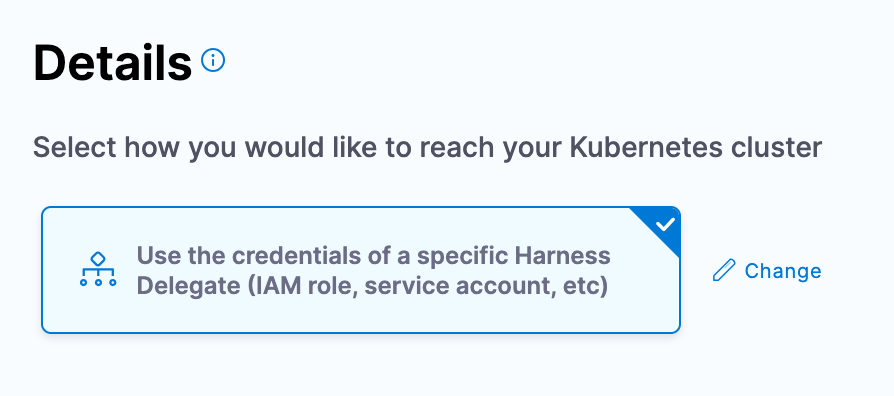
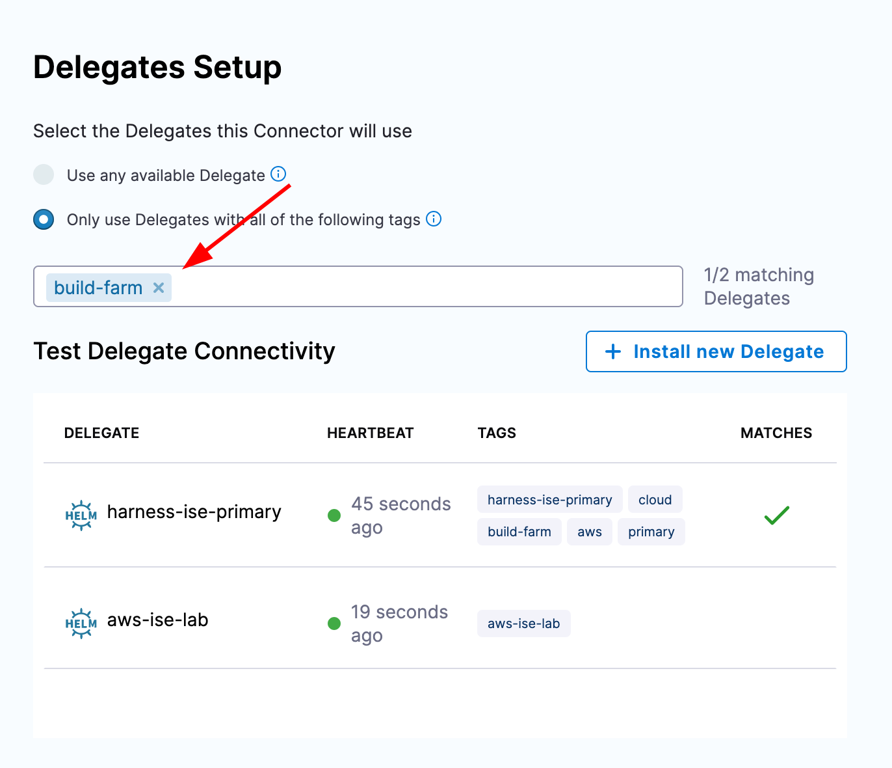
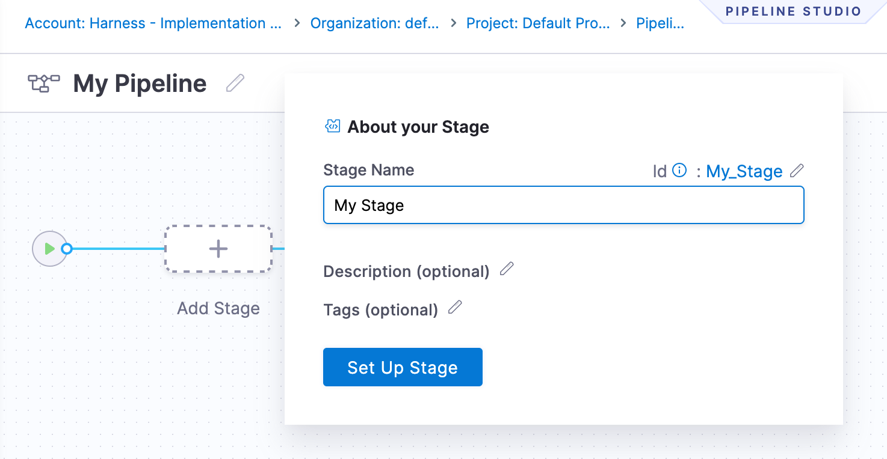
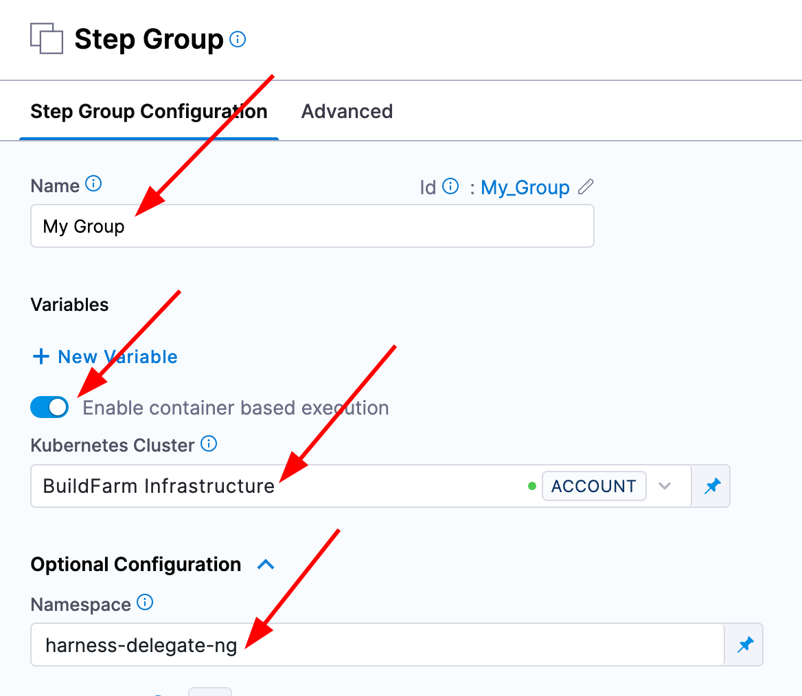
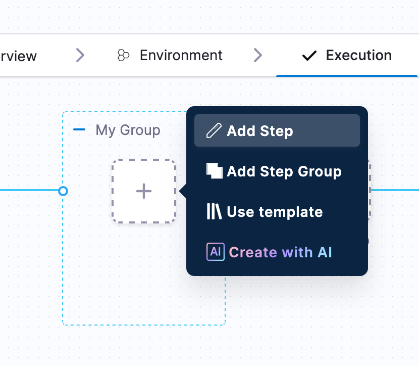
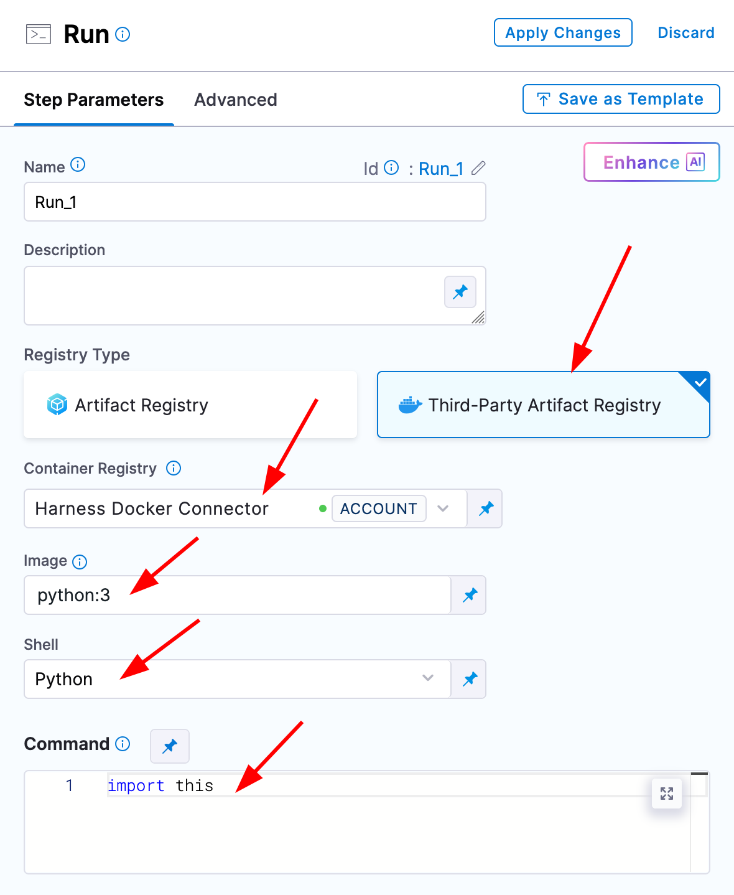

# Pipeline Infrastructure Setup

In order to execute a Harness pipeline (and use container steps), it is necessary to provide a Kubernetes cluster that can serve as an environment where your steps can run. There are several components that need to be deployed and set up in your Harness account to be able to execute pipelines with container steps. This article serves to outline the process of deploying a delegate with the correct permissions in a cluster and setting up connectors to leverage the target cluster. 

## Delegate Deployment

The [Harness Delegate](https://developer.harness.io/docs/platform/delegates/delegate-concepts/delegate-overview/) is a container that runs and exists to execute jobs requested by the Harness manager. In this context, the delegate will be receiving pipelines to execute as containers inside the Kubernetes cluster in which the delegate runs. 

The delegate is deployed via manifest or Helm Chart and exists as a deployment inside the target cluster. You will need some configuration items such as your Harness account URL and a delegate token, which authenticates the delegate to your Harness account and scope where the delegate is created inside of Harness. 

We will need to give the Delegate's Kubernetes Service Account access to create pods and secrets in at least one namespace. A typical deployment pattern would be to deploy the delegate into a namespace called `harness-delegate-ng` and give the delegate `NAMESPACE_ADMIN` rights to be able to run executions in the same namespace. 

To deploy a new delegate, navigate to your Harness account settings and select the delegate tile under resources. You can then select New Delegate and your provisioning method; it is recommended to use Helm. From the New Delegate window, you can simply copy all of the configuration necessary to deploy a delegate for your Harness account in a target namespace. 

:::danger the default install command will install your delegate with `CLUSTER_ADMIN` permissions in your cluster. To follow least-privilege pass the value `--set replicask8sPermissionsType="NAMESPACE_ADMIN"`

Be sure to set the name of the delegate something that identifies it easily, making it the same as the name of your cluster is a good standard.

For more details on delegate deployment, see [this article](https://developer.harness.io/docs/platform/delegates/install-delegates/overview/#install-the-default-harness-delegate).

Once the delegate has been deployed and you see the pod successfully running, we can now move on to creating a Kubernetes connector.

# Kubernetes Connector

[Connectors](https://developer.harness.io/docs/category/connectors) in Harness contain the information necessary to "connect" to external systems. In order to execute a pipeline, we will need a Kubernetes connector which defines how Harness can access a Kubernetes cluster where it can create pods to execute the pipeline. We will create a new Kubernetes connector that leverages the delegate we deployed as the method for gaining access to the Kubernetes API. 

Once again navigate to your Harness account settings and select "Connectors". Then, create a new connector for Kubernetes and create the connector with the same name as the cluster name where the delegate was deployed. For authentication, we will inherit authentication from a Harness Delegate and then select the Harness Delegate we deployed previously.

# Creating a Pipeline

With the delegate and connector created, we are now able to create a pipeline which can execute containers in the target cluster.

Navigate to a Harness project and create a new pipeline. Create a stage of custom type and select the execution tab. 

Next, select "Create a step" and "Create a step group". Give it a name and select the toggle for "Containerized step group". A new input should appear for a Kubernetes connector in which you can select the connector we created above. Next, expand the Advanced Settings option. In the namespace text box, type the namespace where you deployed the delegate. You can now click apply changes in the top right.

We now have a containerized step group where we can define containers and plugins to execute some target logic.

Run steps are where you can run docker images and ad-hoc commands. There should be a default connector in your Harness account that connects to DockerHub called `Harness Docker Connector`. With this connector you should be able to pull images and run commands.

