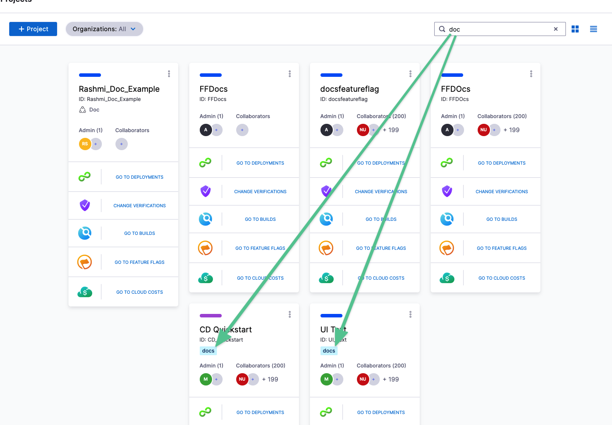

You can add tags to Harness entities and then use the tags to search for all matching entities. For example, you can add a tag to a Harness project and then filter the list of projects by tag.

<<<<<<< HEAD:docs/platform/20_References/tags-reference.md
:::info note
=======
:::info
>>>>>>> main:docs/platform/references/tags-reference.md

Tags are not available for feature flags.

:::
<<<<<<< HEAD:docs/platform/20_References/tags-reference.md
### What are tags?
=======

### What are Tags?
>>>>>>> main:docs/platform/references/tags-reference.md

Tags are simply metadata added to Harness entities. They are strings that can contain any characters.

Harness tags are applied to entities and then used to filter them. You can add multiple tags to an entity, creating a list of tags.

For example, the tag **docs** has been added to two projects. A search for **doc** returns projects with names and tags that match:

### Limitations

<<<<<<< HEAD:docs/platform/20_References/tags-reference.md
* [Runtime inputs](runtime-inputs.md) (`<+input>`) are not supported in Tags.
* Harness variable expressions cannot be used in Tags. Go to [Built-in Harness Variables Reference](../12_Variables-and-Expressions/harness-variables.md).
=======
* [Runtime inputs](/docs/platform/variables-and-expressions/runtime-inputs) (`<+input>`) are not supported in Tags.
* Harness variable expressions cannot be used in Tags. See [Built-in Harness Variables Reference](../variables-and-expressions/harness-variables.md).
>>>>>>> main:docs/platform/references/tags-reference.md

### Delegate tags and general tags

Delegate tags are different from general Tags in the following ways:

* Delegate tags are tags added to delegates.
* Delegate tags are not used in searches.
* Delegates are only tagged with delegate tags. General tags are not applied to delegates.

### Tag expressions

<<<<<<< HEAD:docs/platform/20_References/tags-reference.md
You can reference tags using [Harness expressions](../12_Variables-and-Expressions/harness-variables.md).
=======
You can reference Tags using [Harness expressions](../variables-and-expressions/harness-variables.md).
>>>>>>> main:docs/platform/references/tags-reference.md

You simply reference the tagged entity and then use `tags.[tag name]`, like `<+pipeline.tags.docs>`.

For example, here are several different references:

* `<+pipeline.tags.[tag name]>`
* `<+stage.tags.[tag name]>`
* `<+pipeline.stages.s1.tags.[tag name]>`
* `<+serviceConfig.service.tags.[tag name]>`

<<<<<<< HEAD:docs/platform/20_References/tags-reference.md
### Related reference material

* [Built-in and custom Harness variables reference](../12_Variables-and-Expressions/harness-variables.md)
=======
### Related Reference Material

* [Built-in and custom Harness variables reference](../variables-and-expressions/harness-variables.md)
>>>>>>> main:docs/platform/references/tags-reference.md
