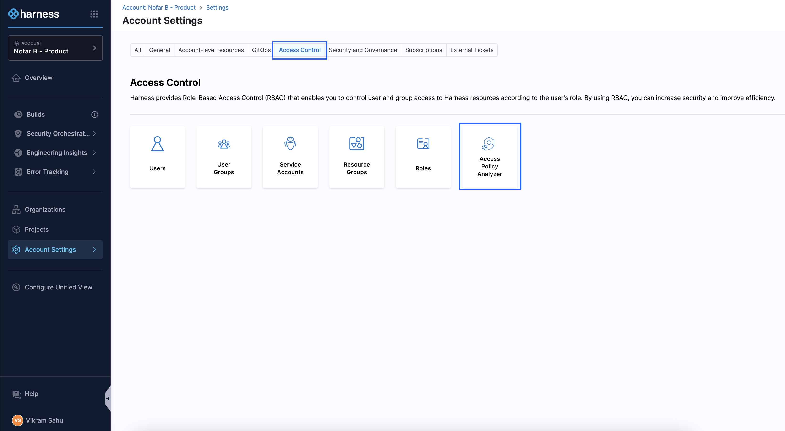
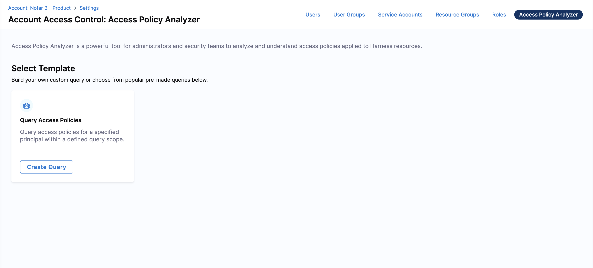
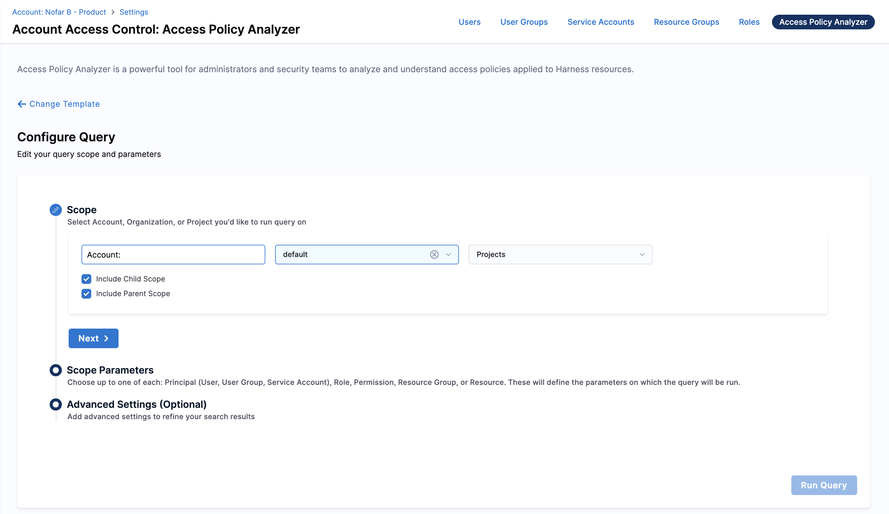
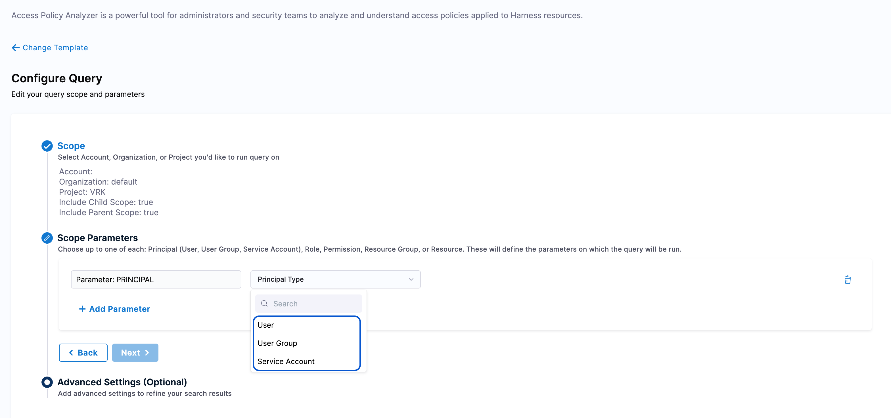
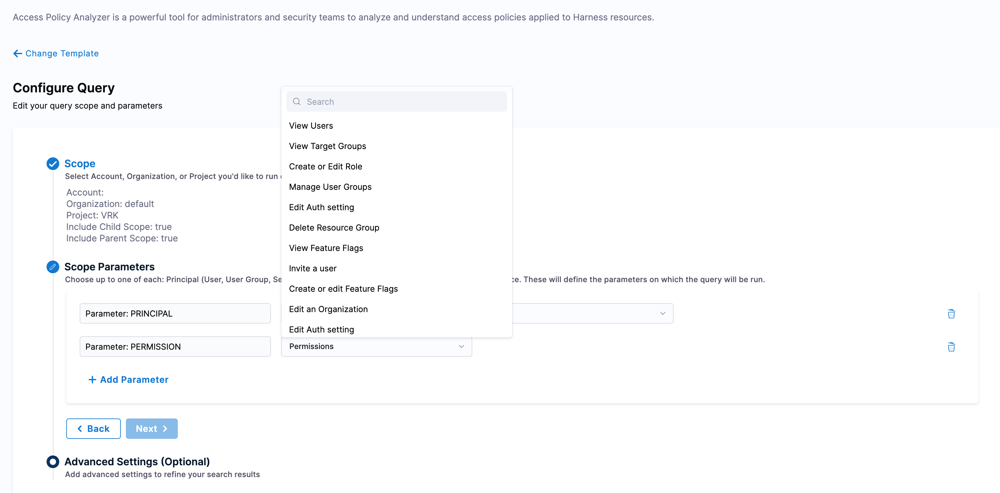
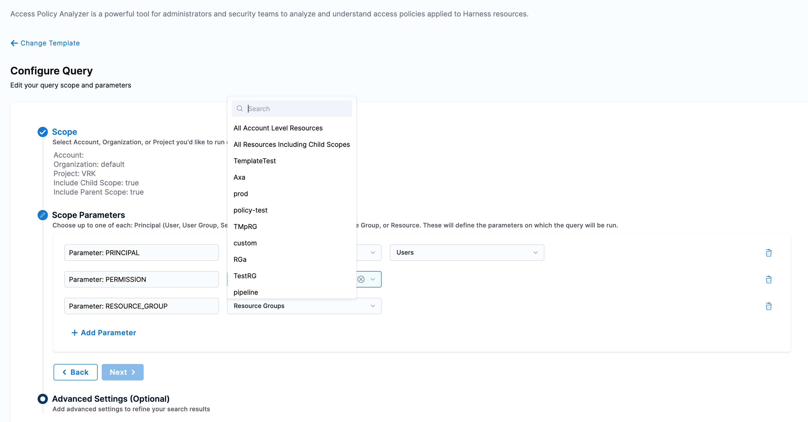
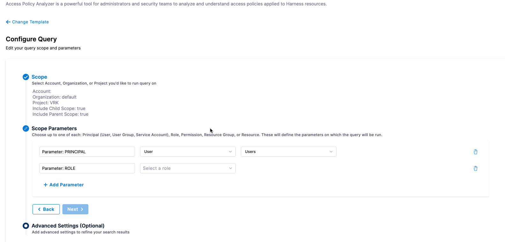
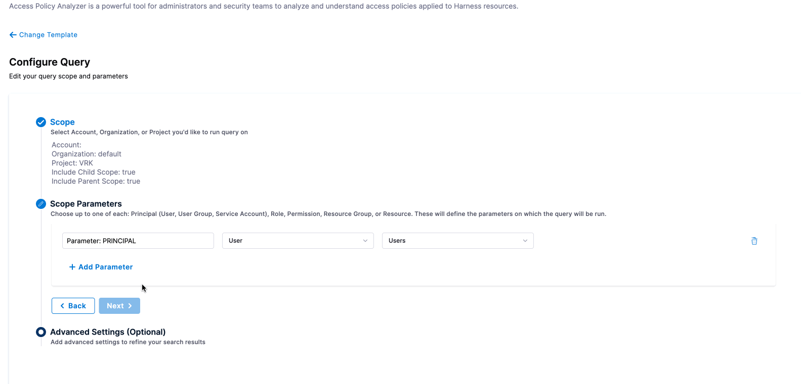
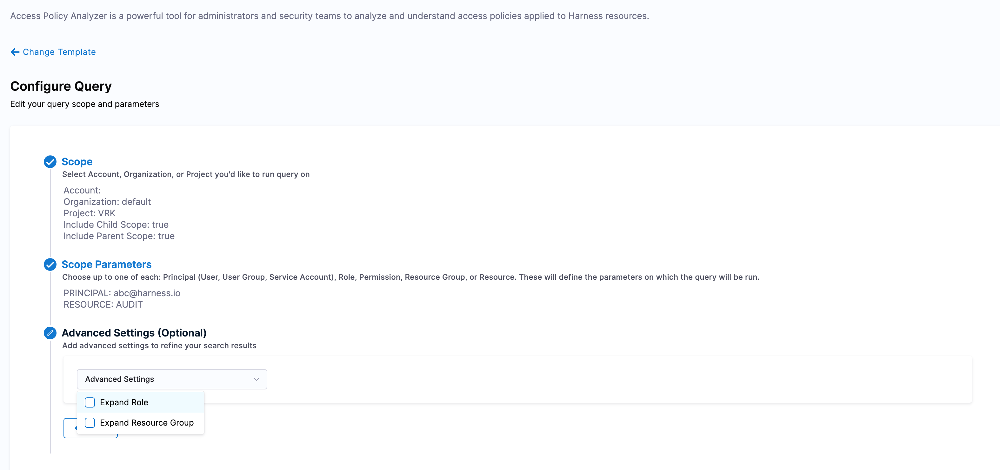
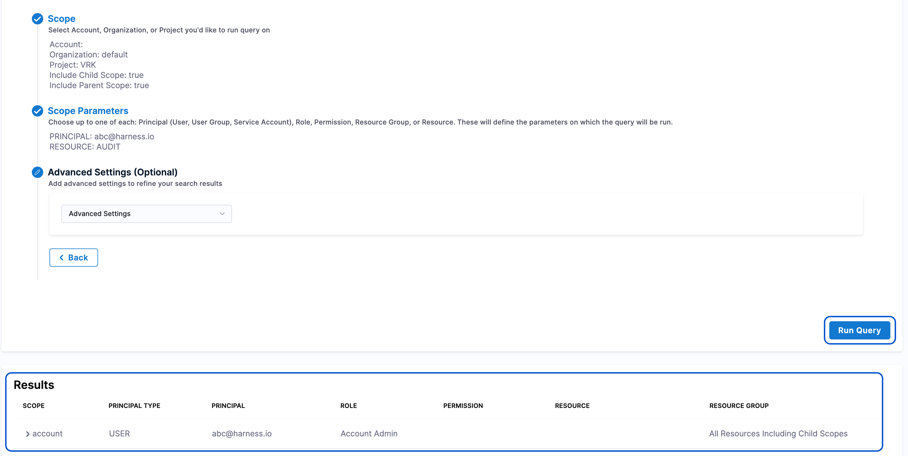

<!--Importing images for resizing in docs-->

import UserSelect from './static/user-select.png'
import UserGroup from './static/usergroup.gif'
import ServiceAcc from './static/serviceaccount.gif'

<!--Introduction-->

The Access Policy Analyzer allows user to review and troubleshoot permissions across Account, Organization, and Project scopes. It provides a centralized way to see who has access to which resources and with what permissions.

This improves visibility, supports security audits, and helps ensure users have only the access they need.

:::note Feature availability
Access Policy Analyzer feature is currently behind the `PL_ENABLE_POLICY_ANALYZER` feature flag. Contact [Harness Support](mailto:support@harness.io) to enable the feature.
:::

### Using Access Policy Analyzer

1. Navigate to Settings → Access Control at the desired scope, and select Access Policy Analyzer.

    

2. Select a template to configure the query.

    

3. **Set the scope for your query**: Currently, only one account can be selected at a time. You can choose the organization and project within that account. You can also refine your query by including the parent scope, child scope, or both, as shown in the image below. Click Next to continue.

    

4. **Add the parameters for your query**: Now that you have defined the scope, you can specify up to five parameters: Principal, Permission, Resource Group, Role, and Resources. You can use multiple combinations to build queries and explore results based on your requirements. Let’s explore the parameters step by step.

    - [**Principal**](/docs/platform/role-based-access-control/rbac-in-harness#principals): Principals include User, User Group, and Service Account. When choosing a principal, you will have one of these three options to proceed, followed by the selection of the specific entity.

        

        - User: Select the system users whose access you want to analyze.

            

        - User Group: Select groups of users to analyze collective access permissions. Once you have selected User Group, proceed to choose the specific user group for the desired scope, as shown below.

          :::note Important note:
            Ensure that the selected user group contains at least one user. The Access Policy Analyzer requires this to fetch policies correctly.
          :::

            

        - Service Account: Choose service accounts to review their access. 

            
    
    - [Permission](/docs/platform/role-based-access-control/rbac-in-harness#permissions-hierarchy-scopes): Select a permission from the dropdown list; you can choose only one permission at a time. 

        

    - [Resource Group](/docs/platform/role-based-access-control/add-resource-groups#manage-resource-groups-in-harness): Similar to Permission, you can select only one resource group at a time that includes All account level Resources or All Resources including child scope.

        

    - [Role](/docs/platform/role-based-access-control/add-manage-roles): Used to limit your query to specific roles across the selected scope.

        

    - [Resource](/docs/platform/role-based-access-control/add-resource-groups/): This parameter allows you to select resources. It includes a Same As Query Scope option; when disabled, you can choose an organization from the dropdown list. Otherwise, it uses the same scope specified earlier.

               

5. Advanced Settings (Optional): This option allows additional set of refinement to your search results. It includes options like Expand Role, which breaks down a selected role into individual permissions in the Policy Analyzer results, and Expand Resource Group, which lets you analyze resources at a more granular level.

    

6. Once you have selected the appropriate options, click Run Query to view your search results.

    

     

   
    