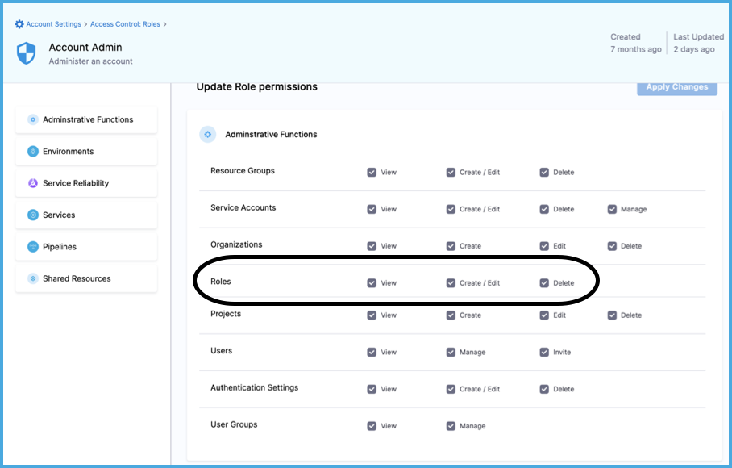
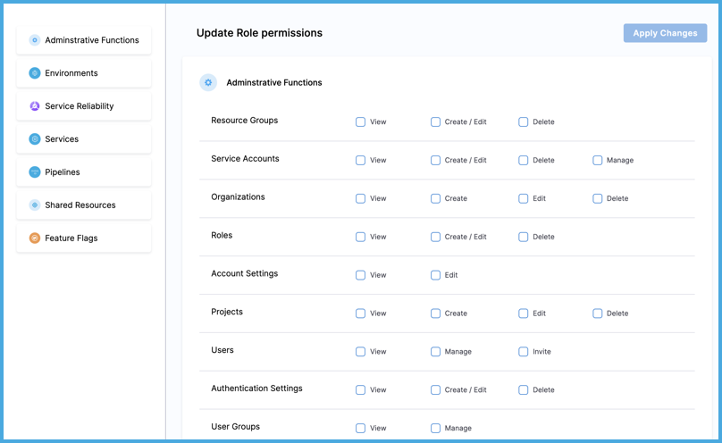

Roles are an [RBAC component](./rbac-in-harness.md#rbac-components) that contain a set of [permissions](/docs/platform/role-based-access-control/permissions-reference). Roles define what actions, such as viewing, creating, editing, or deleting, can be taken on Harness resources. When you assign a role to a user, user group, or service account, the permissions defined in the role are granted to the target user, group, or service account.

Harness includes some [built-in roles](#built-in-roles), and you can [create custom roles](#create-a-role), which are useful for limited and fine-grained access control.

Roles are scope-specific, and you can create them at any [scope](/docs/platform/role-based-access-control/rbac-in-harness#permissions-hierarchy-scopes). For example, a role created at the project scope is only available in that project.

## Roles and resource groups work together

Roles are applied together with [resource groups](/docs/platform/role-based-access-control/add-resource-groups) to create a complete set of permissions and access. For example:

* You can assign the **Organization Admin** role with a resource group that is limited to specific projects or specific organizations.
* You can assign the **Pipeline Executor** role with a resource group that only allows access to specific pipelines, rather than all pipelines in the project.

:::caution Least privilege

RBAC is additive. The total expanse of a user/service account's permissions and access is the sum of all the roles and resource groups from all user groups they belong to, as well as any roles and resource groups assigned directly to them as an individual user/service account.

It is important to follow the principle of least privilege (PoLP). This is a security principle that means users are granted the absolute minimum access/permissions necessary to complete their tasks and nothing more.

While Harness includes some built-in roles and resource groups, to ensure the least privilege, consider:

* Being selective in the way you apply roles and resource groups.
* Creating your own roles and resource groups as needed for refined access control.

:::

## Built-in roles

Harness includes several built-in roles. To examine the permissions assigned to these roles, view them in Harness:

1. In Harness, go to the [scope](/docs/platform/role-based-access-control/rbac-in-harness#permissions-hierarchy-scopes) where the role exists.

   * To view a role at the account scope, select **Account Settings**, and then select **Access Control**.
   * To view a role at the organization scope, go to **Account Settings**, select **Organizations**, select the relevant organization, and then select **Access Control**.
   * To view a role at the project scope, go to **Projects**, select the relevant project, and then select **Access Control**.

2. Select **Roles** in the header.
3. Select the role you want to view. For details about specific permissions, go to the [Permissions reference](/docs/platform/role-based-access-control/permissions-reference).

### Platform roles

These roles are not specific to any modules. They are for administration and oversight of an entire Harness account, organization, or project. They also provide access to cross-module components, such as dashboards and pipelines.

| Role | [Scope](./rbac-in-harness.md#permissions-hierarchy-scopes) |
| ---  | ----- |
| Account Admin | Account |
| Account Viewer | Account |
| Dashboard Admin | Account |
| Dashboard Viewer | Account |
| Billing Admin | Account |
| Organization Admin | Organization |
| Organization Viewer | Organization |
| Project Admin | Project |
| Project Viewer | Project |
| Pipeline Admin | Account |
| Pipeline Executor | Project |

### Module-specific roles

Harness creates these roles for you depending on the modules you use. These roles exist at all [scopes](/docs/platform/role-based-access-control/rbac-in-harness#permissions-hierarchy-scopes).

* Feature Flag Manage Role
* CET Admin
* Code Admin
* Chaos Admin
* CCM Admin
* CCM Viewer
* Security Testing SecOps Role
* Security Testing Developer Role
* GitOps Admin Role

## Manage roles in Harness

To manage roles in Harness, you need a role, such as **Account Admin**, that has [permission](/docs/platform/role-based-access-control/permissions-reference) to view, create/edit, and delete roles.

<!--  -->

<docimage path={require('./static/add-manage-roles-17.png')} />

### Create a role

1. In Harness, go to the [scope](/docs/platform/role-based-access-control/rbac-in-harness#permissions-hierarchy-scopes) where you want to create the role.

   * To create a role at the account scope, select **Account Settings**, and then select **Access Control**.
   * To create a role at the organization scope, go to **Account Settings**, select **Organizations**, select the relevant organization, and then select **Access Control**.
   * To create a role at the project scope, go to **Projects**, select the relevant project, and then select **Access Control**.

2. Select **Roles** in the header, and then select **New Role**.
3. Enter a **Name** for the role. **Description** and **Tags** are optional.
4. Select **Save**.
5. Select [permissions](/docs/platform/role-based-access-control/permissions-reference) for the role.

   <!--  -->

   <docimage path={require('./static/add-manage-roles-19.png')} />

6. Select **Apply Changes**.

### Edit a role

1. In Harness, go to the [scope](/docs/platform/role-based-access-control/rbac-in-harness#permissions-hierarchy-scopes) where the role exists.

   * To edit a role at the account scope, select **Account Settings**, and then select **Access Control**.
   * To edit a role at the organization scope, go to **Account Settings**, select **Organizations**, select the relevant organization, and then select **Access Control**.
   * To edit a role at the project scope, go to **Projects**, select the relevant project, and then select **Access Control**.

2. Select **Roles** in the header.
3. Locate the role you want to edit.
4. Select **More options** (&vellip;) on the role card, and then select **Edit**.
5. Edit the role's name, description, or tags, if needed, and then select **Save**.
6. Edit the role's permissions, and then select **Apply Changes**. For details about specific permissions, go to the [Permissions reference](/docs/platform/role-based-access-control/permissions-reference).

### Delete a role

1. In Harness, go to the [scope](/docs/platform/role-based-access-control/rbac-in-harness#permissions-hierarchy-scopes) where the role exists.

   * To delete a role at the account scope, select **Account Settings**, and then select **Access Control**.
   * To delete a role at the organization scope, go to **Account Settings**, select **Organizations**, select the relevant organization, and then select **Access Control**.
   * To delete a role at the project scope, go to **Projects**, select the relevant project, and then select **Access Control**.

2. Select **Roles** in the header.
3. Locate the role you want to delete.
4. Select **More options** (&vellip;) on the role card, and then select **Delete**.

## Continue RBAC configuration

Creating roles is one part of [configuring RBAC in Harness](/docs/platform/role-based-access-control/rbac-in-harness#configure-rbac-in-harness).

Roles, which grant permissions, work alongside [resource groups](/docs/platform/role-based-access-control/add-resource-groups), which grant access.

After configuring roles and resource group, you assign them to [users](./add-users.md), [user groups](./add-user-groups.md), and [service accounts](./add-and-manage-service-account.md).
