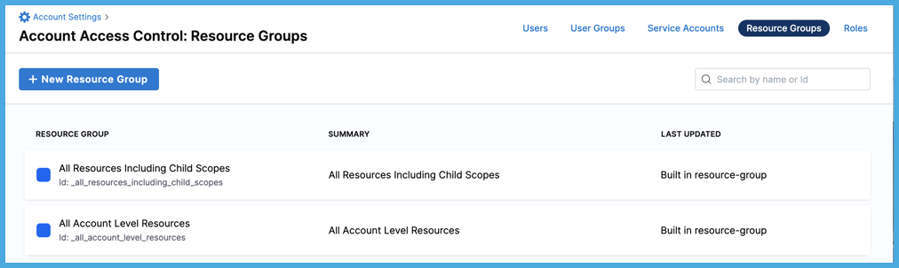
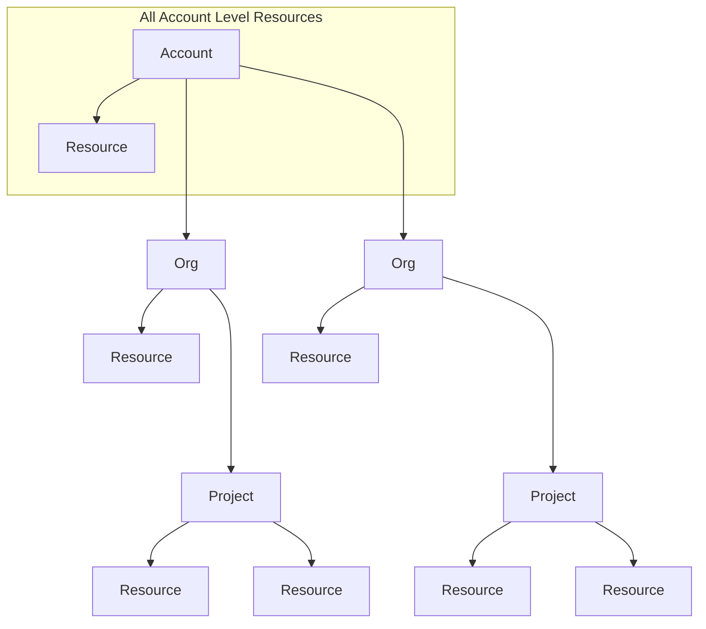
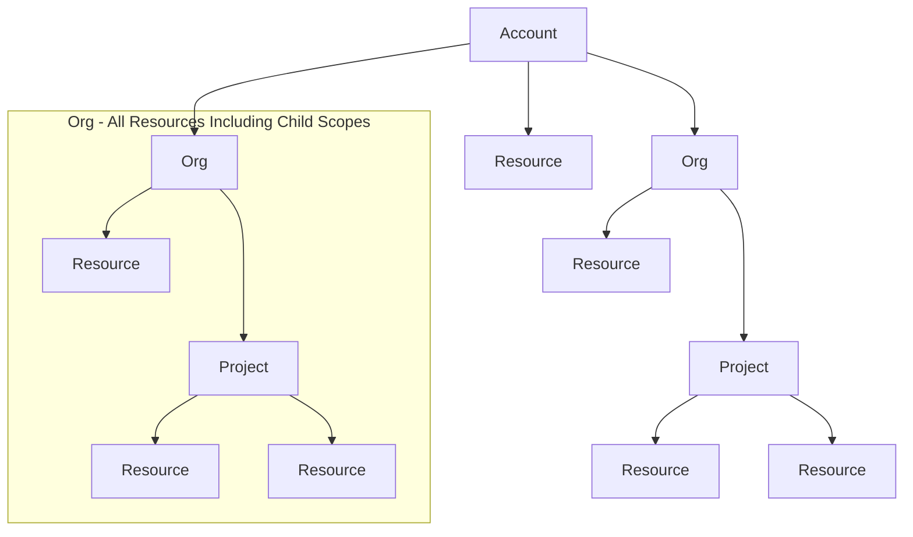
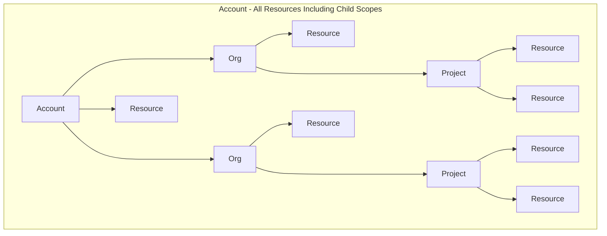
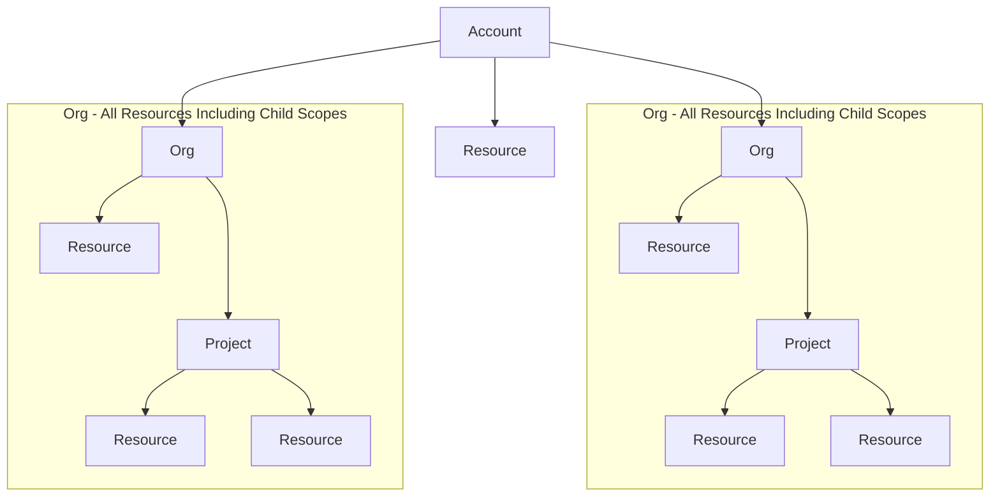
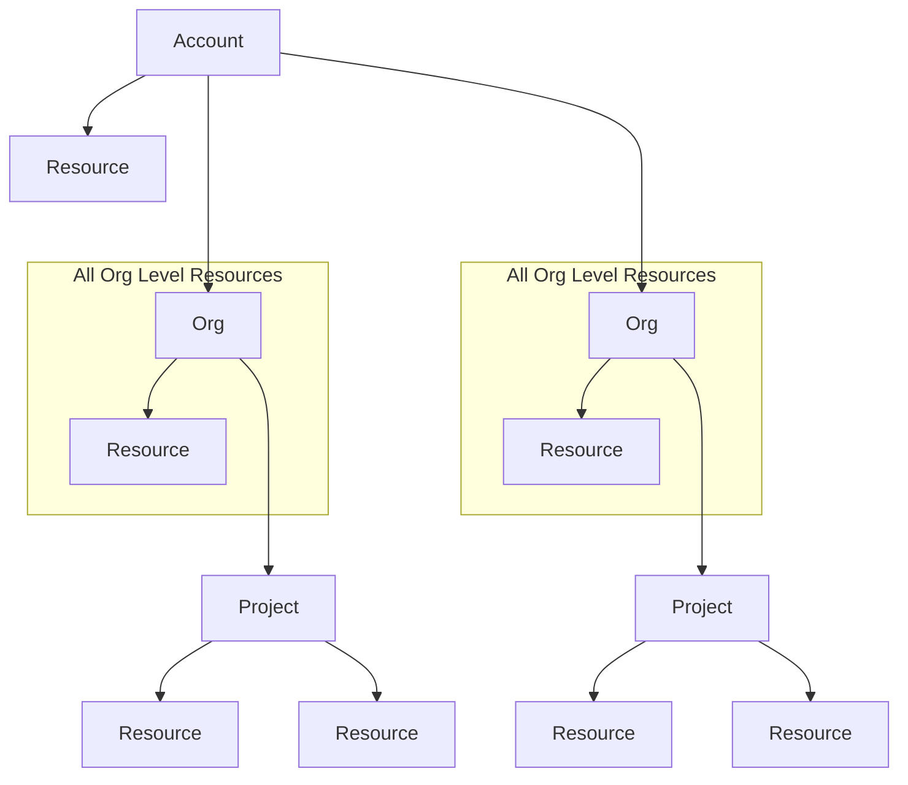
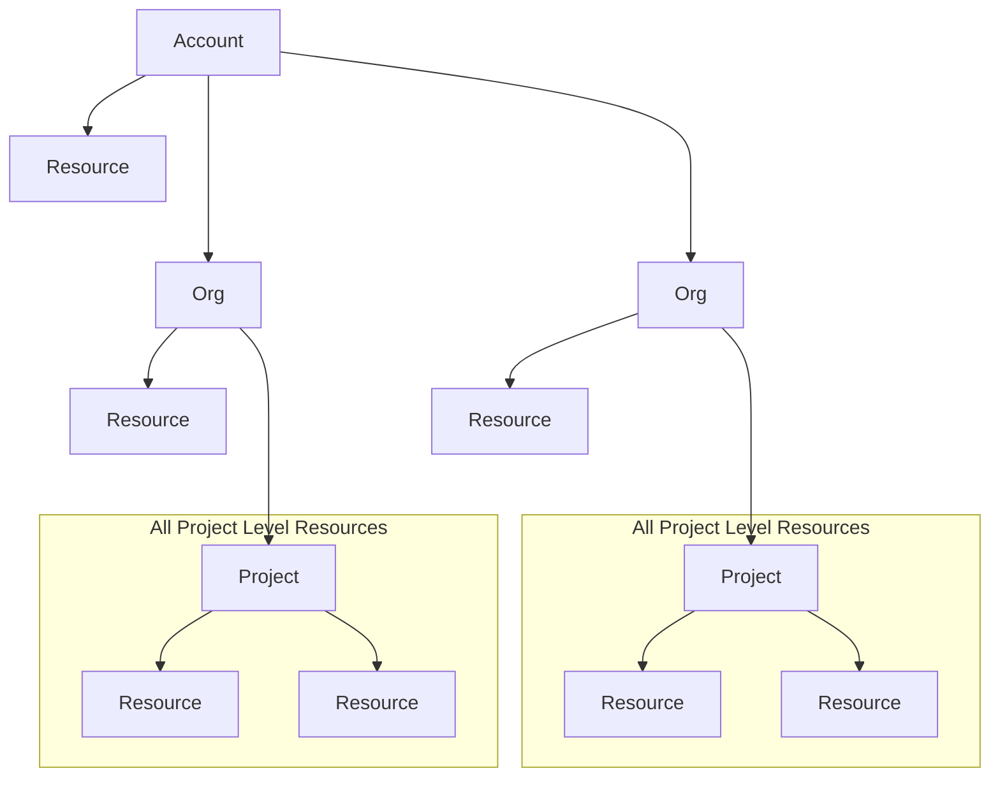
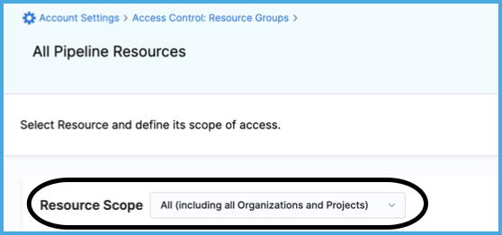
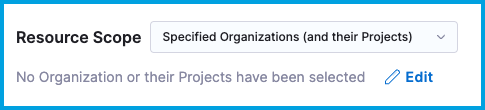

Resource groups are an [RBAC component](./rbac-in-harness.md#rbac-components) that define the objects that a user or service account can access. Objects are any Harness resource, including projects, pipelines, connectors, secrets, delegates, environments, users, and more. When you assign a resource groups to a user, user group, or service account, the access defined in the resource group is granted to the target user, group, or service account.

Harness includes some [built-in resource groups](#built-in-resource-groups), and you can [create custom resource groups](#create-a-resource-group), which are useful for limited and fine-grained access control.

## Roles and resource groups work together

[Roles](./add-manage-roles.md) are applied together with resource groups to create a complete set of permissions and access. For example:

* You can assign the **Organization Admin** role with a resource group that is limited to specific projects or specific organizations.
* You can assign the **Pipeline Executor** role with a resource group that only allows access to specific pipelines, rather than all pipelines in the project.

:::caution Least privilege

RBAC is additive. The total expanse of a user/service account's permissions and access is the sum of all the roles and resource groups from all user groups they belong to, as well as any roles and resource groups assigned directly to them as an individual user/service account.

It is important to follow the principle of least privilege (PoLP). This is a security principle that means users are granted the absolute minimum access/permissions necessary to complete their tasks and nothing more.

While Harness includes some built-in roles and resource groups, to ensure the least privilege, consider:

* Being selective in the way you apply roles and resource groups.
* Creating your own roles and resource groups as needed for refined access control.

:::

## Scopes and refinement

Resource groups are scope-specific, and you can create them at any [scope](./rbac-in-harness.md#permissions-hierarchy-scopes). For example, a resource group created at the project scope is only available in that project.

In addition to the scope at which you create the resource group, each resource group includes **Resource Scope** options that control the scope of access *within the resource group's overall scope*. For example, if you create a resource group at the org level, you can allow access to all projects under that organization, or you can select specific projects.

The scope at which you create a resource group determines which **Resource Scope** options you can apply to that group. For example, if you create a resource group at the project scope, it is impossible to select org or account **Resource Scopes** for that resource group.

<!--  -->

<docimage path={require('./static/rbac-in-harness-03.png')} />

### Resource scope options

If a resource group includes **All Account/Organization/Project Level Resources**, it provides access to the resources at that specified level and nothing lower. For example, **All Account Level Resources** grants access to the account-level resources but nothing at the organization or project levels.

If a resource group includes **All Resources Including Child Scopes**, it provides access to all resources at the specified level and all lower resources. This is an expansive scope comprising many resources. For example, at the org scope, **All Resources Including Child Scopes** grants access to resources at the org level, as well as resources in the scope of projects under that org.

If a resource group includes **Specified Organizations (and their Projects)**, it provides access to resources in one or more selected organizations, as well as resources in projects under those orgs. This option is available for resource groups created at the account scope, and you can use it to provide multi-org access without granting access to all orgs in your account.

If a resource group includes **Specified Projects**, it provides access to resources in one or more selected projects. This option is available for resource groups created at the org scope, and you can use it to provide multi-project access without granting access to all projects under an org.

:::tip

For more resource scope diagrams, go to [Built-in resource groups](#built-in-resource-groups).

:::

### Further refinement

For extremely fine-grained access control, you can select individual resources within a particular resource category, such as specific connectors or pipelines. Upon selecting a resource category, select **Specified**, and then select **Add** to select specific instances of that resource.

For example, to allow access to specific pipelines only, create the resource group at the project level, select the **Pipelines** resource type, and select then specific pipelines in the project.

You can also use [Attribute Based Access Control (ABAC)](./attribute-based-access-control.md) for connectors and environments.

This level of control is not available at all scopes for all resource types. For example, you can't select specific pipelines for resource groups created at the account or org scopes.

## Built-in resource groups

Harness includes several built-in resource groups.

Built-in resource groups at the Account scope

* **All Resources Including Child Scopes:** Includes all resources within the account's scope, as well as those within the scope of orgs and projects under the account. This is the most inclusive resource group possible.

* **All Account Level Resources:** Includes all resources in the account's scope, and excludes resources within the scope of orgs or projects under the account.

Built-in resource groups at the Org scope

* **All Resources Including Child Scopes:** Includes all resources within a specific org's scope, as well as those within the scope of projects under that org. This is set for each org. If you have multiple orgs, you have an **All Resources Including Child Scopes** for each org.

* **All Organization Level Resources:** Includes all resources in a specific org's scope. Excludes resources within the scope of projects under the org. This is set for each org. If you have multiple orgs, you have an **All Organization Level Resources** for each org.

Built-in resource groups at the Project scope

**All Project Level Resources** includes all resources in the project's scope. This is set for each project. If you have multiple projects, you have an **All Project Level Resources** for each project.

## Manage resource groups in Harness

To manage resource groups in Harness, you need a role, such as **Account Admin**, that has [permission](./permissions-reference.md) to view, create/edit, and delete resource groups.

Make sure you understand how [scopes and refinement](#scopes-and-refinement) work in resource groups.

### Create a resource group

1. In Harness, go to the [scope](#scopes-and-refinement) where you want to create the resource group.

   * To create a resource group at the account scope, select **Account Settings**, and then select **Access Control**.
   * To create a resource group at the organization scope, go to **Account Settings**, select **Organizations**, select the relevant organization, and then select **Access Control**.
   * To create a resource group at the project scope, go to **Projects**, select the relevant project, and then select **Access Control**.

2. Select **Resource Groups** in the header, and then select **New Resource Group**.
3. Enter a **Name** for your resource group. **Description**, **Tags**, and **Color** are optional.
4. Select **Save**.
5. Select the **Resource Scope**. The available options depend on the scope where you created the resource group.

   * **Account/Organization/Project only**
   * **All (including all Organizations and Projects)**
   * **All (including Projects)**
   * **Specified Organizations (and their Projects)**
   * **Specified Projects**

   

6. If you selected **Specified Organization** or **Specified Projects**, select **Edit** and select the specific organizations or projects.

   

7. For **Resources**, select **All** or **Specified**.

   

8. If you selected **Specified**, select the resource types to include.

   Depending on the scope where you created the resource group, you can further refine your selection by:

   * **All:** Include all resources in the given category that are within the **Resource Scope**.
   * **By Type:** Include specific types of resources in the given category that are within the **Resource Scope**. Use this option to [configure ABAC](./attribute-based-access-control.md) for connectors and environments.
   * **Specified:** Select specific, named resources in this category that are within the **Resource Scope**, such as specific pipelines.

   These configuration is in addition to the **Resource Scope**. For example, if the **Resource Scope** is **Project Only**, and you select **Specified** pipelines, you can only choose from pipelines *in the specified project scope*. For more information, go to [Scopes and refinement](#scopes-and-refinement).

9. Select **Save**.

### Edit a resource group

1. In Harness, go to the [scope](#scopes-and-refinement) where the resource group exists.

   * To edit a resource group at the account scope, select **Account Settings**, and then select **Access Control**.
   * To edit a resource group at the organization scope, go to **Account Settings**, select **Organizations**, select the relevant organization, and then select **Access Control**.
   * To edit a resource group at the project scope, go to **Projects**, select the relevant project, and then select **Access Control**.

2. Select **Resource Groups** in the header.
3. Locate the resource group you want to edit.
4. Select **More options** (&vellip;), and then select **Edit**.
5. Edit the resource group's name, description, tags, or color, if needed, and then select **Save**.
6. Edit the resource group's scope and resource settings, and then select **Save**.

### Delete a resource group

1. In Harness, go to the [scope](#scopes-and-refinement) where the resource group exists.

   * To delete a resource group at the account scope, select **Account Settings**, and then select **Access Control**.
   * To delete a resource group at the organization scope, go to **Account Settings**, select **Organizations**, select the relevant organization, and then select **Access Control**.
   * To delete a resource group at the project scope, go to **Projects**, select the relevant project, and then select **Access Control**.

2. Select **Resource Groups** in the header.
3. Locate the resource group you want to delete.
4. Select **More options** (&vellip;), and then select **Delete**.

## Continue RBAC configuration

Creating resource groups is one part of [configuring RBAC in Harness](./rbac-in-harness.md#configure-rbac-in-harness).

[Roles](./add-manage-roles.md), which grant permissions, work alongside resource groups, which grant access.

After configuring roles and resource group, you assign them to [users](./add-users.md), [user groups](./add-user-groups.md), and [service accounts](./add-and-manage-service-account.md).
