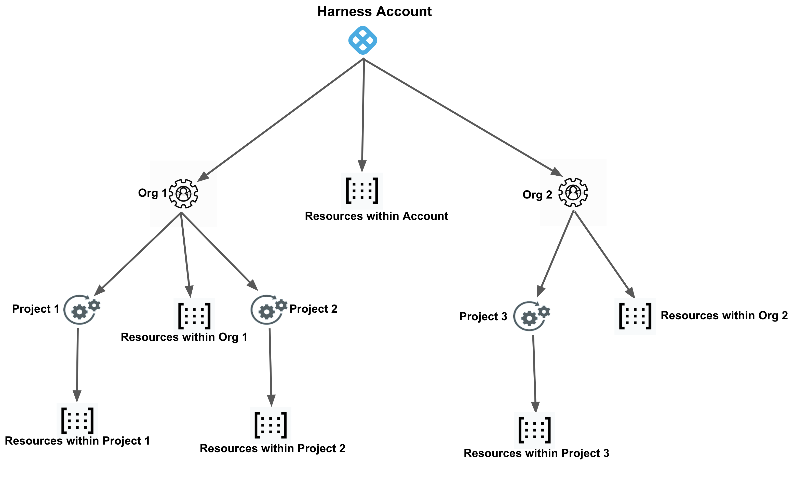
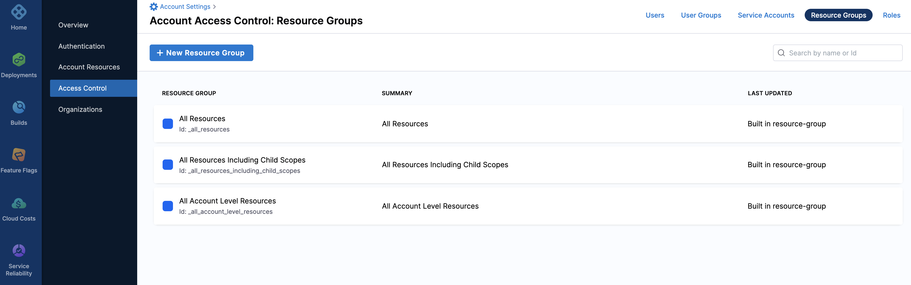
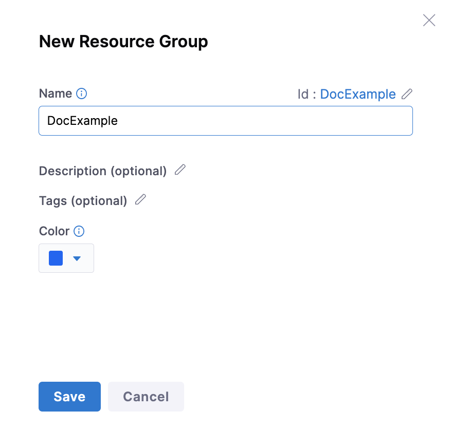
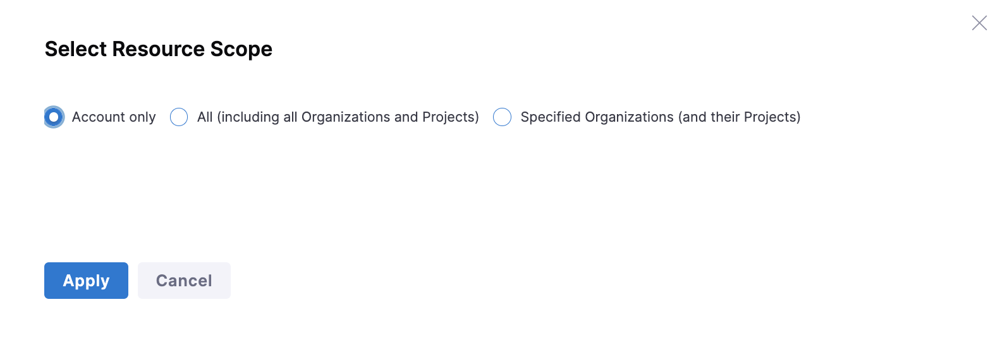
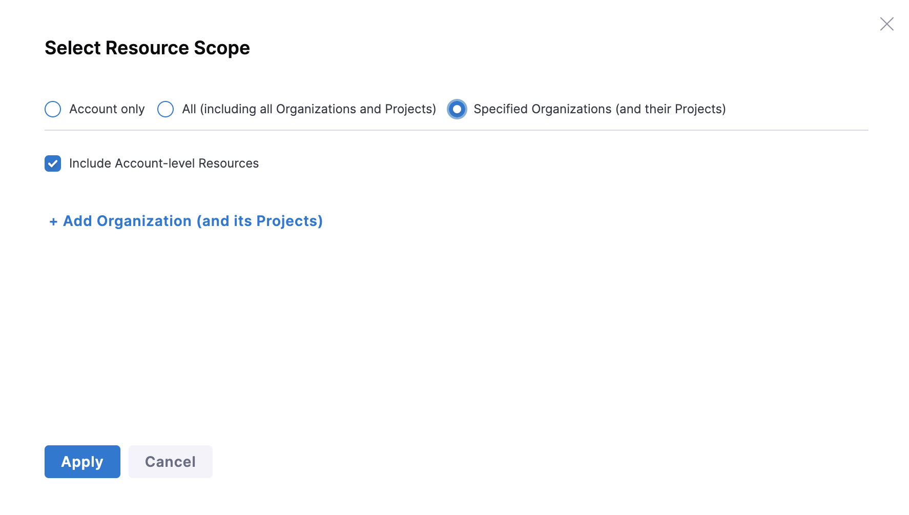
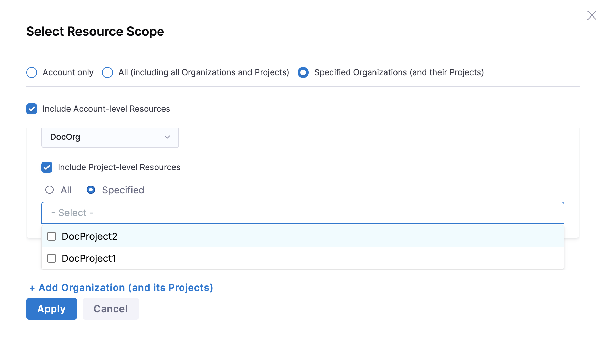
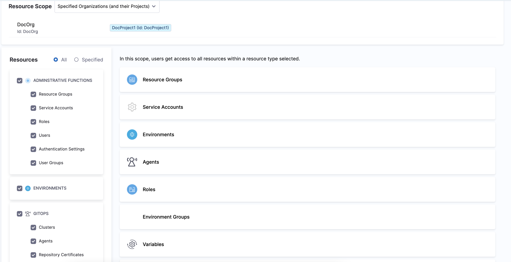
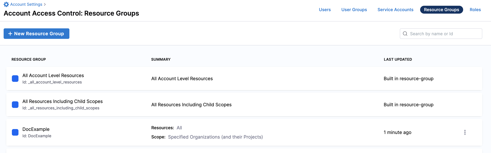

A Resource Group is a set of Harness resources that the permission applies to. Permissions given to a user or user group as part of a Role, apply to the set of resources that are part of the Resource Group.

This topic will explain the steps to create and manage Resource Groups within Harness System.

### Before you begin

* [Learn Harness' Key Concepts](../../getting-started/learn-harness-key-concepts.md)
* Make sure you have **Create/Edit/Delete** Permissions for Resource Groups.

### Visual Summary

Here is a quick overview of Resource Groups at various scopes:

* **Account Only** - To include all the resources within the scope of the Account. This does not include resources within the scope of Org or Project.
* **All (including all Organizations and Projects)** - To include all the resources within the scope of the Account, as well as those within the scope of the Orgs and Projects in this Account.
* **Specified Organizations (and their Projects)** - To include all the resources within the scope of specific Organizations and their Projects.

### Review: Resource Groups and Scopes

A Resource Group can contain any of the following:

* All or selected resources from the list of resources in the Resource Group's scope - For example, a Resource Group RG1 created within Account Acc1 can contain all or selected resources created within the same Account Acc1.
* All or selected resources in the scope in which it is defined. For example, all Account level resources, all Account Level Secret Managers, all Connectors in Org A.
* All or specific resources for the entire account - For example, a Resource Group RG1 within Account Acc1 can contain all or selected resources created within Acc1, Organizations within Acc1, Projects within Organizations in Acc1.

Harness includes the following built-in Resource Groups at the Account, Org, and Project scope:

|  |  |  |
| --- | --- | --- |
| Scope | Resource Group | Description |
| Account | **All Resources Including Child Scopes** | Includes all the resources within the scope of the Account, as well as those within the scope of the Orgs and Projects in this Account. |
| Account | **All Account Level Resources** | Includes all the resources within the scope of the Account. This does not include resources within the scope of Org or Project. |
| Org | **All Resources Including Child Scopes** | Includes all the resources within the scope of the Org, as well as those within the scope of all the Projects created within this Org. |
| Org | **All Organization Level Resources** | Includes all the resources within the scope of the Org. This does not include resources within the scope of Projects. |
| Project | **All Project Level Resources** | Includes all the resources within the scope of the Project. |

#### Access control scenarios

<!--In this example, the **Resource Scope** is locked to **Project only**, which means the resource group can only access the selected resources within this project. If your pipelines use connectors or other resources at a higher scope, you would need to configure RBAC at the account or org scope and then refine access by project. Similarly, if you wanted to create a user group that could run any pipeline in an organization or account, you would need to create the role, resource group, and user group at the account scope (by navigating to **Account Settings** and then selecting **Access Control**). Note that some refinement options, such as selecting specific pipelines, aren't available at higher scopes.-->

<!--After selecting resources, you can customize access further by configuring specific access for each resource type. For example, you can limit access to specific pipelines or connectors only. -->

   |  Resource scope     |  Description     |
   |  ---  |  ---  |
   |  Grant execute permission on specific pipelines.    | Select specific pipelines in the resource group at the project level. **Note:** You cannot select specific pipelines when resource groups are created at the org or account scope. |
   |  Grant execute permissions on all the pipelines in a specific project.    |   Select all the pipelines in the resource group created at the project level.    |
   |  Grant execute permissions on all the pipelines in all the projects within an org.    |   Select scope of the resource group created at org level as `All` and select all the pipelines.    |
   |  Grant execute permissions on all the pipelines in the entire account.    |  Select scope of the resource group created at account level as `All` and selecting all the pipelines.     |

   The following table explains the ways in which you can grant access permission for the required resources: 

   |  Resource scope     |   Description    |
   |  ---  |  ---  |
   |   Grant access permissions on specific resources.    |  Select specific resources in the resource group at the project, org or account scope.      |
   |   Grant access permissions on all the resources in pipelines for a specific project.    |  Select all the resources used in the pipeline in the corresponding resource group created at the project scope.    |
   |   Grant access permissions on all the resources used in the pipeline in the entire org.   |   Select scope of the resource group created at org scope as `All` and select all the resources used in the pipeline.   |
   |   Grant access permissions on all the resources used in all the pipelines in the entire account.  |   Select scope of the resource group created at account level as `All` and select all the resources used in all the pipeline.    |

### Step 1: Add a New Resource Group

Select your **Project/Org/Account**, and click **Access Control**.

Click **Resource Groups** and then click **New Resource Group**. The New Resource Group settings appear.

Enter a **Name** for your **Resource Group**.

Enter **Description** and **Tags** for your **Resource Group**.

Click **Save**.

### Step 2: Select a Resource Scope

You must select the scope of the resources that must be included in your new Resource Group after it has been saved.

You can select one of the following in Resource Group:

* **Account Only**
* **All (including all Organizations and Projects)**
* **Specified Organizations (and their Projects)**
For each Organization you select, you can further select **All** or **Specified** Projects within this Organization to include the resources accordingly.

Click **Apply**.

### Step 3: Select Resources

After you have selected Resource Scope, you must select the resources that you want to include in this Resource group.

You can either Select **All** or **Specified** resources.

Click **Save**.

Go back to Resource Groups. Your Resource Group is now listed here.

### Step: Delete A Resource Group

Click the **Resource Groups** tab under **Access Control.**

Click **Delete** on the top right corner to remove a Resource Group.

### Step: Manage Resource Group

Click the **Resource Groups** tab under **Access Control.**

Click the Resource Group you want to edit. The Resource Group details page appears.

You can add/remove resources from this page.

Click **Apply Changes**.

### Next steps

* [Add and Manage Users](/docs/platform/role-based-access-control/add-users)
* [Add and Manage User Groups](/docs/platform/role-based-access-control/add-user-groups)
* [Add and Manage Roles](./add-manage-roles)
* [Permissions Reference](./permissions-reference)

