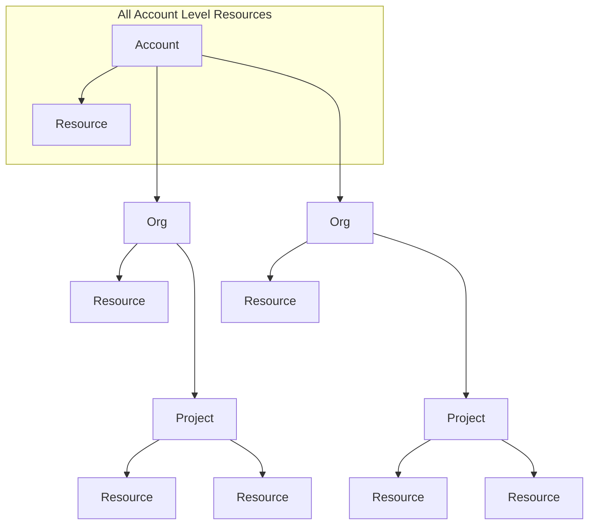
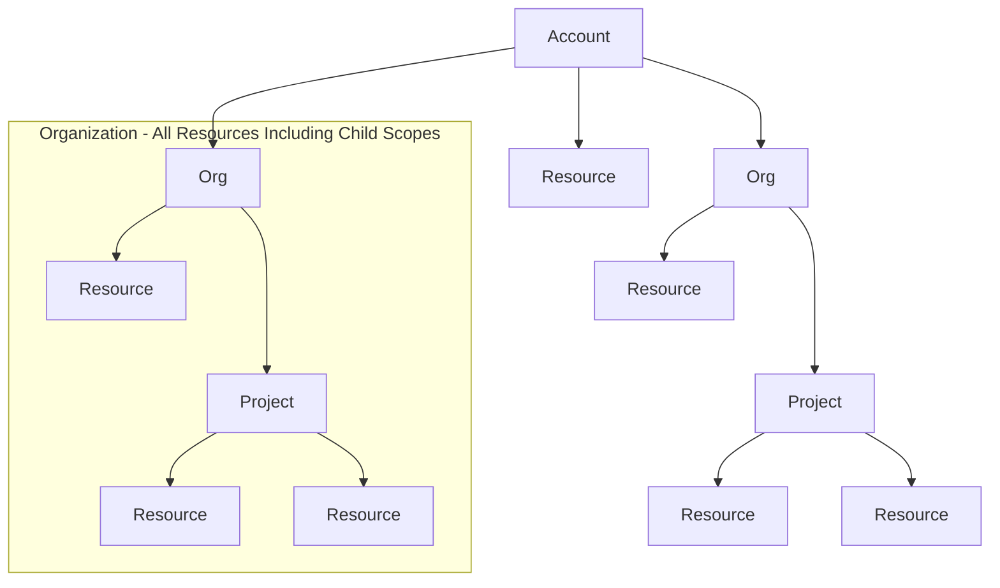
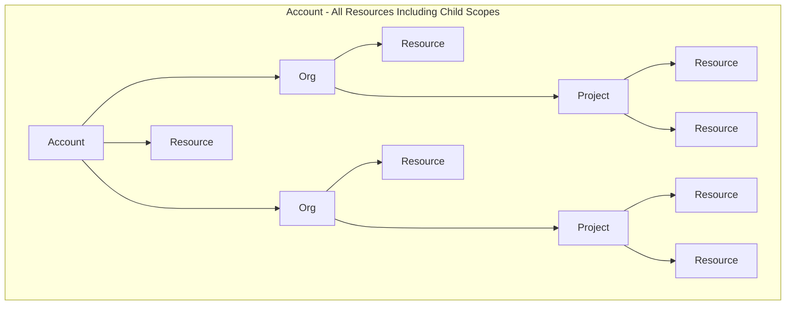
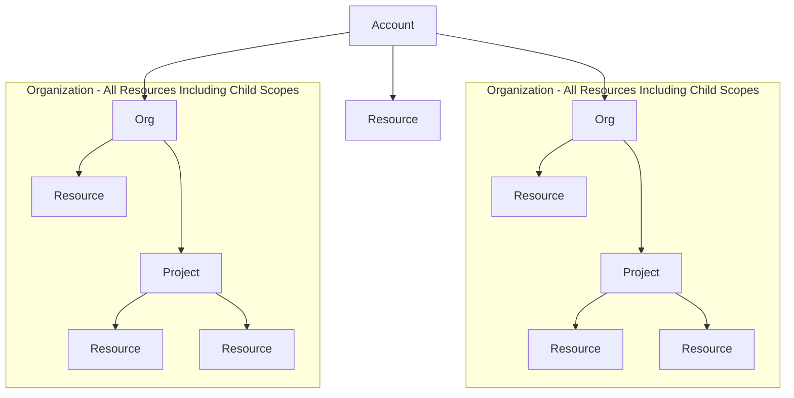
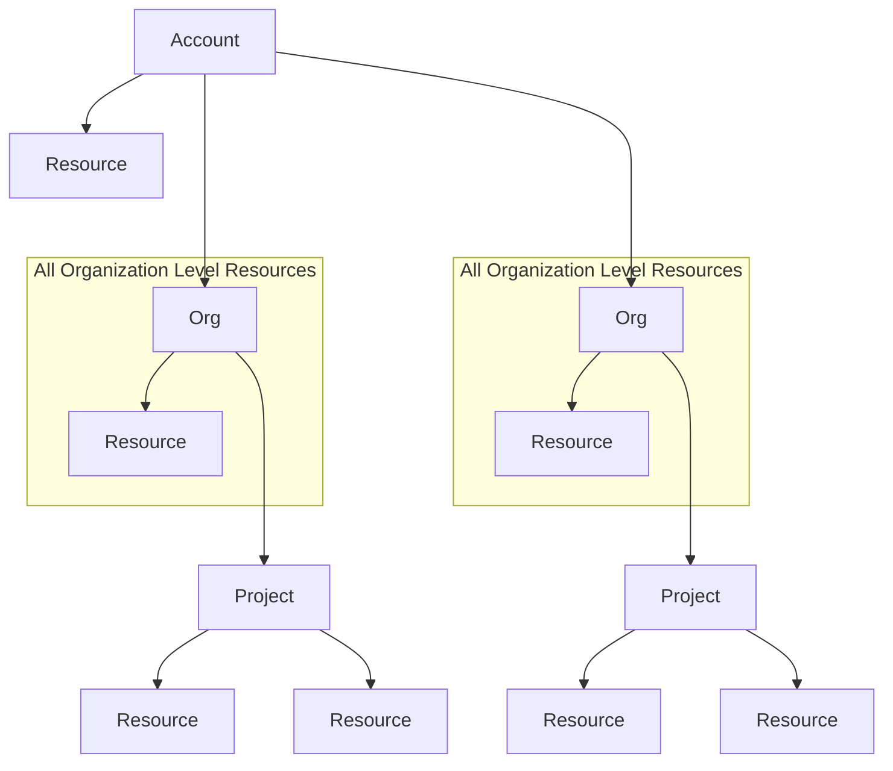
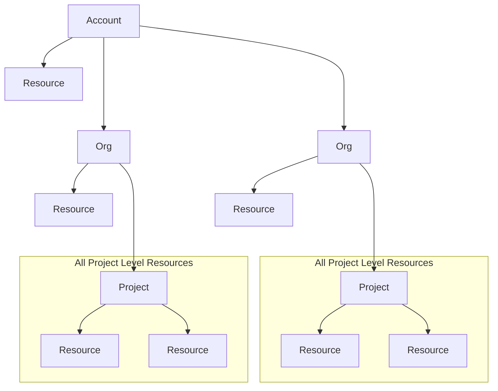

<a href="/docs/platform/role-based-access-control/rbac-in-harness#resource-groups" target="_blank">Resource groups</a> are an <a href="/docs/platform/role-based-access-control/rbac-in-harness#rbac-components" target="_blank">RBAC component</a> that define the objects that a user or service account can access. Objects are any Harness resource, including projects, pipelines, connectors, secrets, delegates, environments, users, and more. When you assign a resource group to a user, user group, or service account, the access defined in the resource group is granted to the target user, group, or service account.

Harness includes some <a href="#built-in-resource-groups" target="_blank">built-in resource groups</a>, and you can <a href="#create-a-resource-group" target="_blank">create custom resource groups</a>, which are useful for limited and fine-grained access control.

---

## What will you learn in this topic?

By the end of this topic, you will know how to:

- [Use resource groups](#roles-and-resource-groups) to control access to Harness resources.
- Configure [resource scope](#resource-scope-options) options at account, organization, and project levels.
- [Create, edit, and delete](#manage-resource-groups-in-harness) custom resource groups.
- [Apply resource groups and add role bindings](#assign-users-to-custom-resource-groups) for users with custom resource groups.

---

## Before you begin

Before you manage resource groups, ensure you have the following:

- **Account Admin role or equivalent permissions**: You need permissions to view, create, edit, and delete resource groups. Go to <a href="/docs/platform/role-based-access-control/permissions-reference" target="_blank">Permissions reference</a> to review required permissions.
- **Understanding of RBAC in Harness**: Familiarity with roles, resource groups, and permission hierarchy. Go to <a href="/docs/platform/role-based-access-control/rbac-in-harness" target="_blank">RBAC in Harness</a> to learn the basics.
- **Understanding of scopes**: Knowledge of account, organization, and project scopes. Go to <a href="/docs/platform/role-based-access-control/rbac-in-harness#permissions-hierarchy-scopes" target="_blank">Permissions hierarchy scopes</a> to understand scope levels.

---

## Roles and resource groups

Roles and resource groups work together to define permissions and access in Harness. Roles grant permissions to perform actions, while resource groups define which resources users can access.

<a href="/docs/platform/role-based-access-control/add-manage-roles" target="_blank">Roles</a> are applied together with <a href="/docs/platform/role-based-access-control/rbac-in-harness#resource-groups" target="_blank">resource groups</a> to create a complete set of permissions and access. For example:

- **Organization Admin role with limited scope**: You can assign the **Organization Admin** role with a resource group that is limited to specific projects or specific organizations.
- **Pipeline Executor role with specific pipelines**: You can assign the **Pipeline Executor** role with a resource group that only allows access to specific pipelines, rather than all pipelines in the project.

Harness RBAC is additive and follows the principle of least privilege. Go to <a href="/docs/platform/role-based-access-control/rbac-in-harness#rbac-is-additive" target="_blank">RBAC is additive</a> to understand how multiple role assignments combine.

---

## Scopes and refinement

Resource groups are scope-specific, and you can create them at any <a href="/docs/platform/role-based-access-control/rbac-in-harness#permissions-hierarchy-scopes" target="_blank">scope</a>. For example, a resource group created at the project scope is only available in that project.

Each resource group you create is tied to the scope where you create it and controls access to resources at that scope and below.

In addition to the scope at which you create the resource group, each resource group includes **Resource Scope** options that control the scope of access *within the resource group's overall scope*. For example, if you create a resource group at the organization level, you can allow access to all projects under that organization, or you can select specific projects.

The scope at which you create a resource group determines which **Resource Scope** options you can apply to that group. For example, if you create a resource group at the project scope, it is impossible to select organization or account **Resource Scopes** for that resource group.

   <DocImage path={require('./static/rbac-in-harness-03.png')} width="80%" height="60%" title="Click to view full size image" />

---

### Resource scope options

Resource scope options determine which resources within the resource group's overall scope are accessible to users.

If a resource group includes **All Account/Organization/Project Level Resources**, it provides access to the resources at that specified level and nothing lower. For example, **All Account Level Resources** grants access to the account-level resources but nothing at the organization or project levels.

```mermaid
flowchart TD
    subgraph All Account Level Resources
    A[Account]-->M[Resource]
    end
    A--->B[Org]
    A--->C[Org]
    B-->N[Resource]
    C-->F[Resource]
    B---->D[Project]
    C---->E[Project]
    D-->G[Resource]
    D-->H[Resource]
    E-->I[Resource]
    E-->J[Resource]
```

If a resource group includes **All Resources Including Child Scopes**, it provides access to all resources at the specified level and all lower resources. This is an expansive scope comprising many resources. For example, at the organization scope, **All Resources Including Child Scopes** grants access to resources at the organization level, as well as resources in the scope of projects under that organization.

```mermaid
flowchart TD
    A[Account]-->M[Resource]
    A-->B[Org]
    A-->C[Org]
    subgraph Organization - All Resources Including Child Scopes
    B-->N[Resource]
    B--->D[Project]
    D-->G[Resource]
    D-->H[Resource]
    end
    C-->F[Resource]
    C--->E[Project]
    E-->I[Resource]
    E-->J[Resource]
```

If a resource group includes **Specified Organizations (and their Projects)**, it provides access to resources in one or more selected organizations, as well as resources in projects under those orgs. This option is available for resource groups created at the account scope, and you can use it to provide multi-organization access without granting access to all orgs in your account.

If a resource group includes **Specified Projects**, it provides access to resources in one or more selected projects. This option is available for resource groups created at the organization scope, and you can use it to provide multi-project access without granting access to all projects under an org.

Go to <a href="#built-in-resource-groups" target="_blank">Built-in resource groups</a> for more resource scope diagrams.

---

## Built-in resource groups

Harness includes several built-in resource groups. You can use these resource groups as-is or create custom resource groups for more specific access control.

Harness includes several built-in resource groups.
Described below are some examples of built-in resource groups at different scopes.

Built-in resource groups at the Account scope

- **All Resources Including Child Scopes**: Includes all resources within the account's scope, as well as those within the scope of orgs and projects under the account. This is the most inclusive resource group possible.

```mermaid
flowchart TD
    subgraph Account - All Resources Including Child Scopes
    A[Account]--->B[Org]
    A-->M[Resource]
    A--->C[Org]
    B-->N[Resource]
    C-->F[Resource]
    B---->D[Project]
    C---->E[Project]
    D-->G[Resource]
    D-->H[Resource]
    E-->I[Resource]
    E-->J[Resource]
    end
```

- **All Account Level Resources**: Includes all resources in the account's scope, and excludes resources within the scope of orgs or projects under the account.

```mermaid
flowchart TD
    subgraph All Account Level Resources
    A[Account]-->M[Resource]
    end
    A--->B[Org]
    A--->C[Org]
    B-->N[Resource]
    C-->F[Resource]
    B---->D[Project]
    C---->E[Project]
    D-->G[Resource]
    D-->H[Resource]
    E-->I[Resource]
    E-->J[Resource]
```

Built-in resource groups at the organization scope

- **All Resources Including Child Scopes**: Includes all resources within a specific org's scope, as well as those within the scope of projects under that organization. This is set for each org. If you have multiple orgs, you have an **All Resources Including Child Scopes** for each org.

```mermaid
flowchart TD
    A[Account]-->M[Resource]
    A-->B[Org]
    A-->C[Org]
    subgraph Organization - All Resources Including Child Scopes
    B-->N[Resource]
    B--->D[Project]
    D-->G[Resource]
    D-->H[Resource]
    end
    subgraph Organization - All Resources Including Child Scopes
    C-->F[Resource]
    C--->E[Project]
    E-->I[Resource]
    E-->J[Resource]
    end
```

- **All Organization Level Resources**: Includes all resources in a specific org's scope. Excludes resources within the scope of projects under the org. This is set for each org. If you have multiple orgs, you have an **All Organization Level Resources** for each org.

```mermaid
flowchart TD
    A[Account]-->M[Resource]
    A--->B[Org]
    A--->C[Org]
    subgraph All Organization Level Resources
    B-->N[Resource]
    end
    B--->D[Project]
    D-->G[Resource]
    D-->H[Resource]
    subgraph All Organization Level Resources
    C-->F[Resource]
    end
    C--->E[Project]
    E-->I[Resource]
    E-->J[Resource]
```

Built-in resource groups at the Project scope

**All Project Level Resources** includes all resources in the project's scope. This is set for each project. If you have multiple projects, you have an **All Project Level Resources** for each project.

```mermaid
flowchart TD
    A[Account]-->M[Resource]
    A--->B[Org]
    A--->C[Org]
    B-->N[Resource]
    B--->D[Project]
    subgraph All Project Level Resources
    D-->G[Resource]
    D-->H[Resource]
    end
    C-->F[Resource]
    C--->E[Project]
    subgraph All Project Level Resources
    E-->I[Resource]
    E-->J[Resource]
    end
```

---

## Manage resource groups in Harness

You can create, edit, and delete resource groups in Harness at the account, organization, or project scope.

To manage resource groups in Harness, you need a role, such as **Account Admin**, that has <a href="/docs/platform/role-based-access-control/permissions-reference" target="_blank">permission</a> to view, create, edit, and delete resource groups.

Go to <a href="#scopes-and-refinement" target="_blank">scopes and refinement</a> to understand how to work with resource groups.

### Granular resource access

You can refine resource groups to grant access to specific individual resources within a category, such as specific connectors or pipelines.

For example, to allow access to specific pipelines only, create the resource group at the project level, select the **Pipelines** resource type, select **Specified**, and then choose the specific pipelines.

   <DocImage path={require('./static/attribute-based-access-control-05.png')} width="80%" height="60%" title="Click to view full size image" />

This level of control is not available at all scopes for all resource types. For example, you cannot select specific pipelines for resource groups created at the account or organization scopes.

---

### Create a resource group

Follow these steps to create a resource group at the account, organization, or project scope:

1. In Harness, go to the <a href="#scopes-and-refinement" target="_blank">scope</a> where you want to create the resource group.

   - **Account scope**: Select **Account Settings**, and then select **Access Control**.
   - **Organization scope**: Go to **Account Settings**, select **Organizations**, select the relevant organization, and then select **Access Control**.
   - **Project scope**: Go to **Projects**, select the relevant project, and then select **Access Control**.

2. Select **Resource Groups** in the header, and then select **New Resource Group**.
3. Enter a **Name** for your resource group. **Description**, **Tags**, and **Color** are optional.
4. Select **Save**.
5. Select the **Resource Scope**. The available options depend on the scope where you created the resource group.

   - **Account/Organization/Project only**: Access to resources at the current scope only.
   - **All (including all Organizations and Projects)**: Access to all resources at the current scope and all child scopes.
   - **All (including Projects)**: Access to all resources at the current scope and all project scopes below.
   - **Specified Organizations (and their Projects)**: Access to selected organizations and their projects.
   - **Specified Projects**: Access to selected projects only.

   

      <DocImage path={require('./static/set-up-rbac-pipelines-41.png')} width="80%" height="60%" title="Click to view full size image" />
   

6. If you selected **Specified Organization** or **Specified Projects**, click **Edit** and select the specific organizations or projects.

   

      <DocImage path={require('./static/add-resource-groups-41.png')} width="80%" height="60%" title="Click to view full size image" />
   

7. For **Resources**, select **All** or **Specified**.

   

      <DocImage path={require('./static/set-up-rbac-pipelines-42.png')} width="80%" height="60%" title="Click to view full size image" />
   

8. If you selected **Specified**, select the resource types to include.

   Depending on the scope where you created the resource group, you can further refine your selection by:

   - **All**: Include all resources in the given category that are within the **Resource Scope**.
   - **By Type**: Include specific types of resources in the given category that are within the **Resource Scope**. Use this option to <a href="/docs/platform/role-based-access-control/attribute-based-access-control" target="_blank">configure ABAC</a> for connectors and environments.
   - **Specified**: Select specific, named resources in this category that are within the **Resource Scope**, such as specific pipelines.

   These configurations are in addition to the **Resource Scope**. For example, if the **Resource Scope** is **Project Only**, and you select **Specified** pipelines, you can only choose from pipelines in the specified project scope. Go to <a href="#scopes-and-refinement" target="_blank">Scopes and refinement</a> to learn more.

9. Select **Save**.

---

### Edit a resource group

Follow these steps to edit an existing resource group:

1. In Harness, go to the <a href="#scopes-and-refinement" target="_blank">scope</a> where the resource group exists.

   - **Account scope**: Select **Account Settings**, and then select **Access Control**.
   - **Organization scope**: Go to **Account Settings**, select **Organizations**, select the relevant organization, and then select **Access Control**.
   - **Project scope**: Go to **Projects**, select the relevant project, and then select **Access Control**.

2. Select **Resource Groups** in the header.
3. Locate the resource group you want to edit.
4. Select **More options** (&vellip;), and then select **Edit**.
5. Edit the resource group's name, description, tags, or color, if needed, and then select **Save**.
6. Edit the resource group's scope and resource settings, and then select **Save**.

---

### Delete a resource group

Follow these steps to delete a resource group:

1. In Harness, go to the <a href="#scopes-and-refinement" target="_blank">scope</a> where the resource group exists.

   - **Account scope**: Select **Account Settings**, and then select **Access Control**.
   - **Organization scope**: Go to **Account Settings**, select **Organizations**, select the relevant organization, and then select **Access Control**.
   - **Project scope**: Go to **Projects**, select the relevant project, and then select **Access Control**.

2. Select **Resource Groups** in the header.
3. Locate the resource group you want to delete.
4. Select **More options** (&vellip;), and then select **Delete**.

---

## Assign users to custom resource groups

You can bind roles to users and attach users to specific resource groups at the **account**, **project**, or **organization** scope. This allows you to grant users access only to the resources defined in the resource group.

To add new users to a custom resource group with role bindings:

1. In Harness, go to **Account Settings**, **Organization Settings**, or **Project Settings**, depending on the <a href="/docs/platform/role-based-access-control/rbac-in-harness#permissions-hierarchy-scopes" target="_blank">scope</a> at which you want to add new users to a custom resource group and do role bindings.
2. Under **Access Control**, select **Resource Groups** tab.
3. If you have an existing resource group, go to step 4. If you do not have one, [create a new resource group](#create-a-resource-group), select the desired resource types, and select **Save**.
4. Return to **Account Settings** or to the scope where you want to add new users. Under **Access Control**, select **Users**.
5. Select **New User**, enter the user's email, then, under **Role Bindings**, select **Add**.
6. Under **Roles**, select **Select a role**, then choose **Account Admin** or any custom role with all permissions selected for the resources in the resource group from the dropdown.
7. Under **Resource Groups**, select **All Resources Including** and select your resource group.
8. Click **Apply** to send an invitation to the user's email. After the user accepts the invite, the role-binding process is complete.

The user can now sign in to their account and access only those resources allowed in the resource groups with their **Account Admin** permissions.

To add role bindings to an existing user:

1. In Harness, go to **Account Settings**, **Organization Settings**, or **Project Settings**, depending on the <a href="/docs/platform/role-based-access-control/rbac-in-harness#permissions-hierarchy-scopes" target="_blank">scope</a> at which you want to add users to a custom resource group and perform role bindings.
2. Under **Access Control**, select **Resource Groups** tab.
3. If you have an existing resource group, go to step 4. If you do not have one, [create a new resource group](#create-a-resource-group), select the desired resource types, and then select **Save**.
4. Return to **Account Settings** or to the scope where you want to add users. Under **Access Control**, select **Users**.
5. Search for the user to whom you want to assign the Account Admin role or any custom role with all permissions selected for the resources in the resource group, and then select the user.
6. Go to the **Role Bindings** tab, then select **Manage Role Bindings**.
7. Under **Role Bindings**, select **Add**. 
8. Under **Roles**, select **Select a role**, and then select **Account Admin**.
9. Under **Resource Groups**, select **All Resources Including**, and then select your resource group.
10. Select **Apply**. You will receive a notification stating **Role Assignments updated successfully**, and the role binding process is complete.
  
The user can now sign in to their account and access only those resources allowed in the resource groups with their **Account Admin** permissions.

---

## Next steps

Creating resource groups is one part of <a href="/docs/platform/role-based-access-control/rbac-in-harness#configure-rbac-in-harness" target="_blank">configuring RBAC in Harness</a>.

- <a href="/docs/platform/role-based-access-control/add-manage-roles" target="_blank">Manage roles</a>: To create roles that grant permissions.
- <a href="/docs/platform/role-based-access-control/add-users" target="_blank">Manage users</a>: To add users and assign roles and resource groups.
- <a href="/docs/platform/role-based-access-control/add-user-groups" target="_blank">Manage user groups</a>: To organize users and apply role bindings at scale.
- <a href="/docs/platform/role-based-access-control/add-and-manage-service-account" target="_blank">Manage service accounts</a>: To configure programmatic access to Harness.
