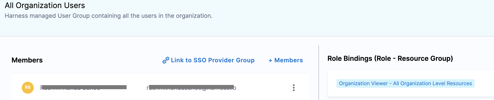
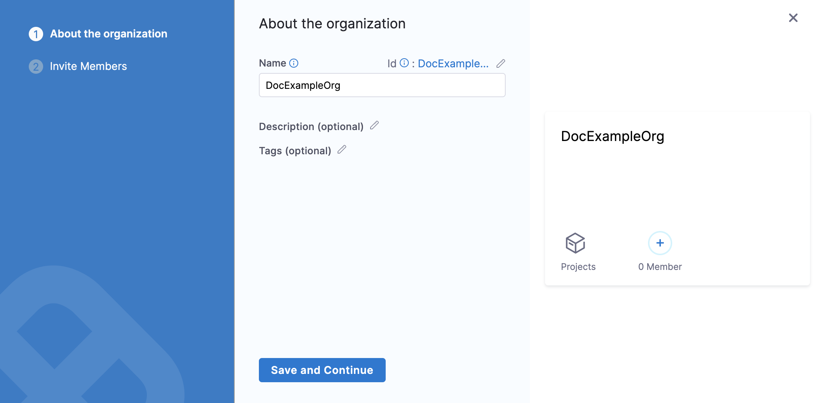
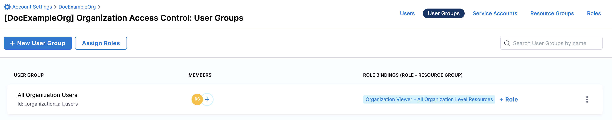
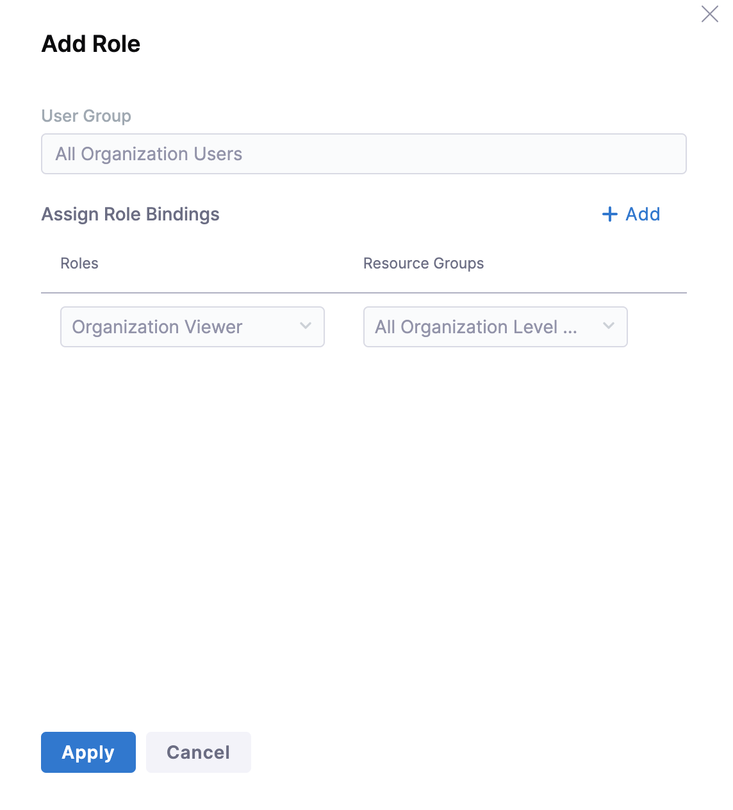
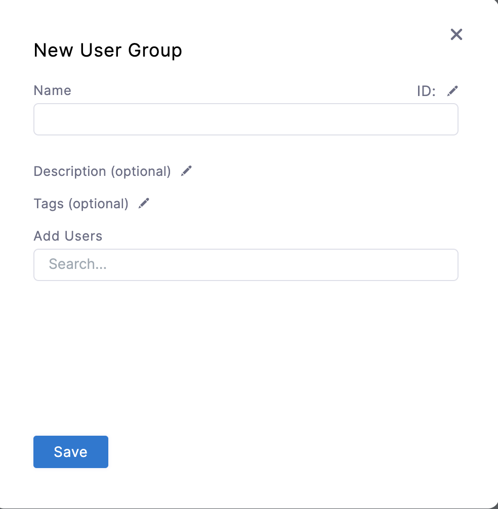
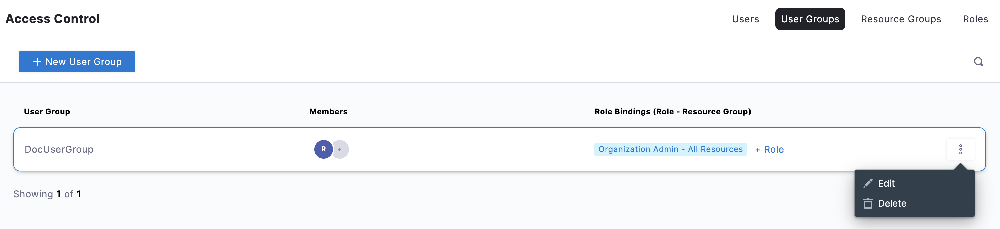
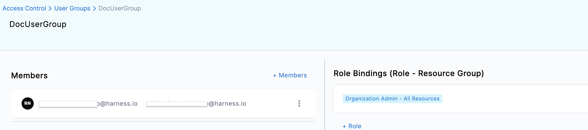
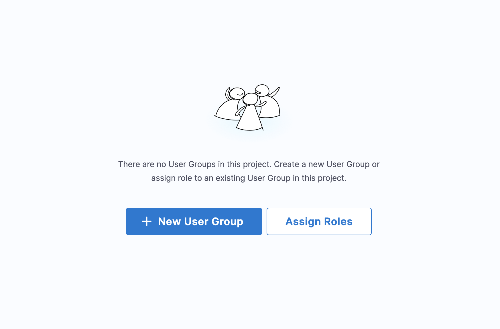
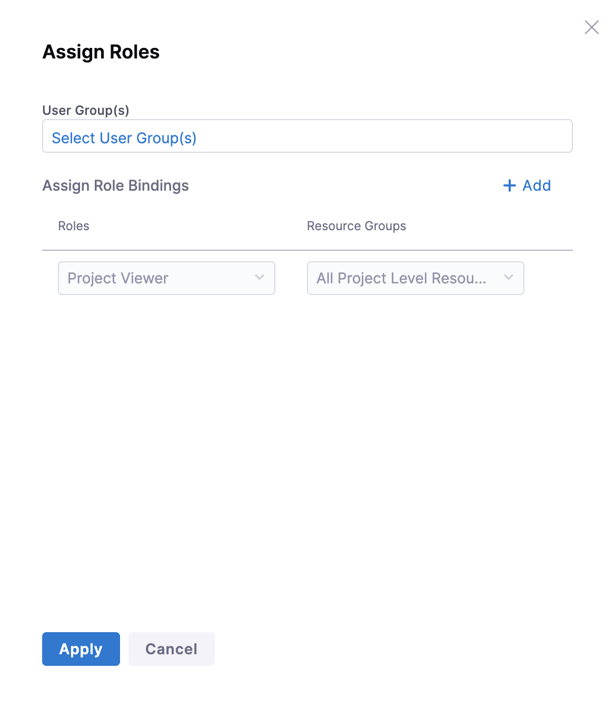
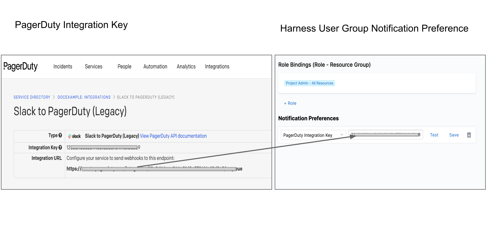

Harness User Groups help you manage user access. Each member of a User Group inherits the [role bindings](/docs/platform/role-based-access-control/rbac-in-harness#role-assignment) assigned to that group.

This topic explains the steps to create and manage User Groups within Harness.

## Default user groups

Harness has default User Group in each scope. These groups have all the users at the respective scope as their members.

Whenever you create a new Organization or Project, Harness creates a default User Group in its scope.

For example, if you add a new Organization to your Account, Harness creates a default User Group in the Organization. This group will have all the users within the scope of the Organization.

This topic explains the default User Groups at each scope and how you can do the Role Assignment for each of them.

### Harness default User Groups overview

Harness adds the scope-specific default User group to all your existing Accounts, Organizations, and Projects as well as to any Organization and Project that you create later.

The users that you add in the Account scope will **not** be assigned the **Account Viewer** role by default. The user's default role assignment is the same as the role assignment of the default User Group in the Account.The following table explains the default User Group at the individual scopes:

|  |  |  |
| --- | --- | --- |
| **Scope** | **Default User Group Name** | **Description** |
| Account | **All Account Users** | All the users in the Account scope are members of this User Group. |
| Organization | **All Organization Users** | All the users in the Organization scope are members of this User Group. |
| Project | **All Project Users** | All the users in the Project scope are members of this User Group. |

* When you add a new Organization or Project, the default role assignment for the default User Group is that of **Organization Viewer** and **Project Viewer** respectively.

* When you add a user to an existing Account, Organization, or Project, Harness adds the user to the default User Group in the scope where you added the user.  
For example, if you add a user to your existing Organization `OrgExample`, Harness will add the user to the All Organization Users group within `OrgExample`.
* Admin can do the required [role assignment](/docs/platform/role-based-access-control/rbac-in-harness#role-assignment) for the default User Groups.
* When you add a user to your Harness Account, the user's default role assignment is the same as the role assignment of the default User Group in the Account.  
For example, the **All Account Users** group in your Account has the role assignment of **Account Viewer**. All the members of this group can view resources within the scope of this Account. Now, you add a new user to this Account.  
Harness adds this user to the **All Account Users** group and the role assignment of this user is **Account Viewer** which is inherited from the default User Group of this Account.

You cannot create, edit, or delete the default User Groups. Harness manages them.

### Assign Role-Bindings for default User Group in a new Organization

1. In your Harness Account, click **Account Settings.**
2. Click **Organizations**.
3. Click **New Organization**. The new Organization settings appear.
4. In **Name**, enter a name for your Organization.
5. Enter **Description**, and [Tags](https://harness.helpdocs.io/article/i8t053o0sq-tags-reference) for your new Org.
6. Click **Save and Continue**.
7. Click **Finish**.  
Your Organization now appears in the list of Organizations.
8. Click on your Organization and then click **Access Control**.
9. Click **User Groups**.  
   **All Organization Users** is the default User Group with a default role assignment of **Organization Viewer**.

   

10. To assign another role to this User Group, click **Role**.  
    The **Add Role** settings appear.
    

11.  Click **Add**.
12.  In **Roles**, select a Harness built-in Role or a custom Role that you have created for the desired permissions.  
For more information on built-in roles and custom roles, see [Add and Manage Roles](./add-manage-roles).
13. In **Resource Groups**, select a Harness built-in Resource Group or a custom Resource Group that you have created for the desired resources.  
For more information on built-in roles and custom roles, see [Add and Manage Resource Groups](./add-resource-groups).
14. Click **Apply**.

All the existing members and any new members that you add to this Organization will have the role bindings that you just added.

## Create custom user groups

### Before you begin

* Make sure you have **Manage** Permissions for User Groups.

### Step: Add New User Group

This topic assumes you have a Harness Project set up. If not, see [Create Organizations and Projects](../organizations-and-projects/create-an-organization.md).

You can add a User Group in Project/Organization/Account scope. To do this, go to Project SETUP, Organization, or Account Resources.

In your **Project/Org/Account**, and click **Project/Org/Account SETUP**.

Click **Access Control**.

In **User Groups** click **New User Group**. The New User Group settings appear.

Enter a **Name** for your **User Group**.

Enter **Description** and [**Tags**](../20_References/tags-reference.md) for your **User Group**.

Select Users under **Add Users**.

Click **Save**.

Your User Group is now listed under User Groups. You can assign Roles to your User Group by clicking on **Role**.

### Step: Delete User Group

Click **User Groups** under **Access** **Control**.

Click **Delete** on the top right corner for the User Group you want to delete.

### Step: Manage User Group

Click the **User Groups** in **Access Control**.

Click the User Group you want to edit. The User Group details appear.

Click **Members** to invite Users to this Group.

Click **Remove** to delete User from this Group.

Click **Role** to change Role Bindings for this User Group.

### Assign Roles

Harness lets you inherit User Groups created at a higher scope by using **Assign Roles**. For example, you can inherit and use User Group(s) created at the Account scope in the Org or Project scope.

To inherit the User Group at the child scope, you must have view User Group permissions at the parent scope and manage User Group permissions at the child scope.​​You can modify the inherited User Group's role bindings in the child scope, but not the member or notification settings. Changes to the User Group in the parent scope will be reflected in the child scope as well.​

You can inherit a User Group from any parent scope to a child scope.

This topic shows you how to inherit a User Group from the Account scope to the Project scope.

In Harness, go to your Project and click **Access Control** in **Project Setup**.

Click **User Groups**.

Click **Assign Roles**. The Assign Roles settings appear.

In User Group(s), click **Select User Group(s)**. All the User Group(s) that you have permission to view across the scopes are listed.

Select the User Group(s) that you want to inherit from any of the parent scopes to your Project. Click **Apply Selected**.

Click **Add** to assign Roles and Resource Groups to this User Group in your Project scope.

Select **Roles** and **Resource Groups** and click **Apply**.

The User Group is now listed in User Groups.

You can get the list of child scopes where the User Group is inherited by clicking on the User Group at the parent scope.

### Option: Notification Preferences

You can set notification channels for your User Group members using **Notification Preferences**.

When the User Group is assigned an Alert Notification Rule, the channels you set here will be used to notify them.

To add notification preferences to Harness User Groups, perform the following steps:

1. In your **Account**/**Organization**/**Project** click Access Control.
2. Click **User Groups**.
3. Select the User Group to which you want to add notification preferences.
4. In **Notification Preferences**, click **Channel**.
5. Configure one or more notification settings from the following options and click **Save:**
	* **Email/Alias** – Enter any group email addresses where Harness can send notifications. For more details, see [Send Notifications Using Email](../5_Notifications/add-smtp-configuration.md#option-send-notifications-for-a-user-group-using-email).
	* **Slack Webhook URL** – Enter the Slack channel Incoming Webhook URL. For more details, see [Send Notifications Using Slack](../5_Notifications/send-notifications-using-slack.md).
	* **PagerDuty Integration Key** – Enter the key for a PagerDuty Account/Service to which Harness can send notifications. You can copy/paste this key from **Integrations** of your service in **Services** > **Service Directory.**
	
	

	* **Microsoft Teams Webhook URL** - Enter the Microsoft Teams Incoming Webhook URL.

### See also

* [Add and Manage Users](../3_User-Management/3-add-users.md)
* [Add and Manage Roles](./add-manage-roles)
* [Add and Manage Resource Groups](./add-resource-groups)
* [Permissions Reference](./permissions-reference)

