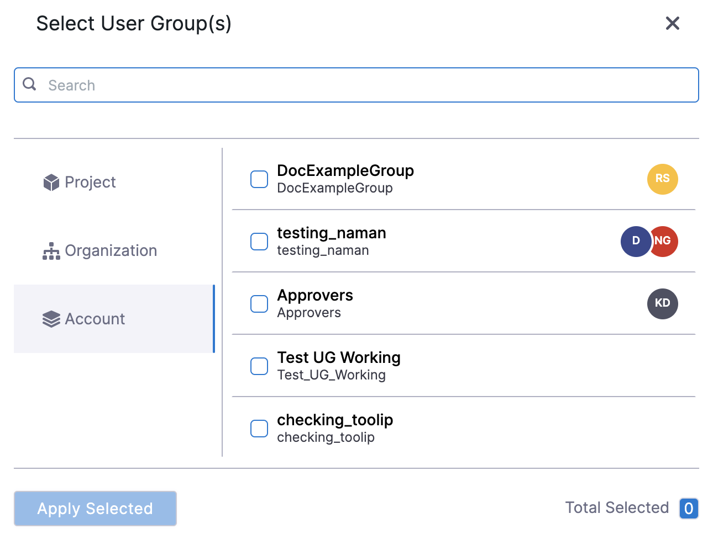
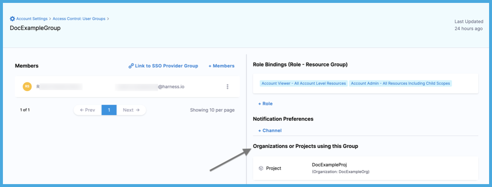

User groups contain multiple Harness users. You assign [roles](./add-manage-roles.md) and [resource groups](./add-resource-groups.md) to user groups. The permissions and access granted by the assigned roles and resource groups are applied to all group members.

You can also assign roles and resource groups to individual users that are not in a group. However, user groups help keep your RBAC organized and make it easier to manage permissions and access. Instead of modifying each user individually, you can edit the permissions and access for the entire group at once.

Harness includes some [built-in user groups](#built-in-user-groups), and you can [create user groups manually](#create-user-groups-manually), through [inheritance](#create-roles-by-inheritance-assign-roles), or through [automated provisioning](#use-automated-provisioning). You can create user groups at all [scopes](./rbac-in-harness.md#permissions-hierarchy-scopes).

## Built-in user groups

Harness has a built-in user group at each [scope](./rbac-in-harness.md#permissions-hierarchy-scopes). This group is called **All Project Users**, **All Organization Users**, or **All Account Users**, depending on the scope. By default, users within a particular scope are in the **All Users** group for that scope.

* **All Account Users:** All users in the account scope.
* **All Organization Users:** All users in an organization's scope.
* **All Project Users:** All users in a project's scope.

Whenever you [create an organization or project](/docs/platform/organizations-and-projects/create-an-organization), Harness creates an **All Users** group for the org or project.

Initially, built-in user groups have no role or resource group assignments. You can [assign a role and resource group](#assign-roles-and-resource-groups) to the built-in user group at a specific scope, which becomes the default role/resource group for all users at that scope.

For example, if you add a user to a project, they are added to the **All Project Users** group for that project, and they inherit the role and resource group you assigned to the **All Project Users** group.

Aside from assigning roles and resource groups, you can't edit or delete the built-in user groups. These groups are created and managed by Harness.

## Use automated provisioning

You can [manually create user groups](#create-user-groups-manually) and users in Harness, and you can use automated provisioning, including:

* [Okta SCIM](./provision-users-with-okta-scim.md)
* [Azure AD SCIM](./provision-users-and-groups-using-azure-ad-scim.md)
* [OneLogin SCIM](./provision-users-and-groups-with-one-login-scim.md)
* [Just-in-time provisioning](./provision-use-jit.md)

When you use automated provisioning, users and user groups are imported from your IdP, and then you [assign roles and resource groups](#assign-roles-and-resource-groups) to the imported users and groups in Harness. For imported users and groups, you manage group metadata, group membership, and user profiles in your IdP, and you manage their role and resource group assignments in Harness. You can also create users and user groups directly in Harness, but any users or groups imported from your IdP must be managed in your IdP.

For example, if you use Okta as your IdP, you could create a user group in Okta and assign users to that group in Okta. When the user group is first imported into Harness, the group and the group members are not associated with any roles or resource groups. You must assign roles and resource groups to the user group in Harness. The group members then inherit permissions and access from the role and resource group that is assigned to the user group.

## Create user groups manually

To create user groups in Harness, you need a role, such as **Account Admin**, that has [permission](./permissions-reference.md) to view and manage user groups.

1. In Harness, go to the [scope](./rbac-in-harness.md#permissions-hierarchy-scopes) where you want to create the user group.

   * To create a user group at the account scope, select **Account Settings**, and then select **Access Control**.
   * To create a user group at the organization scope, go to **Account Settings**, select **Organizations**, select the relevant organization, and then select **Access Control**.
   * To create a user group at the project scope, go to **Projects**, select the relevant project, and then select **Access Control**.

2. Select **User Groups** in the header, and then select **New User Group**.
3. Enter a **Name** for the user group. **Description** and **Tags** are optional.
4. In **Add Users**, select users to add to the group. If you haven't invited any users yet, you can [add users](#add-users-to-a-group) later.
4. Select **Save**.
5. [Assign roles and resource groups](#assign-roles-and-resource-groups) to the user group.

## Create groups by inheritance

At the organization and project scopes, you can quickly create groups by inheriting them from higher scopes. Metadata and members of inherited groups are managed at their original scope. When inherited at a lower scope, you can only change the role and resource group assignment at the inherited scope. Any other modifications to the group must be made at the group's original scope, and those changes are reflected at all scopes where the group is inherited.

| Action | Scope |
| ------ | ----  |
| Edit group members | Original scope only. The changes are reflected in all scopes where the group is inherited. |
| Edit name, description, tags, and notification preferences | Original scope only. The changes are reflected in all scopes where the group is inherited. |
| Edit roles and resource groups | You can change the roles and resource groups that were assigned at the current scope only. You can't make cross-scope modifications. <ul><li>Original scope: Manage role and resource group assignments for the original scope only. Can't edit role/resource groups for inherited scopes.</li><li>Inherited scope: Manage role and resource group assignments for the inherited scope only. Can't edit higher-level roles/resource groups or roles/resource groups in other inherited scopes.</li></ul> |
| Delete group | Original scope only. If deleted, the group is also removed from all scopes where it was inherited. |

To inherit user groups in Harness, you need the following [permissions](./permissions-reference.md):

* **View** user groups at the original scope. For example, if the group originates from the account scope, you must have the ability to view user groups at the account scope.
* **Manage** user groups at the inheritance scope. For example, if you want to inherit a group at a project scope, you must have the ability to manage user groups at that project scope.

1. In Harness, go to the [scope](./rbac-in-harness.md#permissions-hierarchy-scopes) where you want to inherit the user group.

   * To inherit a user group at the organization scope, go to **Account Settings**, select **Organizations**, select the relevant organization, and then select **Access Control**.
   * To inherit a user group at the project scope, go to **Projects**, select the relevant project, and then select **Access Control**.

2. Select **User Groups** in the header, and then select **Assign Roles** next to **New User Group**.
3. In **User Group(s)**, select the groups to inherit. If you don't see a particular group, it either exists at a lower scope or you don't have permission to view it.

   

4. Select **Apply Selected**.
5. Select **Add** to [assign a role and resource group](#assign-roles-and-resource-groups) to the inherited group at the inherited scope. This determines the group's permissions and access at the inherited scope. If the group doesn't already have sufficient permissions/access from the original scope, you need to add the additional necessary permissions/access here.
6. Select **Apply**.

When viewing user groups at higher scopes, you can find a list of **Organizations and Projects Using This Group** in the group details. These are the organizations and projects where the group is inherited.

<!--  -->

<docimage path={require('./static/add-user-groups-55.png')} />

## Assign roles and resource groups

Initially, user groups have no permissions or access. You assign [roles](./add-manage-roles.md) and [resource groups](./add-resource-groups.md) to user groups, and then the permissions and access granted by the assigned roles and resource groups are applied to all group members. For more information about assigning roles and resource groups, go to [RBAC in Harness: Role binding](./rbac-in-harness.md#role-binding).

:::caution Least privilege

RBAC is additive. The total expanse of a user/service account's permissions and access is the sum of all the roles and resource groups from all user groups they belong to, as well as any roles and resource groups assigned directly to them as an individual user/service account.

It is important to follow the principle of least privilege (PoLP). This is a security principle that means users are granted the absolute minimum access/permissions necessary to complete their tasks and nothing more.

While Harness includes some built-in roles and resource groups, to ensure the least privilege, consider:

* Being selective in the way you apply roles and resource groups.
* Creating your own roles and resource groups as needed for refined access control.

:::

To manage user groups in Harness, you need a role, such as **Account Admin**, that has [permission](./permissions-reference.md) to view and manage user groups.

1. In Harness, go to the [scope](./rbac-in-harness.md#permissions-hierarchy-scopes) where you want to configure the group's  role and resource group assignments.

   * To edit a user group at the account scope, select **Account Settings**, and then select **Access Control**.
   * To edit a user group at the organization scope, go to **Account Settings**, select **Organizations**, select the relevant organization, and then select **Access Control**.
   * To edit a user group at the project scope, go to **Projects**, select the relevant project, and then select **Access Control**.

2. Select **User Groups** in the header.
3. Locate the group you want to edit and select **Manage Roles**.
4. In **Role Bindings**, select **Add**, then select a [role](./add-manage-roles.md) and a [resource group](./add-resource-groups.md).

   To delete a role binding, select the **Delete** icon.
   To add another role binding, select **Add** again.

5. Select **Apply**.

## Edit group metadata

Use these steps to edit a user group's name, description, or tags.

1. In Harness, go to the [scope](./rbac-in-harness.md#permissions-hierarchy-scopes) where the user group exists.

   * To edit a user group at the account scope, select **Account Settings**, and then select **Access Control**.
   * To edit a user group at the organization scope, go to **Account Settings**, select **Organizations**, select the relevant organization, and then select **Access Control**.
   * To edit a user group at the project scope, go to **Projects**, select the relevant project, and then select **Access Control**.

2. Select **User Groups** in the header.
3. Locate the group you want to edit.
4. Select **More options** (&vellip;), and then select **Edit**.
5. Edit the groups's name, description, or tags, and then select **Save**.

## Edit group members

Use these steps to add and remove users in a user group.

1. In Harness, go to the [scope](./rbac-in-harness.md#permissions-hierarchy-scopes) where the user group exists.

   * To edit a user group at the account scope, select **Account Settings**, and then select **Access Control**.
   * To edit a user group at the organization scope, go to **Account Settings**, select **Organizations**, select the relevant organization, and then select **Access Control**.
   * To edit a user group at the project scope, go to **Projects**, select the relevant project, and then select **Access Control**.

2. Select **User Groups** in the header.
3. Select the group you want to edit.
4. To add users to the group, select **Members**, select the users to add, and then select **Save**.
5. To remove users from the group, locate the user you want to remove, select **More options** (&vellip;), and then select **Remove**.

## Edit notification preferences

You can configure notification channels for Harness to send messages to group members. When you assign an alert notification rule to a group, the channels specified in the group's **Notification Preferences** are used to notify all group members.

1. In Harness, go to the [scope](./rbac-in-harness.md#permissions-hierarchy-scopes) where the user group exists.

   * To edit a user group at the account scope, select **Account Settings**, and then select **Access Control**.
   * To edit a user group at the organization scope, go to **Account Settings**, select **Organizations**, select the relevant organization, and then select **Access Control**.
   * To edit a user group at the project scope, go to **Projects**, select the relevant project, and then select **Access Control**.

2. Select **User Groups** in the header.
3. Select the group you want to edit.
4. Under **Notification Preferences**, select **Channel**.
5. Configure the notification settings for the preferred channel:
   * **Email/Alias:** Enter any group email addresses where Harness can send notifications. For more information, go to [Send Notifications Using Email](../5_Notifications/add-smtp-configuration.md#option-send-notifications-for-a-user-group-using-email).
   * **Slack Webhook URL:** Enter the Slack channel Incoming Webhook URL. For more information, go to [Send Notifications Using Slack](../5_Notifications/send-notifications-using-slack.md).
   * **Microsoft Teams Webhook URL:** Enter the Microsoft Teams incoming webhook URL.
   * **PagerDuty Integration Key:** Enter the key for a PagerDuty Account/Service to which Harness can send notifications. You can get this key from the integration details in PagerDuty (navigate to **Services** and then **Service Directory**).

      

## Delete user groups

1. In Harness, go to the [scope](./rbac-in-harness.md#permissions-hierarchy-scopes) where the user group exists.

   * To delete a user group at the account scope, select **Account Settings**, and then select **Access Control**.
   * To delete a user group at the organization scope, go to **Account Settings**, select **Organizations**, select the relevant organization, and then select **Access Control**.
   * To delete a user group at the project scope, go to **Projects**, select the relevant project, and then select **Access Control**.

2. Select **User Groups** in the header.
3. Locate the group you want to delete.
4. Select **More options** (&vellip;), and then select **Delete**.
