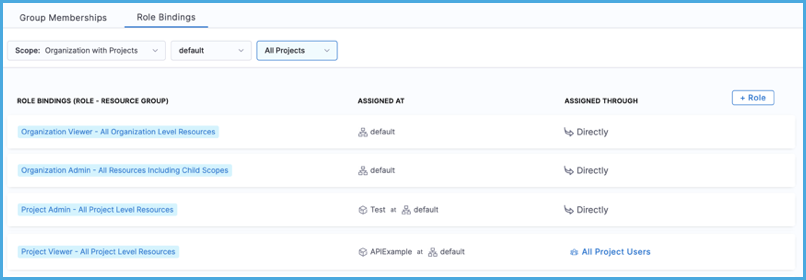
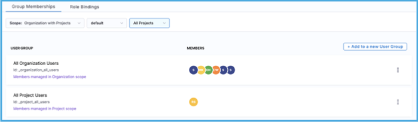

A Harness user is any individual registered with Harness with a unique email address. Users can be associated with multiple Harness accounts, and they can be in multiple user groups. You can assign [roles](./add-manage-roles.md) and [resource groups](./add-resource-groups.md) directly to users, or they can inherit them from [user groups](./add-user-groups.md).

You can [add users manually](#add-users-manually) or through [automated provisioning](#use-automated-provisioning). You can create user groups at all [scopes](./rbac-in-harness.md#permissions-hierarchy-scopes).

:::tip Service accounts

You can also create [service accounts](/docs/platform/role-based-access-control/add-and-manage-service-account) in Harness.

:::

## Use automated provisioning

You can [manually add users](#add-users-manually) and user groups in Harness, and you can use automated provisioning, including:

* [Okta SCIM](./provision-users-with-okta-scim.md)
* [Azure AD SCIM](./provision-users-and-groups-using-azure-ad-scim.md)
* [OneLogin SCIM](./provision-users-and-groups-with-one-login-scim.md)
* [Just-in-time provisioning](./provision-use-jit.md)

When you use automated provisioning, users and user groups are imported from your IdP, and then you [assign roles and resource groups](#assign-roles-and-resource-groups) to the imported users and groups in Harness. For imported users and groups, you manage group metadata, group membership, and user profiles in your IdP, and you manage their role and resource group assignments in Harness. You can also create users and user groups directly in Harness, but any users or groups imported from your IdP must be managed in your IdP.

For example, if you use Okta as your IdP, you could create a user group in Okta and assign users to that group in Okta. When the user group is first imported into Harness, the group and the group members are not associated with any roles or resource groups. You must assign roles and resource groups to the user group in Harness. The group members then inherit permissions and access from the role and resource group that is assigned to the user group.

## Add users manually

To add users in Harness, you need a role, such as **Account Admin**, that has [permission](./permissions-reference.md) to invite and manage users.

:::info

You can add up to 50,000 users in paid plans. Free plans and Harness Community Edition accounts are limited to 1,500 users.

:::

1. In Harness, go to the [scope](./rbac-in-harness.md#permissions-hierarchy-scopes) where you want to add the user.

   * To add a user at the account scope, select **Account Settings**, and then select **Access Control**.
   * To add a user at the organization scope, go to **Account Settings**, select **Organizations**, select the relevant organization, and then select **Access Control**.
   * To add a user at the project scope, go to **Projects**, select the relevant project, and then select **Access Control**.

2. Select **New User**.
3. In **Users**, enter the email address that user will use to log into Harness.

   You can add multiple users at once by entering multiple email addresses.

4. In **User Groups**, you can assign the user to one or more [user groups](./add-user-groups.md).

   When assigned to a user group, the user inherits the [roles and resource groups](#assign-roles-and-resource-groups) assigned to that group.

   You can also assign roles and resource groups directly to individual users.

   Users are not required to belong to user groups; however, user groups make it easier to manage permissions and access. Instead of modifying each user individually, you can edit the permissions and access for the entire group at once.

5. In **Role Bindings**, you can assign roles and resource groups directly to the new user.

   If you selected any **User Groups**, the role and resource group assignments inherited from those groups *are not* listed in **Role Bindings**.

   If you didn't select any user groups, you must apply a role binding. Without a role binding (directly or inherited from a user group), the user won't have any permissions or access in Harness.

6. Select **Apply**. Users receive a verification email at the address(es) you entered. When the user logs into Harness, the user creates a password, the email address is verified, and the user's name attribute is updated.

### Invitation emails

When you add a user, Harness checks your [authentication method](/docs/platform/Authentication/authentication-overview) and email invite preferences to determine if an email invitation should be sent:

* **Login via a Harness Account or Public OAuth Providers:** The invited user gets an email invitation. The user is listed on **Pending Users** until the user accepts the invitation.
* **SAML**, **LDAP**, or **OAuth** *and* you have enabled the feature flag `PL_NO_EMAIL_FOR_SAML_ACCOUNT_INVITES`: Harness adds the user directly to the **Active Users** list, and Harness *doesn't* send an email to the user.
* **SAML**, **LDAP**, or **OAuth** *and* you have enabled the feature flag `AUTO_ACCEPT_SAML_ACCOUNT_INVITES`: Harness adds the user directly to the **Active Users** list, and Harness sends a notification email to the user.
* **SAML**, **LDAP**, or **OAuth** *and* you have enabled both feature flags: `PL_NO_EMAIL_FOR_SAML_ACCOUNT_INVITES` takes precedence over `AUTO_ACCEPT_SAML_ACCOUNT_INVITES`. Harness adds users directly to the **Active Users** list, and Harness *doesn't* send invitation emails.

## Assign roles and resource groups

You assign [roles](./add-manage-roles.md) and [resource groups](./add-resource-groups.md) to users to grant them permissions and access in Harness. Users can inherit roles and resource groups from [group membership](./add-user-groups.md), or you can assign roles and resource groups directly to individual users. For more information about assigning roles and resource groups, go to [RBAC in Harness: Role binding](./rbac-in-harness.md#role-binding).

:::caution Least privilege

RBAC is additive. The total expanse of a user/service account's permissions and access is the sum of all the roles and resource groups from all user groups they belong to, as well as any roles and resource groups assigned directly to them as an individual user/service account.

It is important to follow the principle of least privilege (PoLP). This is a security principle that means users are granted the absolute minimum access/permissions necessary to complete their tasks and nothing more.

While Harness includes some built-in roles and resource groups, to ensure the least privilege, consider:

* Being selective in the way you apply roles and resource groups.
* Creating your own roles and resource groups as needed for refined access control.

:::

To manage users in Harness, you need a role, such as **Account Admin**, that has [permission](./permissions-reference.md) to manage users.

### View role bindings

1. In Harness, go to the [scope](./rbac-in-harness.md#permissions-hierarchy-scopes) where the user exists.

   * To edit a user at the account scope, select **Account Settings**, and then select **Access Control**.
   * To edit a user at the organization scope, go to **Account Settings**, select **Organizations**, select the relevant organization, and then select **Access Control**.
   * To edit a user at the project scope, go to **Projects**, select the relevant project, and then select **Access Control**.

2. Select the user you want to view.
3. Switch to the **Role Bindings** tab.
4. Select a **[Scope](./rbac-in-harness.md#permissions-hierarchy-scopes)**.

   * **All**: List role bindings across all scopes.
   * **Account only**: List role bindings only at the account scope.
   * **Organization** **only**: List role bindings in the scope of a specific organization, but not the projects under that organization.
   * **Organization and Projects**: List role bindings in the scope of a specific organization and all projects under that organization.

5. Review the role bindings.

   The **Assigned Through** column indicates the source of the role binding. Assignments are either **Direct** or inherited from a user group. If inherited, the user group name is listed.

   The **Assigned At** column indicates the scope at which the assignment was made. If assigned at an organization or project scope, the organization and project name are listed.

   

### Edit direct assignments

Use these steps to manage directly assigned role bindings.

1. Follow the steps to [view role bindings](#view-role-bindings).
2. Select **Manage Roles**.
3. In **Role Bindings**, select **Add**, then select a [role](./add-manage-roles.md) and a [resource group](./add-resource-groups.md). Repeat to add more role bindings.
4. To delete a role binding, select the **Delete** icon.
5. Select **Apply** to save the changes.

### Edit inherited assignments

There are several ways to edit inherited role bindings:

* Edit group membership through an individual user's profile. This is best for changing group membership for a single user.
* [Edit membership in the user group's settings](./add-user-groups.md#edit-group-members), rather than editing each user individually. This is useful for adding and removing multiple users at once.
* [Edit role bindings in the user group's settings](./add-user-groups.md#assign-roles-and-resource-groups). Do this to change inherited role bindings without changing group membership.
* Editing group membership in your IdP. If you use [use automated provisioning](#use-automated-provisioning), group membership is managed through your IdP.

To edit group membership through a user's profile:

1. Follow the steps to [view role bindings](#view-role-bindings).
2. Switch to the **Group Memberships** tab.

   <!--  -->

   <docimage path={require('./static/add-users-14.png')} />

3. Select a **[Scope](./rbac-in-harness.md#permissions-hierarchy-scopes)**.

   * **All**: List groups across all scopes.
   * **Account only**: List groups only at the account scope.
   * **Organization** **only**: List groups in the scope of a specific organization, but not the projects under that organization.
   * **Organization and Projects**: List groups in the scope of a specific organization and all projects under that organization.

4. Select **Add to a new User Group**, and then modify the user's group membership by selecting or deselecting groups accordingly.

   * To add the user to a group, search for and select the relevant group.
   * To remove the user from a group, search for and deselect the relevant group.

5. Select **Apply Selected**.

## Delete users

Use these steps to delete a user from Harness.

:::info

If you [use automated provisioning](#use-automated-provisioning), user accounts are managed by your IdP. Delete or deactivate the user in your IdP to revoke their access to Harness.

:::

1. Make sure you have a role, such as **Account Admin**, that has [permission](./permissions-reference.md) to manage users.
2. In Harness, go to the [scope](./rbac-in-harness.md#permissions-hierarchy-scopes) where the user exists.

   * To delete a user at the account scope, select **Account Settings**, and then select **Access Control**.
   * To delete a user at the organization scope, go to **Account Settings**, select **Organizations**, select the relevant organization, and then select **Access Control**.
   * To delete a user at the project scope, go to **Projects**, select the relevant project, and then select **Access Control**.

3. Locate the user you want to delete.
4. Select **More options** (&vellip;), and then select **Delete**.
