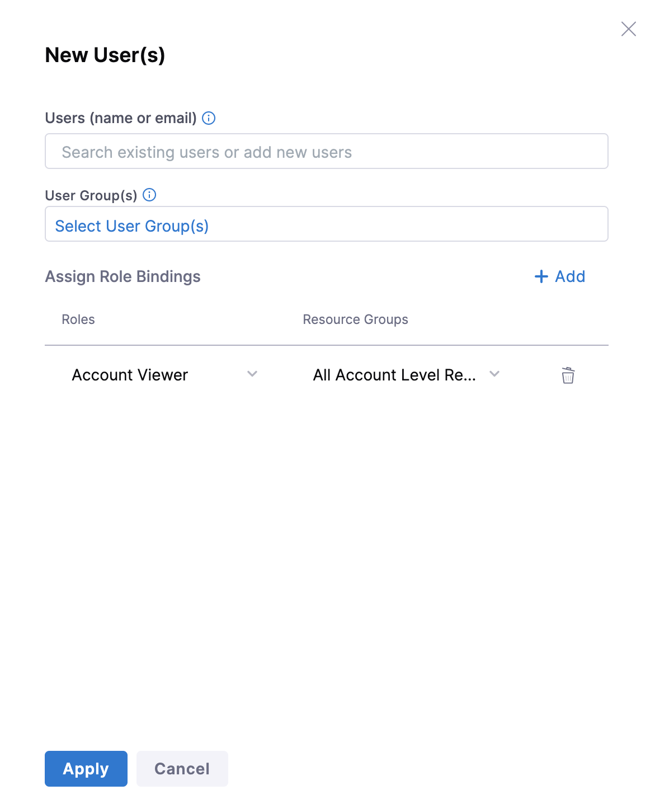
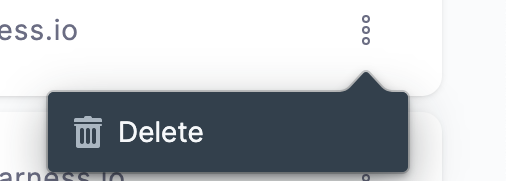
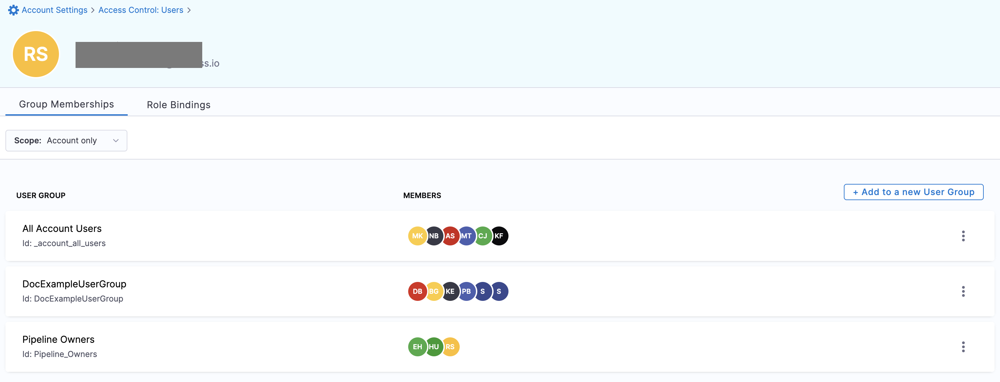
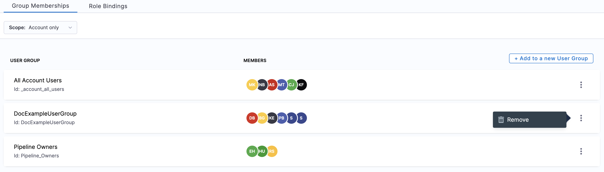

A Harness User is any individual registered with Harness with a unique email address. A User can be a part of multiple Accounts.

This topic will explain the steps to create and manage Users within Harness.

:::tip Automatic provisioning

You can create users and user groups directly in Harness, and you can use automated provisioning, including:

* [Okta SCIM](./provision-users-with-okta-scim.md)
* [Azure AD SCIM](./provision-users-and-groups-using-azure-ad-scim.md)
* [OneLogin SCIM](./provision-users-and-groups-with-one-login-scim.md)
* [Just-in-time provisioning](./provision-use-jit.md)

With automated provisioning, users and user groups are imported from your IdP, and then you [assign roles and resource groups](#role-assignment) to the imported [principals](#principals) in Harness. You manage group metadata, group membership, and user profiles in your IdP, and you manage role and resource group assignments in Harness.

You can also create users and user groups directly in Harness, but any users or groups imported from your IdP must be managed in your IdP. For imported users and group, you can only change their role and resource group assignments in Harness.

<!-- alternate text
When you use automated provisioning, users and user groups are imported from your IdP, and then you assign roles and resource groups to the imported [principals](#principals) in Harness. For imported users and groups, you manage group metadata, group membership, and user profiles in your IdP, and you manage their role and resource group assignments in Harness. You can also create users and user groups directly in Harness, but any users or groups imported from your IdP must be managed in your IdP.

For example, if you use Okta as your IdP, you could create a user group in Okta and assign users to that group in Okta. When the user group is first imported into Harness, the group and the group members are not associated with any roles or resource groups. You must [assign roles and resource groups](#assign-the-role-and-resource-group-to-the-user-group) to the user group in Harness. The group members then inherit permissions and access from the role and resource group that is assigned to the user group.-->

:::

### Before you begin

* Make sure you have **Manage** Permissions for Users.

### Step: Add New User

You must first invite Users to your Account/Org/Project to add them to User Groups and assign Role Bindings accordingly. For more information on User Groups and Role Bindings, see [Add and Manage User Groups](/docs/platform/role-based-access-control/add-user-groups) and [Role Assignment](/docs/platform/role-based-access-control/rbac-in-harness#role-assignment).

Click **Account Settings**, and click **Access Control**.

Click **New User** in **Users**. The New User settings appear.

Enter the email address(es) that the User will use to log into the Harness platform.

If you have Roles and Resource Groups defined, select the Roles and Resource Groups for this user. To add Roles and Resource Groups, see [Add Roles](./add-manage-roles) and [Add Resource Groups](./add-resource-groups).

Click **Save**. The user will receive a verification email at the address(es) you provided. When the user logs into Harness, the user creates a password, the email address is verified, and the user name is updated.

You can add up to 50000 users in Harness Non-Community Edition.

#### User invites

For any new user that you add to your Harness Account, Org, or Project, Harness checks the following and sends invites accordingly:

1. If your authentication mechanism is set to **Login via a Harness Account or Public OAuth Providers**, the invited user gets an email invitation. The user is added to the **Pending Users** list until the user accepts the invitation.
2. If your authentication mechanism is set to SAML, LDAP, or OAuth, and the feature flag `PL_NO_EMAIL_FOR_SAML_ACCOUNT_INVITES` is enabled, Harness adds the invited user to the Active Users list.  
Harness does not send any emails to the user when this feature flag is enabled.
3. If your authentication mechanism is set to SAML, LDAP, or OAuth, and the feature flag `AUTO_ACCEPT_SAML_ACCOUNT_INVITES` is enabled, Harness sends a notification email to the user and adds the user to the Active Users list.

If you enable both feature flags, the feature flag`PL_NO_EMAIL_FOR_SAML_ACCOUNT_INVITES` takes precedence over the feature flag`AUTO_ACCEPT_SAML_ACCOUNT_INVITES`. Harness does not send any emails to users.

### Step: Delete User

Click **Users** under **Access** **Control**.

Click **Delete** on the top right corner to delete a specific user.

### Step: Manage User

To edit Role Bindings for a User, do the following:

 In **Access Control**, click **Users.**

Click on the user you want to edit. The user details appear.

Click **Delete** on the right to remove a User Group.

Click **Role** to change Role Bindings for this User.

#### Group Memberships

You can view the group membership of a specific user on the user details page by clicking **Group Memberships**.

Harness lets you select one of the following scopes to view the user's group membership:

* **All**: lists the user's group membership across all the scopes.
* **Account only**: lists the user's group membership only in the Account scope.
* **Organization** **only**: lists the user's group membership in the scope of the selected Organization.
* **Organization and Projects**: lists the user's group membership in the scope of the selected Organization and Project.

To add the user to a new user group, click **Add to a new User Group**.

Click **Remove** to remove the user as a member from a specific user group.

#### Role Bindings

You can view the role bindings for a specific user on the user details page by clicking **Role Bindings**.

Here, you can view a given user's role bindings across all scopes and user groups.

Harness lets you select one of the following scopes to view the user's role bindings:

* **All**: lists the user's role bindings across all the scopes.
* **Account only**: lists the user's role bindings only in the Account scope.
* **Organization** **only**: lists the user's role bindings in the scope of the selected Organization.
* **Organization and Projects**: lists the user's role bindings in the scope of the selected Organization and Project.

To add a new role binding for a user, click **Role**.

### See also

* [Add and Manage User Groups](/docs/platform/role-based-access-control/add-user-groups)
* [Add and Manage Roles](./add-manage-roles)
* [Add and Manage Resource Groups](./add-resource-groups)
* [Permissions Reference](./permissions-reference)

