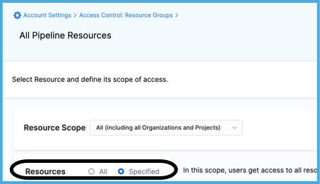
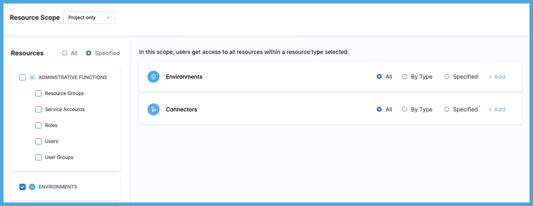
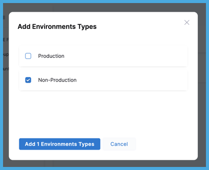
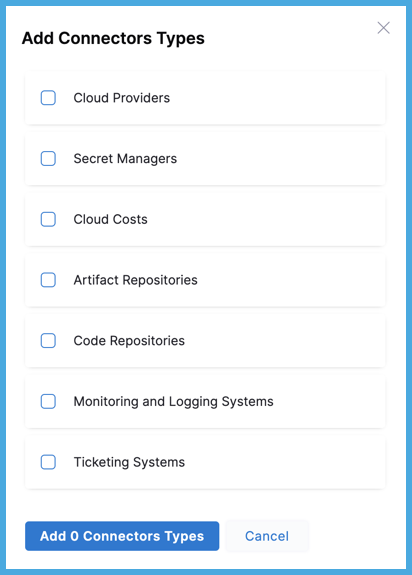
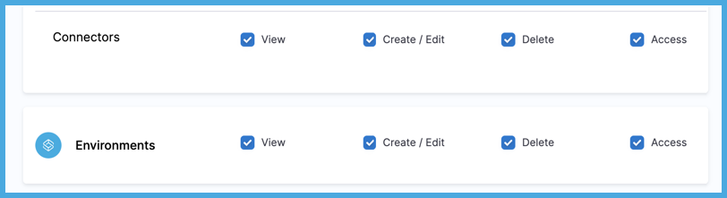

[Role-based access control (RBAC) in Harness](/docs/platform/role-based-access-control/rbac-in-harness) helps you manage who has access to your Harness resources, what they can do with those resources, and in what scope they have access. RBAC is role-based, which means permissions and access to resources are determined by the roles assigned to users, user groups, and service accounts.

Attribute-based access control (ABAC) grants access to Harness resources based on attributes associated with those resources, such as connector type. ABAC is an optional extension of [RBAC in Harness](./rbac-in-harness.md) that uses attribute-based rules to grant access in the context of specific actions.  ABAC is a way to refine [resource groups](./add-resource-groups.md) by adding another dimension of control.

ABAC can help you:

* Simplify management of role bindings at scale.
* Provide more fine-grained access control.
* Reduce the number of role bindings you need to manage.
* Leverage attributes with specific business meanings.

ABAC adds the additional dimensions of [connector](/docs/category/connectors) and [environment](/docs/continuous-delivery/x-platform-cd-features/environments/environment-overview) types to refine resource groups. For example:

* Grant access to manage non-production environments but not other types of environments.
* Grant access to manage code repo connectors but not other types of connectors.

## Configure ABAC

To configure ABAC in Harness, you must be an **Admin** for the relevant account, organization, or project.

1. [Create or edit a resource group](./add-resource-groups.md).
2. For **Resources**, select **Specified**.

   <!--  -->

   <docimage path={require('./static/set-up-rbac-pipelines-42.png')} />

3. Select **Environments** and/or **Connectors**.

   ABAC is available for environments and connectors only. These steps focus on configuring ABAC; however, your resource groups can include other resource categories. For other resources categories and general information about configuring resource groups, go to [Manage resource groups](./add-resource-groups.md).

   <!--  -->

   <docimage path={require('./static/attribute-based-access-control-05.png')} />

4. To apply ABAC to **Connectors** or **Environments**, select **By Type**, and then select **Add**.

   For information about the **All** and **Specified** options, go to [Manage resource groups](./add-resource-groups.md).

   ABAC is in addition to the **Resource Scope**. For example, if the **Resource Scope** is **Project Only**, and you select connectors **By Type**, then the resource group includes all connectors of the selected types that are *in the specified project only*. For more information, go to [Manage resource groups: Scopes and refinement](./add-resource-groups.md#scopes-and-refinement).

5. Select the types to include, and then select **Add**.

   For **Environments**, you can choose **Production** or **Non-Production**.

   <!--  -->

   <docimage path={require('./static/attribute-based-access-control-06.png')} />

   For **Connectors**, you can choose one or more of the following Harness connector types: **Artifact Repositories**, **Cloud Costs**, **Cloud Providers**, **Code Repositories**, **Monitoring and Logging Systems**, **Secret Managers**, and **Ticketing Systems**.

   <!--  -->

   <docimage path={require('./static/attribute-based-access-control-07.png')} />

6. Select **Save**.

## Continue RBAC configuration

Creating resource groups with ABAC is one part of [configuring RBAC in Harness](./rbac-in-harness.md#configure-rbac-in-harness).

[Roles](./add-manage-roles.md), which grant permissions, work alongside resource groups and ABAC, which grant access. Because ABAC applies to environments and connectors, the role you choose to accompany your ABAC-enhanced resource group should include permissions relevant to environments or connectors.

<!--  -->

<docimage path={require('./static/attribute-based-access-control-08.png')} />

After configuring roles and resource group, you assign them to [users](./add-users.md), [user groups](./add-user-groups.md), and [service accounts](./add-and-manage-service-account.md).
